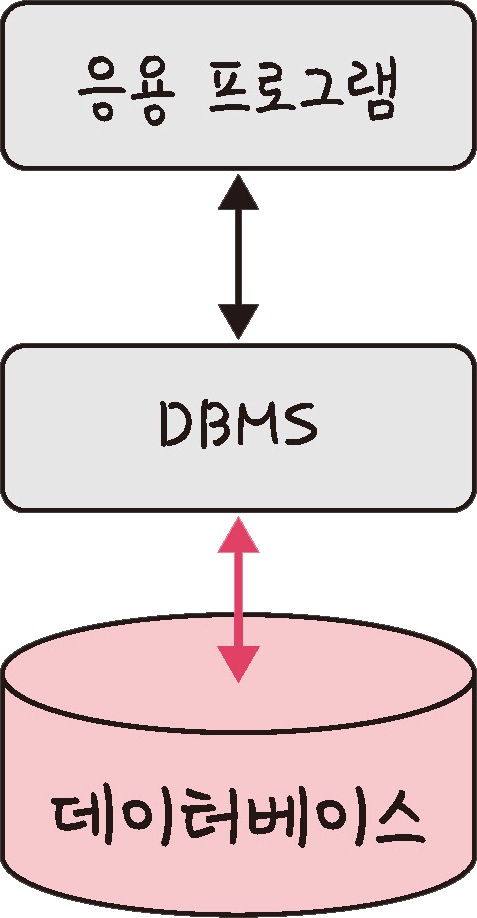
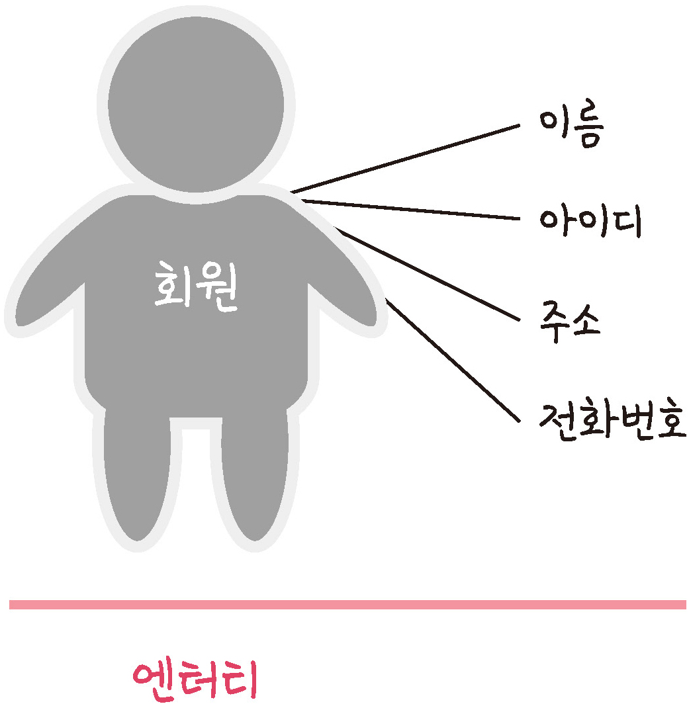
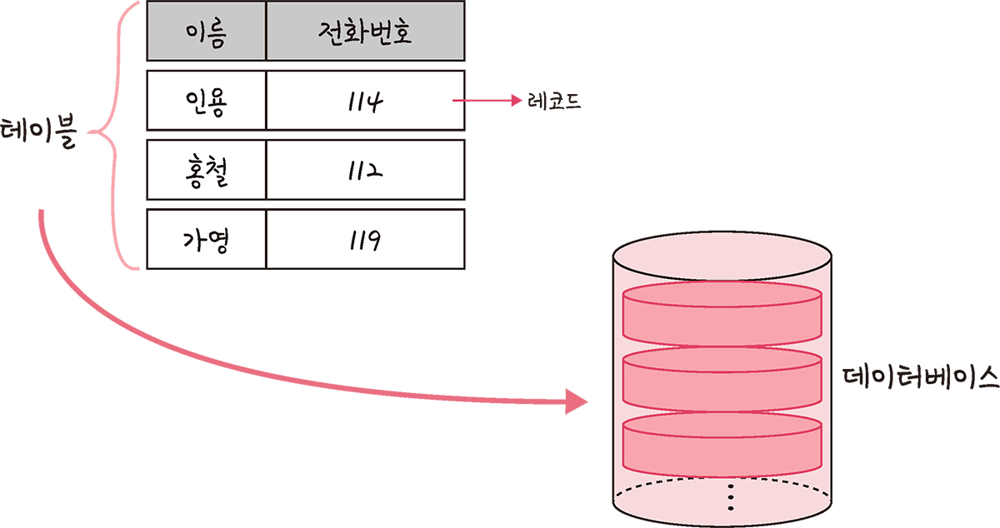
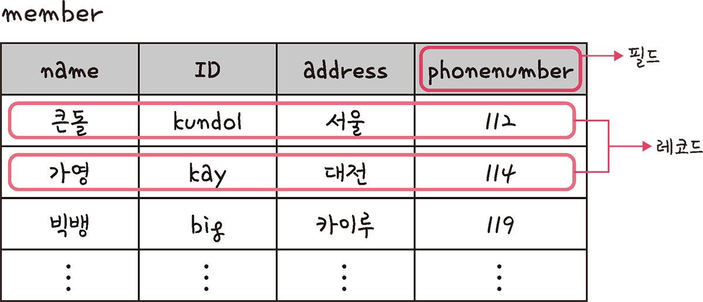
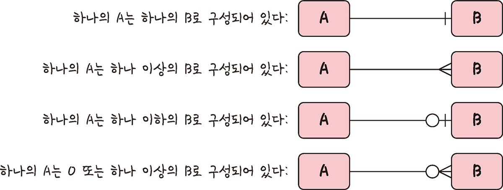
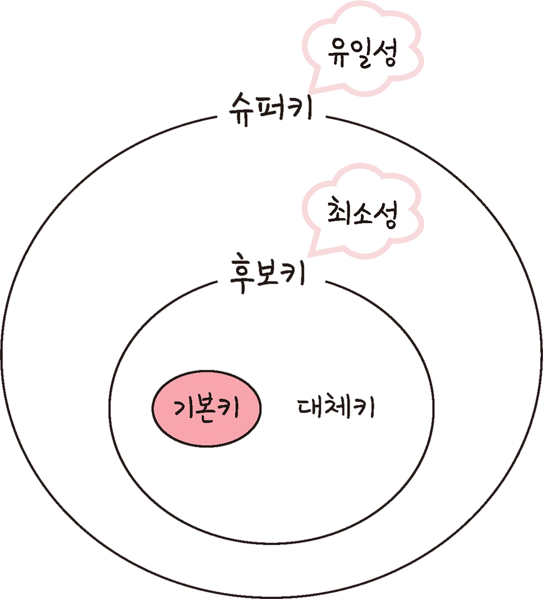
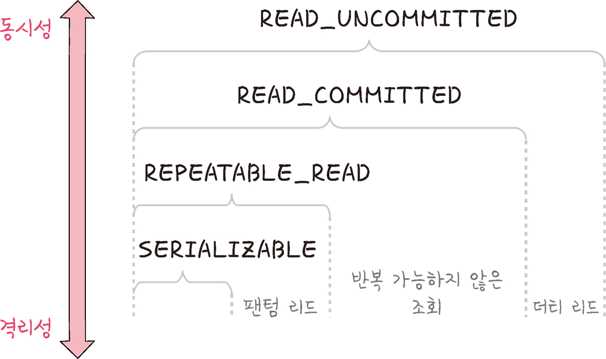

# DB 정리

**데이터베이스(DataBase)**

일정한 규칙, 혹은 규약을 통해 구조화되어 저장되는 데이터의 모음

**DBMS(DataBase Management System)**

데이터베이스를 제어, 관리하는 통합 시스템

DB 안에 있는 데이터들은 특정 DBMS마다 정의된 쿼리언어(query language)를 통해 삽입, 삭제, 수정, 조회 등을 수행할 수 있다.

DB는 실시간 접근과 동시공유가 가능하다.

위 그림처럼 DB 위에 DBMS가 있고 그 위에 응용 프로그램이 있다.

이러한 구조를 기반으로 데이터를 주고받는다.

> 응용프로그램 예시: Node.js, Spring, ...
> DBMS 예시: MySQL, Oracle, ...

**엔티티(Entity)**

사람, 장소, 물건, 개념 등 여러 개의 속성을 지닌 명사를 의미

> 회원이라는 엔티티가 있다면 회원은 이름, 아이디, 주소, 전화번호 등의 속성을 갖는다.
>
> 

엔티티는 약한 엔티티와 강한 엔티티로 나뉜다.

예를 들어 A가 혼자서는 존재하지 못하고, B의 존재여부에 따라 종속적이라면 A는 약한 엔티티이고, B는 강한 엔티티가 된다.
> 방과 건물, 방은 건물 안에만 존재 -> 방은 약한 엔티티, 건물은 강한 엔티티

**릴레이션**

릴레이션(Relation)은 DB에서 정보를 구분하여 저장하는 기본 단위

엔티티에 관한 데이터를 DB는 릴레이션 하나에 담아서 관리함
> 릴레이션은 관계형 데이터베이스에서는 '테이블'이라고 한다.
> NoSQL DB에서는 '컬렉션'이라고 한다.

**테이블과 컬렉션**

DB의 종류는 크게 관계형 DB와 NoSQL DB로 나눌 수 있다.

이중 대표적인 관계형 DB인 MySQL과 NoSQL DB인 MongoDB를 예로 들면,

MySQL의 구조는 레코드-테이블-DB로 이루어져 있고,

MongoDB의 구조는 도큐먼트-컬렉션-DB로 이루어져 있다.

관계형 DB의 구조 그림

**속성**

속성(attribute)은 릴레이션에서 관리하는 구체적이며 고유한 이름을 갖는 정보

**도메인**

도메인(domain)이란 릴레이션에 포함된 각각의 속성들이 가질 수 있는 값의 집합
> 성별이라는 속성의 도메인: [남, 여]

**필드와 레코드**

회원이라는 엔티티는 member라는 테이블로 속성인 이름, 아이디 등을 가지고 있으며 name, ID, address 등의 '필드'를 가진다.

이 테이블에 쌓이는 행(row) 단위의 데이터를 '레코드'또는 '튜플'이라고 한다.

**필드 타입**

필드는 타입을 갖는다.

MySQL 기준 숫자 타입

|타입|용량(바이트)|최솟값(부호 있음)|최솟값(부호 없음)|최댓값(부호 없음)|최댓값(부호 있음)|
|--|--|--|--|--|--|
|TINYINT|1|-128|0|127|255|
|SMALLINT|2|-32768|0|32767|65535|
|MEDIUMINT|3|-8388608|0|8388607|16777215|
|INT|4|-2147483648|0|2147483647|4294967295|
|BIGINT|8|-263|0|263-1|264-1|

날짜 타입으로는 DATE, DATETIME, TIMESTAMP 등이 있다.
> DATE: 날짜 부분은 있지만, 시간 부분은 없는 값에 사용, 3바이트 용량
> DATETIME: 날짜 및 시간 부분을 모두 포함하는 값에 사용, 8바이트 용량
> TIMESTAMP: 날짜 및 시간 부분을 모두 포함하는 값에 사용, 4바이트 용량

문자 타입으로는 CHAR, VARCHAR, TEXT, BLOB, ENUM, SET이 있다

> CHAR와 VARCHAR 모두 그 안에 수를 입력해서 몇자까지 입력할지 정한다.
> CHAR는 테이블을 생성할 때 선언한 길이로 고정된다. 0~255
> VARCHAR는 가변길이의 문자열, 10글자를 저장할 경우, 10글자 + 길이기록용 1바이트로 저장하게된다.

> TEXT와 BLOB 두개의 타입 모두 큰 데이터를 저장할때 쓰는 타입
> TEXT는 큰 문자열 저장에 쓰여 주로 게시판의 본문을 저장할때 쓴ㄴ다.
> BLOB은 이미지, 동영상 등 큰데이터 저장에 쓴다.
>> 그러나 보통은 아마존의 이미지 호스팅 서비스인 S3를 이용하는 등 서버에 파일을 올리고 파일에 관한 경로를 VARCHAR로 저장합니다.

> ENUM과 SET 모두 문자열을 열거한 타입
>
> ENUM은 ENUM('X-SMALL', 'SMALL') 형태로 쓰이며, 이중에서 하나만 선택하는 단일 선택만 가능하고, ENUM 리스트에 없는 잘못된 값을 삽입하면 빈 문자열이 대신 삽입된다. 
>
> ENUM을 사용하면 ENUM 리스트의 문자열들이 0,1등으로 매핑되어 메모리를 적게 사용하는 이점을 얻는다.
> ENUM은 최대 65535개의 요소들을 넣을 수 있다.
>
> SET은 ENUM과 비슷하지만 여러개의 데이터를 선택할 수 있고, 비트 단위의 연산을 할 수 있으며, 최대 64개의 요소를 집어넣을 수 있다는 점이 다르다.
>
> ENUM과 SET을 쓸 경우 공간적으로 이점을 볼 수 있지만, 애플리케이션의 수정에 따라 리스트의 목록을 수정해야한다는 단점이 있다.

**관계**

DB에는 여러개의 테이블이 있고 이러한 테이블은 서로의 관계가 정의되어 있다.

이러한 관게를 관계화살표로 나타낸다.

**키**

테이블 간의 관계를 조금 더 명확하게 하고 테이블 자체의 인덱스를 위해 설정된 장치로 `기본키`, `외래키`, `후보키`, `슈퍼기`, `대체키`가 있다.

위 그림처럼 슈퍼키는 유일성을 만족하지만, 최소성을 만족하지 않을수도 있습니다.

후보키는 유일성과 최소성 모두 만족합니다.

유일성: 중복되는 값이 없는 필드

최소성: 필드를 조합하지 않고 최소 필드만 써서 키를 형성할 수 있는 것

**기본키**

기본키(Primary Key)는 유일성과 최소성을 만족하는 키

이는 테이블의 데이터중 고유하게 존재하는 속성
> 기본키는 자연키와 인조키가 있다
>
> 인조키: 테이블의 필드 외에 인위적으로 생성한 키. 절대 변하지 않는다.(개발자가 따로 설정하지 않는이상)
>
> 자연키: 인위적으로 생성되지 않고 기존에 있는 필드를 조합한 키.(주민번호) 언젠가는 변할 수 있다.

**외래키**

외래키(Foreign Key)는 다른 테이블의 기본키를 그대로 참조하는 값으로 개체와의 관계를 식별하는데 사용한다.
> 외래키는 중복이어도 ㄱㅊ

후보키: 기본키가 될수 있는 후보들 (유일성과 최소성을 만족)

대체키: 후보키가 두개 이상일 경우 어느하나를 기본키로 지정하고 남은 후보키를 말한다.

슈퍼키: 레코드를 유일하게 식별할 수 있는 유일성을 갖춘 키

---

## ERD의 정규화 과정

ERD(Entity Relationship Diagram)은 DB를 구축할때 가장 기초적인 뼈대 역할을 하며, 릴레이션 간의 관계를 정의한 것

서비스를 구축할때 가장 먼저 신경 써야할 부분이다.

### ERD의 중요성

ERD는 시스템의 요구사항을 기반으로 작성되며, ERD를 기반으로 DB를 구축한다. 구축한 뒤에도 재설계가 필요한 경우에 설계도 역할을 담당하기도 한다.

ERD는 관계형 구조로 표현할 수 있는 데이터를 구성하는 데 유용할 수 있지만, 비정형 데이터를 충분히 표현할 수 없다는 단점이 있다.
> 비정형 데이터 - 비구조화 데이터, 미리 정의된 데이터 모델이 없거나 미리 정의된 방식으로 정리되지 않은 정보를 말한다.

### 정규화 과정

정규화 과정은 릴레이션 간의 잘못된 종속 관계로 인해 DB 이상 현상이 일어나서 이를 해결하거나, 저장 공간을 효율적으로 사용하기 위해 릴레이션을 여러 개로 분리하는 과정입니다.

정규화된 정도는 정규형(NF, Normal Form)으로 표현한다.

|정규형|의미|
|--|--|
|1NF|모든 attribute의 값은 atomic해야 한다.|
|2NF|부분종속함수제거(non-prime attribute는 key를 partial FD 하면 안됨)|
|--|(다른표현)후보키의 진부분집합으로는 함수적종속성을 만족x|
|3NF|이행종속함수제거(non-prime attribute끼리 FD하면 안됨)|
|--|(다른표현) trivial or a '전부'가 슈퍼키여야 한다 or a에는 없고 b에는 있는 attribute중 하나가 후보키에 소속되야 한다|
|BCNF|모든 non-prime attribute는 X에 오면 안됨|
|--|(다른표현) trivial or a '전부'가 슈퍼키여야 한다|

(모든 정규화는 앞의 정규화를 만족해야한다)

(BCNF와 종속성 보존을 둘다 만족하지 못할수있다)

> 정규형 과정을 거친다고 성능이 100% 좋아지는 것은 아님
>
> 좋아질수도 나빠질수도 있음 
>
> 테이블을 나누게 되면 어떤 쿼리는 조인을 해야해서 느려질수 있다 -> 이때는 비정규화 필요

---

### 트랜잭션과 무결성

`트랜잭션` - DB에서 하나의 논리적 기능을 수행하기 위한 작업의 단위

DB에 접근하는 방법은 쿼리이므로, 즉 여러개의 쿼리를 하나로 묶는 단위를 말한다.

`트랜잭션 용어`

커밋 - 여러 쿼리가 성공적으로 처리되었다고 확정하는 명령어

롤백 - 트랜잭션으로 처리한 하나의 묶음 과정을 일어나기 전으로 돌리는 일

`트랜잭션의 특징` - ACID

1. 원자성(Atomicity) - 트랜잭션과 관련된 일이 모두 수행되거나 아예 안되는것을 보장하는 특징
    > all or nothing
2. 일관성(Consistency) - `허용된 방식`으로만 데이터를 변경해야 하는 것을 의미
    > 1000원 있는데 2000원 출금하면 안됨 - 2000원 쿼리 못보냄
3. 격리성(Isolation) - 트랜잭션 수행시 서로 끼어들지 못하는 것을 의미
    > 격리성은 여러 개의 격리 수준으로 나뉘어 격리성을 보장 (밑에서 설명)
4. 지속성(Durability) - 성공적으로 수행된 트랜잭션은 영원히 반영되어야 하는것을 의미
    > DB에 시스템 장애가 발생해도 원래로 복구하는 회복기능이 있어야 함(체크섬, 저널링, 롤백 등)

`격리 수준`

SERIALIZABLE, REPEATABLE_READ, READ_COMMITTED, READ_UNCOMMITTED가 있으며 위로 갈수록 동시성이 강해지지만 격리성은 약해지고, 아래로 갈수록 동시성은 약해지고 격리성은 강해집니다.

`격리 수준에 따라 발생하는 현상`

팬텀 리드, 반복 가능하지 않는 조회, 더티 리드가 있다.

팬텀 리드 - 한 트랜잭션 내에서 동일한 쿼리를 보냈을때 해당 조회 결과가 다른 경우를 의미 (멱등성x)

반복 가능하지 않는 조회(non-repeatable read) - 한 트랜잭션 내의 같은 행에 두번 이상 조회가 발생했는데, 그 값이 다른 경우

> 팬텀 리드와 다른점 - 반복가능하지않는 조회는 값이 달라질수있는데, 팬텀리드는 다른행이 선택될수 있다.

더티 리드 - 한 트랜잭션이 실행 중일때 다른 트랜잭션에 의해 수정되었지만 아직 `커밋되지 않은` 행의 데이터를 읽을 수 있을때 발생
> A가 100을 1로 수정한 내용이 `커밋되지 않은` 상태라도, B가 조회한 결과가 1로 나오는 경우

`SERIALIZABLE` - 트랜잭션을 순차적으로 진행시키는 것. 여러 트랜잭션이 동시에 같은 행에 접근할 수 없다.
> 교착 상태가 일어날 확률도 많고, 가장 성능이 떨어지는 격리 수준

`REPEATABLE_READ` - 하나의 트랜잭션이 수정한 행을 다른 트랜잭션이 수정할 수 없도록 막아주지만, 새로운 행을 추가하는것은 막지 않는다.
> 이후에 추가된 행이 발견될 수 있다.

`READ_COMMITTED` - 커밋 완료된 데이터에 대해서만 조회를 허용, 하지만 어떤 트랜잭션이 접근한 행을 다른 트랜잭션이 수정할 수 있음
> 가장 많이 사용되는 격리 수준, 대부분 DBMS의 기본값

`READ_UNCOMMITTED` - 가장 낮은 격리 수준, 가장 빠름

`무결성(Data Integrity)`

데이터의 정확성, 일관성, 유효성을 유지하는 것
> 무결성의 종류 
>
> 개체 무결성 - 기본키로 선택된 필드는 빈값허용x
>
> 참조 무결성 - 참조 관계에 있는 테이블의 데이터는 항상 일관된값을 유지해야함
>
> 고유 무결성 - unique 부여한 필드는 모두 고유해야 함
>
> NULL 무결성 - notnull 부여하면 null이 될수 없다.

---