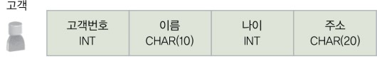
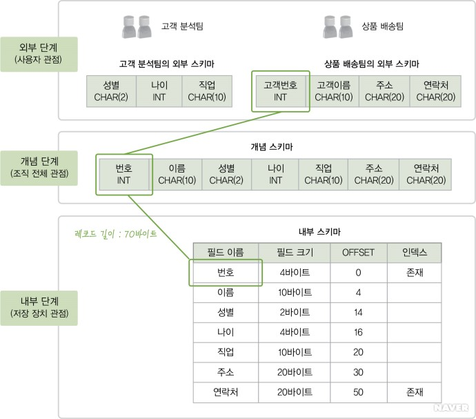
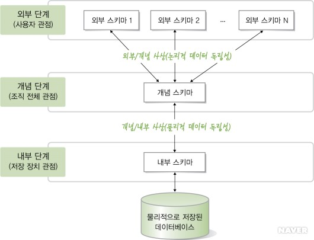

데이터를 컴퓨터 상에서 `효율적으로` 저장하기 위해 사용하는 것이 데이터베이스이다.

> 데이터 vs 정보
> 
> 데이터(data)란 현실 세계에서 관찰 or 측정하여 수집한 자료  
> 정보(information)란 데이터를, 의사결정에 유용하게 사용할 수 있도록, 처리하여 체계적으로 조직한 결과물

## 데이터베이스란

컴퓨터 상에서 데이터가 저장되는 공간

## 데이터베이스의 특징

데이터의 중복을 최소화하고, 데이터를 일관성 있게 유지한다.

---

데이터베이스는 특정 공간에 모아 놓은 데이터의 집합일 뿐, 데이터베이스에 데이터를 삽입하고 불필요해진 데이터를 삭제하며 잘못된 데이터를 수정하는 것은 다른 이의 몫이다. 
그렇다면 누가 그 힘들고 귀찮은 일을 대신해주는 걸까?

> 과거에는 데이터를 관리하기 위해 파일 시스템(file system)을 이용하였다. - 파일로 데이터를 관리
> 
> 파일 시스템은 별도의 구입 비용이 들지 않는다는 장점이 있지만, 응용 프로그램마다 파일을 따로 유지하는 특성 떄문에
> 발생하는 문제점들이 있다.
> 
> 1. 데이터 중복 - 같은 데이터가 여러 파일에 존재 -> 데이터 일관성, 무결성을 유지하기 어려워짐
> 2. 데이터 종속성 - 데이터가 담긴 파일의 구조가 변경되면, 응용 프로그램이 해당 파일에 접근하는 방법도 변경돼야 함
> 3. 보안 문제 - 파일 안의 레코드나 필드와 같은 더 작은 단위에 대한 접근 통제와 더 구체적인 권한 부여 불가능

---

기존 파일시스템의 문제점에 대한 대안으로 제시된 것이 바로 데이터베이스 관리 시스템(DataBase Management System)이다.

## DBMS

DBMS란 DB를 운영하고 관리하는 소프트웨어이다.  
(필요한 데이터를 데이터베이스에 통합하여 저장하고 이에 대한 관리를 담당한다)

### DBMS의 특징

DB 구조를 정의하거나 수정  
데이터 검색, 수정, 삭제  

> 파일시스템 vs 데이터베이스
>
> 데이터베이스의 장점: 데이터 중복 최소화, 데이터를 일관성 있게 유지, 데이터 복구나 보안성 제공  
> 데이터베이스의 단점: 비용, 러닝 커브
>
> 파일시스템의 장점: 간단하고 경제적  
> 파일시스템의 단점: 데이터 중복, 보안 관리 어려움

---

DBMS에서 데이터를 관리하려면 해당 데이터의 특징? 조건? 등을 정의해야 한다.  

> 우유라는 데이터를 정의할 때 필요한 특징들 - 양(g), 칼로리(kcal), 영양성분(...), ...

이 특징 & 조건을 정의한 것이 바로 `스키마`이다.

## 스키마(schema)

데이터의 구조나 제약 조건를 정의하는 개념

> 스키마는 DB를 설계할 때 정해지, 한번 정해진 후에는 자주 바뀌지 않는다.

스키마 예시  

---

데이터베이스의 여러 장점 덕분에, 많은 사용자가 데이터베이스를 이용하지만,  
데이터베이스의 복잡한 내부 구조와 동작 방식을 모두 이해하고 있어야 한다면,  
일반 사용자에게 데이터베이스는 그림의 떡일 수밖에 없다.  
(이것들을 일일이 공부할 수 없기 때문)

이를 위해 미국의 표준화 기관인 ANSI/SPARC에서는  
데이터베이스의 복잡한 내부 구조를 감추고 일반 사용자가 데이터베이스를 쉽게 이해하고 이용할 수 있도록  
3단계 데이터베이스 구조(3-level database architecture)를 제안하였다.

## 3단계 데이터베이스 구조

3단계 데이터베이스 구조는 하나의 데이터베이스를 세 단계로 나누어 이해한다.

사용자 단에서 DB를 바라보는 뷰를 정의하는 외부 스키마,  
전체 데이터베이스의 구조를 정의하는 개념 스키마,  
데이터의 물리적인 저장구조를 정의하는 내부 스키마

> 데이터베이스 하나를 세 단계로 나누고, 각 단계별로 다른 추상화(abstraction)를 제공하면 데이터베이스를 효과적으로 관리할 수 있다

---

### 외부 단계

외부 단계(external level)에서는,  
개별 사용자 관점에서 데이터베이스를 이해하고 표현한다.

> 하나의 데이터베이스를 조직 내의 사용자들이 함께 사용하지만 각 사용자가 데이터베이스 전체에 관심이 있는 것은 아니다.  
> 사용자마다 업무 내용과 사용 목적이 달라 필요한 데이터 내용이 다를 수 있다

이처럼 외부 단계에서 사용자에게 필요한 데이터베이스를 정의한 것을 외부 스키마(external schema)라 한다.

---

### 개념 단계

개념 단계(conceptual level)에서는,  
데이터베이스를 이용하는 사용자들의 관점을 통합하여, 데이터베이스를 조직 전체의 관점에서 이해하고 표현한다.

데이터베이스 관리 시스템이나 데이터베이스 관리자는 데이터베이스의 일부분이 아닌 전체 데이터베이스에 관심을 가지는데, 
개념 단계에서는 데이터베이스 관리 시스템이나 관리자의 관점에서 모든 사용자에게 필요한 데이터를 통합한 전체 데이터베이스의 논리적 구조를 정의한다. 
그리고 이를 개념 스키마(conceptual schema)라 한다.

> 개념 스키마는 조직 전체의 관점에서 생각하는 데이터베이스의 모습이며, 모든 사용자가 생각하는 데이터베이스의 모습을 하나로 합친 모습이다

> 데이터베이스 하나에는 개념 스키마가 하나만 존재한다.  
> -> 외부 스키마는 개념 스키마를 기초로 하여 사용자의 이용 목적에 맞게 만들어진다.

> 일반적으로 스키마라고 하면, 개념 스키마를 의미한다.

---

### 내부 단계

전체 데이터베이스가 저장 장치에 실제로 저장되는 방법을 정의한 것을 내부 스키마(internal schema)라고 한다.

내부 스키마는 파일에 데이터를 저장하는 레코드의 구조, 레코드를 구성하는 필드 크기, 인덱스를 이용한 레코드 접근 경로 등을 정의한다.  
(데이터베이스는 저장 장치에 파일 형태로 저장됨)

> 내부 스키마는 데이터베이스의 개념 스키마에 대한 물리적인 저장 구조를 표현하므로 하나의 데이터베이스에 하나만 존재한다.

---

하나의 데이터베이스에는 세 가지 유형의 스키마가 존재하지만, 이는 데이터베이스를 바라보는 관점이 다를 뿐 모두 같은 데이터베이스를 표현한다

실제 데이터는 물리적 저장 장치에 저장된 데이터베이스에만 존재하므로 
사용자가 자신의 외부 스키마를 통해 원하는 데이터를 얻으려면 내부 스키마에 따라 저장된 데이터베이스에 접근해야 한다. 

> 그러므로 세 가지 스키마 사이에는 유기적인 대응 관계가 성립해야 한다.

---

스키마 사이의 대응 관계를 사상 또는 매핑(mapping)이라 한다.   

외부 스키마와 개념 스키마는 외부/개념 사상에 의해 대응되고,  
개념 스키마와 내부 스키마는 개념/내부 사상(저장 인터페이스라고도 함)에 의해 대응된다.  
DBMS는 미리 정의된 외부/개념 사상과 개념/내부 사상 정보를 이용해 사용자가 원하는 데이터에 접근할 수 있다.

---

데이터베이스를 3단계 구조로 나누고, 단계별로 스키마를 유지하며 스키마 사이의 대응 관계를 정의하는 궁극적인 목적은   
데이터 독립성(data independency)을 실현하기 위해서이다

## 데이터 독립성

3단계 데이터베이스 구조의 특징  
하위 스키마를 변경하더라도 상위 스키마가 영향을 받지 않는 특성

목적은 데이터베이스 시스템의 유연성과 유지보수 용이성을 증진시키는 것

데이터 독립성에는 논리적 데이터 독립성과 물리적 데이터 독립성이 존재한다.

---

### 논리적 데이터 독립성

개념 스키마가 변경되어도 외부 스키마에 영향을 주지 않는 것  

(애플리케이션에 영향을 주지 않고 데이터베이스의 논리적 구조를 변경할 수 있는 것)

---

### 물리적 데이터 독립성

내부 스키마가 변경되어도 개념 스키마에 영향을 주지 않는 것  

(데이터베이스의 논리적 구조에 영향을 주지 않고 물리적 저장 장치를 변경할 수 있는 것)

---

데이터 독립성을 실현하면서 데이터베이스를 다양한 관점에서 이해하기 위해   
정의되는 세 가지 스키마와, 스키마 간의 사상 정보도 어딘가에 저장되어 있어야 필요할 때 사용할 수 있다.  

데이터베이스에 저장되는 데이터에 관한 정보를 저장하는 곳을 데이터 사전(data dictionary) 또는 시스템 카탈로그(system catalog)라고 한다.

## 데이터 사전/시스템 카탈로그

(데이터베이스에 저장되어 있는 데이터를 정확하고 효율적으로 이용하기 위해)  
스키마, 사상 정보, 다양한 제약조건 등을 저장하고 있는 것

> DB에 저장되는 데이터에 대한 정보를 메타 데이터라고 한다.  
> (데이터에 대한 데이터)

> 데이터 사전도 데이터를 저장하는 데이터베이스의 일종이기 때문에 시스템 데이터베이스(system database)라고 한다