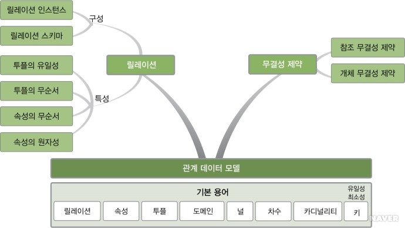
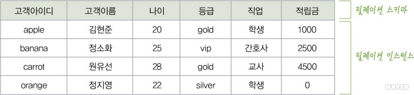
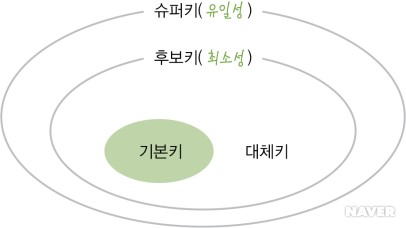

# 관계 데이터 모델(Relational Database Model)

## 관계형 데이터베이스(Relational Database)

관계형 데이터베이스(RDB)는 데이터를 효율적으로 저장하고 관리하기 위한 데이터베이스의 한 유형이다. 

이 데이터베이스는 테이블이라는 구조적인 형태로 데이터를 저장하며, 각 테이블은 특정 주제나 개체에 대한 정보를 포함한다.

이 데이터베이스는 테이블 간의 관계(relationship)를 정의할 수 있다.  
이러한 관계를 통해, 여러 테이블 간의 관계를 쉽게 이해하고 정보를 얻을 수 있다.

> 관계형 데이터베이스는 SQL(Structured Query Language)이라는  
> 표준화된 언어를 사용하여 데이터에 접근하고 조작한다.

### 관계형 데이터베이스의 장점

1. 데이터 무결성: 트랜잭션 관리와 제약 조건을 통해 데이터 무결성을 보장한다.  
   트랜잭션은 여러 작업을 원자적으로 묶어 데이터베이스를 일관된 상태로 유지하고, 제약 조건은 부정확한 데이터 입력을 방지하여 데이터의 신뢰성을 높인다.

2. 구조화된 데이터 저장: 테이블 형태의 구조는 데이터를 체계적으로 저장하고 관리할 수 있도록 도와준다.  
   각 테이블은 필드와 레코드로 구성되어 있어 데이터의 구조를 명확하게 정의할 수 있다.

3. 복잡한 쿼리 및 조인 지원: SQL을 사용하여 다양하고 복잡한 쿼리를 수행할 수 있다.   
   또한, 여러 테이블 간의 조인을 통해 복잡한 데이터 추출이 가능하며, 이는 분석 및 리포팅에 유리하다.

## RDBMS

RDBMS(Relational DataBase Management System)은  
관계형 데이터베이스를 만들고 업데이트하고 관리하는 데 사용하는 소프트웨어를 말한다.

> 잘 알려진 RDBMS의 예로는 MySQL, Oracle Database 등이 있다.

## 관계 데이터베이스 모델의 용어들

### 릴레이션(Relation)
  
관계 데이터 모델에서 하나의 개체(entity)에 대한 데이터의 모음

> 릴레이션을 테이블이라고도 많이 부른다

> relation vs relationship
>
> 관계형DB에서  
> relation은 하나의 개체에 대한 데이터의 모음을 뜻하고,  
> relationship은 여러 relation 간의 논리적 연결을 뜻한다.

---

### 속성(Attribute)

릴레이션의 열을 속성이라고 부른다.  
(필드(field)라고도 부름)

> 관계 데이터 모델에서 속성의 값은 더 이상 분해할 수 없는 `원자` 값만 사용할 수 있다

> 고객 릴레이션의 속성은 고객아이디, 고객 이름, 나이 등이 있다.

### 튜플(Tuple)

릴레이션의 행을 튜플이라고 부른다.  
(레코드(record)라고도 부름)

> 고객 릴레이션의 튜플은 고객 한 명에 대한 실제 속성 값들을 모아놓은 것  
> -> 고객 객체의 인스턴스

### 도메인(Domain)

속성 하나가 가질 수 있는 값의 집합을 해당 속성의 도메인이라 한다.

> 고객 릴레이션에서 등급 속성의 값으로 vip, gold, silver, bronze 중 하나만 허용된다면,  
> 4가지 값을 모아놓은 것이 등급 속성의 도메인
> 
> 고객이름 속성의 도메인은 CHAR(20), 즉 문자 20개로 구성된 문자 타입으로 정의하고,  
> 나이 속성의 도메인은 INT, 즉 정수 타입으로 정의
> 
> -> 데이터 타입을 도메인, 변수를 속성

### 차수(degree)

하나의 릴레이션에서, 속성의 수를 차수라고 한다.

> 모든 릴레이션은 최소 1 이상의 차수를 유지해야 한다

### 카디널리티(Cardinality)

하나의 릴레이션에서, 튜플의 전체 개수를 카디널리티라고 한다.

---

## 릴레이션의 구성

릴레이션은 릴레이션 스키마와 릴레이션 데이터베이스로 구성되어 있다.

### 릴레이션 스키마(relation schema)

릴레이션의 논리적 구조

``예시``  
릴레이션이름(속성이름1, 속성이름2, ..., 속성이름n)

### 릴레이션 인스턴스(relation instance)

릴레이션 인스턴스(relation instance)는 어느 한 시점에 릴레이션에 존재하는 튜플들의 집합이다

---

## 릴레이션의 특성

1. 튜플의 유일성: 하나의 릴레이션에는 동일한 튜플이 존재할 수 없다.

> 튜플의 유일하게 구별하기 위해 선정되는 속성(또는 속성들의 모임)을 키(key)라고 부른다.  
> (이 키를 이용해 튜플의 유일성이 만족되면 릴레이션에서 원하는 튜플에 쉽게 접근할 수 있다)

2. 튜플의 무순서: 하나의 릴레이션에서 튜플 사이의 순서는 무의미하다.

> 순서와 상관없이 튜플 내용이 같아야 같은 릴레이션이다.  
> (데이터베이스는 위치가 아닌 내용으로 검색되므로 튜플의 순서는 중요하지 않다)

3. 속성의 무순서: 하나의 릴레이션에서 속성 사이의 순서는 무의미하다

> 속성은 순서가 바뀌어도 다른 릴레이션이 될 수 없고, 순서와 상관없이 같은 속성들로 구성되어 있어야 같은 릴레이션이다.

> 속성 값은 릴레이션에서 위치가 아닌 속성의 이름으로 접근하므로  
> 하나의 릴레이션에는 이름이 같은 속성이 존재할 수 없고,  
> 이름도 속성의 의미가 명확히 드러나는 것으로 사용하는 것이 좋다.

4. 속성의 원자성: 속성 값은 원자 값만 사용할 수 있다.

---

## 키

릴레이션에 포함된 투플들을 유일하게 구별해주는 역할은 속성 또는 속성들의 집합인 키가 담당한다.  
키(key)는 관계 데이터 모델에서 중요한 제약조건을 정의한다.

---

관계 데이터 모델에서는 키를 5가지로 분류할 수 있다.

1. 슈퍼키
2. 후보키
3. 기본키
4. 대체키
5. 외래키

---

### 슈퍼키(super key)

유일성을 만족하는 속성 or 속성들의 집합

> 유일성(uniqueness)
>
> 키가 갖추어야 할 기본 특성으로,  
> 하나의 릴레이션에서 키로 지정된 속성의 값은 튜플마다 달라야 한다라는 의미이다.
>
> -> 키 값이 같은 튜플은 존재할 수 없다.

---

> 슈퍼키 중에는 튜플 하나를 유일하게 구별하기 위해서  
> 불필요한 속성의 값까지 확인하는 비효율적인 작업이 생길 수도 있다.  
> 
> 그래서 꼭 필요한 속성의 집합만으로 튜플을 유일하게 구별할 수 있도록 하는 또 다른 키의 개념이 필요하다.

### 후보키(candidate key)

유일성과 최소성을 만족하는 속성 or 속성들의 집합

> 최소성(minimality)
> 
> 키를 구성하고 있는 여러 속성 중에서 하나라도 없으면 튜플을 유일하게 구별할 수 없다라는 의미이다.  
> -> 꼭 필요한 최소한의 속성들로만 키를 구성하는 특성

> 하나의 속성으로 구성된 키는 당연히 최소성을 만족한다

> (주의)
> 
> 릴레이션 인스턴스만 보고 유일성과 최소성을 판단해서는 안된다.  
> -> 새로운 투플이 삽입되거나 기존 투플의 속성 값이 바뀌어도 유지되어야 하기 때문

---

> 릴레이션에서 투플을 구별하기 위해 여러 개의 후보키를 모두 사용할 필요는 없다.  
> -> 여러 후보키 중에서 기본적으로 사용할 키를 하나 선택해야 한다.

### 기본키(primary key)

튜플의 식별자로 이용하기에 가장 적합한 것을 릴레이션마다 선택 후보키

> 기본키를 선택할 때의 기준들
> 
> 1. null 값을 가질 수 있는 속성이 포함된 후보키는 기본키로 부적합
> 2. 값이 자주 바뀔 수 있는 속성이 포함된 후보키는 기본키로 부적합
> 3. 단순한 후보키가 기본키로 적합

---

### 대체키(alternate key)

기본키로 선택되지 못한 후보키들

> 대리키라고도 한다  
>
> 자연키와 대비되는, 인위적으로 만들어진 식별자를 대리키(surrogate key)라고도 한다.

---

### 외래키(foreign key)

한 릴레이션의 기본키를 참조하는 속성의 집합

> 외래키는 릴레이션들 사이의 관계를 올바르게 표현하기 위해 필요하다.

> 외래키가 반드시 다른 릴레이션을 참조할 필요는 없다.  
> 참조하는 릴레이션과 참조되는 릴레이션이 같을 수도 있다.
> 
> ex) 댓글(댓글id, 부모 댓글id, 내용, ...), 폴더(폴더id, 상위 폴더id, ...)

> 외래키는 기본키를 그대로 참조하지만, null 값이 들어갈 수 있다.

---

## 관계 데이터 모델의 제약

관계 데이터 모델에서 정의하고 있는 기본 제약 사항은 무결성 제약조건(integrity constraint)이다.

`무결성 제약조건`  
데이터의 일관성과 정확성을 유지하고 보증하기 위해, 지켜야 하는 규칙

> 데이터베이스의 상태가 변하더라도, 무결성 제약조건은 반드시 지켜져야 한다.

    데이터베이스 내부의 데이터를 보호한다는 관점에서 무결성은 보안과 유사하다.

    하지만 보안이 권한이 없는 사용자로부터 데이터를 보호하는 것이라면, 
    무결성은 권한이 있는 사용자의 잘못된 요구에 의해 데이터가 부정확해지지 않도록 보호하는 것이다.

무결성 제약조건에는 개체 무결성 제약조건과 참조 무결성 제약조건 등이 있다.

---

### 개체 무결성 제약조건(entity integrity constraint)

기본키를 구성하는 모든 속성은 널 값을 가지면 안 된다는 규칙

---

### 참조 무결성 제약조건(referential integrity constraint)

외래키는 참조할 수 없는 값을 가질 수 없다는 규칙

    외래키는 다른 릴레이션의 기본키를 참조하는 속성이고 릴레이션 간의 관계를 표현하는 역할을 한다.
    그런데 외래키가 자신이 참조하는 릴레이션의 기본키와 상관이 없는 값을 가지게 되면
    두 릴레이션을 연관시킬 수 없으므로 외래키 본래의 의미가 없어진다.

    그러므로 외래키는 자신이 참조하는 릴레이션에 기본키 값으로 존재하는 값, 즉 참조 가능한 값만 가져야 한다.

> 여기서 외래키가 null 값을 가졌다고 참조 무결성 제약조건을 위반한 것은 아니다.  
> (그냥 참조 할 대상을 지정하지 않은 것이다)

---

### 도메인 무결성 제약조건(domain integrity constraint)

속성들의 값은 정의된 도메인에 속한 값이어야 한다는 규칙