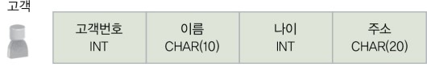

## 데이터베이스린  

특정 조직의 여러 사용자가 **공유**하며 사용할 수 있도록 **통합**해서 **저장**한 **운영** 데이터의 집합

## 데이터베이스의 특징

1. 실시간 접근 가능
2. 계속 변화
3. 동시 공유 가능
4. 내용으로 참조 가능

---

데이터베이스는 특정 공간에 모아 놓은 데이터의 집합일 뿐, 데이터베이스에 데이터를 삽입하고 불필요해진 데이터를 삭제하며 잘못된 데이터를 수정하는 것은 다른 이의 몫이다. 
그렇다면 누가 그 힘들고 귀찮은 일을 대신해주는 걸까?

> 과거에는 데이터를 관리하기 위해 파일 시스템(file system)을 이용하였다.
> 
> 파일 시스템은 별도의 구입 비용이 들지 않는다는 장점이 있지만, 응용 프로그램마다 파일을 따로 유지하는 특성 떄문에
> 발생하는 문제점들이 있다.
> 
> 1. 데이터 중복 -> 데이터 일관성, 무결성을 유지하기 어려워짐
> 2. 성능 문제 -> 특정 데이터를 찾으려면, 파일에 있는 모든 데이터를 조회해야 한다.
> 3. 보안 문제 -> 특정 유저만 특정 파일을 읽을 수 있도록 할 수 있는 시스템이 없다.

---

## DBMS

DBMS(DataBase Management System)란 DB와 상호작용하기 위한 인터페이스를 제공하는 소프트웨어이다.  
(필요한 데이터를 데이터베이스에 통합하여 저장하고 이에 대한 관리를 집중적으로 담당한다)

> 파일시스템 vs DBMS
> 
> 파일시스템의 장점: 바로 사용가능하다.   
> 파일시스템의 단점: 보안 & 성능 부분에서 취약
> 
> DBMS의 장점: 보안 & 성능 부분에서 좋음  
> DBMS의 장점: 별도로 학습 필요, 중앙 집중 관리로 인한 취약점 존재(여기 털리면 데이터 아예 못씀)

### DBMS의 장점

데이터 독립성 확보, 데이터 동시 공유 가능, 데이터 보안 향상, 데이터 무결성 유지

---

## 데이터베이스 시스템

데이터베이스 시스템은 데이터베이스와 데이터베이스 관리 시스템 외에도 사용자, 
사용자가 데이터베이스에 접근하는 데 사용하는 데이터 언어, 데이터베이스와 데이터베이스 관리 시스템을 설치하고 데이터 처리 연산을 담당하는 컴퓨터로 구성된다.

## 스키마

스키마란 DB에 저장되는 데이터 구조와 제약조건을 정의한 것이다.

스키마 예시  

(DB에 실제로 저장된 값 - 인스턴스)

---

데이터베이스의 복잡한 내부 구조와 동작 방식을 모두 이해하고 있어야 한다면 일반 사용자에게 데이터베이스는 그림의 떡일 수밖에 없다.

미국의 표준화 기관인 ANSI/SPARC에서는 데이터베이스의 복잡한 내부 구조를 감추고 일반 사용자가 데이터베이스를 쉽게 이해하고 이용할 수 있도록 
3단계 데이터베이스 구조(3-level database architecture)를 제안하였다.

## 3단계 데이터베이스 구조

개별 사용자 관점에서 바라보는 외부 단계(external level),  
조직 전체의 관점에서 바라보는 개념 단계(conceptual level),  
물리적인 저장 장치의 관점에서 바라보는 내부 단계(internal level)로 나눈다.

> 데이터베이스 하나를 세 단계로 나누고, 각 단계별로 다른 추상화(abstraction)를 제공하면 데이터베이스를 효과적으로 관리할 수 있다  

> (일반적으로 내부 단계에서 외부 단계로 갈수록 추상화 레벨이 높아진다)

---

### 외부 스키마

외부 단계(external level)에서는 개별 사용자 관점에서 데이터베이스를 이해하고 표현한다.

> 하나의 데이터베이스를 조직 내의 사용자들이 함께 사용하지만 각 사용자가 데이터베이스 전체에 관심이 있는 것은 아니다. 
> 사용자마다 업무 내용과 사용 목적이 달라 필요한 데이터 내용이 다를 수 있다

이처럼 외부 단계에서 사용자에게 필요한 데이터베이스를 정의한 것을 외부 스키마(external schema)라 한다. 
외부 스키마는 각 사용자가 생각하는 데이터베이스의 모습인 논리적인 구조로, 사용자마다 다르다.

### 개념 스키마

개념 단계(conceptual level)에서는 데이터베이스를 이용하는 사용자들의 관점을 통합하여, 데이터베이스를 조직 전체의 관점에서 이해하고 표현한다.

데이터베이스 관리 시스템이나 데이터베이스 관리자는 데이터베이스의 일부분이 아닌 전체 데이터베이스에 관심을 가지는데, 
개념 단계에서는 데이터베이스 관리 시스템이나 관리자의 관점에서 모든 사용자에게 필요한 데이터를 통합한 전체 데이터베이스의 논리적 구조를 정의한다. 
그리고 이를 개념 스키마(conceptual schema)라 한다.

> 개념 스키마는 조직 전체의 관점에서 생각하는 데이터베이스의 모습이며, 모든 사용자가 생각하는 데이터베이스의 모습을 하나로 합친 모습이다

> 데이터베이스 하나에는 개념 스키마가 하나만 존재한다.  
> -> 외부 스키마는 개념 스키마를 기초로 하여 사용자의 이용 목적에 맞게 만들어진다.

### 내부 스키마

전체 데이터베이스가 저장 장치에 실제로 저장되는 방법을 정의한 것을 내부 스키마(internal schema)라고 한다.

내부 스키마는 파일에 데이터를 저장하는 레코드의 구조, 레코드를 구성하는 필드 크기, 인덱스를 이용한 레코드 접근 경로 등을 정의한다.  
(데이터베이스는 저장 장치에 파일 형태로 저장됨)

> 내부 스키마는 데이터베이스의 개념 스키마에 대한 물리적인 저장 구조를 표현하므로 하나의 데이터베이스에 하나만 존재한다.

---

> 하나의 데이터베이스에는 세 가지 유형의 스키마가 존재하지만, 이는 데이터베이스를 바라보는 관점이 다를 뿐 모두 같은 데이터베이스를 표현한다

실제 데이터는 물리적 저장 장치에 저장된 데이터베이스에만 존재하므로 
사용자가 자신의 외부 스키마를 통해 원하는 데이터를 얻으려면 내부 스키마에 따라 저장된 데이터베이스에 접근해야 한다. 

> 그러므로 세 가지 스키마 사이에는 유기적인 대응 관계가 성립해야 한다.

스키마 사이의 대응 관계를 사상 또는 매핑(mapping)이라 한다.   

외부 스키마와 개념 스키마는 외부/개념 사상에 의해 대응되고,   
개념 스키마와 내부 스키마는 개념/내부 사상에 의해 대응된다.   
데이터베이스 관리 시스템은 미리 정의된 외부/개념 사상과 개념/내부 사상 정보를 이용해 사용자가 원하는 데이터에 접근할 수 있다.

---

데이터베이스를 3단계 구조로 나누고, 단계별로 스키마를 유지하며 스키마 사이의 대응 관계를 정의하는 궁극적인 목적은   
데이터 독립성(data independency)을 실현하기 위해서이다

## 데이터 독립성

데이터 독립성은 하위 스키마를 변경하더라도 상위 스키마가 영향을 받지 않는 특성

### 논리적 데이터 독립성

논리적 데이터 독립성은 개념 스키마가 변경되더라도 외부 스키마가 영향을 받지 않는 것이다.

> 개념 스키마가 변경되어도 외부 스키마가 영향을 받지 않는다는 것은   
> 결국 외부 스키마의 사용자가 전체 데이터베이스의 논리적 구조가 변경되었다는 사실을 알 필요가 없음을 의미한다.

### 물리적 데이터 독립성

물리적 데이터 독립성은 내부 스키마가 변경되더라도 개념 스키마가 영향을 받지 않는 것이다. 

> 그래서 결과적으로는 외부 스키마도 영향을 받지 않는다.

