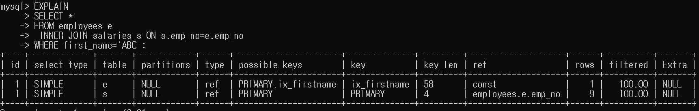
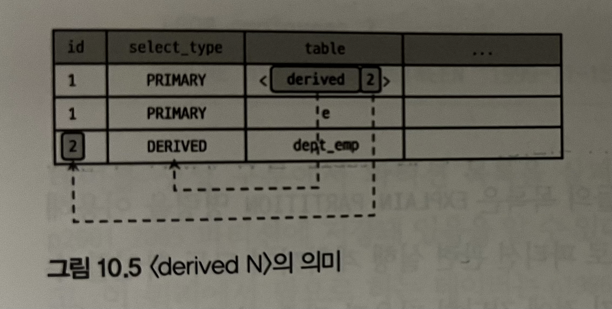

살펴볼 것
1. MySQL 서버의 실행 계획에 가장 큰 영향을 미치는 통계 정보
2. 실행 계획을 읽는 순서 
3. 실행 계획에 출력되는 키워드, 알고리즘에

# 통계 정보

테이블 및 인덱스에 대한 통계 정보와 히스토그램을 살펴본다.

> MySQL 8.0 버전부터 인덱스되지 않은 칼럼들에 대해서도  
> 데이터 분포도를 수집해서 저장하는 히스토그램이 도입됐다.

## 테이블 및 인덱스 통계 정보

비용 기반 최적화에서 제일 중요한 것은 통계 정보다.

### MySQL 서버의 통계 정보

> 5.6 버전부터 각 테이블의 통계 정보를 mysql 데이터베이스의  
> innodb_index_stats 테이블과 innodb_table_stats 테이블로 관리할 수 있게 됐다.  
> (이전까지는 그냥 메모리에 저장 -> 휘발됨)

통계 정보의 각 칼럼이 의미하는 것
- innodb_index_stats.stat_name='n_diff_pfx%': 인덱스가 가진 유니크한 값의 개수
- innodb_index_stats.stat_name='n_leaf_pages': 인덱스가 가진 리프 노드 페이지의 개수
- innodb_index_stats.stat_name='size': 인덱스 트리의 전체 페이지 개수
- innodb_table_stats.n_rows: 테이블의 전체 레코드 건수
- innodb_table_stats.clustered_index_size: PK 크기(InnoDB 페이지 개수)
- innodb_table_stats.sum_of_other_index_sizes: PK를 제외한 인덱스의 크기(InnoDB 페이지 개수)

## 히스토그램

### 히스토그램 정보 수집 및 삭제

히스토그램은 칼럼 단위로 관리되는데,  
이는 ```ANALYZE TABLE ... UPDATE HISTOGRAM``` 명령을 실행해  
수동으로 수집 및 관리된다.

수집된 정보는 시스템 딕셔너리에 함께 저장되고,  
서버를 시작할 때 information_schema 데이터베이스의  
column_statistics 테이블로 로드한다.

히스토그램의 타입은 2 종류가 있다.
1. Singleton(싱글톤 히스토그램): 칼럼 값 개별로 레코드 건수를 관리하는 히스토그램, 도수 분호 히스토그램이라고 함
2. Equi-Height(높이 균형 히스토그램): 칼럼 값의 범위를 균등한 개수로 나눠서 관리하는 히스토그램, Height-Balanced 히스토그램이라고 함

히스토그램은 버킷(Bucket) 단위로 구분되어  
레코드 건수나 칼럼값의 범위가 관리된다.

싱글톤 히스토그램은 각 버킷이 칼럼과 발생 빈도율 2개 값을 가진다.  
높이 균형 히스토그램은 각 버킷이 범위 시작 값과 마지막 값, 발생 빈도율과 각 버킷에 포함된 유니크한 값의 개수 4개의 값을 가진다.

히스토그램의 모든 레코드 건수 비율은 누적으로 표시된다.
(그래서 항상 마지막 버킷의 빈도율은 1이 된다)

> 여기서 기울기가 일정하다면 각 범위가 비슷한 레코드 건수를 가진다고 할 수 있다.

information_schema.column_statistics 테이블의 HISTOGRAM 칼럼이 가진 필드들의 의미
- sampling-rate: 스캔한 페이지의 비율(1이라면 전체를 스캔한 것이다, but 테이블 전체를 스캔하는 것은 부하가 높다)
- histogram-type: 히스토그램의 종류
- number-of-buckets-specified: 히스토그램을 생성할 때 설정한 버킷의 개수(현재 개수가 아닌 설정된 개수, default 100)

### 히스토그램의 용도

> 히스토그램이 도입되기 전에,  
> MySQL 서버는 해당 테이블의 전체 레코드 건수와  
> 인덱스된 칼럼이 가지는 유니크한 값의 개수만 가지고 예측을 했다.
> (하지만 데이터는 균등한 분포도를 가지지 않기 때문에 문제가 되었다)

히스토그램이 없다면 옵티마이저는 조인 순서를 결정할 때  
테이블의 전체 레코드 건 수나 크기등 단순한 정보만으로  
조인의 드라이빙 테이블을 결정한다.

각 칼럼에 대해 히스토그램 정보가 있다면  
어느 테이블을 먼저 읽어야 조인의 횟수를 줄일 수 있을지  
정확히 판단할 수 있다.

### 히스토그램과 인덱스

MySQL 서버에서는 쿼리의 실행 계획을 수립할 때  
사용가능한 인덱스들로부터 조건절에 일치하는 레코드 건수를 대략 파악하고  
최종적으로 가장 나은 실행 계획을 선택한다.

이때 조건절에 일치하는 레코드 건수를 예측하기 위해  
실제 인덱스의 B-Tree를 샘플링해서 살펴본다.  
이 작업을 `인덱스 다이브(Index Dive)`라고 표현한다.

그런데 인덱스된 칼럼에 대해 히스토그램을 생성하는게 과연 좋을까?

MySQL 8.0 서버에서는 인덱스된 칼럼을 검색 조건으로 사용하는 경우  
그 칼럼의 히스토그램은 사용하지 않고 실제 인덱스 다이브를 통해 직접 수집한 정보를 활용한다.  
(이는 실제 검색 조건 대상 값에 대한 샘플링을 실행하는 것이므로 항상 히스토그램보다 정확한 결과를 기대할 수 있다)

하지만 인덱스 다이브 작업은 어느 정도의 비용이 필요하다.

> ex)  
> 만약 WHERE 조건절에 있는 IN 연산자의 값이 많다면,  
> 인덱스 다이브 작업은 비용이 많이 들게 된다.

## 코스트 모델(Cost Model)

MySQL 서버가 쿼리를 처리하기 위한 작업들
- 디스크로부터 페이지 읽기
- 메모리(InnoDB 버퍼 풀)로부터 페이지 읽기
- 인덱스 키 비교
- 레코드 평가
- 메모리 임시 테이블 작업
- 디스크 임시 테이블 작업

MySQL 서버는 사용자의 쿼리에 대해  
다양한 작업이 얼마나 필요한지 예측하고  
전체 작업 비용을 계산한 결과를 바탕으로 최적의 실행 계획을 찾는다.

이렇게 전체 쿼리의 비용을 계산하는데 필요한 작업 단위들의 비용을  
`코스트 모델(Cost Model)`이라고 한다.

MySQL 5.7 이전 버전까지는  
이런 작업들의 비용을 서버 소스 코드에 상수화 했다.

> 그 이후 버전부터 각 작업 단위의 비용을 관리자가 조정할 수 있게 됐지만,  
> 꼭 바꿔서 사용해야 하는 것은 아니다.  
>
> 코스트 모델은 MySQL 서버가 사용하는 하드웨어와  
> 서버 내부 처리 방식에 대한 깊이 있는 지식을 필요로 한다.
> 
> 그리고 기본값으로도 MySQL 서버는 20년동안 잘 사용됐기 때문에  
> 함부로 변경하지 않는게 좋을 것 같다.

---

# 실행 계획 확인

`DESC`, `EXPLAIN` 명령으로 MySQL 서버의 실행 계획을 확인할 수 있다.

## 실행 계획 출력 포맷

MySQL 8.0 버전부터 `FORMAT` 옵션을 통해  
실행 계획의 표시 방법을 JSON이나 TREE, 단순 테이블 형태로 선택할 수 있다.

## 쿼리의 실행 시간 확인

MySQL 8.0.18 버전부터는  
쿼리의 실행 계획과 단계별 소요 시간 정보를 확인할 수 있는  
`EXPLAIN ANALYZE` 기능이 추가됐다.

> `SHOW PROFILE` 명령도 어떤 부분에서 시간이 많이 소요됐는지 알려주지만,  
> 실행 계획의 단계별로 소요된 시간 정보를 보여주진 않는다.

`EXPLAIN ANALYZE` 명령은 항상 결과를 TREE 포맷으로 보여주기 때문에  
EXPLAIN 명령어의 FORMAT 옵션을 사용할 수 없다.

TREE 포맷 실행 계획 실행 순서
- 들여쓰기가 같은 레벨에서는 상단에 위치한 라인이 먼저 실행
- 들여쓰기가 다른 레벨에서는 가장 안쪽에 위치한 라인이 먼저 실행

> ex)  
> (1) ->  
> (2) ---->  
> (3) ---->  
> (4) ------>  
> 라면
> 
> (2) -> (4) -> (3) -> (1) 순서로 실행되는 것

`EXPLAIN ANALYZE` 명령의 결과에는 단계별로  
실제 소요된 시간(actual time)과 처리한 레코드 건수(rows), 반복 횟수(loops)가 표시된다.

actual time: 숫자 값 2개 표시 됨(첫번째 레코드를 가져오는데 걸린 평균 시간, 마지막 레코드를 가져오는데 걸린 평균 시간)  
rows: 처리한 평균 레코드 건수  
loops: 반복 횟수

평균 시간과 평균 레코드 건수인 이유는 loops가 1 이상일 때를 포함하기 때문이다.

> `EXPLAIN ANALYZE` 명령은 실제 쿼리를 실행하고 사용된 실행 계획과 소요된 시간을 보여주는 것
> 
> 그래서 쿼리의 실행 계획이 나쁜 경우라면   
> `EXPLAIN` 명령으로 먼저 확인 후, 어느정도 튜닝해서  
> `EXPLAIN ANALYZE` 명령을 실행하는 것이 좋다.

---

# 실행 계획 분석



표의 각 라인(레코드)은 쿼리 문장에서 사용된 테이블의 개수만큼 출력된다.  
(서브쿼리로 생성 된 임시 테이블 포함)  

실행 순서는 위에서 아래로 표시 된다.
(UNION이나 상관 서브쿼리의 경우 순서대로 표시되지 않을 수 있음)

---

이제부터 실행 계획의 각 칼럼이 어떤 것을 의미하는지,  
어떤 값들이 등장하는지 살펴본다.

## id 칼럼

id 칼럼은 단위 SELECT 쿼리별로 부여되는 식별자 값이다.

> 단위 쿼리  
> SELECT 키워드 단위별로 구별한 쿼리

만약 서브쿼리를 실행했는데, 해당 쿼리의 실행 계획에서  
id 칼럼의 값이 같다면, 이는 조인을 이용한 것이다.

> 한 가지 주의해야 할 점은  
> 실행 계획의 id 칼럼이 테이블의 접근 순서를 의미하지 않는다.
> 
> 순서가 헷갈린다면 `EXPLAIN FORMAT=TREE` 명령으로 확인하자

## select_type 칼럼

각 단위 SELECT 쿼리가 어떤 타입의 쿼리인지 표시되는 칼럼이다.

### SIMPLE

UNION이나 서브쿼리를 사용하지 않는 단순한 SELECT 쿼리  
(쿼리의 조인이 포함된 경우도 포함)

일반적으로 제일 바깥 SELECT 쿼리의 select_type이 SIMPLE로 표시된다.

### PRIMARY

UNION이나 서브쿼리를 가지는 SELECT 쿼리의 실행 계획에서 가장 바깥쪽에 있는  
단위 쿼리는 PRIMARY로 표시 된다.  
(SIMPLE 처럼 제일 바깥 쿼리 하나만 표시)

### UNION

UNION으로 결합하는 단위 SELECT 쿼리 가운데 첫번째 쿼리를 제외한 두번째 이후  
단위 SELECT 쿼리들이 UNION으로 표시 된다.

> UNION의 첫번쨰 단위 쿼리는 select_type이 UNION이 아니라,  
> DERIVED로 표시 된다.  
> (UNION 되는 쿼리들을 모아서 임시 테이블에 저장하기 때문에)

### DEPENDENT UNION

UNION과 같이 UNION이나 UNION ALL로 집합을 연결하는 쿼리에서 표시된다.
여기서 DEPENDENT는 UNION ALL로 결합된 단위 쿼리가  
외부 쿼리에 의해 영향을 받는 것을 의미한다.

### UNION RESULT

UNION 결과를 담아두는 테이블을 의미한다.

> MySQL 8.0 버전부터는 UNION ALL을 하면 임시 테이블을 사용하지 않는다.
> -> UNION RESULT 없음
> 
> 하지만 그냥 UNION은 임시 테이블을 사용한다.

UNION RESULT는 실제 쿼리에서 단위 쿼리가 아니기 때문에 별도의 id 값은 부여되지 않는다.

UNION RESULT 레코드의 table 칼럼은 `<union #,#>`으로 표시되는데  
여기서 #은 UNION을 진행한 테이블의 id 값을 의미한다.

### SUBQUERY

FROM 절 이외에서 사용되는 서브쿼리를 의미한다.

> FROM 절에서 사용되는 서브쿼리의 select_type은 DERIVED로 표시된다.  
> (파생 테이블)

> 서브쿼리는 사용되는 위치에 따라 다르게 불린다.
> - 중첩된 서브쿼리(Nested Subquery): SELECT 되는 칼럼에 사용되는 서브쿼리
> - 서브쿼리(Subquery): WHERE 절에 사용된 서브쿼리
> - 파생 테이블(Derived Table): FROM 절에 사용된 서브쿼리, 인라인 뷰라고도 부름
> 
> 반환하는 값의 특성에 따라도 다르게 불린다.
> - 스칼라 서브쿼리(Scalar Subquery): 하나의 값만 반환하는 쿼리(칼럼이 1개)
> - 로우 서브쿼리(Row Subquery): 칼럼의 개수와 상관없이 하나의 레코드만 반환하는 쿼리

### DEPENDENT SUBQUERY

서브쿼리가 바깥쪽 SELECT 쿼리에서 정의된 칼럼을 사용하는 경우 표시된다.

> DEPENDENT가 붙은 쿼리는  
> 외부 쿼리가 먼저 수행된 후 내부 쿼리가 실행돼야 하므로  
> (DEPENDENT가 없는)일반 서브쿼리보다는 처리 속도가 느릴 때가 많다.

### DERIVED

단위 SELECT 쿼리의 실행 결과로 메모리나 디스크에 임시 테이블을 생성하는 것을 의미한다.  
(파생 테이블)

> 위에서 FROM 절에서 사용되는 서브쿼리는 DERIVED라고 표시된다고 했는데,  
> 지금은 서브쿼리 최적화가 많이 이루어져서 모든 경우가 그렇지는 않다. 

> 그리고 가능하다면 DERIVED 형태의 실행 계획을  
> 조인으로 해결할 수 있도록 하는 것이 좋다.
> 
> 특히 서브쿼리를 조인으로 재작성해서 처리하자

### DEPENDENT DERIVED

FROM절의 서브쿼리가 외부 칼럼을 참조할 때 표시된다.

> 원래 FROM 절의 서브쿼리는 외부칼럼을 참조할 수 없지만,  
> 8.0 버전부터 래터럴 조인(LATERAL JOIN) 기능이 추가되면서 같이 등장했다.

### UNCACHEABLE SUBQUERY

캐싱이 불가능한 서브쿼리에 표시된다.

> 조건이 똑같은 서브쿼리가 실행될 때는 다시 실행하지 않고  
> 이전의 실행 결과를 그대로 사용할 수 있게, 내부적인 캐시 공간에 저장한다.
> 
> SUBQUERY는 처음 한번만 실행해서 결과를 캐싱  
> DEPENDENT SUBQUERY는 의존하는 바깥쪽 쿼리의 칼럼의 값 단위로 캐싱

캐시를 사용하지 못하게 하는 요소
- 사용자 변수가 서브쿼리에 사용된 경우
- UUID()와 RAND()와 같이 결과가 호출될 떄마다 달라지는 함수가 서브쿼리에 사용된 경우

### UNCACHEABLE UNION

UNION과 UNCACHEABLE이 혼합된 형태

### MATERIALIZED

FROM 절이나 IN 형태의 쿼리에 사용된 서브쿼리를 최적화할 떄 사용된다.

서브쿼리의 내용을 임시 테이블로 구체화(Meterialization)한 후,  
임시 테이블과 바깥 테이블을 조인하면서 최적화 된다.

> 이 select_type이 사용되면 실행 계획에 레코드가 한 줄(임시 테이블) 추가된다.  
> (임시 테이블의 id는 바깥 테이블과 같을 것이다 - 조인되니까)

## table 칼럼

MySQL 서버의 실행 계획은 단위 SELECT 쿼리 기준이 아니라,  
테이블 기준으로 표시된다.

테이블의 이름에 별칭이 부여된 경우 별칭이 표시된다.

> 별도의 테이블을 사용하지 않는 SELECT 쿼리는  
> table 칼럼에 NULL이 표시된다.  
> (DUAL 테이블도 마찬가지)

table 칼럼에 `<union M, N>` 또는 `<derived N>`와 같이 `<>`로 둘러쌓인 테이블은 임시 테이블을 의미한다.
그리고 `<>`안에 표시되는 숫자는 단위 SELECT 쿼리의 id를 의미한다.



## partitions 칼럼

파티셔닝이 어떻게 이루어지는지 알려주는 칼럼

// 파티셔닝 잘 모름...

## type 칼럼

MySQL 서버가 각 테이블의 레코드를 어떻게 읽었는지를 나타낸다.  
(인덱스를 이용했는지, 테이블을 처음부터 끝까지 읽었는지 등)

> MySQL 메뉴얼에서는 type 칼럼을 "조인 타입"이라고 소개한다.  
> MySQL에서는 하나의 테이블로부터 레코드를 읽는 작업도 조인처럼 처리하기 때문이다.

type 칼럼에 표시될 수 있는 값들  
(위부터 성능이 빠른 순)
- system
- const
- eq_ref
- ref
- fulltext
- ref_or_null
- unique_subquery
- index_subquery
- range
- index_merge
- index
- ALL

ALL을 제외한 다른 값들은 인덱스를 사용하는 접근 방법이다.  
ALL은 풀 테이블 스캔을 의미한다.

하나의 단위 SELECT 쿼리는 위의 접근 방법 중 단 하나만 사용할 수 있다.  
또한 index_merge를 제외한 다른 접근 방법은 모두 인덱스 하나만을 이용한다.

### system

레코드에 1건만 존재하는 테이블 or 한 건도 존재하지 않는 테이블을  
참조하는 형태의 접근 방법이다.

MyISAM이나 MEMORY 테이블에서만 사용되는 접근 방법  
(InnoDB는 index나 ALL이 나타난다)

### const

테이블의 레코드 건수와 상관없이  
쿼리가 PK나 유니크 키 칼럼을 이용하는 WHERE 조건절을 가지고 있으며,  
반드시 1건을 반환하는 쿼리의 처리 방식을 말한다.
(다른 DBMS에선 이를 유니크 인덱스 스캔이라고 표현한다)

> PK나 유니크 인덱스의 일부 칼럼만을 사용하면  
> 실제로 몇개인지 모르기 때문에  
> 이는 const로 표시되지 않는다.  
> (ref로 표시된다)

### eq_ref

(여러 테이블이 조인되는 방식에서만 표시된다)  
조인에서 처음 읽은 테이블의 칼럼값을,  
그 다음 읽어야 할 PK나 유니크 키 칼럼의 검색 조건에 사용할 때를 가리켜
eq_ref라 한다.
(두번쨰 읽는 테이블의 type 칼럼에 표시된다)

> 유니크 인덱스는 NOT NULL이어야 하며,  
> 다중 칼럼 인덱스라면 인덱스의 모든 칼럼이 비교 조건에 사용되야 한다.

즉 조인 이후에 두번쨰 읽는 테이블에서 반드시 1건만 존재한다는 보장이 있어야  
사용된다.

### ref

인덱스의 종류와 관계없이 동등(Equal) 조건으로 검색할 때  
ref 접근 방법이 표시된다.

> 조회되는 레코드가 반드시 1건이라는 보장이 없으므로  
> const나 eq_ref보다는 빠르지 않다.
> 
> 하지만 동등한 조건으로만 비교되므로 매우 빠른 조회 방법 중 하나다.

> 위 세가지 접근 방법은 인덱스의 분포도가 나쁘지 않다면  
> 성능상의 문제는 거의 없다.

### fulltext

MySQL 서버의 전문 검색(Full-text Search) 인덱스를 사용해 레코드를 읽는 접근 방법

### ref_or_null

ref 방식 또는 NULL 비교(IS NULL) 접근 방법을 의미한다.

### unique_subquery

WHERE 조건절에서 IN(subquery) 형태의 쿼리를 위한 접근 방법이다.  
서브쿼리에서 중복되지 않는 유니크한 값만 반환할 때 사용한다.

> MySQL 8.0 버전부터는 IN(subquery) 형태의 세미조인을 최적화하기 위한 많은 기능이 도입됐다.  
> 따라서 다른 실행 계획이 보일 수도 있다.

### index_subquery

WHERE 조건절의 IN(subquery)에서 중복된 값을 반환할 때,  
인덱스를 이용해서 중복을 제거할 수 있을 때 사용된다.

### range

인덱스 레인지 스캔 형태의 접근 방법이다.

범위로 검색하는 경우: "<, >, IS NULL, BETWEEN, IN, LIKE"

> 여기서는 const, ref, range 모두 인덱스 레인지 스캔으로 묶어서 지칭한다.

### index_merge

2개 이상의 인덱스를 이용해 각각의 검색 결과를 만들어 낸 후,  
그 결과를 병합해서 처리하는 방식이다.  
(대표적으로 OR 이 사용됐을 때)

index_merge 접근 방법의 특징
- 여러 인덱스를 읽어야 하므로 range 보다 효율이 떨어진다.
- 전문 검색 인덱스는 index_merge가 적용되지 않는다.
- 이 작업 이후에 교집합, 합집합, 중복 제거 과정이 필요하다.

### index

인덱스 풀 스캔을 의미한다.

> range 처럼 효율적으로 필요한 부분만 읽는 것이 아님을 알아두자

인덱스 풀 스캔은 풀 테이블 스캔과 비교했을 때,  
비교하는 레코드 건수는 같지만,  
(인덱스는 일반적으로 전체 데이터 파일보다 크기가 작으므로)  
풀 테이블 스캔보다 빠르다.

const, ref, range 로 처리할 수 없는 경우 +  
(인덱스에 포함된 칼럼만으로 처리할 수 있는 경우) or (인덱스를 이용해 정렬/그루핑 작업이 가능한 경우)  
위 케이스에서 사용가능한 방식이다.

### ALL

풀 테이블 스캔을 의미한다.  
(가장 비효율적인 방법)

## possible_keys 칼럼

옵티마이저가 최적의 실행 계획을 만들기 위해  
후보로 선정됐던 접근 방법에서 사용된 인덱스의 목록이다.

> 실제로 사용된 것 1개 포함

## key 칼럼

최종 선택된 실행 계획에서 사용하는 인덱스를 표시한다.

PRIMARY: PK 사용  
다른 인덱스는 인덱스의 이름이 표시된다.

> index_merge 방식이 사용되면  
> 칼럼에 2개 이상의 인덱스가 표시되고,  
> 
> ALL 방식이 사용되면 칼럼에 NULL이 표시된다.

## key_len 칼럼

쿼리를 처리하기 위해 인덱스에서 몇개의 칼럼이 사용됐는지 알려준다.

> MySQL에서는 NOT NULL이 아닌 칼럼에서는  
> 칼럼의 값이 NULL인지 아닌지를 저장하기 위해 1바이트를 추가로 더 사용한다.

## ref 칼럼

접근 방법(type 칼럼)이 ref일 때(or eq_ref)  
참조 조건으로 어떤 값이 제공됐는 지 보여준다.

상숫값을 지정했다면 const로 표시되고,  
다른 테이블의 칼럼값이면 그 테이블명과 칼럼명이 표시된다.

> 이 칼럼 값이 func라면, 이는 "Function"의 줄임말로  
> 참조용으로 사용되는 값을 그대로 사용한 것이 아니라  
> 콜레이션 변환(그냥 문자열 변환)이나  
> 값 자체의 연산을 거쳐서 참조됐다는 것을 의미한다.  
> 
> func이 쓰이면 어떤 테이블의 칼럼을 썼는지 알 수 없으므로  
> 조인할 때, 조인 칼럼의 타입은 일치시키는 편이 좋다.

## rows 칼럼

실행 계획의 효율성 판단을 위해 예측했던 레코드 건수를 보여준다.  
(이 값은 통계 정보를 참조해 MySQL 옵티마이저가 산출해 낸 예상값이라서 정확하지는 않다)

또한 rows 칼럼에 표시되는 값은 반환하는 레코드의 예측치가 아니라  
쿼리를 처리하기 위해 얼마나 많은 레코드를 읽고 체크해야 하는지를 의미한다.
(그래서 실제 레코드 건수와 rows 칼럼의 값은 일치하지 않을 때가 많다)

## filtered 칼럼

필터링되고 남은 레코드의 비율을 의미한다.  
(실제 비율)

100은 필터링되지 않았다는 것

> 여기서 비율은 rows 칼럼의 값의 비율을 의미한다.  
> (not 전체 레코드)

## Extra 칼럼

쿼리의 실행 계획과 관련된 중요한 내용이 자주 표시된다.

지금부터는 많이 쓰이는 대표적인 것 몇 개의 코멘트만 보겠다.  
(이 외의 것들은 메뉴얼을 확인하자)

### Using where

> MySQL 서버는 내부적으로 MySQL 엔진과 스토리지 엔진으로 나뉜다.
> 
> 스토리지 엔진은 디스크나 메모리 상에서 필요한 레코드를 읽거나 저장하는 역할  
> MySQL 엔진은 스토리지 엔진으로부터 받은 레코드를 가공 또는 연산하는 역할

MySQL 엔진 레이어에서 별도의 가공을 해서 필터링 작업을 처리한 경우에 나타나는 코멘트이다.

### Using index

데이터 파일을 전혀 읽지 않고 인덱스만 읽어서 쿼리를 모두 처리할 수 있을 때 표시된다.  
(커버링 인덱스가 사용된 경우)

> 이는 인덱스 레인지 스캔이나 인덱스 풀 스캔을 구분하지 않는다.
> 
> Using index가 표시된 실행 계획이 어떤 스캔을 사용하는지 구분하고 싶다면  
> type 칼럼을 통해 구분하면 된다.  
> index: 인덱스 풀 스캔(인데 커버링 인덱스로 사용됨)  
> range: 인덱스 레인지 스캔(인데 커버링 인덱스로 사용됨)

### Using temporary

MySQL 서버에서 쿼리를 처리하는 동안  
중간 결과를 담아두기 위해 임시 테이블(Temporary Table)을 사용할 떄 표시된다.

임시 테이블은 메모리 혹은 디스크에서 생성된다.  
(이는 실행 계획에서 확인할 수 없다. 시스템 변수를 통해 확인하자)

> "Using temporary"가 표시되지 않아도  
> 내부적으로 임시 테이블을 사용할 수도 있다.
> 
> COUNT(DISTINCT col1) 을 사용하는 경우가 대표적이다.
