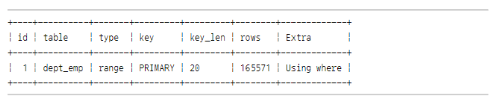
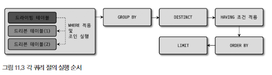
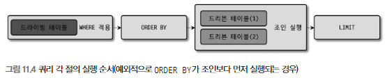
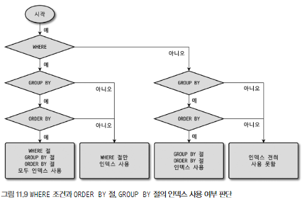

애플리케이션에서 데이터를 저장 또는 조회하기 위해 데이터베이스와 통신할 때  
DB 서버로 전달되는 것은 SQL 뿐이다.

SQL은 어떠한(What) 데이터를 요청하기 위한 언어이지,  
어떻게(How) 데이터를 읽을지를 표현하는 아니다.  

그래서 빠르게 쿼리가 수행되게 하려면 DB 서버에서  
쿼리가 어떻게 요청을 처리할지 예측할 수 있어야 한다.

이제부터  
쿼리의 패턴별로 "어떻게 처리되는가?"를 살펴보겠다.  
그리고 유용한 쿼리 패턴도 함께 살펴보겠다.

# 쿼리 작성과 연관된 시스템 변수

MySQL 서버의 시스템 설정이 쿼리에 어떤 영향을 주는지 살펴보겠다.

## SQL 모드

`STRICT_TRANS_TABLES` (default: on)  
이 옵션이 활성화되면 INSERT나 UPDATE 문장으로 데이터를 변경하는 경우  
칼럼의 타입과 저장되는 타입이 다를 때 타입 변경을 막아준다.

`ANSI_QUOTES`(default: off)  
이 옵션이 활성화되면 홑따옴표(')만 문자열 값 표기로 사용할 수 있고,  
쌍따옴표(")는 칼럼명이나 테이블명과 같은 식별자를 표기하는 데만 사용할 수 있다.

`ONLY_FULL_GROUP_BY`(default: on)  
이 옵션이 활성화되면 GROUP BY 절이 사용된 문장의 SELECT 절에는  
GROUP BY 절에 명시된 칼럼과 집계 함수(COUNT or SUM 같은 그룹 함수)만 사용할 수 있다.

`PIPE_AS_CONCAT` (default: off)  
이 옵션이 활성화되면 오라클과 같이  
"||"를 문자열 연결 연산자로 사용할 수 있다.

`NO_ZERO_IN_DATE` & `NO_ZERO_DATE` (default: on)  
이 두 옵션외 활성화되면 DATE 또는 DATETIME 타입의 칼럼에  
"0000-00-00"과 같은 잘못된 날짜를 지정하는 것이 불가능해진다.

## 영문 대소문자 구분

MySQL 서버는 설치된 운영체제에 따라 테이블명의 대소문자를 구분한다.  
(MySQL의 DB나 테이블이 디스크의 디렉터리나 파일로 매핑되기 때문)

윈도우에 설치된 MySQL에서는 대소문자를 구분하지 않지만  
유닉스 계열의 운영체제에서는 대소문자를 구분한다.

> 이를 운영체제와 관련없이 하기 위해 MySQL 서버의 설정을 고칠 수 있지만,  
> (lower_case_table_names)  
> 가능하면 설정 자체를 떠나서 초기 DB나 테이블을 생성할 때 대문자 또는 소문자 만으로  
> 통일해서 사용하는 편이 좋다.

---

# 매뉴얼의 SQL 표기 문법 표기를 읽는 방법

MySQL 매뉴얼에서 SQL 문법을 표기하는 방법을 간단히 알아본다.


대문자로 표시한 단어 - 키워드  
(키워드는 대소문자를 구분하지 않고 사용할 수 있다)

이탤릭체로 표현한 단어 - 토큰  
테이블명이나 칼럼명 또는 표현식을 의미한다.

대괄호("[]") - 선택 사항
(이는 없어도 문법적인 오류를 일으키지 않으며, 있어도 발생하지 않는다)

파이프("|") - 앞과 뒤의 키워드/표현식 중 하나만 선택해서 사용

중괄호("{}") - 괄호 내의 아이템 중에서 반드시 하나를 사용

"..." - 앞에 명시된 키워드/표현식이 반복될 수 있다.

---

# MySQL 연산자와 내장 함수

## 리터럴 표기법 문자열

### 문자열

SQL 표준에서 문자열은 항상 홑따옴표(')를 사용해서 표시한다.

> 문자열 값이 홑따옴표를 가지고 있을 때는  
> 홑따옴표를 두번 연속해서 사용할 수 있다.

---

### 숫자

숫자 값을 상수로 SQL에 사용할 때는 다른 DBMS와 마찬가지로  
따옴표 없이 숫자 값을 입력하면 된다.

문자열 형태로 따옴표를 사용하더라도  
비교 대상이 숫자 값이거나 숫자 타입의 칼럼이면  
MySQL 서버가 문자열 값을 숫자 값으로 자동 변환한다.

이때 MySQL은 숫자 타입과 문자열 타입 간의 비교에서,  
숫자 타입을 우선시하므로  
문자열 값을 숫자 값으로 변환한 후에 비교를 수행한다.

```SELECT * FROM tab_test WHERE number_column='10001';```  
```SELECT * FROM tab_test WHERE string_column=10001;```

첫번째 쿼리는 주어진 상숫값을 숫자로 변환하므로,  
성능과 관련된 문제가 발생하지 않는다.

두번쨰 쿼리는 문자열 칼럼을 숫자로 변환해서 비교한다.  
따라서 `string_column`에 인덱스가 있더라도  
이를 이용하지 못한다.

> 원천적으로 이러한 문제점을 제거하려면  
> 숫자 값은 숫자 타입의 칼럼에만 저장해야 한다.

---

### 날짜

MySQL에서 정해진 형태의 날짜 포맷으로 표기하면  
MySQL 서버가 자동으로 DATE나 DATETIME 값으로 변환하기 때문에  
STR_TO_DATE() 같은 함수를 사용하지 않아도 된다.

```SELECT * FROM dept_emp WHERE from_date='2011-04-29';```  
```SELECT * FROM dept_emp WHERE from_date=STR_TO_DATE('2011-04-29', '%y-%m-%d');```  
위 두 쿼리의 차이점은 없다.

---

### 불리언

BOOL이나 BOOLEAN이라는 타입은 TINYINT 타입에 대한 동의어이다.

BOOLEAN 타입을 TRUE나 FALSE로 비교했지만,  
실제로 값을 조회해 보면 0 또는 1 값이 조회된다.

MySQL은 C/C++ 언어에서처럼 TRUE 또는 FALSE 같은  
BOOLEAN 값을 정수로 매핑해서 사용하는 것이다.

> 이때 MySQL에서는 FALSE가 정숫값 0이 되지만,  
> TRUE는 C/C++ 언어와 달리 1만을 의미한다는 점을 주의하자

---

## MySQL 연산자

### 동등 비교(=, <=>)

`<=>`: NULL-safe 비교 연산자

1 = 1 -> 1
NULL = 1 -> NULL
NULL = NULL -> NULL

1 <=> 1 -> 1
NULL <=> 1 -> 0
NULL <=> NULL -> 1

`<=>`은 NULL을 하나의 값으로 인식하고 비교한다.

### 부정 비교(<>, !=)

`<>`, `!=` 둘다 가능하다.

### NOT 연산자(!)

기존의 결과를 반대로 만드는 연산자  
NOT과 ! 둘다 사용 가능하다.

### AND(&&)와 OR(||) 연산자

불리언 표현식을 결합하기 위한 연산자  
MySQL에서는 AND와 OR 뿐만 아니라 && 와 || 도 사용 가능하다.

> sql_mode의 `PIPES_AS_CONCAT`을 활성화하면  
> 문자열 연결을 위해 || 을 사용할 수 있다.
> 
> 하지만 가독성을 위해 따로 사용하는 것이 좋을 것 같다.

> OR 보다 AND의 우선순위가 높다.

### 나누기(/, DIV)와 나머지(%, MOD) 연산자

### REGEXP 연산자

문자열 값이 어떤 패턴을 만족하는지 확인하는 연산자

`SELECT 'abc' REGEXP '^[x-z]';`

> REGEXP 연산자는 인덱스를 사용할 수 없다.

### LIKE 연산자

(인덱스를 사용가능한) 단순한 문자열 패턴 비교 연산자  
(대신 와일드카드가 뒤쪽에만 있어야 한다)

LIKE에서 사용할 수 있는 와일으카드는 '%'와 '_' 밖에 없다.

> REGEXP 연산자는 비교 대상 문자열이 일부만 일치해도 TRUE를 반환하는데,  
> LIKE는 비교 대상 문자열의 전체가 일치해야 TRUE를 반환한다.

> '%'나 '_' 문자 자체를 비교하고 싶다면 escape를 사용하면 된다.  
> `SELECT 'abc' LIKE 'a/%' ESCAPE '/'`

### BETWEEN 연산자 & IN 연산자

BETWEEN 연산자는 "크거나 같다"와 "작거나 같다"를 하나로 합친 연산자

IN 연산자는 여러 개의 값에 대해 동등 비교 연산을 수행하는 연산자  
(여러번의 동등 비교이기 때문에 일반적으로 빠르게 처리된다)

BETWEEN 연산자를 이용해 인덱스를 사용할 때 주의해야 할 점이 있다.

```
SELECT * FROM dept_emp 
WHERE dept_no BETWEEN 'd003' AND 'd005' 
AND emp_no=10001;
```

```
SELECT * FROM dept_emp 
WHERE dept_no IN ('d003', 'd004', 'd005') 
AND emp_no=10001;
```

위 두 쿼리는 같은 결과를 반환하지만  
(dept_no, emp_no) 인덱스를 사용한다면  
실행계획이 다르게 나온다.




rows 칼럼의 숫자가 다르게 나왔다.  
-> IN은 동등 비교 연산자를 통해 계산되서 작업 범위가 많이 줄어드는데,  
-> BETWEEN은 범위 탐색을 하기 때문에 작업 범위가 IN절보다 높게 나왔다.


> IN절은 동등 비교 조건을 여러 번 사용한 것처럼 계산되기 때문에,  
> 뒤의 조건인 `emp_no=10001`도 같이 작업 범위를 결정하는데  
> 
> BETWEEN은 범위를 결정하기 때문에  
> `emp_no=10001`은 작업 범위를 결정하지 못하게 된다.

하지만 BETWEEN에 해당하는 값들의 범위를 미리 알아야 IN절을 사용할 수 있다.  

이를 서브쿼리를 이용하면 옵티마이저가 세미 조인 최적화를 해준다.

```
SELECT * FROM dept_emp 
WHERE dept_no IN (
    SELECT dept_no
    FROM departments
    WHERE dept_no BETWEEN 'd003' AND 'd005') 
AND emp_no=10001;
```

---

# SELECT

이번 절에서는 SELECT 쿼리의 각 부분에 사용될 수 있는 기능을 성능 위주로 살펴보겠다.

## SELECT 절의 처리 순서



만약 인덱스를 이용하여 ORDER BY 절이 수행된다면 순서는 약간 바뀐다.  
(GROUP BY 절이 없을 떄)



---

## WHERE 절과 GROUP BY 절, ORDER BY 절의 인덱스 사용

WHERE 절, GROUP BY 절, ORDER BY 절이 어떤 요건을 갖췄을 때  
인덱스를 이용할 수 있는지 좀 더 자세히 살펴보겠다.

### 인덱스를 사용하기 위한 기본 규칙

1. 인덱스된 칼럼 값 자체를 변환하지 않고 그대로 사용해야 한다.
2. 그리고 WHERE 절에 사용되는 비교 조건에서 연산자 양쪽의 두 비교 대상 값은  
데이터 타입이 일치해야 한다.

### WHERE 절의 인덱스 사용

WHERE 조건이 인덱스를 사용하는 방법은  
크게 `작업 범위 결정 조건`과 `체크 조건` 두가지 방식으로 구분할 수 있다.

작업 범위 결정 조건은, WHERE 절에서 동등 비교 조건이나 IN으로 구성된 조건에 사용되 칼럼들이  
인덱스의 칼럼 구성과 좌측에서부터 비교했을 때 얼마나 일치하는가에 따라 달라진다.

(col1, col2, col3, col4)에 대한 인덱스가 있을 때  
WHERE 절의 조건으로 col1, col2, col4 모두 동등 비교 조건이고,  
col3이 범위 비교 조건이라면  
col1, col2, col3은 작업 범위 결정 조건이 되고,  
col4는 체크 조건이 된다.

이는 col3이 동등 비교 조건이 아니라 범위 비교 조건으로 사용됐기 때문이다.

> WHERE 절에 제시된 조건들의 순서는 인덱스와 무관하다.
> (옵티마이저는 인덱스를 사용할 수 있는 조건들을 뽑아서 최적화를 수행한다)

위의 설명은 AND 연산자로 연결되는 경우를 가정한 것이다.  
만약 OR 연산자가 있다면 처리 방법이 완전히 바뀐다.

> 풀 테이블 스캔이 사용될 수도 있고,  
> index_merge 접근 방법이 사용될 수도 있다.

---

### GROUP BY 절의 인덱스 사용

GROUP BY 절의 각 칼럼은 비교 연산자를 가지지 않으므로,  
작업 범위 결정 조건이나 체크 조건을 구분해서 생각할 필요 없다.

1. GROUP BY 절에 명시된 칼럼이 인덱스 칼럼의 순서와 위치가 같아야 한다.
2. 인덱스를 구성하는 칼럼 중에서 뒤쪽에 있는 칼럼은 GROUP BY 절에 명시되지 않아도 인덱스를 사용할 수 있다.  
   (여기서 앞의 칼럼들이 GROUP BY 절에 명시되어야 한다)
3. GROUP BY 절에 명시된 칼럼이 하나라도 인덱스에 없으면,  
   인덱스를 이용하지 못한다.

여기서 WHERE 조건절에 col1, col2가 동등 비교 조건으로 사용된다면  
GROUP BY 절에 col1이나 col2가 빠져도 인덱스를 이용할 수도 있다.

> ```WHERE col1 = 'A' ... GROUP BY col2, col3```  
> ```WHERE col1 = 'A' ... GROUP BY col1, col2, col3```
> 
> 위 두 쿼리는 같은 결과를 반환한다.

### ORDER BY 절의 인덱스 사용

ORDER BY 절의 인덱스 사용 여부는 GROUP BY 요건과 거의 흡사하다.

여기서 조건이 하나 더 있는데,  
정렬되는 각 칼럼의 ASC 및 DESC 옵션이 인덱스와 같거나 정반대인 경우에만  
사용할 수 있다.

> 만약 (col1 ASC, col2 DESC, col3 ASC) 인덱스가 있는데,  
> ```ORDER BY col1, col2, col3``` 이 쿼리는 인덱스를 사용하지 못한다.  
> ```ORDER BY col1, col2 DESC, col3```이나  
> ```ORDER BY col1 DESC, col2, col3 DESC```는 가능하다.

### WHERE 조건과 ORDER BY(또는 GROUP BY) 절의 인덱스 사용

WHERE 절과 ORDER BY 절이 같이 사용된 하나의 쿼리 문장은  
다음 3가지 중 한가지로만 인덱스를 이용한다.
1. WHERE 절과 ORDER BY 절이 동시에 같은 인덱스를 이용:  
   WHERE 조건절이 사용하는 칼럼과 ORDER BY 절의 정렬 대상 칼럼이  
   모두 하나의 인덱스에 연속해서 포함돼 있을 때
2. WHERE 절만 인덱스를 이용
   (WHERE 절의 조건에 일치하는 레코드의 건수가 많지 않을 때 효율적)
3. ORDER BY 절만 인덱스를 이용  
   (아주 많은 레코드를 정렬해야 할 때 사용됨)

> GROUP BY나 ORDER BY가 인덱스를 사용할 수 있을지 없을지 모호할 떄는  
> 조금 변경한 쿼리와 원본 쿼리가 같은 순서나 결과를 보장하는지 확인해 보면 된다.

### GROUP BY 절과 ORDER BY 절의 인덱스 사용

GROUP BY와 ORDER BY 절이 동시에 사용된 쿼리에서  
두 절이 모두 하나의 인덱스를 사용해서 처리되려면  
GROUP BY 절에 명시된 칼럼과 ORDER BY에 명시된 칼럼의  
순서와 내용이 모두 같아야 한다.

만약 둘 중 하나라도 인덱스를 이용할 수 없을 때는  
둘다 인덱스를 사용하지 못한다.  
(임시 테이블로 처리하는게 더 효율적이다)

### WHERE 조건과 ORDER BY 절, GROUP BY 절의 인덱스 사용

판단하는 방법

1. WHERE 절이 인덱스를 사용할 수 있는가?
2. GROUP BY 절이 인덱스를 사용할 수 있는가?
3. GROUP BY 절과 ORDER BY 절이 동시에 인덱스를 사용할 수 있는가?



## WHERE 절의 비교 조건 사용 시 주의사항

### NULL 비교

MySQL에서는 NULL 값이 포함된 레코드도 인덱스로 관리된다.  
(인덱스에서 NULL을 하나의 값으로 인정해서 관리한다)

### 문자열이나 숫자 비교

칼럼의 타입에 맞게 상수 리터럴을 비교 조건에 사용하는 것이 중요하다.
(문자열은 문자열로, 숫자면 숫자 리터럴로 이용하자)

### 날짜 비교

날짜만 저장하는 DATE 타입,  
날짜와 시간을 함께 저장하는 DATETIME과 TIEMSTAMP 타입,  
시간만 저장하는 TIME 타입

`DATE 또는 DATETIME과 문자열 비교`  
문자열 값을 자동으로 DATETIME 타입의 값으로 변환해서 비교한다.  
여기서 STR_TO_DATE 함수를 이용해서 비교할 수도 있다.  
(여기서 칼럼을 변경하지 않고 상수를 변경하는 형태로 사용하는 것이 좋다)

`DATE와 DATETIME의 비교`  
굳이 DATE() 함수를 사용하지 않아도 DATE에 `00:00:00`을 붙혀서 비교한다.  
타입 변환은 인덱스의 사용 여부에 영향을 미치지 않기 때문에 성능보다는 쿼리의 결과에 주의해서 사용하자

### Short-Circuit Evaluation

> 쇼트 서킷  
> (A && B)에서 A가 0이라면 B를 수행하지 않고 바로 0 반환  
> (A || B)에서 A가 1이라면 B를 수행하지 않고 바로 1 반환
> 
> 이처럼 선행 표현식의 결과에 따라 후행 표현식을 평가할지 말지 결정하는 최적화를 말한다

MySQL 서버는 쿼리의 WHERE 절에 나열된 조건을 순서대로  
Short-Circuit Evaluation 방식으로 평가해서  
해당 레코드를 반환해야 할지 말지를 결정한다.

여기서 WHERE 절의 조건 중에서 인덱스를 사용할 수 있는 조건이 있다면  
Short-Circuit Evaluation과는 무관하게 MySQL 서버는 그 조건을  
최우선으로 사용한다.

따라서 복잡한 연산 또는 다른 테이블의 레코드를 읽어야 하는  
서브쿼리 조건 등은 WHERE 절의 뒤쪽으로 배치하는 것이 성능상 도움이 될 것이다.

---

## DISTINCT

DISTINCT를 남용하는 것은 성능적인 문제도 있고,  
쿼리의 결과가 의도한 바와 달라질 수 있다.

> 테이블 간 조인 쿼리를 작성하는 경우  
> 각 테이블 간의 조인이 1:1 조인인지, 1:M 조인인지  
> 업무적인 특성을 이용해 DISTINCT를 줄이자

DISTINCT는 GROUP BY 처럼 처리 된다.

---

## LIMIT n

쿼리 문장에 GROUP BY나 ORDER BY 같은 전체 범위 작업이 선행되더라도  
LIMIT 절이 있다면 크진 않지만 나름의 성능 향상은 있다.

많은 응용 프로그램에서 테이블의 데이터를 SELECT할 때 조금씩 잘라서(페이징)  
가져가게 되는데, 이때 LIMIT 절을 ```LIMIT n, m```와 같이 사용하는 경우가 많다.

처음 몇 개 페이지는 문제가 되지 않지만,  
n과 m이 매우 커질 때 문제가 된다.

```LIMIT 0, 10```은 빠르게 수행 되지만,  
```LIMIT 2000000, 10```은 매우 느리게 수행될 수 있다.  
(MySQL 서버는 2000010건의 레코드를 읽어야 하기 때문이다)

### LIMIT m, n 해결 방법 1. 커서 기반 페이징

20만번째부터 10개만 반환한다면,  
이는 WHERE 조건절로 읽어야 할 위치(20만번째 레코드의 값)를 찾고  
그 위치에서 10개만 읽는 형태의 쿼리를 사용하는 방식

이때 20만번째의 레코드의 값을 커서라고 표현한다.

> 이떄 해당 칼럼이 유니크한지 아닌지에 따라  
> 쿼리가 달라질 수 있으니 주의하자

### LIMIT m, n 해결 방법 2. 커버링 인덱스 사용

(A)
```
SELECT ...
FROM t
ORDER BY id
LIMIT 200000, 10;
```

(B)
```
SELECT ...
FROM t AS t1 
JOIN (SELECT id FROM t AS t2 ORDER BY id LIMIT 200000,10)
ON t1.id = t2.id;
```

A 쿼리를 B 쿼리로 바구는 방법

이때 ORDER BY절에 있는 칼럼에 대한 인덱스가 필요하다.
(대신 서브쿼리를 처리하기 위한 인덱스가 필요하다)

B 쿼리는 서브쿼리를 커버링 인덱스로 처리할 수 있기 때문에,  
성능이 빨라진다.

> 여기서 주의할 점
> 원본 쿼리에 WHERE 절이나, GROUP BY 절  
> 또는 HAVING 절이 있다면
>
> 이를 인덱스로 처리하지 못할 수도 있다.
> (인덱스를 처리하지 못하는 케이스에 한해서)

---

## COUNT()

InnoDB 스토리지 엔진을 사용하는 테이블에서는  
WHERE 조건이 없는 COUNT(*) 쿼리라고 하더라도  
직접 데이터나 인덱스를 읽어야만 레코드 건수를 가져올 수 있기 때문에  
큰 테이블에서 COUNT() 함수를 사용하는 작업은 주의해야 한다.

COUNT() 함수에 칼럼명이나 표현식이 인자로 사용되면  
그 칼럼이나 표현식의 결과가 NULL이 아닌 레코드 건수만 반환한다.  

따라서 NULL이 될 수 있는 칼럼을 COUNT() 함수에 사용할 때는  
의도대로 쿼리가 작동하는지 확인하는 것이 좋다.

> 특히 페이징을 구현할 때 COUNT() 함수를 이용해  
> 전체 페이지의 개수를 구하는 쿼리를 보낼때가 많은데,  
> 이 쿼리로 인해 성능이 매우 안좋아 질 수 있다.

---

## JOIN

JOIN이 어떻게 인덱스를 사용하는지에 대해 쿼리 패턴별로 살펴보겠다.

### JOIN 순서와 인덱스

인덱스 레인지 스캔은  
인덱스를 탐색하는 단계(Index Seek)와,  
인덱스를 스캔하는 단계(Index Scan)로 구분할 수 있다.

일반적으로 인덱스를 이용해서 쿼리하는 작업에서는  
가져오는 레코드의 건수가 소량이기 떄문에 스캔 작업은 부하가 작지만  
특정 인덱스 키를 찾는 인덱스 탐색 작업은 상대적으로 부하가 높은 편이다.

만약 드리븐 테이블에서 인덱스를 사용한다면,  
인덱스 탐색 작업과 스캔 작업은  
드라이빙 테이블에서 읽은 레코드 건수만큼 반복한다.

따라서 옵티마이저는 인덱스가 있는 테이블을 드리븐 테이블로 설정한다.

두 칼럼 모두 인덱스가 없는 경우  
레코드 건수가 적은 테이블을 드라이빙 테이블로 선택한다.  
그리고 MySQL 서버는 이를 해시 조인으로 처리한다.

### JOIN 칼럼의 데이터 타입

조인되는 칼럼의 타입이 다르다면 인덱스를 사용하지 못해  
성능이 매우 안좋아 질 수 있다.

항상 데이터 타입을 일치시키자

### OUTER JOIN의 성능과 주의사항

MySQL 옵티마이저는 절대 아우터로 조인되는 테이블을  
드라이빙 테이블로 선택하지 못한다.

그래서 드리븐 테이블에서 WHERE 조건절이 사용된다고 해도  
OUTER JOIN이라 드라이빙 테이블로 사용하지 못하기 때문에  
성능이 떨어질 수 있다.

> 만약 여기서 INNER JOIN을 사용한다면  
> 쿼리의 성능이 올라갈 수도 있다.

꼭 필요한 경우가 아니라면 이너 조인을 사용하는 것이  
업무 요건을 정확히 구현함과 동시에 쿼리의 성능도 향상시킬 수 있다.

아우터 조인 쿼리를 작성하면서 많이 하는 실수는  
아우터로 조인되는 테이블에 대한 조건을 WHERE 절에 함께 명시하는 것이다.

조건을 WHERE 절에 명시하는 것이 아니라,  
ON 절에 명시해야 한다.

> 만약 아우터 테이블의 조건을 WHERE 절에 명시한다면  
> 이는 OUTER JOIN이 아닌 INNER JOIN로 변환돼서 실행된다.

> 예외적인 경우도 있다.  
> (안티 조인 효과를 기대하는 경우 - IS NULL, NOT IN, NOT EXISTS)  
> (두 테이블 간에 일치하지 않는 행을 반환하는 조인)
> 이때는 WHERE 절에 조건을 명시할 수 있다.

### JOIN과 외래키(FOREIGN KEY)

외래키는 조인과 아무런 연관이 없다.

외래키를 생성하는 주목적은 데이터의 무결성을 보장하기 위해서다.  
(참조 무결성)

### 지연된 조인(Delayed Join)

조인이 실행되기 이전에 GROUP BY나 ORDER BY를 처리하는 방식을 의미한다.  
(조인을 수행하면 레코드 건수가 늘어나기 때문)

지연된 조인은 주로 LIMIT절이 함께 사용된 쿼리에서 더 큰 효과를 얻을 수 있다.  
(111p 참고)

### 래터럴 조인(Lateral Join)

FROM 절에 사용된 서브쿼리에서 외부 쿼리의 FROM 절에 정의된 테이블의  
칼럼을 참조하는 방식을 래터럴 조인이라 한다.

LATERAL 키워드를 가진 서브쿼리는 조인 순서상 후순위로 밀리고,  
외부 쿼리의 결과 레코드 단위로 임시 테이블이 생성되기 때문에  
필요한 경우에만 사용해야 한다.

### 실행 계획으로 인한 정렬 흐트러짐

쿼리의 실행 계획에서 네스티드 루프 조인 대신  
해시 조인이 사용되면 쿼리 결과의 레코드 정렬 순서가 달라진다.

실행 계획은 MySQL 옵티마이저에 의해 그떄그떄 상황에 따라 달라질 수 있다.  
정렬된 결과가 필요하다면 ORDER BY를 명시적으로 사용해주자

---

## 서브쿼리

### SELECT 절에 사용된 서브쿼리

일반적으로 SELECT 절에 서브쿼리를 사용하면  
그 서브쿼리는 항상 칼럼과 레코드가 하나인 결과를 반환해야 한다.

---

### FROM 절에 사용된 서브쿼리

FROM 절에 서브쿼리가 사용되면  
서브쿼리의 결과를 임시 테이블로 저장하고  
필요할 때 임시 테이블을 사용하는 방식으로 처리한다.

하지만 MySQL 5.7버전부터는 옵티마이저가 FROM 절의 서브쿼리를  
외부 쿼리로 병합하는 최적화를 수행하도록 개선됐다.

---

### WHERE 절에 사용된 서브쿼리

WHERE 절의 서브쿼리는 처리되는 방식이 다양하다.

- 동등 또는 작다 비교
- IN 비교
- NOT IN 비교

`동등 또는 작다 비교`

서브쿼리를 먼저 실행한 후 상수로 변환한다.  
이 상숫값을 가지고 외부쿼리를 수행한다.

> 여기서 단일 값 비교가 아닌  
> 튜플 비교 방식이 사용되는 것은 주의해야 한다.

`IN 비교 (IN subquery)`

세미 조인 방식으로 수행한다.

- 테이블 풀-아웃
- 퍼스트 매치
- 루스 스캔
- 구체화
- 중복 제거

`NOT IN 비교 (NOT IN subquery)`

안티 세미 조인 방식으로 수행된다.

- NOT EXISTS  
- 구체화

---

## 잠금을 사용하는 SELECT

SELECT 쿼리를 이용해 읽은 레코드의 칼럼 값을  
애플리케이션에서 가공해서 다시 업데이트 하고자 할 때는  
SELECT가 실행된 후 다른 트랜잭션이 그 칼럼의 값을 변경하지 못하게 해야 한다.

이때 사용되는 옵션이 `FOR SHARE`와 `FOR UPDATE` 절이다.

`FOR SHARE`는 SELECT 쿼리로 읽은 레코드에 대해서 읽기 잠금(공유 잠금)을 걸고,  
`FOR UPDATE`는 SELECT 쿼리가 읽은 레코드에 대해서 쓰기 잠금(배타 잠금)을 건다.

> 이 두가지 잠금은 모두 자동 커밋이 OFF 된 상태 또는  
> 트랜잭션이 시작된 상태에서만 잠금이 유지된다.

한가지 주의할 점은 `FOR SHARE`나 `FOR UPDATE` 절을 가지지 않는 SELECT 쿼리의 작동 방식이다.  
InnoDB 스토리지 엔진을 사용하는 테이블은 잠금 없는 읽기가 지원되기 떄문에  
특정 레코드가 "SELECT ... FOR UPDATE" 쿼리에 의해서 잠겨진 상태라 하더라도  
`FOR SHARE`와 `FOR UPDATE` 절을 가지지 않는 단순 SELECT 쿼리는 아무런 대기 없이 실행된다.

### 잠금 테이블 선택

여러 테이블을 조인할 때, 특정 테이블만 잠그고 싶다면  
OF 옵션을 통해 걸 수 있다.

`FOR UPDATE OF e`, `FOR SHARE OF e`

### NO WAIT & SKIP LOCKED

`FOR UPDATE NOWAIT`

NOWAIT 옵션을 사용하면  
SELECT 쿼리가 해당 레코드에 대해 즉시 잠금을 획득하지 못했다면  
바로 에러를 반환하면서 쿼리는 즉시 종료된다.

`FOR UPDATE SKIP LOCKED`

SKIP LOCKED 옵션을 사용하면  
잠겨진 레코드는 반환하지 않고, 잠금이 걸리지 않은 레코드만 가져온다.

하지만 SKIP LOCKED 옵션을 사용한 SELECT 구문은  
확정적이지 않은 쿼리가 된다.  
(잠금이 있냐 없냐에 따라 결과가 달라질 수 있음)

> 이 옵션들을 사용하지 않는다면  
> 해당 레코드에 대해 잠금이 걸려있을 때  
> 선행 트랜잭션이 완료될 떄까지 기다리던가,  
> innodb_lock_wait_timeout 시스템 변수에 설정된 시간(50초)  
> 동안 기다렸다가 에러 메시지를 받게 될 것이다.

> NOWAIT와 SKIP LOCKED 절은 FOR SHARE에서 사용 불가  
> (UPDATE와 DELETE에서도 사용 불가 - 비확정적이기 떄문)

실무에서는 NO WAIT보다 SKIP LOCKED를 더 많이 사용한다고 한다.  
(특정 케이스에서)

### SKIP LOCKED 사용 예시 - 1. Batch 처리

시나리오
1. name이 'July'인 테이블을 정렬해서 3건 가져온다.
2. 한건씩 name을 'JJuly'로 업데이트한다.
3. 다음 처리 대상 3건을 가져온다.  
   (1,2 번을 반복)

위 과정을 멀티 스레드로 처리할 때,  
SKIP LOCKED를 사용하면 다른 스레드가 이미 처리 중인 레코드를 건너뛰고  
다음 레코드를 가져올 수 있다.

`select * for members where name = 'July' order by id limit 3 for update skip locked;`  
위 쿼리를 통해 업데이트 할 레코드의 락을 획득한다.  
그 다음 해당 레코드를 업데이트한다.  
(이때 skip locked를 사용하면 다른 스레드가 이미 처리 중인 레코드를 건너뛰고 다음 레코드를 가져올 수 있다)

### SKIP LOCKED 사용 예시 - 2. 티켓팅 서비스

시나리오
1. 사용자들이 티켓을 예매한다.
2. 좌석을 선택하고 결제를 진행한다.

이때 예매 시작 시점부터 결제 성공 시점까지,  
다른 사용자들이 해당 좌석을 선택 불가능하게 만들어야 한다.

만약 이 작업을 WAS에서 처리한다면  
구현해야 할 작업들이 꽤 많다.

이를 SKIP LOCKED를 사용하면  
DB에서 간단하게 처리할 수 있다.

---

# 쿼리 성능 테스트

간단하게 쿼리의 성능을 판단해보기 위해서 어떠한 부분을 고려해야 하고,  
어떤 영향 요소가 있는지 살펴보겠다.

## 쿼리의 성능에 영향을 미치는 요소

가장 큰 변수는 MySQL 서버가 가지고 있는  
여러 종류의 버퍼나 캐시일 것이다.

### 운영체제의 캐시

MySQL 서버는 OS의 파일 시스템 관련 기능(시스템콜)을 이용해 데이터 파일을 읽어온다.

여기서 OS는 일반적으로 한번 읽은 데이터는 OS가 관리하는 별도의 캐시 영역에 보관한다.

하지만 InnoDB 스토리지 엔진은 일반적으로 파일 시스템의 캐시나 버퍼를 거치지 않는 
Direct I/O를 사용하므로 OS의 캐시가 큰 영향을 미치지 않는다.

> 쿼리의 성능을 테스트할 때는 OS 캐시를 비워놔야 한다.
> 
> 리눅스 서버의 캐시 제거하는 명령
> ```
> sync
> echo 3 > /proc/sys/vm/drop_caches
> ```

### MySQL 서버의 버퍼 풀(InnoDB 버퍼 풀)

InnoDB의 버퍼 풀은 인덱스 페이지는 물론이고,  
데이터 페이지까지 캐시하며,  
쓰기 작업을 위한 버퍼링 작업까지 겸해서 처리한다.

> MySQL 서버에 포함된 버퍼 풀을 초기화하려면 MySQL 서버를 재시작해야 한다.
> 
> InnoDB는 서버가 종료될 떄 자동으로 덤프됐다가 다시 시작하면 자동으로 적재된다.  
> `innodb_buffer_pool_load_at_startup`, `innodb_buffer_pool_load_at_shutdown`  
> 시스템 변수로 관리할 수 있다.

### 독립된 MySQL 서버

MySQL 서버가 가동 중인 장비에 웹 서버나 다른 배치용 프로그램이 실행되고 있다면  
테스트하려는 쿼리의 성능이 영향을 받게 될 것이다.

이와 마찬가지로 MySQL 서버뿐 아니라 테스트 쿼리를 실행하는  
클라이언트 프로그램이나 네트워크의 영향 요소도 고려해야 한다.

### 쿼리 테스트 횟수

실제 쿼리의 성능 테스트를 MySQL 서버의 상태가  
워밍업된 상태(몇번 실행해서 캐싱된 상태)에서 진행할 지,  
콜드 상태(캐시, 버퍼 모두 초기화된 상태)에서 진행할지도 고려해야 한다.

> 실제 서비스 환경의 쿼리는 대부분 콜드 상태보다는 워밍업 상태에서 실행된다.

