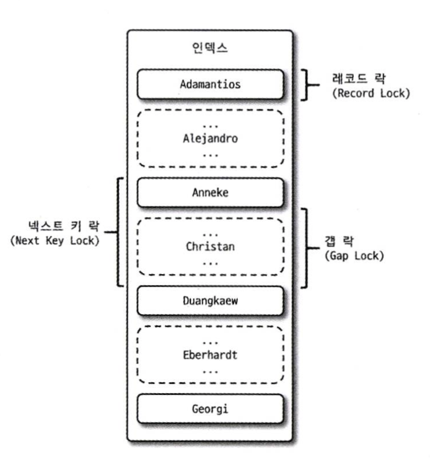
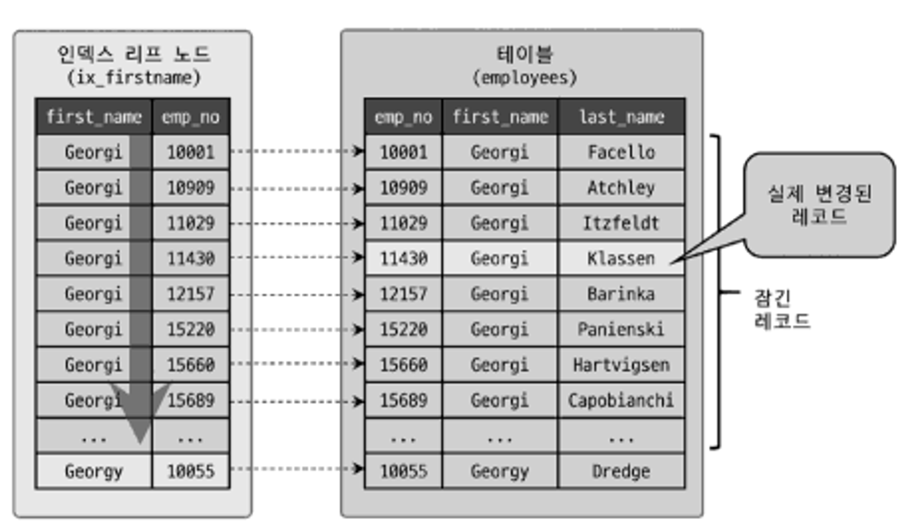

# 트랜잭션과 잠금

MySQL의 동시성에 영향을 미치는 잠금(Lock)과 트랜잭션, 트랜잭션의 격리 수준(Isolation level)을 살펴보겠다.

> 트랜잭션: 작업의 완전성을 보장해 주는 것  
> (모두 처리하거나, 아예 처리하지 않거나)

> 잠금(Lock): 동시성을 제어하기 위한 기능

> 트랜잭션의 격리 수준: 트랜잭션 간의 작업 내용을 어떻게 공유하고 차단할 것인지를 결정하는 레벨

---

## 트랜잭션

InnoDB 스토리지 엔진은 트랜잭션을 지원하지만,  
MyISAM이나 MEMORY 스토리지 엔진은 트랜잭션을 지원하지 않는다.

> INSERT INTO tab VALUES (1), (2), (3);  
> 쿼리를 3개의 스토리지 엔진에 각각 실행했을 때
> 
> 만약 (3) 레코드를 삽입하는데 실패한다면,  
> InnoDB는 3개 모두 삽입이 실패하는데,  
> MyISAM과 MEMORY는 (3) 만 삽입이 실패한다.
> ( (1), (2)는 삽입 성공하여 테이블에 등록된다 )

MyISAM과 MEMORY에서 발생하는 위 현상을 부분 업데이트라고 표현하며,  
이러한 부분 업데이트 현상은 테이블 데이터의 정합성을 맞추는데 상당히 어렵게 한다.

### 트랜잭션 주의 사항

트랜잭션 또한 DBMS의 커넥션과 동일하게 꼭 필요한 최소의 코드에만 적용하는 것이 좋다.

-> 프로그램 코드에서 트랜잭션의 범위를 최소화하라는 의미이다.

> 트랜잭션이 길어지면 생기는 문제점들
> 1. 트랜잭션을 유지하는 동안, 사용자는 DB의 커넥션을 맺게 되는데,  
>    DB 커넥션은 개수가 제한적이어서, 소유하는 기간이 길어질수록  
>    사용 가능한 여유 커넥션의 개수는 줄어들 것이다.
>    (어느 순간에는 다른 사용자가 커넥션을 가져가기 위해 기다려야 하는 상황이 발생 할 수도 있다)
> 2. 트랜잭션을 유지하는 동안, 특정 레코드에 대한 락을 획득한 상태에서
>    트랜잭션을 종료하지 않는다면, 종료할 떄까지 계속 락을 획득하고 있어서
>    다른 트랜잭션이 해당 레코드에 대한 락을 획득하기 위해 계속 기다려야 할 것이다.
> 3. 트랜잭션을 계속 유지한다면 언두 영역이 과도하게 커져,  
>    메모리에 안좋은 영향을 줄 것이다.
>    (격리 수준에 따라 다르다)

또 트랜잭션을 유지하는 동안 외부 API(FTP 파일 전송, 메일 전송)를 이용하는 것은 매우 안 좋다.  
외부 API의 응답이 늦어진다면 이는 DBMS 서버까지 위험해지는 상황이 발생할 것이다.

프로그램 코드에서 라인 수즌 한두 줄이라도 네트워크 작업이 있는 경우에는  
반드시 트랜잭션에서 배제 해야 한다.

---

## MySQL 엔진의 잠금

MySQL에서 사용되는 잠금은 크게 스토리지 엔진 레벨과 MySQL 엔진 레벨로 나눌 수 있다.  
MySQL 앤잔 레벨의 잠금은 모든 스토리지에 영향을 미치지만,  
스토리지 엔진 레벨의 잠금은 스토리지 엔진 간 상호 영향을 미치지는 않는다.

MySQL 엔진에서는  
테이블 데이터 동기화를 위한 `테이블 락`,  
테이블의 구조를 잠그는 `메타데이터 락`,  
그리고 사용자의 필요에 맞게 사용할 수 있는 `네임드 락`  
이 있다.

### 글로벌 락

글로벌 락이 영향을 미치는 범위는 MySQL 서버 전체이며,  
작업 대상 테이블이나 DB가 다르더라도 동일하게 영향을 미친다.

한 세션에서 글로벌 락을 획득하면  
다른 세션에서 SELECT를 제외한 대부분의 DDL 문장이나 DML 문장을 실행하는 경우  
글로벌 락이 해제될 떄까지 해당 문장이 대기 상태로 남는다.

> MySQL 8.0 부터는 백업 툴들의 안정적인 실행을 위해  
> 백업 락이 도입됐다. (가벼운 글로벌 락)
> 
> 특정 세션에서 백업 락을 획득하면 다음의 정보를 변경할 수 없게 된다.
> - DB 및 테이블 등 모든 객체 생성 및 변경, 삭제
> - REPAIR TABLE과 OPTIMIZE TABLE 명령
> - 사용자 관리 및 비밀번호 변경
> 
> 백업 락은 일반적인 테이블의 데이터 변경은 허용된다.

### 테이블 락

테이블 락은 개별 테이블 단위로 설정되는 잠금이며,  
명시적 또는 묵시적으로 특정 테이블의 락을 획득할 수 있다.

명시적 잠금 획득: ```LOCK TABLES table_name [ READ | WRITE ]```
잠금 해제: ```UNLOCK TABLES```

명시적인 테이블 락도 특별한 상황이 아니면 애플리케이션에서 사용할 필요가 거의 없다  
(글로벌 락과 동일하게 온라인 작업에 상당한 영향을 미치기 떄문)

묵시적인 테이블 락은 MyISAM이나 MEMORY 테이블에 데이터를 변경하는 쿼리를 실행하면 발생한다.

InnoDB 테이블의 경우 스토리지 엔진 차원에서 레코드 기반의 잠금을 제공하기 때문에,  
단순 데이터 변경 쿼리로 인해 묵시적인 테이블 락이 설정되지는 않는다.  
(DML 쿼리에서는 없고, DDL 쿼리의 경우 테이블 락이 걸린다)

### 네임드 락

GET_LOCK() 함수를 이용해 임의의 문자열에 대해 잠금을 설정할 수 있다.

> 문자열을 사용하기 위해 네임드 락을 사용하기 보단,  
> 클라이언트 간 상호 동기화를 처리해야 할 때 네임드 락을 이용해 처리할 수 있다.  
> (각 프로그램 실행 시간을 분산 -> 데드락 최소화)

### 메타데이터 락

DB 객체(테이블이나 뷰 등)의 이름이나 구조를 변경하는 경우에 획득하는 잠금이다.

이 락은 명시적으로 획득/해제 하는 것이 아니라,  
```RENAME TABLE tab_a TO tab_b``` 같이  
테이블의 이름을 변경하는 경우 자동으로 획득하는 잠금이다.

> RENAME TABLE의 경우 원본 이름과 변경될 이름 두 개 모두 한꺼번에 잠금을 설정한다.

---

어느 날 테이블의 구조를 변경해야 할 요건이 발생했다.

DDL을 이용해서 변경할 수도 있지만,
MySQL 서버의 DDL은 단일 스레드로 작동하기 때문에 상당히 많은 시간이 소요될 수 있다.
(그리고 시간이 걸리는 동안 언두 로그의 증가 등을 고민해야 한다)

이때는 새로운 구조의 테이블을 생성하고 먼저 최근의 데이터까지는  
PK 값을 범위별로 나눠서 여러 개의 스레드로 빠르게 복사한다.  
그리고 나머지는 트랜잭션과 테이블 잠금, RENAME TABLE 명령으로  
응용 프로그램의 중단 없이 실행할 수 있다.
(이때 테이블의 잠금으로 인해 INSERT를 할 수 없다)

> ```RENAME TABLE rank TO rank_backup, rank_new TO rank```
> 
> ```RENAME TABLE rank TO rank_backup```  
> ```RENAME TABLE rank_new TO rank```
> 
> 첫번째 예시는 문제없이 돌아간다.  
> 하지만 두번째 예시는 아주 짧은 시간이지만 rank 테이블이 존재하지 않는 순간이 생긴다.  
> -> "Table not found `rank`"" 오류를 발생시킨다.

---

## InnoDB 스토리지 엔진 잠금

InnoDB 스토리지 엔진은 MySQL에서 제공하는 잠금과는 별개로  
스토리지 엔진 내부에서 레코드 기반의 잠금 방식을 탑재하고 있다.

> 이 덕분에 다른 스토리지 엔진보다 뛰어난 동시성 처리를 제공하지만,  
> 이원화된 잠금 탓에 InnoDB 스토리지 엔진에서 사용되는 잠금에 대한 정보는  
> MySQL 명령을 이용해 접근하기가 상당히 까다롭다.
>
> 최근 버전에서 InnoDB의 트랜잭션과 잠금, 그리고 잠금 대기 중인 트랜잭션의 목록을 조회할 수 있는 방법이 도입됐다.
> 
> MySQL 서버의 `information_schema` DB에 존재하는  
> `INNODB_TRX`, `INNODB_LOCKS`, `INNODB_LOCK_WAITS` 라는 테이블을 조인해서 조회하면  
> 현재 트랜잭션이 어떤 잠금을 대기하고 있고 해당 잠금을 어느 트랜잭션이 가지고 있는지 확인할 수 있으며,  
> 장시간 잠금을 가지고 있는 클라이언트를 찾아 종료시킬 수도 있다.
> 
> 그리고 `Performance Schema`를 이용해  
> InnoDB 스토리지 엔진의 내부 잠금(세마포어)에 대한 모니터링 방법도 추가됐다.

InnoDB 스토리지 엔진은 레코드 락이 페이지 락으로,  
또는 테이블 락으로 레벨업되는 경우는 없다.

그리고 InnoDB 스토리지 엔진에서는 레코드 락 뿐만 아니라,  
레코드와 레코드 사이의 간격을 잠그는 갭(GAP) 락이라는 것이 존재한다.



### 레코드 락

레코드 자체만을 잠그는 것

다른 DBMS의 레코드와 다르게 InnoDB 스토리지 엔진의 레코드 락은  
레코드 자체가 아니라 인덱스의 레코드를 잠근다는 것이다.

> InnoDB에서  
> 보조 인덱스를 이용한 변경 작업은  
> 넥스트 키 락 또는 갭 락을 사용하지만  
> 
> PK or 유니크 인덱스에 의한 변경 작업에서는  
> 갭에 대해서는 잠그지 않고 레코드 자체에 대해서만 락을 건다.

### 갭 락

레코드와 바로 인접한 레코드 사이의 간격만을 잠그는 것

갭 락의 역할: 레코드와 레코드 사이에 새로운 레코드가 생성되는 것을 제어한다.

### 넥스트 키 락

레코드 락과 갭 락을 합쳐 놓은 형태의 잠금

넥스트 키 락과 갭 락으로 인해  
데드락이 발생하거나 다른 트랜잭션을 기다리게만드는 일이 자주 발생한다고 한다.

### 자동 증가 락

auto_increment 칼럼이 사용된 테이블에  
동시에 여러 레코드가 insert 되는 경우,  
저장되는 각 레코드는 중복되지 않고 저장된 순서대로 증가하는 일련번호 값을 가져야 한다.

InnoDB 스토리지 엔진에서는 이를 위해 내부적으로 
auto_increment 락이라고 하는 테이블 수준의 잠금을 사용한다.

이 락을 명시적으로 획득하고 해제하는 방법은 없다.
(auto_increment 락은 아주 잠깐 동안 걸렸다가 해제되기 떄문)

> MySQL 5.1 이상부터는  
> innodb_autoinc_lock_mode 시스템 변수를 통해  
> 자동 증가 락의 방식을 변경할 수 있다고 한다.

---

### InnoDB의 잠금과 인덱스

InnoDB의 잠금과 인덱스는 상당히 중요한 연관 관계가 있다.  
InnoDB의 잠금은 레코드를 잠그는 것이 아니라 인덱스를 잠그는 방식으로 처리된다

즉, 변경해야 할 레코드를 찾기 위해 검색한 인덱스의 레코드를 모두 락을 걸어야 한다.

```SELECT COUNT(*) FROM employees WHERE first_name = 'Georgi';```  
위 쿼리의 결과가 253이고,

```SELECT COUNT(*) FROM employees WHERE first_name = 'Georgi' AND last_name = 'Klassen';```  
위 쿼리의 결과가 1인 상태라고 가정해보자.

```UPDATE employees SET hire_date=NOW() WHERE first_name = 'Georgi' AND last_name = 'Klassen';```
위 쿼리는 1건의 레코드가 업데이트 될 것이다.
위 쿼리의 과정 동안, 몇 개의 레코드에 락을 걸어야 할까?

first_name에 대한 인덱스만 있다면  
총 253개의 레코드에 락이 걸린다.



만약 인덱스가 아예 없다면,  
테이블 풀 스캔을 진행하면서 테이블의 모든 레코드를 잠그게 될 것이다.

---

### 레코드 수준의 잠금 확인 및 해제 방법

MySQL 8.0 버전부터는 performance_schema의 data_locks와 data_lock_waits 테이블을 통해 확인이 가능하다.

위 테이블을 통해 스레드 번호를 확인하고 `KILL` 명령어를 통해  
특정 스레드를 강제 종료해 락을 해제시킬 수 있다.

---

## MySQL의 격리 수준

여러 트랜잭션이 동시에 처리될 때 특정 트랜잭션이  
다른 트랜잭션에서 변경하거나 조회하는 데이트를 볼 수 있게 허용할지 말지를 결정하는 것

`READ UNCOMMITED`, `READ COMMITTED`, `REPEATABLE READ`, `SERIALIZABLE`  
4가지로 나뉜다.  
뒤로 갈수록, 트랜잭션 간의 데이터 격리 정도가 높아지며, 동시 처리 성능도 떨어진다.

> 사실 `SERIALIZABLE` 격리 수준이 아니라면  
> 크게 성능의 개선이나 저하는 발생하지 않는다.

여기서 `READ UNCOMMITED`와 `SERIALIZABLE`은 거의 사용되지 않는다.

> 격리 수준의 세가지 부정합 문제
> 
> |--|DIRTY READ |NON-REPEARABLE READ |PHANTOM READ |
> |--|--|--|--|
> |READ UNCOMMITTED| 발생 |발생 |발생|
> |READ COMMITTED| 없음| 발생 |발생| 
> |REPEARABLE READ |없음 |없음 |발생 (InnoDB는 없음)|
> |SERIALIZABLE |없음 |없음 |없음|

### READ UNCOMMITTED

각 트랜잭션의 변경 내용이 커밋이나 롤백 여부와 상관없이  
다른 트랜잭션에서 보인다.

정합성에 문제가 많은 격리 수준

DIRTY READ 문제 있다.  
(데이터가 나타났다가 사라졌다 하는 현상)

### READ COMMITTED

다른 트랜잭션에서 커밋된 데이터만 트랜잭션에서 조회할 수 있다.

InnoDB는 이를 언두 영역을 이용해 구현했다.

B 트랜잭션이 1번 레코드의 이름을 '라라'에서 '토토'로 바꾸고 커밋했을 때  
A 트랜잭션에서는(B보다 먼저 시작했음) '라라'로 조회 된다.

이는 InnoDB가 B 트랜잭션이 레코드를 업데이트했을 때,  
이전 내용을 언두 영역으로 백업했기 때문이다.

NON-REPEATABLE READ 문제 있다.  
(B 트랜잭션에서 레코드를 업데이트하고 커밋하면, A 트랜잭션에서 이전에는 안보였다가 나중에 보일 수 있음)

### REPEATABLE READ
(InnoDB 스토리지 엔진의 default 격리 수준)

동일 트랜잭션 내에서는 동일한 결과를 보여준다.

마찬가지로 언두 영역을 이용해서 구현했다.
(해당 데이터가 다른 트랜잭션에서 업데이트 돼 커밋되도, 언두 영역을 이용해 같은 데이터를 조회한다)

`REPEATABLE READ`와 `READ COMMITTED`의 차이는  
언두 영역에 백업된 레코드의 여러 버전 가운데  
몇 번째 이전 버전까지 찾아 들어가냐 하느냐에 있다.

특정 트랜잭션 번호의 구간 내에서 백업된 언두 데이터는 보존된다.
(현재 트랜잭션이 커밋되도, 이전 트랜잭션이 끝나지 않았다면 언두 데이터는 사라지지 않는다)

> 이로 인해 하나의 레코드에 대해 백업이 하나 이상 존재할 수 있다.  
> -> 언두 영역이 백업된 데이터로 무한정 커질 수도 있다.  
> -> MySQL 서버의 처리 성능이 떨어질 수 있다.

PHAMTOM READ 발생 가능  
(InnoDB는 발생하지 않는다)

### SERIALIZABLE

가장 단순하면서 가장 엄격한 격리 수준  
그만큼 동시 처리 성능도 다른 트랜잭션 격리 수준보다 떨어진다.

이 격리 수준이 설정되면, 읽기 작업도 잠금을 획득해야 한다. (베타락?)  
한 트랜잭션에서 읽고 쓰는 레코드를 다른 트랜잭션에서는 절대 접근할 수 없다.

모든 격리 수준의 부정합 문제가 발생하지 않는다. 

(MySQL InnoDB 기준)  
SERIALIZABLE 격리 수준을 적용시키면  
일반적인 ```select``` 쿼리가 ```select ... for share``` 처럼 작동한다고 보면 된다.  
(오토커밋 OFF 기준)

> 오토커밋이 켜진 상태에서 `select` 쿼리를 보내면,  
> (해당 레코드에 대한 쓰기 잠금을 다른 트랜잭션이 가지고 있다 해도)  
> 대기가 발생하지 않고 바로 레코드가 반환된다.
> 
> `select` 쿼리 한개만 있는 트랜잭션은 Read-only 이다.  
> 따라서 MySQL 서버는 이 트랜잭션이 데이터 무결성을 해칠 가능성이 없다고 판단해  
> 대기를 발생시키지 않는다고 한다.
> 
> (이떄도 MVCC를 이용해 이전 버전의 레코드를 반환할 수 있다)

---

> InnoDB 스토리지 엔진에서는 갭 락과 넥스트 키 락 덕분에  
> REPEATABEL READ에서도 PHANTOM READ가 발생하지 않는다.

---

//TODO

언제 어떤 락이 적용되나?

-> 로그 파일 설정에 따라 다르다는데 로그파일 공부 후에 작성