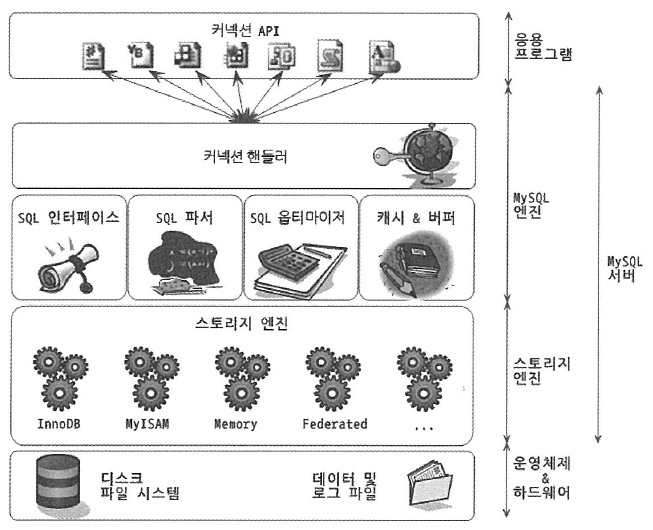

# MySQL 아키텍쳐 구조

mysql 서버는 사람의 머리 역할을 담당하는 MYSQL 엔진과 손발 역할을 담당하는 스토리지 엔진으로 구분된다.

> 스토리지 엔진은 핸들러 API만 만족하면 따로 구현 가능하다.

## MySQL 엔진 아키텍쳐

MySQL 엔진은 클라이언트로부터 접속 및 쿼리 요청을 처리하는 커넥션 핸들러와 SQL 파서 및 전처리기, 쿼리의 최적화된 실행을 위한 옵티마이저가 중심을 이룬다.
MYSQL 엔진은 요청된 SQL 문장을 분석, 최적화 하는 처리를 수행하고,
실제 데이터를 디스크 스토리지에 저장하거나 읽어오는 부분은 스토리지 엔진이 전담한다.

MYSQL 엔진의 쿼리 실행기에서 데이터를 쓰거나 읽어야 할때는 각 스토리지 엔진에 
쓰기/읽기를 요청하는데, 이러한 요청을 핸들러 요청이라 하고,
사용되는 API를 핸들러 API라고 한다.

### MySQL 스레딩 구조

MYSQL 서버는 스레드 기반으로 작동한다.

포그라운드 스레드와 백그라운드 스레드로 구분할 수 있다.

`포그라운드 스레드`

포그라운드 스레드는 MYSQL 서버에 접속한 클라이언트의 수만큼 존재
요청하는 쿼리 문장을 처리
(사용자 스레드 == 포그라운드 스레드)

클라가 커넥션 종료하면 담당하던 스레드는 다시 스레드 캐시로 돌아간다.

포그라운드 스레드는 데이터를 MYSQL의 버퍼나 캐시로부터 가져오며,  
버퍼나 캐시에 없는 경우에는 직접 디스크의 데이터나 인덱스 파일로부터 데이터를 읽어와서 작업을 처리한다.
(이때 InnoDB는 백그라운드 스레드가 버퍼로부터 디스크까지 기록하는 작업을 처리한다고 한다)

`백그라운드 스레드`

InnoDB는 다음과 같은 여러 가지 작업이 백그라운드로 처리된다.
- 인서트 버퍼(Insert Buffer)를 병합하는 스레드
- 로그를 디스크로 기록하는 스레드 (!)
- InnoDB 버퍼 풀의 데이터를 디스크에 기록하는 스레드 (!)
- 데이터를 버퍼로 읽어 오는 스레드
- 잠금이나 데드락을 모니터링하는 스레드

( (!) 이 중요 )

### 메모리 할당 및 사용 구조

크게 글로벌 메모리 영역과 로컬 메모리 영역으로 구분할 수 있다.

`글로벌 메모리 영역`
- 테이블 캐시
- InnoDB 버퍼 풀
- InnooDB 어댑티브 해시 인덱스
- InnoDB 리두 로그 버퍼

글로벌 메모리 영역은 MySQL 서버가 시작되면서 운영체제로부터 할당된다.  
클라이언트 스레드의 수와 무관하게 하나의 메모리 공간만 할당된다.

`로컬 메모리 영역`  
(세션 메모리 영역이라고도 표현한다)
- 정렬 버퍼
- 조인 버퍼
- 바이너리 로그 캐시
- 네트워크 버퍼

클라이언트 스레드가 쿼리를 처리하는 데 사용하는 메모리 영역이다.  
(각 로컬 메모리 영역은 공유가 안된다)

> 로컬 메모리 영역의 중요한 특징은  
> 각 쿼리의 용도 별로 필요할 때만 공간이 할당되고  
> 필요하지 않은 경우에는 MySQL이 메모리 공간을 할당조차도 하지 않을 수 있다.

### 쿼리 실행 구조

`쿼리 파서`  
사용자 요청으로 들어온 쿼리 문장을 토큰(MySQL이 인식할 수 있는 최소 단위)  
으로 분리해 트리 형태의 구조로 만들어 내는 작업  
(쿼리 문장의 기본 문법 오류는 이 과정에서 발견된다)

`전처리기`  
파서 과정에서 만들어진 파서 트리를 기반으로 쿼리 문장에 구조적인 문제점이 있는지 확인한다.  
(해당 객체의 존재 여부, 접근 권한 확인)

`옵티마이저`  
어떻게 쿼리 문장을 저렴한 비용으로 가장 빠르게 처리할지를 결정하는 역할  
(실행 계획 수립)

`실행 엔진`  
만들어진 실행 계획대로 각 핸들러에게 요청해서 받은 결과를  
또 다른 핸들러 요청의 입력으로 연결하는 역할

`핸들러(스토리지 엔진)`  
실행 엔진의 요청에 따라 데이터를 디스크로 저장하고 디스크로부터 읽어 오는 역할

> 옵티마이저가 두뇌라면 실행 엔진과 핸들러는 손과 발

