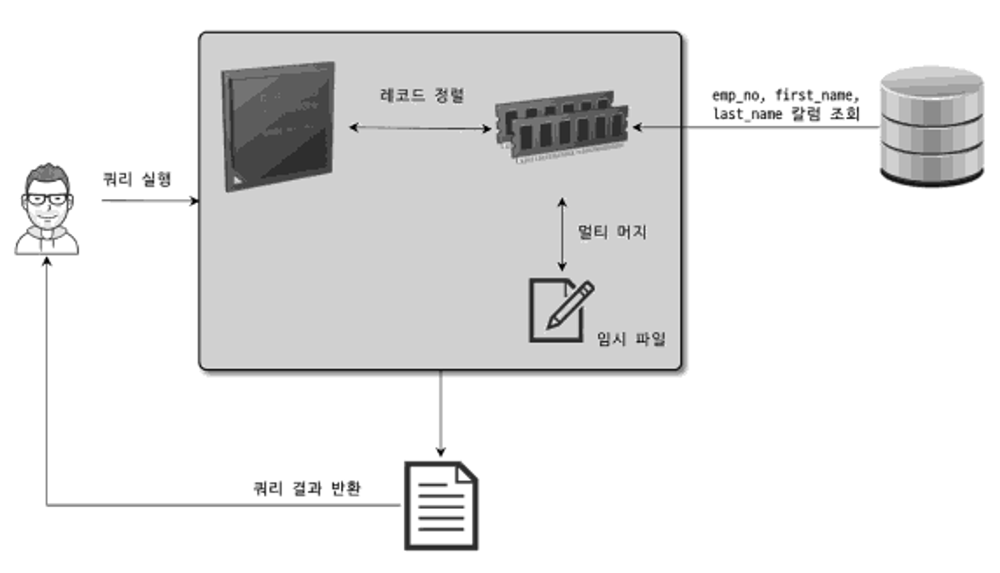
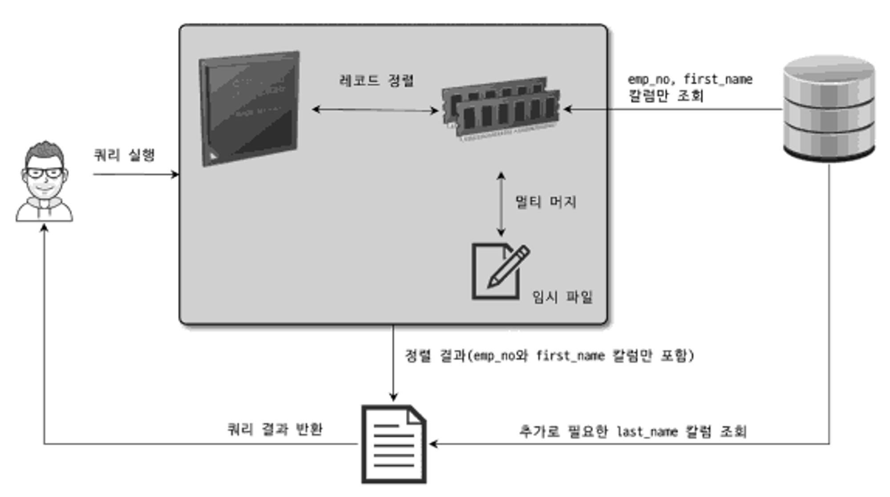
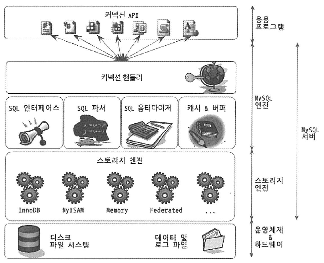
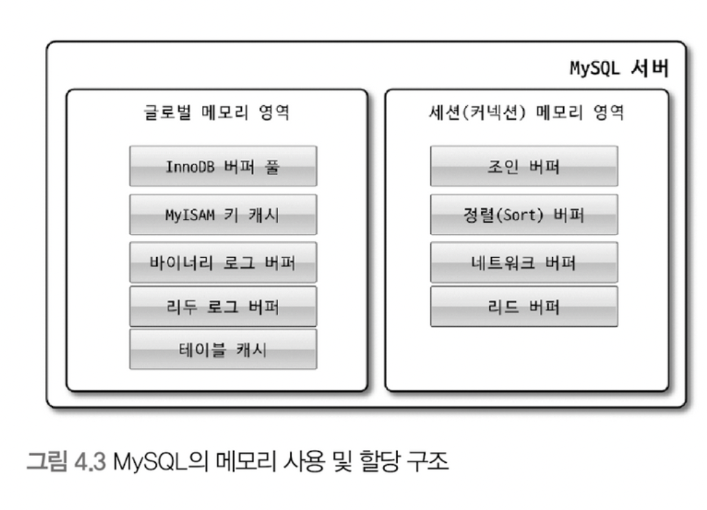
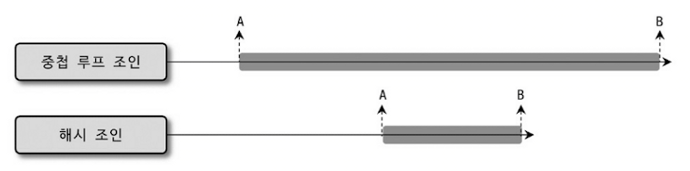

MySQL 서버로 요청된 쿼리는 결과는 동일하지만 내부적으로 그 결과를 만들어내는 방법은 매우 다양하다.
이런 다양한 방법 중에서 어떤 방법이 최적이고 최소의 비용이 소모될지 결정해야 한다.

MySQL 역시 다른 DBMS처럼, 쿼리를 최적으로 실행하기 위해 각 테이블의 데이터가 어떤 분포로 저장돼 있는지
통계 정보를 참조하며, 그러한 기본 데이터를 비교해 최적의 실행 계획을 수립하는 작업이 필요하다.
이를 옵티마이저가 담당한다.

> MySQL에서는 `EXPLAIN` 명령어로 쿼리의 실행 계획을 알 수 있다.
>
> 실행 계획에 표시되는 내용을 이해하려면 MySQL 서버 옵티마이저가 실행하는 최적화에 대해 어느정도 지식을 갖추고 있어야 한다.

---

# 개요

실행 계획을 살펴보기 전 먼저 알고 있어야 할 몇가지 사항들

## 쿼리 실행 절차

1. 사용자로부터 요청된 SQL 문장을 잘게 쪼개서 MySQL 서버가 이해할 수 있는 수준으로 분리한다.
2. SQL의 파싱 정보(파스 트리)를 확인하면서 어떤 테이블부터 읽고 어떤 인덱스를 이용해 테이블을 읽을지 선택한다.
3. 두 번쨰 단계에서 결정된 테이블의 읽기 순서나 선택된 인덱스를 이용해 스토리지 엔진으로부터 데이터를 가져온다.

첫 번째 단계를 `SQL 파싱`이라 하며, 이 단계에서 문법적으로 잘못된 SQL 문장을 걸러낸다.
`SQL 파서`가 담당한다.
그리고 이때 `SQL 파스 트리`가 만들어진다.

두 번째 단계는 SQL 파스 트리를 참조하면서 다음과 같은 내용을 처리한다.

- 불필요한 조건 제거 및 복잡한 연산의 단순화
- (여러 테이블의 조인이 있는 경우) 어떤 순서로 테이블을 읽을 지 결정
- 각 테이블에 사용된 조건과 인덱스 통계 정보를 이용해 사용할 인덱스를 결정
- 가져온 레코드들을 임시 테이블에 넣고 다시 한번 가공해야 하는지 결정

두 번째 단계는 `최적화 및 실행 계획 수립` 단계이다.
MySQL 서버의 `옵티마이저`에서 처리한다.
이 단계가 마무리되면 `실행 계획`이 만들어진다.

> 첫번째와 두번째 단계는 거의 MySQL 엔진에서 처리하며,
> 세 번째 단계는 MySQL 엔진과 스토리지 엔진이 동시에 참여해서 처리한다.

---

## 옵티마이저 종류

옵티마이저는 DB 서버에서 두뇌와 같은 역할을 담당한다.

옵티마이저는 비용 기반 최적화(Cost-based optimizer, CBO) 방법과
규칙 기반 최적화 방법(Rule-based optimizer, RBO)로 크게 나눌 수 있다.

`규칙 기반 최적화`
대상 테이블의 레코드 건수나 선택도(Cardinality) 등을 고려하지 않고,
옵티마이저에 내장된 우선순위에 따라 실행 계획을 수립하는 방식

`비용 기반 최적화`쿼리를 처리하기 위한 여러 가지 방법을 만들고, 각 단위 작업의 비용(부하) 정보와대상 테이블의 예측된 통계 정보를 이용해 실행 계획별 비용을 산출하는 방식

> 규칙 기반 최적화는 비용 계산이 부담스러운 이유로 사용되던 방법이다.
>
> 규칙 기반 최적화는 초기 버전의 오라클 DBMS에서 사용했고,
> 비용 기반 최적화는 현재 대부분의 DBMS가 선택하고 있다고 한다.

---

# 기본 데이터 처리

MySQL 서버를 포함한 모든 DBMS는 데이터를 정렬하거나 그루핑하는 등의 기본 데이터 가공 기능을 가지고 있다.

지금부터 기본적인 가공을 위해 MySQL 서버가 어떤 알고리즘을 사용하는지 알아보겠다.

## 풀 테이블 스캔 & 풀 인덱스 스캔

(풀 인덱스 스캔은 Index.md 에서 설명했음)

풀 테이블 스캔 - 인덱스를 사용하지 않고 테이블의 데이터를 처음부터 끝까지 읽는 것

풀 테이블 스캔 조건

- 테이블의 레코드 건수가 매우 작을 때(인덱스를 이용하는 것보다 풀 테이블 스캔이 더 빠를 경우)
- WHERE 절이나 ON 절에 인덱스를 이용할 수 있는 적절한 조건이 없는 경우
- 인덱스 레인지 스캔을 사용할 수 있다 해도, 일치 레코드 건수가 너무 많은 경우
  (인덱스의 B-Tree 샘플링해서 조사한 통계 정보 기준)

대부분의 DBMS는 풀 테이블 스캔을 실행할 때
한꺼번에 여러 개의 블록/페이지를 읽어오는 기능을 내장하고 있다.

InnoDB 스토리지 엔진은특정 테이블의 연속된 데이터 페이지가 읽히면백그라운드 스레드에 의해 리드 어헤드(Read ahead) 작업이 자동으로 시작된다.

> 리드 어헤드
> 어떤 영역의 데이터가 앞으로 필요해지리라는 것을 예측해서
> 요청이 오기 전에 미리 디스크에서 읽어 InnoDB의 버퍼 풀에 가져다 두는 것

풀 테이블 스캔이 실행되면 처음 몇 개의 데이터 페이지는포그라운드 스레드가 페이지 읽기를 실행하지만특정 시점부터는 읽기 작업을 백그라운드 스레드로 넘긴다.(백그라운드 스레드는 한번에 4개/8개씩의 페이지를 읽으면 그 수를 증가시킨다)이후에 포그라운드 스레드는 미리 버퍼 풀에 준비된 데이터를 사용하기만 하면 되므로 쿼리가 빨리 처리된다.

> `innodb_read_ahead_threshold` 시스템 변수를 이용해
> InnoDB 스토리지 엔진이 언제 리드 어헤드를 시작할지 임계값을 설정할 수 있다.

> 리드 어헤드는 풀 인덱스 스캔에서도 사용된다.

---

## 병렬 처리

MySQL 8.0 버전부터, 처음으로 쿼리의 병렬 처리가 가능해졌다.
(하나의 쿼리에 대한 병렬 처리)
(여러 개의 쿼리에 대한 병렬 처리는 이전에도 가능했음)

`innodb_parallel_read_threads` 시스템 변수로
하나의 쿼리를 최대 몇개의 스레드를 이용할지 정할 수 있다.

대신 아무런 WHERE 조건 없이 단순한 테이블의 전체 건수를 가져오는 쿼리만 병렬로 처리할 수 있다.
`SELECT count(*) FROM Table1`

---

## ORDER BY 처리(Using filesort)

정렬을 처리하는 방법은인덱스를 이용하는 방법(1)과, 쿼리가 실행될 때 "Filesort"라는 별도의 처리를 이용하는 방법(2)으로 나눌 수 있다.

> 인덱스를 이용해 튜닝하기 힘든 케이스
>
> - 정렬 기준이 너무 많아서
> - GROUP BY의 결과 또는 DISTINCT 같은 처리의 결과를 정렬해야 할 때
> - UNION 같이 임시 테이블의 결과를 다시 처리해야 할 경우
> - 랜덤하게 결과 레코드를 가져와야 하는 경우

실행 계획의 Extra 칼럼에 "Using filesort" 메시지가 표시 됐다면
별도의 정렬 처리를 수행했음을 알 수 있다.

---

MySQL 서버에서 정렬이 어떻게 처리될까?
정렬 특성으로는 무엇이 있을까?

### 소트 버퍼(Sort buffer)

MySQL이 정렬을 수행하기 위해 할당 받은 별도의 메모리 공간을 말한다.
정렬이 필요한 경우에만 할당 된다.
레코드의 크기에 따라 가변적으로 증가한다.
(`sort_buffer_size`라는 시스템 변수로 최대 사용 공간 설정 가능)

만약 정렬해야 할 레코드의 건수가 소트 버퍼보다 크다면 MySQL은 정렬해야 할 레코드를 여러 조각으로 나누어 처리한다.
이 과정에서 임시 저장을 위해 디스크를 사용한다.

> 메모리의 소트 버퍼에서 정렬을 수행하고, 그 결과를 임시로 디스크에 기록해 둔다.
> 그 다음 레코드를 가져와서 정렬 & 기록을 반복한다.
> 이처럼 각 버퍼 크기만큼 정렬된 레코드를 다시 병합하여 정렬을 수행하는 것을
> 멀티 머지(Multi-merge)라고 표현한다.

이 작업들은 모두 디스크의 쓰기와 읽기를 유발한다.

소트 버퍼를 크게 설정해도, 큰 차이가 없을 수도 있다.
너무 큰 소트 버퍼를 사용하는 경우, 큰 메모리 공간 할당 때문에 성능이 훨씬 떨어질 수도 있다.

> 그리고 소트 버퍼는 세션 메모리 영역이므로,
> 소트 버퍼 크기를 늘릴 수록,
> 커넥션이 많을 때 소트 버퍼로 소비되는 메모리 공간이 커지게 된다.
> -> OS는 메모리 부족 현상을 겪을 수도 있다.

> 소트 버퍼를 크게 설정하여
> 디스크의 읽기 & 쓰기 사용량은 줄일 수 있다.
>
> 대량 데이터의 정렬이 필요한 경우
> 해당 세션의 소트 버퍼만 일시적으로 늘려서 쿼리를 실행하고
> 다시 줄이는 것도 좋은 방법이다.

---

### 정렬 알고리즘

레코드를 정렬할 때, 레코드 전체를 소트 버퍼에 담을지 또는 정렬 기준 칼럼만 소트 버퍼에 담을지에 따라 `싱글 패스`와 `투 패스` 두 가지 정렬 모드로 나눌 수 있다.

> 정렬을 수행하는 쿼리가 어떤 정렬 모드를 사용하는지
> 옵티마이저 트레이스 기능으로 확인하기
>
> ```
> // 옵티마이저 트레이스 활성화
> SET OPTIMIZER_TRACE="enabled=on", END_MARKERS_IN_JSON=on;
> SET OPTIMIZER_TRACE_MAX_MEM_SIZE=1000000;
>
> // 쿼리 실행
>
> // 트레이스 내용 확인
> SELECT * FROM INFORMATION_SCHEMA_OPTIMIZER_TRACE \G
> ```
>
> 출력된 내용에서"filesort_summary" 섹션의 "sort_algorithm" 필드가 정렬 알고리즘이 표시되고,"sort_mode" 필드에는 "<fixed_sort_key, packed_additional_fields>"가 표시된 것을 확인할 수 있다.
>
>> "std::stable_sort"는 C++ STL의 stable_sort() 함수를 사용했다는 것
>>

`MySQL 서버의 정렬 방식`

- "<sort_key, rowid>" 정렬 키와 레코드의 로우 아이디만 가져와서 정렬 (투 패스)
- "<sort_key, additional_fields>" 정렬 키와 레코드 전체를 가져와서 정렬 (싱글 패스)
  (레코드의 칼럼들은 고정 사이즈로 메모리 저장)
- "<sort_key, packed_additional_fields>" 정렬 키와 레코드 전체를 가져와서 정렬
  (레코드의 칼럼들은 가변 사이즈로 메모리 저장)

MySQL 5.7 버전부터 세 번째 방식이 도입됐다.
(정렬을 위한 메모리 공간의 효율적인 사용을 위해)

---

`싱글 패스 정렬 방식`

소트 버퍼에 정렬 기준 칼럼을 포함해 SELECT 대상이 되는 칼럼 전부를 담아서 정렬을 수행하는 방식
(정렬이 필요하지 않은 칼럼도 포함한다)



`투 패스 정렬 방식`

정렬 대상 칼럼과 PK 값만 소트 버퍼에 담아서 정렬을 수행하고,
정렬된 순서대로 다시 PK로 테이블을 읽어서 SELECT 할 칼럼을 가져오는 정렬 방식



투 패스 정렬 방식은 테이블을 두 번 읽어야 한다.싱글 패스 정렬 방식은 더 많은 소트 버퍼 공간이 필요하다.

> 최신 버전에서는 일반적으로 싱글 패스 정렬 방식을 사용한다.싱글 패스가 아닌 투 패스 정렬 방식을 사용하는 경우
>
> - 레코드의 크기가 max_length_for_sort_data 시스템 변수에 설정된 값보다 클 때
> - BLOB이나 TEXT 타입의 칼럼이 SELECT 대상에 포함될 때
>
> 즉, 정렬 대상 레코드의 크기나 건수가 상당히 많은 경우 투 패스가 효율적이다.

---

### 정렬 처리 방법

3가지가 있고, 아래로 갈수록 처리 속도는 떨어진다.


| 정렬 처리 방법                                  | 실행 계획의 Extra 칼럼 내용                        |
| ----------------------------------------------- | -------------------------------------------------- |
| 인덱스를 사용한 정렬                            | 별도 표기 없음                                     |
| 조인에서 드라이빙 테이블만 정렬                 | "Using filesort" 메시지가 표시 됨                  |
| 조인에서 조인 결과를 임시 테이블로 저장 후 정렬 | "Using temporary; Using filesort" 메시지가 표시 됨 |

---

`인덱스를 이용한 정렬`

별도의 "Filesort" 과정 없이 인덱스를 순서대로 읽어서 결과를 반환한다.

> 인덱스를 이용한 정렬을 위해서는 반드시 ORDER BY에 명시된 칼럼이
> 제일 먼저 읽는 테이블(조인이 사용된 경우 드라이빙 테이블)에 속하고,
> ORDER BY의 순서대로 생성된 인덱스가 있어야 한다.
> 그리고 WHERE 절의 첫번째 조건과 ORDER BY는 같은 인덱스를 사용할 수 있어야 한다.
>
> 그리고 B-Tree 계열의 인덱스가 아니라면
> 인덱스를 이용한 정렬을 사용할 수 없다.
>
> 여러 테이블이 조인되는 경우 Nested-Loop 방식의 조인에서만
> 이 방식을 사용할 수 있다.

인덱스를 사용한 정렬이 가능한 이유는
B-Tree 인덱스가 key-value 형태로 정렬 돼 있기 때문이다.
(또한 조인이 Nested-Loop 방식으로 실행되기 때문에 순서가 흐트러지지 않는다)

만약 조인 버퍼가 사용되면 순서가 흐트러질 수 있기 때문에
주의해야 한다.

---

`조인의 드라이빙 테이블만 정렬`

이 방법으로 처리되려면,
조인에서 첫번째로 읽히는 테이블(드라이빙 테이블)의 칼럼만으로 ORDER BY 절을 작성해야 한다.

```
SELECT *
FROM employees e, salaries s
WHERE s.emp_no=e.emp_no
AND e.emp_no BETWEEN 100002 AND 100010
ORDER BY e.last_name
```

처리 순서

1. 인덱스를 이용해 WHERE 절의 조건 수행
2. 검색 결과를 last_name 칼럼으로 정렬 수행(filesort)
3. 정렬한 결과를 순서대로 읽으면서 salaries 테이블과 조인을 수행해 결과를 가져 옴

---

`임시 테이블을 이용한 정렬`

위 패턴의 쿼리가 아닌,
그 외 패턴의 쿼리에서는 항상 조인의 결과를 임시 테이블에 저장하고,
그 결과를 다시 정렬하는 결과를 거친다.

이 방법은 정렬해야 할 레코드 건수가 가장 많기 때문에 가장 느린 정렬 방법이다.

```
SELECT *
FROM employees e, salaries s
WHERE s.emp_no=e.emp_no
AND e.emp_no BETWEEN 100002 AND 100010
ORDER BY s.salary;
```

ORDER BY 절의 정렬 기준 칼럼이 드라이빙 테이블이 아니라, 드리븐 테이블에 있는 칼럼이다.
-> 정렬이 수행되기 전에 salaries 테이블을 읽어야 한다.
-> 조인된 데이터를 가지고 정렬할 수 밖에 없다.

---

> 쿼리가 처리되는 방식은 두 가지가 있다.
>
> `1. 스트리밍 방식`
> 조건에 일치하는 레코드가 검색될 때마다 바로바로 클라이언트로 전송해주는 방식
> 클라이언트는 쿼리를 요청하고 곧바로 원했던 첫 번째 레코드를 전달받는다.
> -> 빠른 응답 시간을 보장해준다.
> (그리고 LIMIT처럼 결과 건수를 제한하는 조건들은 쿼리의 전체 실행 시간을 상당히 줄여줄 수 있다)
>
> `2. 버퍼링 방식`
> ORDER BY나 GROUP BY 같은 처리는 쿼리의 결과가 스트리밍 되는 것을 불가능하게 한다.
> 버퍼링 방식으로 처리되는 쿼리는 먼저 결과를 모아서 MySQL 서버에서 일괄 가공해야 하므로
> 모든 결과를 스토리지 엔진으로부터 가져올 때까지 기다려야 한다.
> (버퍼링 방식으로 처리되는 쿼리는 LIMIT를 걸어도 성능 향상에 별로 도움이 되지 않는다)

---

`정렬 처리 방법의 성능 비교`

ORDER BY의 3가지 처리 방법 가운데
인덱스를 사용한 정렬 방식만 스트리밍 형태의 처리이며,
나머진 모두 버퍼링된 후에 정렬된다.

어느 테이블이 먼저 드라이빙되어 조인되는지도 중요하지만
어떤 정렬 방식으로 처리되는지는 더 큰 성능 차이를 만든다.

가장하다면 인덱스를 사용한 정렬로 유도하고,
그렇지 못하다면 최소한 드라이빙 테이블만 정렬해도 되는 수준으로 유도하는 것도
좋은 튜닝 방법이라고 할 수 있다.

---

### 정렬 관련 상태 변수

MySQL 서버는 처리하는 주요 작업에 대해서는 해당 작업의 실행 횟수를 상태 변수로 저장한다.

```
FLUSH STATUS;
SHOW STATUS LIKE 'Sort%';
```

Sort_merge_passes - 멀티 머지 횟수
Sort_range - 인덱스 레인지 스캔을 통해 검색된 결과에 대한 정렬 작업 횟수(누적 됨)
Sort_scan - 풀 테이블 스캔을 통해 검색된 결과에 대한 정렬 작업 횟수(누적 됨)
Sort_rows - 지금까지 정렬한 전체 레코드 건수

---

## GROUP BY 처리

`GROUP BY` 또한 `ORDER BY`와 같이 스트리밍된 처리를 할 수 없게 하는 처리 중 하나다.

> `HAVING` 절을 통해 `GROUP BY` 결과를 필터링한다.  
> `GROUP BY`에 사용된 조건은 인덱스를 사용해서 처리될 수 없으므로  
> `HAVING` 절을 튜닝 할 고민을 할 필요는 없다.  
> (`HAVING` 절은 이미 그룹화 된 결과를 필터링하기 떄문에 인덱스를 사용 못한다는 뜻)

---

`GROUP BY` 절이 처리되는 케이스
1. 인덱스 스캔 방법(인덱스를 차례대로 읽음)
2. 루스 인덱스 스캔(인덱스를 건너뛰면서 읽음)
3. 인덱스를 사용하지 못하는 케이스(임시 테이블 사용)

---

### 인덱스 스캔을 이용하는 GROUP BY(타이트 인덱스 스캔)

드라이빙 테이블에 속한 칼럼만 이용해 그루핑할 때  
GROUP BY 칼럼으로 이미 인덱스가 있을 때의 케이스  
(인덱스를 차례대로 읽으면서 그루핑 작업을 수행하고 그 결과로 조인을 처리)

이 케이스는 그룹화를 위해 추가적인 정렬 작업이나 내부 임시 테이블은 필요하지 않다.

> 하지만 그룹 함수 등의 그룹값을 처리해야 해서 임시 테이블이 필요할 때도 있다

실행 계획의 Extra 칼럼에는 별도로  
GROUP BY 관련 코멘트("Using index for group-by")나  
임시 테이블 사용 또는 정렬 관련 코멘트("Using temporary, Using filesort")  
가 표시되지 않는다.

---

### 루스 인덱스 스캔을 이용하는 GROUP BY

(실행 계획의 Extra 칼럼에 "Using index for group-by" 코멘트가 표시된다)

```
EXPLAIN
SELECT emp_no
FROM salaries
WHERE from_date = '1985-03=01'
GROUP BY emp_no;
```

`salaries` 테이블에 (emp_no, from_date) 인덱스가 있다면  
위 쿼리는 루스 인덱스 스캔이 적용된다.

쿼리 처리 과정
1. (emp_no, from_date) 인덱스를 차례대로 스캔하면서 emp_no의 유일한 값(그룹 키) "10001"을 찾아낸다.
2. (emp_no, from_date) 인덱스에서 emp_no가 "10001"인 것 중에서  
   from_date 값이 '1985-03-01'인 레코드만 가져온다.  
   (이는 emp_no=10001 AND from_date='1985-03-01' 조건을 이용한 것과 같다)  
   이후의 from_date 값들은 스킵한다.
3. (emp_no, from_date) 인덱스에서 emp_no의 다음 유니크한 값(그룹 키)을 가져온다.

루스 인덱스 스캔 방식은 단일 테이블에 수행되는 GROUP BY 처리에만 사용될 수 있다.

> 프리픽스 인덱스(컬럼 값의 앞쪽 일부만으로 생성된 인덱스)는  
> 루스 인덱스 스캔을 사용할 수 없다.

> 근데 멀티컬럼 인덱스에 포함된 컬럼의 수가 많아서  
> 루스 인덱스 스캔이 사용될 수도 있는 것 같다.
> 
> 그러니까 특정 쿼리에 딱 맞는 인덱스를 사용했을 때  
> (인덱스 풀 스캔 방식)  
> 해당 인덱스의 컬럼이 추가된다면  
> 인덱스 풀 스캔이 루스 인덱스 스캔으로 변형된 느낌?
> 
> (col1, col2, col3) 인덱스 포함  
> `SELECT DISTINCT col1, col2 FROM tb_test`
> 
> 만약 (col1, col2) 만 가지고 인덱스가 만들어 졌다면  
> 인덱스 풀 스캔이 사용됐을 듯

커버링 인덱스 케이스 중에서 컬럼이 더 적게 쓰였을 때도(앞부분만)  
루스 인덱스 스캔이 사용되는 것 같다.  
(인덱스의 뒷 부분은 사용할 필요가 없으므로 스킵되는 느낌?)

---

내가 나름대로 정리한 루스 인덱스 스캔이 적용되는 케이스
1. GROUP BY절에서 집계 함수가 MIN, MAX만 쓰였을 때
2. 커버링 인덱스 케이스인데 인덱스의 앞부분 컬럼만 사용됐을 때  
   (원래였으면(인덱스의 컬럼이 적었다면) 인덱스 풀 스캔일 때)  

너무 당연한가?

---

### 임시 테이블을 사용하는 GROUP BY

GROUP BY의 기준 칼럼이 인덱스를 전혀 사용하지 못할 떄 사용되는 방식

실행계획의 Extra 칼럼에 "Using temporary" 메시지가 표시된다.  
ORDER BY 절이 없다면 "Using temporary" 메시지는 표시되지 않는다.  
(정렬되지 않는다는 뜻)`

> MySQL 8.0 이전 버전까지는 GROUP BY가 사용된 쿼리는
> 그루핑 되는 칼럼을 기준으로 묵시적인 정렬까지 함께 수행됐다.
> 
> 8.0 버전부터는 이 같은 묵시적인 정렬이 더 이상 실행되지 않는다.  
> (GROUP BY 절의 칼럼들로 구성된 유니크 인덱스를 가진, 임시 테이블을 만들어 중복 제거와 집합 함수 연산 수행)

---

## DISTINCT 처리

DISTINCT를 쓸때도 두가지 케이스가 있다.  
집합 함수와 같이 쓸 때, 같이 안 쓸 때
이렇게 구분한 이유는, 각 경우에 DISTINCT 키워드가 영향을 미치는 범위가 달라지기 때문이다.
(not 집계 함수 -> SUM, AVG 제외, only COUNT, MIN, MAX)

### SELECT DISTINCT ...

DISTINCT가 일반적으로 사용될 때는, GROUP BY와 동일한 방식으로 처리된다.

```
SELECT DISTINCT emp_no FROM salaries;
SELECT emp_no FROM salaries GROUP BY emp_no;
```

위의 두 쿼리는 내부적으로 같은 작업을 수행한다.  


> SELECT 절에 사용되는 DISTINCT는 키워드는 조회되는 모든 칼럼에 영향을 미친다.
> 
> ```
> SELECT DISTINCT col1, col2 from tb_test;
> SELECT DISTINCT(col1), col2 from tb_test;
> ```
> 
> 위의 두 쿼리는 같은 결과를 낸다.

### 집합 함수와 함께 사용된 DISTINCT

집합 함수 내에서 사용된 DISTINCT는  
그 집합 함수의 인자로 전달된 칼럼값이 유니크한 것들을 가져온다.

```
SELECT COUNT(DISTINCT s.salary) FROM employees e, salaries s
WHERE e.emp_no=s.emp_no and e.emp_no between 100001 and 100100;
```

위 쿼리는 where절 처리를 위해 employees 테이블읜 인덱스는 사용했지만  
COUNT(DISTINCT s.salary)를 처리하기 위해 임시 테이블을 사용해야 한다.  
하지만 이 쿼리의 실행 계획에는 임시 테이블을 사용한다는 메시지(Using temporary)는 표시되지 않는다.  


---

## 내부 임시 테이블 활용

MySQL 엔진이 내부 스토리지 엔진으로부터 받아온 레코드를  
정렬하거나 그루핑할 때는 내부적인 임시 테이블을 사용한다.  
(여기서 "CREATE TEMPORARY TABLE" 명령을 통해 생성된 것과는 다르다)

일반적으로 MySQL 엔진이 사용하는 임시 테이블은  
처음에는 메모리에 생성됐다가 크기가 커지면 디스크로 옮겨진다.  
그리고 쿼리가 완료되면 자동으로 삭제된다.

### 임시 테이블이 필요한 쿼리

1. ORDER BY와 GROUP BY에 명시된 칼럼이 다른 쿼리
2. ORDER BY나 GROUP BY에 명시된 조인의 순서상 첫번째 테이블이 아닌 쿼리
3. DISTINCT와 ORDER BY가 동시에 존재하는 경우 또는 DISTINCT가 인덱스로 처리되지 못하는 쿼리
4. UNION이나 UNION DISTINCT가 사용된 쿼리(select_type 칼럼이 RESULT인 경우)
5. 쿼리의 실행 계획에서 select_type이 DERIVED인 쿼리

어떤 쿼리의 실행 계획에서 Extra 칼럼에 "Using temporary"라는 메시지가 표시되면,  
이는 임시 테이블을 사용하는 쿼리다.

여기서 3,4,5번 쿼리는 임시 테이블을 사용해도 "Using temporary" 메시지가 표시되지 않는다.  
1번 ~ 4번 쿼리 패턴은 유니크 인덱스를 가지는 내부 임시 테이블이 만들어진다.  
그리고 5번 쿼리는 유니크 인덱스가 없는 내부 임시 테이블이 생성된다.

> 일반적으로 유니크 인덱스가 있는 내부 임시 테이블은  
> 없는 임시 테이블보다 처리 성능이 상당히 느리다.

### 내부 임시 테이블이 디스크에 생성되는 경우

1. UNION이나 UNION ALL에서 SELECT 되는 칼럼 중에서 길이가 512바이트 이상인 칼럼이 있는 경우
2. GROUP BY나 DISTINCT 칼럼에서 512바이트 이상인 칼럼이 있는 경우
3. 메모리 임시 테이블의 크기가 시스템 변수로 설정한 값보다 클 경우

### 임시 테이블 관련 상태 변수

실행 계획을 통해 임시 테이블이 사용됐는지(Using temporary) 확인할 수 있지만,  
임시 테이블이 어디서 사용됐는지(메모리 or 디스크) 알 수는 없다.  
그리고 몇 개의 임시 테이블이 사용됐는지 알 수 없다.

임시 테이블이 어디서 사용됐는지는  
시스템 변수를 통해 알 수 있다.

```
FLUSH STATUS; // 현재 세션의 상태 값 초기화

// 원하는 쿼리 입력

SHOW SESSION STATUS LIKE 'Created_tmp%';
```

Created_tmp_tables: 지금까지 쿼리의 처리를 위해 사용된 임시 테이블의 개수의 누적 값(메모리 디스크 구분x)
Created_tmp_disk_tables: 디스크에 내부 임시 테이블이 만들어진 개수의 누적 값

---

# 고급 최적화

MySQL 서버의 옵티마이저는,  
통계 정보와 옵티마이저 옵션을 결합해서 최적의 실행 계획을 수립한다.

옵티마이저 옵션은 크게  
옵티마이저 스위치 옵션과 옵티마이저 조인 옵션으로  
구분할 수 있다.

> 대부분은 최적화를 위해 이 옵션들이 켜져 있다.  
> 하지만 어떤 옵션이 켜짐으로써 특정 쿼리가 비효율적으로 실행될 수도 있다.  
> ~~대부분은 효율적일듯~~
> 
> 이 옵션들에 의해 실행 계획이 수립되기 떄문에,  
> 쿼리를 좀 더 효율적으로 처리하고 싶다면  
> 각각의 기능을 알고, 적용할지 말지를 결정하면 좋다고 생각한다.

---

## 옵티마이저 스위치 옵션

`optimizer_switch` 시스템 변수를 통해 제어한다.

```
// MySQL 서버 전체적으로 설정
SET GLOBAL optimizer_switch='{시스템_변수1}={on/off},{시스템_변수2}={on/off}, ...'

// 현재 커넥션만 설정
SET SESSION optimizer_switch='{시스템_변수1}={on/off},{시스템_변수2}={on/off}, ...'

// 현재 쿼리에만 설정
SELECT /*+ SET_VAL(optimizer_switch='{시스템_변수1}={on/off}' /* 
...
FROM ...
```

### 

MySQL 서버에서 사용하는  
기본적인 조인 방식은  
드라이빙 테이블의 레코드를 한 건 읽어서  
드리븐 테이블의 일치하는 레코드를 찾아서 조인을 수행하는 방식

위 방식이 네스티드 루프 조인(Neted Loop Join)  
(조인의 연결 조건이 되는 칼럼에 모두 인덱스가 있는 경우 사용되는 방식)

MySQL 서버 내부 구조상 조인 처리는 MySQL 엔진이 하지만,  
실제 레코드를 검색하고 읽는 부분은 스토리지 엔진이 담당한다.

### index_condition_pushdown

default: on

인덱스를 이용해서 스캔할 때는
MySQL 엔진이 스토리지 엔진에게 조건을 전달해서
스토리지 엔진이 직접 탐색한다.

그런데 애초에 인덱스에 해당하지 않는 조건이라면  
스토리지 엔진은 조건을 받지 못해, 그냥 전부다 스캔한다.

이 기능을 켜면 인덱스 칼럼엔 있지만 스캔이 안되는 조건을 체크할 수 있다.
('%'가 앞에 있는 케이스 등)

### use_index_extensions

default: on

세컨더리 인덱스(논-클러스터링 인덱스)의 리프노드에는 PK가 저장되어 있는데,  
이 기능을 켜면 (인덱스 칼럼 + PK 칼럼)인 인덱스처럼 사용가능하다.

### index_merge

default: on

하나의 테이블에 대해 2개 이상의 인덱스를 이용해 쿼리를 처리하도록 하는 옵션

> 쿼리에 사용된 각각의 조건이 서로 다른 인덱스를 사용할 수 있고  
> 그 조건을 만족하는 레코드 건수가 많은 것으로 예상될 떄 사용된다. 

이 옵션이 적용되면 실행 계획의 type 칼럼에 index_merge 메시지가 나타난다.

이 옵션은 세가지 세부 옵션으로 세팅할 수 있다.

### index_merge_intersection

default: on

각각의 인덱스에 대한 결과의 교집합이 반환했다는 것을 의미

실행 계획의 Extra 칼럼에 Using intersect 메시지가 나타난다.

### index_merge_sort_union

default: on

### index_merge_union

default: on

사용된 2개 이상의 조건이 각각의 인덱스를 사용하되  
OR 연산자로 연결된 경우에 사용되는 최적화다.

실행 계획의 Extra 칼럼에 Using union 메시지가 나타난다.

> 여기서 각각의 결과에 중복된 레코드가 있을 수도 있다.
> 
> 이때 MySQL 서버는 내부적으로 PK를 이용해 중복을 제거한다.  
> (우선순위 큐 알고리즘을 이용한다 함)
> 
> 이게 가능한 이유는 각 쿼리의 결과가 PK로 정렬되있을 때만 가능하다.

> 만약 2개의 조건들이 OR 연산으로 연결 됐는데,  
> 둘 중 하나라도 인덱스를 사용하지 못하면  
> 항상 풀 테이블 스캔을 사용해야 한다.

### index_merge_sort_union

default: on

위와 비슷한데, 각각의 쿼리가 PK로 정렬되어 있지 않을 때 경우이다.

그래서 MySQL 서버는 중복을 제거하기 위해,  
각 집합을 PK 칼럼으로 정렬한 다음 중복 제거를 수행한다.

실행 계획의 Extra 칼럼에 Using sort_union 메시지가 나타난다.

### semijoin(세미 조인)

다른 테이블과 실제 조인을 수행하지 않고,  
단지 다른 테이블에서 조건에 일치하는 레코드가 있는지 없는지만 체크하는 형태의 쿼리를  
세미 조인 이라고 한다.


### hash_join(해시 조인)

(MySQL 8.0.18 버전에 추가된 기능)

아래 그림은 네스티드 루프 조인과 해시 조인의 처리 성능을 보여준다.
- 화살표의 길이 = 전체 쿼리의 실행 시간
- A 지점 = MySQL 서버가 첫번째 레코드를 찾아낸 시점
- B 지점 = MySQL 서버가 마지막 레코드를 찾아낸 시점



해시 조인은 첫번째 레코드를 찾는데는 시간이 많이 걸리지만, 전체 실행 시간이 많이 걸리지 않았다.  
네스티드 루프 조인은 전체 실행 시간은 많이 걸리지만, 첫번째 레코드를 찾는데는 상대적으로 빨랐다.

즉 해시 조인은 최소 스루풋(Best Throughput) 전략에 유용하며,  
네스티드 루프 조인은 최고 응답 속도(Best Response-time) 전략에 유용하다.

(일반적인 웹 서비스는 온라인 트랜잭션(OLTP) 서비스이기 때문에 응답 속도가 상대적으로 더 중요하다)  
(분석과 같은 서비스는 전체 스루풋이 상대적으로 더 중요하다)

MySQL 서버는 범용 RDBMS라서, (범용 -> OLTP를 위한 DB)  
주로 조인 칼럼에 인덱스가 없거나  
조인 대상 테이블 중 일부의 레코드 건수가 매우 적은 경우  
등에 대해서만 해시 조인 알고리즘을 적용하도록 설계돼 있다.

-> MySQL 서버의 해시 조인 최적화는 네스티드 루프 조인을 적용하기 힘든 경우를 위한 '차선책' 같은 기능

해시 조인이 사용 된 실행 계획의 Extra 칼럼에는 hash join 키워드가 표시된다.

// TODO 해시 조인 대상 테이블의 크기가 조인 버퍼를 넘어섰을 때의 메커니즘(디스크 활용한 메커니즘)

### prefer_ordering_index

default: on

하나의 쿼리에 대해 여러 실행 계획이 나올 수 있는데,  
이때 정렬을 하기 위해 인덱스를 고르는 가중치를 낮추는 옵션

```
EXPLAIN 
SELECT *
FROM employees
WHERE hire_date BETWEEN '1995-01-01' AND '1995-02-01'
ORDER BY emp_no;
```

인덱스를 이용한 위 쿼리의 처리는 두가지로 나뉜다.
1. ix_hiredate로 조건에 해당하는 레코드를 찾은 다음, emp_no에 대한 정렬 수행
2. PK를 이용해 정순으로 탐색하면서, 조건에 해당하는 레코드 반환

여기서 옵티마이저가 인덱스를 고를 떄,  
정렬을 많이 생각한다면 2번을 고를 수도 있다.

그런데 만약 조건에 해당하는 레코드의 수가 매우 적다면,  
2번은 매우 비효율적인 방법이 될 것이다.

이럴때 이 옵션을 꺼주면 2번이 아닌,  
1번을 선택하게 될 것이다.

> 이 옵션이 켜져 있다고 무조건 이런 건 아니고, 가능성이 있다.  
> (옵티마이저도 실수를 한다 함)

---

## 조인 최적화 알고리즘

MySQL의 조인 쿼리의 최적화를 위한 알고리즘이 2개 있다.

### Exhaustive 알고리즘

FROM 절에 명시된 모든 테이블의 조합에 대해 실행 계획의 비용을 계산해서  
최적의 조합 1개를 찾는 알고리즘  
(브루트포스 - O(n!))

매우 오래 걸린다.

### Greedy 검색 알고리즘

여기선 2개의 시스템 변수가 사용된다.
1. optimizer_search_depth (default 62)
2. optimizer_search_level (default 1)

기존 Exhaustive 알고리즘은 모든 테이블을 조인해봐서  
최적해를 골랐는데

Greedy 검색 알고리즘은 최대 optimizer_search_depth 개수만큼 테이블을 조인해보고 최적해를 고른다.
그리고 고른 최적해를 통해 첫번째 테이블을 정하고, 또 윗줄을 반복한다.
(전체를 보지 않고 일부만 가지고 한개씩 정하는 알고리즘)

이때 optimizer_search_level의 값이 1이라면 heuristic하게 검색한다.  
(이전 조인 순서의 최소 비용이 100인데, 현재 순서의 비용이 100을 넘어서면 그냥 넘어간다)
(백트래킹 알고리즘 적용)

> 만약 optimizer_search_level의 값이 0이라면,  
> optimizer_search_depth의 값을 default로 설정하면 성능에 심각한 영향을 미칠 수 있으니  
> 4나 5로 설정하는 걸 추천한다고 한다.
> 
> MySQL 8.0 버전부터는 조인 최적화가 많이 개선되어  
> optimizer_search_depth 변수의 값에는 크게 영향을 받지 않지만,  
> optimizer_search_level 변수의 값에는 크게 영향을 받는다고 한다.
> 
> -> 그냥 optimizer_search_level은 1로 설정하자

---


