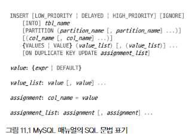

애플리케이션에서 데이터를 저장 또는 조회하기 위해 데이터베이스와 통신할 때  
DB 서버로 전달되는 것은 SQL 뿐이다.

SQL은 어떠한(What) 데이터를 요청하기 위한 언어이지,  
어떻게(How) 데이터를 읽을지를 표현하는 아니다.  

그래서 빠르게 쿼리가 수행되게 하려면 DB 서버에서  
쿼리가 어떻게 요청을 처리할지 예측할 수 있어야 한다.

이제부터  
쿼리의 패턴별로 "어떻게 처리되는가?"를 살펴보겠다.  
그리고 유용한 쿼리 패턴도 함께 살펴보겠다.

# 쿼리 작성과 연관된 시스템 변수

MySQL 서버의 시스템 설정이 쿼리에 어떤 영향을 주는지 살펴보겠다.

## SQL 모드

`STRICT_TRANS_TABLES` (default: on)  
이 옵션이 활성화되면 INSERT나 UPDATE 문장으로 데이터를 변경하는 경우  
칼럼의 타입과 저장되는 타입이 다를 때 타입 변경을 막아준다.

`ANSI_QUOTES`(default: off)  
이 옵션이 활성화되면 홑따옴표(')만 문자열 값 표기로 사용할 수 있고,  
쌍따옴표(")는 칼럼명이나 테이블명과 같은 식별자를 표기하는 데만 사용할 수 있다.

`ONLY_FULL_GROUP_BY`(default: on)  
이 옵션이 활성화되면 GROUP BY 절이 사용된 문장의 SELECT 절에는  
GROUP BY 절에 명시된 칼럼과 집계 함수(COUNT or SUM 같은 그룹 함수)만 사용할 수 있다.

`PIPE_AS_CONCAT` (default: off)  
이 옵션이 활성화되면 오라클과 같이  
"||"를 문자열 연결 연산자로 사용할 수 있다.

`NO_ZERO_IN_DATE` & `NO_ZERO_DATE` (default: on)  
이 두 옵션외 활성화되면 DATE 또는 DATETIME 타입의 칼럼에  
"0000-00-00"과 같은 잘못된 날짜를 지정하는 것이 불가능해진다.

## 영문 대소문자 구분

MySQL 서버는 설치된 운영체제에 따라 테이블명의 대소문자를 구분한다.  
(MySQL의 DB나 테이블이 디스크의 디렉터리나 파일로 매핑되기 때문)

윈도우에 설치된 MySQL에서는 대소문자를 구분하지 않지만  
유닉스 계열의 운영체제에서는 대소문자를 구분한다.

> 이를 운영체제와 관련없이 하기 위해 MySQL 서버의 설정을 고칠 수 있지만,  
> (lower_case_table_names)  
> 가능하면 설정 자체를 떠나서 초기 DB나 테이블을 생성할 때 대문자 또는 소문자 만으로  
> 통일해서 사용하는 편이 좋다.

---

# 매뉴얼의 SQL 표기 문법 표기를 읽는 방법

MySQL 매뉴얼에서 SQL 문법을 표기하는 방법을 간단히 알아본다.

대문자로 표시한 단어 - 키워드  
(키워드는 대소문자를 구분하지 않고 사용할 수 있다)

이탤릭체로 표현한 단어 - 토큰  
테이블명이나 칼럼명 또는 표현식을 의미한다.

대괄호("[]") - 선택 사항
(이는 없어도 문법적인 오류를 일으키지 않으며, 있어도 발생하지 않는다)

파이프("|") - 앞과 뒤의 키워드/표현식 중 하나만 선택해서 사용

중괄호("{}") - 괄호 내의 아이템 중에서 반드시 하나를 사용

"..." - 앞에 명시된 키워드/표현식이 반복될 수 있다.

---

