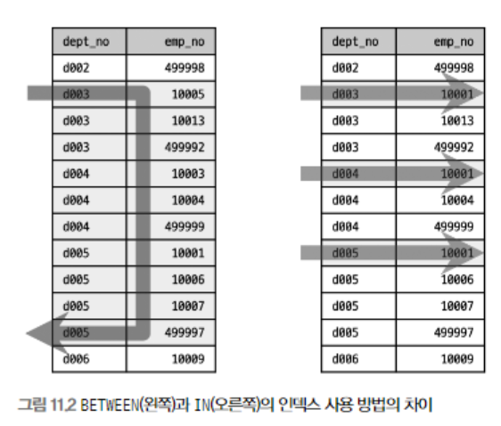

애플리케이션에서 데이터를 저장 또는 조회하기 위해 데이터베이스와 통신할 때  
DB 서버로 전달되는 것은 SQL 뿐이다.

SQL은 어떠한(What) 데이터를 요청하기 위한 언어이지,  
어떻게(How) 데이터를 읽을지를 표현하는 아니다.  

그래서 빠르게 쿼리가 수행되게 하려면 DB 서버에서  
쿼리가 어떻게 요청을 처리할지 예측할 수 있어야 한다.

이제부터  
쿼리의 패턴별로 "어떻게 처리되는가?"를 살펴보겠다.  
그리고 유용한 쿼리 패턴도 함께 살펴보겠다.

# 쿼리 작성과 연관된 시스템 변수

MySQL 서버의 시스템 설정이 쿼리에 어떤 영향을 주는지 살펴보겠다.

## SQL 모드

`STRICT_TRANS_TABLES` (default: on)  
이 옵션이 활성화되면 INSERT나 UPDATE 문장으로 데이터를 변경하는 경우  
칼럼의 타입과 저장되는 타입이 다를 때 타입 변경을 막아준다.

`ANSI_QUOTES`(default: off)  
이 옵션이 활성화되면 홑따옴표(')만 문자열 값 표기로 사용할 수 있고,  
쌍따옴표(")는 칼럼명이나 테이블명과 같은 식별자를 표기하는 데만 사용할 수 있다.

`ONLY_FULL_GROUP_BY`(default: on)  
이 옵션이 활성화되면 GROUP BY 절이 사용된 문장의 SELECT 절에는  
GROUP BY 절에 명시된 칼럼과 집계 함수(COUNT or SUM 같은 그룹 함수)만 사용할 수 있다.

`PIPE_AS_CONCAT` (default: off)  
이 옵션이 활성화되면 오라클과 같이  
"||"를 문자열 연결 연산자로 사용할 수 있다.

`NO_ZERO_IN_DATE` & `NO_ZERO_DATE` (default: on)  
이 두 옵션외 활성화되면 DATE 또는 DATETIME 타입의 칼럼에  
"0000-00-00"과 같은 잘못된 날짜를 지정하는 것이 불가능해진다.

## 영문 대소문자 구분

MySQL 서버는 설치된 운영체제에 따라 테이블명의 대소문자를 구분한다.  
(MySQL의 DB나 테이블이 디스크의 디렉터리나 파일로 매핑되기 때문)

윈도우에 설치된 MySQL에서는 대소문자를 구분하지 않지만  
유닉스 계열의 운영체제에서는 대소문자를 구분한다.

> 이를 운영체제와 관련없이 하기 위해 MySQL 서버의 설정을 고칠 수 있지만,  
> (lower_case_table_names)  
> 가능하면 설정 자체를 떠나서 초기 DB나 테이블을 생성할 때 대문자 또는 소문자 만으로  
> 통일해서 사용하는 편이 좋다.

---

# 매뉴얼의 SQL 표기 문법 표기를 읽는 방법

MySQL 매뉴얼에서 SQL 문법을 표기하는 방법을 간단히 알아본다.


대문자로 표시한 단어 - 키워드  
(키워드는 대소문자를 구분하지 않고 사용할 수 있다)

이탤릭체로 표현한 단어 - 토큰  
테이블명이나 칼럼명 또는 표현식을 의미한다.

대괄호("[]") - 선택 사항
(이는 없어도 문법적인 오류를 일으키지 않으며, 있어도 발생하지 않는다)

파이프("|") - 앞과 뒤의 키워드/표현식 중 하나만 선택해서 사용

중괄호("{}") - 괄호 내의 아이템 중에서 반드시 하나를 사용

"..." - 앞에 명시된 키워드/표현식이 반복될 수 있다.

---

# MySQL 연산자와 내장 함수

## 리터럴 표기법 문자열

### 문자열

SQL 표준에서 문자열은 항상 홑따옴표(')를 사용해서 표시한다.

> 문자열 값이 홑따옴표를 가지고 있을 때는  
> 홑따옴표를 두번 연속해서 사용할 수 있다.

---

### 숫자

숫자 값을 상수로 SQL에 사용할 때는 다른 DBMS와 마찬가지로  
따옴표 없이 숫자 값을 입력하면 된다.

문자열 형태로 따옴표를 사용하더라도  
비교 대상이 숫자 값이거나 숫자 타입의 칼럼이면  
MySQL 서버가 문자열 값을 숫자 값으로 자동 변환한다.

이때 MySQL은 숫자 타입과 문자열 타입 간의 비교에서,  
숫자 타입을 우선시하므로  
문자열 값을 숫자 값으로 변환한 후에 비교를 수행한다.

```SELECT * FROM tab_test WHERE number_column='10001';```  
```SELECT * FROM tab_test WHERE string_column=10001;```

첫번째 쿼리는 주어진 상숫값을 숫자로 변환하므로,  
성능과 관련된 문제가 발생하지 않는다.

두번쨰 쿼리는 문자열 칼럼을 숫자로 변환해서 비교한다.  
따라서 `string_column`에 인덱스가 있더라도  
이를 이용하지 못한다.

> 원천적으로 이러한 문제점을 제거하려면  
> 숫자 값은 숫자 타입의 칼럼에만 저장해야 한다.

---

### 날짜

MySQL에서 정해진 형태의 날짜 포맷으로 표기하면  
MySQL 서버가 자동으로 DATE나 DATETIME 값으로 변환하기 때문에  
STR_TO_DATE() 같은 함수를 사용하지 않아도 된다.

```SELECT * FROM dept_emp WHERE from_date='2011-04-29';```  
```SELECT * FROM dept_emp WHERE from_date=STR_TO_DATE('2011-04-29', '%y-%m-%d');```  
위 두 쿼리의 차이점은 없다.

---

### 불리언

BOOL이나 BOOLEAN이라는 타입은 TINYINT 타입에 대한 동의어이다.

BOOLEAN 타입을 TRUE나 FALSE로 비교했지만,  
실제로 값을 조회해 보면 0 또는 1 값이 조회된다.

MySQL은 C/C++ 언어에서처럼 TRUE 또는 FALSE 같은  
BOOLEAN 값을 정수로 매핑해서 사용하는 것이다.

> 이때 MySQL에서는 FALSE가 정숫값 0이 되지만,  
> TRUE는 C/C++ 언어와 달리 1만을 의미한다는 점을 주의하자

---

## MySQL 연산자

### 동등 비교(=, <=>)

`<=>`: NULL-safe 비교 연산자

1 = 1 : 1
NULL = 1 : NULL
NULL = NULL : NULL

1 = 1 : 1
NULL = 1 : 0
NULL = NULL : 1

`<=>`은 NULL을 하나의 값으로 인식하고 비교한다.

### 부정 비교(<>, !=)

`<>`, `!=` 둘다 가능하다.

### NOT 연산자(!)

기존의 결과를 반대로 만드는 연산자  
NOT과 ! 둘다 사용 가능하다.

### AND(&&)와 OR(||) 연산자

불리언 표현식을 결합하기 위한 연산자  
MySQL에서는 AND와 OR 뿐만 아니라 && 와 || 도 사용 가능하다.

> sql_mode의 `PIPES_AS_CONCAT`을 활성화하면  
> 문자열 연결을 위해 || 을 사용할 수 있다.
> 
> 하지만 가독성을 위해 따로 사용하는 것이 좋을 것 같다.

> OR 보다 AND의 우선순위가 높다.

### 나누기(/, DIV)와 나머지(%, MOD) 연산자

### REGEXP 연산자

문자열 값이 어떤 패턴을 만족하는지 확인하는 연산자

`SELECT 'abc' REGEXP '^[x-z]';`

> REGEXP 연산자는 인덱스를 사용할 수 없다.

### LIKE 연산자

(인덱스를 사용가능한) 단순한 문자열 패턴 비교 연산자  
(대신 와일드카드가 뒤쪽에만 있어야 한다)

LIKE에서 사용할 수 있는 와일으카드는 '%'와 '_' 밖에 없다.

> REGEXP 연산자는 비교 대상 문자열이 일부만 일치해도 TRUE를 반환하는데,  
> LIKE는 비교 대상 문자열의 전체가 일치해야 TRUE를 반환한다.

> '%'나 '_' 문자 자체를 비교하고 싶다면 escape를 사용하면 된다.  
> `SELECT 'abc' LIKE 'a/%' ESCAPE '/'`

### BETWEEN 연산자 & IN 연산자

BETWEEN 연산자는 "크거나 같다"와 "작거나 같다"를 하나로 합친 연산자

IN 연산자는 여러 개의 값에 대해 동등 비교 연산을 수행하는 연산자  
(여러번의 동등 비교이기 때문에 일반적으로 빠르게 처리된다)

BETWEEN 연산자를 이용해 인덱스를 사용할 때 주의해야 할 점이 있다.

```
SELECT * FROM dept_emp 
WHERE dept_no BETWEEN 'd003' AND 'd005' 
AND emp_no=10001;
```

```
SELECT * FROM dept_emp 
WHERE dept_no IN ('d003', 'd004', 'd005') 
AND emp_no=10001;
```

위 두 쿼리는 같은 결과를 반환하지만  
(dept_no, emp_no) 인덱스를 사용한다면  
실행계획이 다르게 나온다.


rows 칼럼의 숫자가 다르게 나왔다.  
-> IN은 동등 비교 연산자를 통해 계산되서 작업 범위가 많이 줄어드는데,  
-> BETWEEN은 범위 탐색을 하기 때문에 작업 범위가 IN절보다 높게 나왔다.



> IN절은 동등 비교 조건을 여러 번 사용한 것처럼 계산되기 때문에,  
> 뒤의 조건인 `emp_no=10001`도 같이 작업 범위를 결정하는데  
> 
> BETWEEN은 범위를 결정하기 때문에  
> `emp_no=10001`은 작업 범위를 결정하지 못하게 된다.

하지만 BETWEEN에 해당하는 값들의 범위를 미리 알아야 IN절을 사용할 수 있다.  

이를 서브쿼리를 이용하면 옵티마이저가 세미 조인 최적화를 해준다.

```
SELECT * FROM dept_emp 
WHERE dept_no IN (
    SELECT dept_no
    FROM departments
    WHERE dept_no BETWEEN 'd003' AND 'd005') 
AND emp_no=10001;
```


