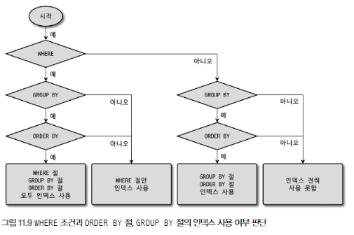

## mysql 아키텍쳐

머리 역할을 담당하는 mysql 엔진과
손발을 담당하는 스토리지 엔진

> 대부분 InnoDB 스토리지 엔진 사용 함

### mysql 스레딩 구조

포그라운드 스레드
서버에 접속한 클라이언트 수만큼 존재, 요청하는 쿼리를 처리
버퍼나 캐시 사용(없으면 직접 디스크의 데이터/인덱스 읽어와서 처리)

백그라운드 스레드
인서트 버퍼 병합하는 스레드,
로그를 디스크에 기록하는 스레드 !
innodb 버퍼풀 데이터 디스크에 기록하는 스레드 !
버퍼로 읽어오는 스레드
잠금이나 데드락 모니터링하는 스레드

### mysql 메모리 구조

글로벌 메모리 영역
- 테이블 캐시
- innodb 버퍼 풀
- innodb 어댑티브 해시 인덱스
- innodb 리두 로그 버퍼

로컬 메모리 영역  
(쿼리 처리할 때 사용되는 메모리 영역)
- 정렬 버퍼
- 조인 버퍼
- 바이너리 로그 캐시
- 네트워크 버퍼

### 쿼리 실행 구조

쿼리 파서, 전처리기, 옵티마이저, 실행 엔진, 핸들러(스토리지 엔진)

### InnoDB 스토리지 엔진

레코드 기반 잠금을 제공

1. PK에 의한 클러스터링
2. 외래 키 지원
3. MVCC(하나의 레코드에 대해 여러 버전이 동시에 존재 - 언두 로그를 이용함)
4. 잠금 없는 일관된 읽기(다른 테이블에서 쓰기 잠금 걸어도 그냥 select는 바로 실행 됨)
5. InnoDB 버퍼 풀(데이터 파일, 인덱스를 메모리에 캐시해 두는 공간)
6. 언두 로그(트랜잭션 보장, 격리 수준 보장)
7. 체인지 버퍼(insert, update 시 인덱스 변경 작업 같이 해줌(버퍼링)) - 유니크 인덱스x
8. 리두 로그 및 로그 버퍼
9. 어댑티브 해시 인덱스(InnoDB에서 자동으로 생성됨, 인덱스번호&키값 으로 생성)

---

## 트랜잭션과 잠금

InnoDB만 트랜잭션 기능을 제공한다.

### 잠금

InnoDB 스토리지 엔진 내부에서 레코드 기반 잠금 제공

mysql innodb 대기 발생 시 디폴트로 사용되는 옵션  
-> 대기한 시간이 50초를 넘어서면 바로 에러 처리

### 트랜잭션 격리 수준

`READ UNCOMMITED` - 커밋되지 않아도 다른 트랜잭션에서 보여지는 레벨
`READ COMMITTED` - 커밋된 레코드만 다른 곳에서 보여지는 레벨(언두 로그 활용)
`REPEATABLE READ` - 시작 지점 이후에 항상 같은 레코드만 보여지는 레벨(언두 로그 활용)
`SERIALIZABLE` - 커밋되지 않은 쿼리는 무조건 잠금 됨

> 오토커밋이 켜져있다면 일반적인 SELECT 쿼리는 잠금 없이 진행된다.
> (오토커밋이 OFF라면 일반적인 SELECT 쿼리는 `SELECT ... FOR SHARE` 처럼 처리된다)

---

## 인덱스

InnoDB 스토리지 엔진에서
레코드 잠금이나 넥스트 키락은  
검색을 수행한 인덱스를 잠근 후 테이블의 레코드를 잠그는 방식으로  
구현 돼 있다.

### 작업 범위 결정 조건과 체크 조건

동등 비교 조건을 사용하면 작업 범위 결정 조건

범위 비교 조건을 사용하면 그 칼럼까지는 작업 범위 결정 조건
그 이후의 칼럼들은 체크 조건이 된다.

> 작업 범위 결정 조건: 인덱스가 탐색할 범위를 정하는 조건  
> 체크 조건: 결정 된 범위 내에서 조건에 해당하는 확인해주는 조건

> 다중 칼럼 인덱스에서 선행 칼럼에 대한 조건절이 없다면  
> 인덱스를 사용할 수 없다.

### 유니크 인덱스

유니크 인덱스와 일반 세컨더리 인덱스 비교

읽기 성능은 비슷하다.

쓰기 성능은 유니크 인덱스가 별로다.

> 유니크 인덱스는 insert/update 시 해당 칼럼이  
> 유니크한지 체크해야 하기 때문에 체인지 버퍼 못씀  
> 그떄 끄때 디스크 탐색해야 한다.  
> 
> 중복된 값 체크: 일기 잠금(공유 잠금)  
> 쓰기할 떄: 쓰기 잠금(배타 잠금)

결론: 유니크 인덱스는 꼭 필요할 때만 쓰자

### 외래키

외래키 제약이 설정되면  
그에 대한 인덱스가 만들어진다.

외래키를 사용함으로써 참조 무결성을  
서버자체에서 지켜주지만,  
이를 위해 동시성 처리가 떨어진다.

그리고 외래키와 관련된 칼럼의 변경은 잠금이 발생한다.

---

## 옵티마이저

옵티마이저가 select 쿼리에 대해 어떻게 최적화가 이루어지는지 

특별한 최적화에는 뭐가 있는지 살펴보겠다.

### 쿼리 실행 절차

1. sql 파싱(sql 파스 트리 생성)
2. 옵티마이저가 최적화 및 실행 계획 수립
3. 실행 계획대로 스토리지 엔진으로부터 데이터 가져옴

1,2는 MySQL 엔진가
3은 스토리지 엔진이 담당

### 풀 테이블 스캔, 인덱스 풀 스캔

풀 테이블 스캔 조건
- 레코드 건수가 매우 작을 때
- 조건에 해당하는 적절한 인덱스가 없을 때 
- 인덱스 레인지 스캔이 가능해도 조회되는 레코드 건수가 너무 많을 때

> 인덱스를 통해 조회하는 데이터는 랜덤 I/O이기 떄문에  
> 너무 많다면 이는 비효율적이다.

InnoDB 스토리지 엔진은 리드 어헤드를 지원하기 떄문에  
풀 테이블 스캔 & 인덱스 풀 스캔을 그나마 빠르게 처리할 수 있다.  
(백그라운드 스레드가 처리)

### 고급 최적화

`index_condition_pushdown`  
인덱스 칼럼엔 있지만 스캔이 안되는 조건을 체크할 수 있다.  
(와일드카드 '%'가 앞에 있을 때)

`use_index_extensions`  
설정한 인덱스 칼럼과 PK 칼럼까지 인덱스의 키로 사용됨

`index_merge`  
하나의 테이블에 대해 두개의 인덱스를 사용해 처리하는 옵션  
세부 옵션으로 3가지가 있다.
- index_merge_intersection 각각의 결과에 대해 교집합 연산 수행(AND 연산)
- index_merge_union 각각의 결과에 대해 합집합 수행(OR 연산)  
  (각 결과가 PK에 의해 정렬되었을 때 가능 - 중복 알아서 없앨 수 있음)
- index_merge_sort_union 위와 비슷, 쿼리가 PK로 정렬되어 있지 않을 때 사용

`semijoin`
서브쿼리를 최적화하는 방법
(아래 서브쿼리에서 설명)

`hash join`

> 네스티드 루프 조인 vs 해시 조인
> 첫 레코드가 반환되는 시간은 네스티드 루프조인이 빠르다.
> 하지만 전체 처리시간은 해시 조인이 빠르다.
> 
> -> 응답성-네스티드 루프 조인, 쓰루풋-해시 조인
> 
> 응답 속도를 좋게해도, order by나 group by 때문에
> 임시 테이블 사용하면 의미없다.

### 조인 최적화 알고리즘

시스템 변수에 의해 그리디 & 백트래킹 알고리즘 이용해서 조인 순서를 결정한다.

> optimizer_search_depth 만큼 모든 조인 경우의 수 탐색해서 가장 낮은 케이스의  
> 첫번쨰 테이블을 조인의 첫번째 테이블로 지정  
> 위 과정을 계속 반복  
> 
> 여기서 특정 케이스가 이전 케이스들의 최솟값보다 높아진다면 바로 다음 케이스 탐색  
> (백트래킹)

---

## 실행 계획

실행 계획의 칼럼들의 값 중 유명한 값들만 몇가지 소개하겠다.

`explain` 명령은 해당 쿼리의 실행 계획을 보여준다.  
`explain analyze` 명령은 해당 쿼리가 어떻게 실행되는 트리 형태로 자세히 보여준다.
(실제로 몇번 탐색하는지 소요되는 시간을 전부 보여준다)

### id 칼럼

select 쿼리별로 부여되는 식별자 값

같은 id를 가지고 있다면 조인되었다는 뜻

그리고 같은 id를 가지고 있는 테이블 중에서  
위에 있는 테이블이 드라이빙 테이블,  
아래에 있는 테이블이 드리븐 테이블

### type 칼럼

각 테이블의 레코드를 어떻게 읽었는지 나타낸다.

ref - 인덱스 레인지 스캔(동등 비교 조건)  
range - 인덱스 레인지 스캔(범위 비교 조건)  
index - 인덱스 풀 스캔  
ALL - 풀 테이블 스캔

### key 칼럼

최종 실행 계획에서 사용되는 인덱스의 이름을 표시

(PK는 PRIMARY)

### rows 칼럼

예측했던 레코드 건수를 보여준다.  
(실행 계획의 효율성 판단을 위한 칼럼)

### filtered 칼럼

필터링되고 남은 레코드의 비율을 의미한다.  
(실제 비율)

### Extra 칼럼

쿼리의 실행 계획과 관련된 중요한 내용이 표시되는 칼럼

---

## 각 쿼리별로 어떻게 처리 될까

### SELECT 처리 순서

기본 적인 처리 순서  
(사용할 수 있는 인덱스가 없을 때)  
FROM & JOIN - WHERE - GROUP BY - DISTINCT - HAVING - ORDER BY - LIMIT/OFFSET

인덱스를 이용해 WHERE절을 처리할 수 있을 때 처리 순서  
FROM & WHERE 처리하고 JOIN - GROUP BY - DISTINCT - HAVING - ORDER BY - LIMIT/OFFSET

인덱스를 이용해 WHERE절과 ORDER BY를 처리할 수 있을 때 처리 순서  
(GROUP BY 없어야 함)  
FROM & WHERE - ORDER BY - JOIN - LIMIT/OFFSET

> 위 케이스가 모든 케이스를 대변하지는 않는다.
> 
> 케바케니까 자세한 건 실행 계획으로 확인하자

### WHERE, ORDER BY, GROUP BY

WHERE 절, GROUP BY 절, ORDER BY 절이 어떤 요건을 갖췄을 때
인덱스를 사용할 수 있을까

> 여기서 인덱스를 사용하지 못한다는 것은,  
> 인덱스를 사용하는 것이 더 비효율적이라는 얘기이다.

절대 조건
1. 인덱스된 칼럼 값 자체를 변환하지 않고 그대로 사용해야 한다.
2. 그리고 WHERE 절에 사용되는 비교 조건에서 연산자 양쪽의 두 비교 대상 값은  
   데이터 타입이 일치해야 한다.
3. 인덱스를 사용할 수 있다 하더라도, 풀 테이블 스캔이 더 빠를 수 있다.  
   (인덱스를 통한 접근은 랜덤 I/O이기 떄문)

`WHERE절에서 작업 범위 결정 조건과 체크 조건`  
동등 비교 조건은 무조건 작업 범위 결정 조건  
하지만 LIKE 조건절이나 범위 조건을 사용하면,  
그 다음 조건들은 체크 조건으로 사용된다.

> 만약 WHERE절에서 OR 연산자가 쓰인다면  
> 풀 테이블 스캔 or index_merge 가 쓰일 수 있다.

`GROUP BY(ORDER BY)절 이 인덱스를 사용하려면`  
GROUP BY(ORDER BY)에 명시된 칼럼들의 순서가 인덱스와 일치해야 한다.  
GROUP BY(ORDER BY)에 명시된 칼럼들 중 하나라도 인덱스에 없다면, 인덱스를 사용하지 못한다.  
(GROUP BY(ORDER BY)에 명시된 칼럼들 보다 인덱스에 있는 칼럼이 많은건 괜찮다)

ORDER BY 추가 조건  
여기서 ORDER BY는 인덱스에 선언된 칼럼들의 ASC/DESC 옵션이 ORDER BY의 칼럼들의 옵션이  
아예 같거나 정반대인 경우에만 가능하다.

`ORDER BY 절과 GROUP BY 절이 동시에 인덱스 사용`  
ORDER BY절과 GROUP BY절을이 동시에 사용된 쿼리에서  
둘다 인덱스를 사용하려면,  
해당 절의 칼럼의 순서와 내용이 모두 같아야 한다.  
(이 외는 모두 인덱스를 사용할 수 없다)

`WHERE 조건과 GROUP BY(ORDER BY) 절의 인덱스 사용`
1. WHERE 절이 인덱스를 사용할 수 있는가?
2. GROUP BY 절이 인덱스를 사용할 수 있는가?
3. GROUP BY 절과 ORDER BY 절이 동시에 인덱스를 사용할 수 있는가?

### DISTINCT

GROUP BY와 비슷하게 처리된다.

### LIMIT

그냥 LIMIT 10, 10 이정도는 빠르게 처리되지만,

LIMIT 2000000, 10 은 매우 느리게 처리된다.  
(처음부터 스캔하니까)

이럴때는 WHERE 조건절로 처리하는걸 고려해보자
or 서브쿼리 & 커버링 인덱스 사용

### JOIN

옵티마이저는 항상 드리븐 테이블을 최적으로 읽을 수 있도록 최적화한다.
(드라이빙 테이블의 레코드 수만큼 드리븐 테이블을 탐색하기 떄문)

1. 드리븐 테이블은 인덱스가 있는 테이블이 좋다.
2. (두 테이블 다 인덱스가 있다면) 드라이빙 테이블은 카디널리티가 작아야 좋다.

`OUTER JOIN`
옵티마이저는 아우터 조인되는 테이블을 드라이빙 테이블로 선택할 수 없다.  

> 꼭 필요한 경우가 아니라면 이너 조인을 사용하는 것이 좋다.

### HAVING

HAVING 절은 대부분 인덱스를 사용해 최적화 되지 못한다.

HAVING 절에서 사용되는 조건들은 대부분 집계 함수를 처리할 때 사용되는데,  
집계 함수를 사용하고 나서는 인덱스를 사용할 수 없다.

### 서브쿼리

`SELECT 절의 서브쿼리`

SELECT 절의 서브쿼리는 항상 스칼라 서브쿼리만 가능하다.  
해당 서브쿼리와 외부쿼리(원본쿼리)는 따로 실행된다.

> 스칼라 서브쿼리 vs 로우 서브쿼리(레코드 서브쿼리)
> 
> 스칼라 서브쿼리는 결과의 칼럼 수와 레코드 수가 1개인 쿼리
> 로우 서브쿼리는 결과의 칼럼 수나 레코드 수가 2개 이상인 쿼리

`FROM 절의 서브쿼리`

SELECT절 서브쿼리처럼 따로 실행하고, 이를 임시 테이블에 저장한다음  
원본 쿼리를 실행한다.

> MySQL 8.0 버전 이전에는, FROM절의 서브쿼리는 외부쿼리의 칼럼을 조회할 수 없었는데,  
> 래터럴 조인이 나오면서 가능해졌다.
> (대신 외부 쿼리의 결과 레코드 단위로 임시 테이블이 생성되기 떄문에 주의해야 한다)

`WHERE 절의 서브쿼리`

=, >, < 비교  
스칼라 서브쿼리라서 따로 처리된다.

IN 비교
1. 세미 조인 최적화
2. IN-to-EXISTS 최적화
3. MATERIALIZATION

NOT IN 비교
1. IN-to-EXISTS 최적화
2. MATERIALIZATION

> 세미 조인은 서브쿼리를 조인 형태로 바꿔서 최적화하는 기법을 말한다.

`세미 조인 최적화 방법`
- Table Pull-out
- Duplicate Weed-out
- First Match
- Loose Scan
- Materialization

