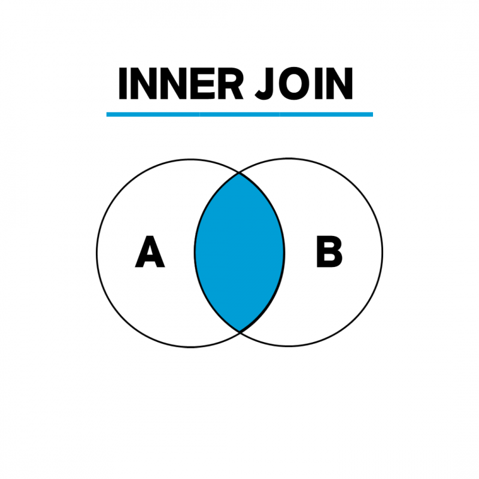
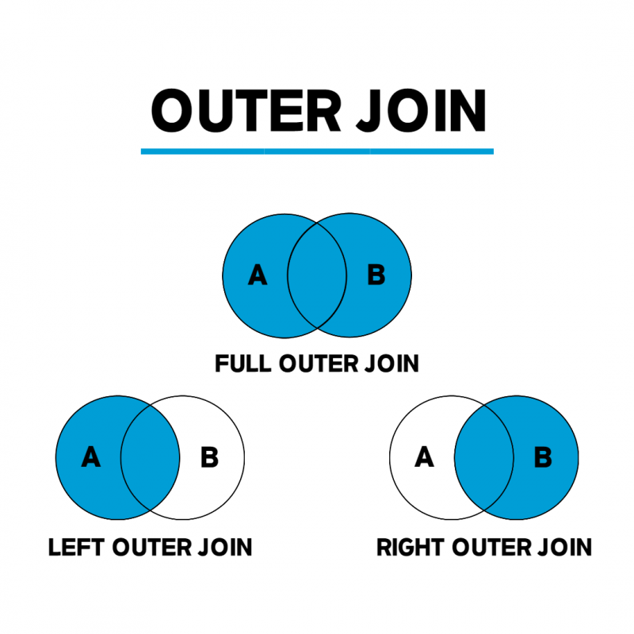

## SQL이란

SQL(Structured Query Language)란 데이터베이스에서  
데이터를 다루는데 사용하는 언어

> SQL vs C언어
>
> 목적  
> SQL: DB에서, 데이터를 조작하고 관리하기 위한 언어, DB와 상호작용하는데 사용 됨  
> C언어: 범용 프로그래밍 언어, 다양한 종류의 소프트웨어를 개발하기 위해 사용 됨
> 
> 사용 방식  
> SQL: 비절차적(선언형) 언어(어떤 결과를 얻을 것인지 정의)
> C언어: 절차적(명령형) 언어(명시적으로 어떻게 작업을 수행할 것인지 제어)

---

## SQL의 실행 과정

SQL 작성 - 구문 분석 - 최적화(실행 계획 생성) - 데이터 액세스 & 결과 반환

> 구문 분석(Parsing)
> 
> DBMS가 작성한 SQL을 문법적으로 검사한다.  
> (문장의 구조를 파악, 각 요소가 올바르게 배치되었는지 확인)

> 최적화(Optimization)
> 
> DBMS는 인덱스, 조인 순서 등을 고려하여 실행 계획 생성

---

## SQL의 종류

SQL은 기능에 따라 DDL, DML, DCL로 나눈다.

### DDL(Data Definition Language)

데이터 정의어, 테이블의 구조를 생성, 변경, 삭제 

CREATE, ALTER, DROP, TRUNCATE 등이 있다.

CREATE: 테이블 생성  
ALTER: 테이블 수정  
DROP: 테이블 삭제  
TRUNCATE: 테이블 초기화

> DROP은 테이블 자체를 삭제하고,  
> TRUNCATE는 테이블은 남아있지만, 테이블에 저장되있던 데이터가 모두 삭제된다.

> DDL은 오토 커밋(롤백 불가)

### DML(Data management Language)

데이터 조작어, 테이블의 데이터를 생성, 조회, 수정, 제거

INSERT, SELECT, UPDATE, DELETE가 있다.

INSERT: 테이블에 데이터 삽입  
SELECT: 데이터를 조회  
UPDATE: 데이터를 변경  
DELETE: 데이터를 삭제

> 만약 모든 데이터를 삭제해야 한다면 DELETE보다, TRUNCATE가 더 빠르다.  
> (TRUNCATE 사용할 때는 롤백 불가 주의)

> DML은 롤백 가능

### DCL(Data Control Language)

데이터베이스에 접근하고 데이터들을 사용하도록 권한을 주고 회수하는 명령어

GRANT, REVOKE가 있다.

GRANT: 액세스 권한 부여  
REVOKE: 액세스 권한 철회

---

## 참조 무결성과 CASCADE

참조 무결성: 외래키는 참조할 수 없는 값을 가질 수 없다는 규칙

그런데 만약 참조 키가 참조하고 있는 컬럼의 값이 바뀌거나 삭제 된다면?    
-> 해당 컬럼를 참조하고 있는 참조키의 값을 전부 업데이트 해줘야 한다.

이떄 CASCADE를 사용한다.

### CASCADE

cascade 옵션을 사용하면,  
특정 컬럼의 값을 삭제하거나 변경했을 때,  
해당 컬럼을 참조하고 있는 컬럼들도 자동으로 삭제/변경 되게 한다.

> cascade 옵션을 사용하여, 참조 무결성을 준수할 수 있게 된다.

```
create table course(
    course
    dept_name varchar(20) 
    foreign key (dept_name) references department
    on delete cascade // 자동 삭제
    on update cascade // 자동 변경
    . . .)    
```

course 테이블에서 참조하고 있는 department 테이블의 PK 값이 변경되거나 삭제되면,  
course 테이블에서 이를 참조하고 있는 튜플들의 값도 변경된다.

> 외래키를 생성할 때, 무조건 테이블의 PK만 참조할 수 있는 것이 아니라,  
> 유니크 제약조건이 걸려 있는 속성도 참조할 수 있다.

---

## VIEW

뷰(VIEW)란, 다른 테이블로 만들어진 가상 테이블을 말한다.

> 뷰는 실제 테이블처럼, 행과 열을 가지고 있지만, 실제로 데이터를 저장하고 있지 않는다.  
> (특정 데이터를 보여주는 역할만 수행)
> 
> 여러 테이블을 번거롭게 들러서 확인을 해야 할 때 혹은  
> SELECT 문을 겹겹이 사용해서 어려운 쿼리문으로 조회를 수행해야 할 때  
> 이러한 번거로움을 줄여주는 것이 바로 뷰이다.

### 뷰의 장점/단점

장점
1. 특정 사용자에게 테이블 전체가 아닌 필요한 필드만 보여줄 수 있음(보안 관리)
2. 쿼리문을 쉽게 작성할 수 있음

단점
1. 한 번 정의된 뷰는 변경이 불가능
2. 삽입, 삭제, 변경 작업에 따른 오버헤드 발생 가능  
(테이블을 업데이트 하면 뷰도 업데이트 될 수 있음)
3. 뷰는 자신만의 인덱스를 가질 수 없음

---

## SELECT

데이터베이스에서 데이터를 조회하기 위한 쿼리문

> SQL 중에 가장 많이 사용되는 명령어가 SELECT이기 때문에,  
> 따로 카테고리를 나눠서 설명한다.

### SELECT 명령어의 처리순서

```sql
select [distinct] '필드이름1', '필드이름2', ...
from '테이블이름1'
[join | left join | right join | ...] '테이블이름2' on ...
where ,,,
group by ,,,
having ...
order by ...
limit ... offset ... ;
```

FROM 절 & JOIN 조건 - WHERE 절 - GROUP BY 절 - HAVING 절 - Window function - SELECT 절 - DISTINCT 절 - ORDER BY 절 - LIMIT/OFFSET 절

> ORDER BY절은 SELECT절 다음으로 처리되기 때문에,  
> SELECT절에 alias가 있다면(대부분 집계함수),  
> ORDER BY절에서 alias를 사용할 수 있다.
> 
> 하지만 WHERE절과 GROUP BY절은 SELECT절보다 먼저 처리되기 때문에,  
> alias를 사용할 수 없다.

---

### DISTINCT

select 결과에 중복 튜플을 제거한다.

예시  
(distinct 없을 때 결과)

|name|
|--|
|han1|
|han1|
|han2|

(distinct 추가 했을 때 결과)

|name|
|--|
|han1|
|han2|


---

### GROUP BY

데이터를 그룹으로 묶는다.  
(대부분 집계함수와 같이 사용한다 - AVG, COUNT, MIN, MAX, SUM)

> 그룹으로 묶는다.  
> == GROUP BY로 지정된 컬럼에서 동일한 값을 가진 튜플을 하나의 그룹으로 묶어준다.

```select ... from ... group by '컬럼명1', '컬럼명2', ...```

### ORDER BY

데이터를 정렬시킨다.

```select ... from ... order by '컬렴명1' [asc | desc], '컬럼명2' [asc | desc], ...```

조회 결과를  
'컬럼명1'을 기준으로 오름차순/내림차순 으로 정렬,  
'컬럼명2'을 기준으로 오름차순/내림차순 정렬

> asc(오름차순 정렬)는 order by 절의 default(굳이 안써도 됨)  
> 내림차순 정렬하려면 desc 추가해줘야 함

---

## JOIN

여러 개의 테이블을 연결한다.

> 테이블을 연결할 때 조건은 on 절을 많이 사용

연결해주는 방식에 따라 inner join과 outer join으로 나뉜다  
(그 외 cross join과 self join도 있다)

### inner join



inner join은 두 테이블 간의 일치하는 튜플만 반환한다.

> 그냥 join이라고만 써도 inner join으로 실행된다.

### outer join



outer join은 두 테이블 간의 일치하지 않는 행도 반환한다.

여기서 반환하는 방식도 3가지로 나뉜다.

> 3가지 조인 모두 outer 쓰지 않고 실행 가능  
> (left join, right join, full join)

1. `Left Outer Join`  
   왼쪽 테이블의 모든 행을 포함하며,  
   오른쪽 테이블과 일치하는 행이 있으면 해당 행을 반환하고,  
   일치하지 않으면 NULL 값을 채워 반환한다.

2. `Right Outer Join`  
   오른쪽 테이블의 모든 행을 포함하며,   
   왼쪽 테이블과 일치하는 행이 있으면 해당 행을 반환하고,   
   일치하지 않으면 NULL 값을 채워 반환한다.

3. `Full Outer Join`:  
   양쪽 테이블 중 어느 한쪽에라도 일치하는 행이 있으면 해당 행을 반환하며,  
   양쪽 테이블에 모두 일치하지 않는 행은 NULL 값을 채워 반환한다.


### cross join

두 테이블 간에 가능한 모든 조합을 만들어내는 조인 유형으로,  
첫 번째 테이블의 각 행을 두 번째 테이블의 모든 행과 결합한다.

결과는 첫 번째 테이블의 행 수와 두 번째 테이블의 행 수의 곱만큼의 행을 가지게 된다

### self join

하나의 테이블 내에서 자기 자신과 조인하는 것을 의미한다.  

> 테이블 내의 다른 행들 간에 관계를 파악하거나 비교할 때 유용하다.

---

## 서브 쿼리

하나의 SQL 문에 포함되어 있는 또 다른 SQL 문

서브 쿼리는 괄호 () 안에서 사용한다.

### 서브 쿼리 실행순서

서브 쿼리 실행 -> 메인 쿼리 실행

### 서브 쿼리 분류
위치에 따라서 다르게 불린다.

```sql
SELECT col1, (SELECT ...) // 스칼라 서브 쿼리(Scalar Sub Query): 하나의 컬럼처럼 사용 (표현 용도)
FROM (SELECT ...)         // 인라인 뷰(Inline View): 하나의 테이블처럼 사용 (테이블 대체 용도)
WHERE col = (SELECT ...)  // 중첩 서브 쿼리: 서브쿼리의 결과에 따라 달라지는 조건절(=, in, any, ...)
```

`1. 스칼라 서브 쿼리`

하나의 튜플만 조회 가능하다.  
테이블에서 값을 가져올 때 사용한다.

`2. 인라인 뷰`

> FROM 절에 사용되는 서브 쿼리(인라인 뷰)는 반드시 as 명칭을 지정해줘야 한다.

`3. 중첩 서브 쿼리`

어떤 조건 문을 사용하냐에 따라서 서브쿼리의 결과가 바뀐다.

단일 행(=, >, ...) - 서브 쿼리의 결과 값이 하나여야 한다.  
복수 행(any, in, ...) - 서브 쿼리의 결과 값이 하나 이상일 수 있다.

### 서브 쿼리 주의사항

1. 서브 쿼리에서는 ORDER BY를 사용하지 못한다.
2. 서브 쿼리에서, 메인 쿼리의 컬럼을 사용할 수 있지만, 메인 쿼리에서는 서브 쿼리의 컬럼을 사용할 수 없다.

---

### SELECT ~ FOR UPDATE

선택된 행을 업데이트 하기 위해 잠그는 데 사용된다.

-> 잠긴 트랜잭션이 완료될 때까지 다른 트랜잭션에서는 해당 행을 수정할 수 없다.   
-> 동시 환경에서의 데이터 일관성을 제어하고 보장하기 위한 메커니즘이다.

---

## SQL Injection

응용 프로그램 보안 상의 허점을 이용해, 악의적인 SQL문을 실행되게 함으로써, 데이터베이스를 비정상적으로 조작하는 공격 기법

예시  
```sql = "SELECT * FROM users WHERE name = '" + name + "'";```

### 예방 방법

1. 위 예시처럼 문자열 연결을 사용하지 않고, 파라미터화 된 쿼리를 사용
2. SQL에서 특별한 의미를 가진 문자들이 입력되면 차단

---

## SQL 안티 패턴 예시

```select * ...``` 사용  
모든 컬럼을 선택하는 것은 필요하지 않은 데이터를 불러오게 되어 메모리 사용량을 높일 수 있다.  
-> 필요한 컬럼을 명시적으로 선택하자

비효율적인 ORDER BY 사용  
ORDER BY 절은 정렬 작업을 수행하므로, 비효율적으로 사용할 경우 성능 저하가 발생할 수 있다.  
-> 정렬이 필요없는 경우 ORDER BY를 생략하자

문자열 연결로 동적 쿼리 생성  
SQL 인젝션 공격에 취약  
-> 문자열 연결 대신 파라미터화 된 쿼리 등을 사용하자

---

### 더 알아볼 것들

1. distinct는 내부적으로 어떻게 처리될까
2. where 안에 조건들이 어떻게 처리되는지(& 어떻게 최적화 할 수 있을지)
3. 조인 - 조인 수행 원리 등등
4. 서브쿼리가 실행되는 순서(무슨 구문에 있냐, 메인쿼리 컬럼 사용하냐에 따라서 실행순서가 바뀌는지)