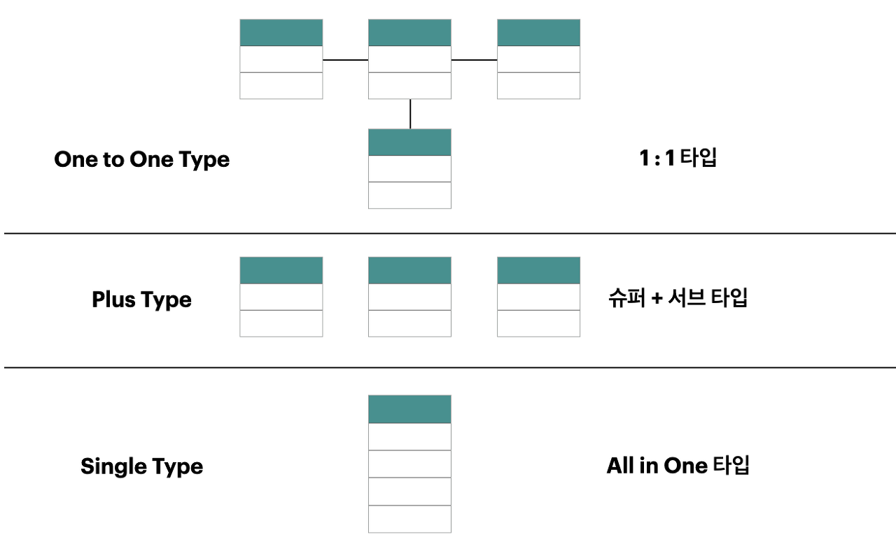

### `슈퍼타입과 서브타입`

슈퍼타입: 여러 엔티티가 공유하는 일반적인 카테고리 또는 공통 속성

서브타입: 슈퍼타입을 제외한 고유한 추가 속성

`슈퍼/서브타입 데이터 모델의 변환타입 비교`

|구분|OneToOne Type|Plus Type|Single Type|
|--|--|--|--|
|의미|각각의 테이블을 개별적으로 유지|서브타입별로 슈퍼타입 추가|모든 필드를 한 테이블에 추가|
|특징|개별 테이블 유지|슈퍼+서브타입 테이블|하나의 테이블|
|확장성|우수함|보통|나쁨|
|조인성능|나쁨|나쁨|우수함|
|I/O량 성능|좋음|좋음|나쁨|
|관리용이성|좋지않음|좋지않음|좋음(1개)|
|트랜잭션 유형에 따른 선택방법|개별 테이블로 접근이 많은 경우 선택|슈퍼+서브 형식으로 데이터를 처리하는 경우 선택|전체를 일괄적으로 처리하는 경우 선택|

---

#### `반정규화(Denormalization)`

시스템의 성능 향상, 개발 및 운영의 편의성 등을 위해 정규화된 데이터 모델을 통합, 중복, 분리하는 과정으로 의도적으로 정규화 원칙을 위배하는 행위

반정규화를 수행하면 시스템의 성능이 향상되고 관리 효율성을 증가시키지만 데이터의 일관성 및 정합성이 저하될 수 있다.

`반정규화의 대상` 
- 디스크 I/O량이 많아 성능저하
- 경로가 너무 멀어 조인으로 성능저하
- 컬럼을 계산하여 읽을 때 성능 저하

> 반정규화를 위해서는 사전에 데이터의 일관성과 무결성을 우선으로 할지, DB의 성능과 단순화를 우선으로 할지를 결정해야 함

`반정규화 방법`

테이블 병합, 테이블 분할, 중복 테이블 추가, 중복 속성 추가 등이 있다.

|기법분류|기법|내용|
|--|--|--|
|테이블 병합|1:1 관계|1:1 관계를 통합하여 성능향상|
|--|1:M 관계|1:M 관계를 통합하여 성능향상|
|--|슈퍼/서브타입|슈퍼/서브 관계를 통합하여 성능 향상|
|테이블 분할|수직분할|컬럼 단위의 테이블을 디스크 I/O를 분산처리하기 위해 테이블을 1:1로 분리하여 성능향상(트랜잭션의 처리되는 유형파악이 선행되어야 함)|
|--|수평분할|행(레코드)단위로 집중 발생되는 트랜잭션을 분석하여 디스크 I/O 및 데이터 접근의 효율성을 높여 성능을 향상하기 위해 행 단위로 테이블을 쪼갬|
|테이블 추가|중복테이블 추가|다른 업무이거나 서버가 다른 경우 동일한 테이블 구조를 중복하여 원격 조인을 제거하고 성능을 향상|
|--|통계테이블 추가|SUM, AVG 등을 미리 수행하여 계산해 둠으로써 조회 시 성능을 향상|
|--|이력테이블 추가|이력테이블 중에서 마스터 테이블에 존재하는 레코드를 중복하여 이력 테이블에 존재하는 방법|

---

# 데이터베이스 모델링

## 데이터 모델링의 정의
- 고객과 함께 고객의 업무 프로세스를 이해해야 데이터 모델링을 제대로 할 수 있다.
- 현실 세계를 데이터베이스에서 표현하기 위한 추상화 과정
- 데이터 모델링 표기법을 사용해서 모델링한다.
- 고객의 업무 프로세스내 비즈니스 프로세스 규칙을 정의하여 데이터 모델로 표현 할 수 있어야 한다.
- 고객이 이해하기 쉽게 간결하게 모델링 해야 한다.

## 데이터 모델링의 특징
|||
|--|--|
|추상화 Abstraction|현실 세계를 일정한 양식(표기법)에 맞게 간략하게 표현한다.|
|단순화 Simplification|누구나 이해하기 쉽도록 약속된 규약에 의해 제한된 표기법 또는 언어를 이용하여 표기한다.|
|명확화 Clarity|명확하게 의미가 한가지로 해석되어야 함으로 애매모호함을 제거하고 정확하게 현상을 기술한다.|

## 대이터 모델링의 단계 - 개논물
1. 개념적 모델링 - 추상화수준 가장낮음, 업부측면의 모델링, 전시적이고 포괄적인 모델링, 핵심 엔티티 도출, ERD 작성
2. 논리적 모델링 - 특정 DB 모델에 종속된다. 세부속성, 식별자, 관계등을 정확하게 표현, 데이터 정규화 완료, 재사용성이 높음
3. 물리적 모델링 - 물리적인 성능과 데이터, 저장을 고려한 설계, 가장 구체적인 데이터 모델링, 추상화 수준이 가장 낮은 단계, 성능, 보안, 가용성을 고려한 DB 모델링

## 데이터 모델링의 3가지 관점
데이터 관점 -  데이터와 업무 간의 어떤 관련이 있는지, 데이터와 데이터 사이의 관계가 무엇인지에 따라 모델링을 한다. 비즈니스 프로세스 에서 사용되는 데이터를 의미한다.
- 구조 분석, 정적 분석

프로세스 관점 - 실제 하는 업무에 따라 무엇을 어떻게 하는지 모델링한다. 비즈니스 프로세스에서 수행하는 작업을 의미한다.
- 시나리오 분석, 도메인 분석, 동적 분석

데이터와 프로세스의 상관 관점 - 업무의 처리(프로세스)와 데이터 간의 서로 어떤 영향을 주고받는지를 모델링한다.
- CRUD

## 데이터 모델링을 위한 ERD(Entity Relationship Diagram)
대표적인 표기법 - Chen, UML, IE, Barker
작성하는 순서
1. 엔티티 도출
2. 엔티티 배치
3. 엔티티 관계 설정
4. 관계명 기술
5. 관계 참여도 기술
6. 관계 필수 여부 기술

## 3단계 구조 스키마
데이터베이스의 독립성을 위해서 존재

사용자(외부 스키마), 설계자(내부 스키마), 개발자(개념 스키마)의 각기 관점에 따라 DB를 기술하고 이들관의 관계를 표준으로 정했다.

데이터의 독립성 확보를 통해서 데이터 복잡도 감소, 데이터 중복 뺴고, 요구사항 변경에 따른 대응력 향상 관리 및 유지보수 비용 절감등의 장점이 생긴다.

각계층을 뷰라고 부르면 서로 독립성을 확보한다.

## DB 3단계 구조 특징
|||
|--|--|
|외부스키마|데이터베이스의 개별 사용자 관점의 이해와 표현, 응용프로그램이 접근하는 데이터베이스, 여러개의 외부 스키마 존재|
|개념 스키마|관리자의 관점, 전체적인 논리구조, 일반적으로 스키마는 개념스키마를 지정함|
|내부 스키마|시스템 설계자의 관점, 실제로 물리적으로 어떻게 저장되는지 확인|

## 엔티티(Entity)
데이터의 집합

저장되며 관리되는 데이터

개념, 사건, 장소등의 명사

유형과 무형에 따른 분류
||예시|
|--|--|
|유형 엔티티| 사원,제품,교수 등 - 물리적, 안정적|
|개념 엔티티| 강의, 금융상품, 부서 등 - 물리적x 개념적o|
|사건 엔티티| 구매, 판매, 영업, 수납 등 - 비즈니스 프로세스|

발생 시점에 따른 엔티티 분류
||예시|
|--|--|
|기본 엔티티|고객, 부서, 판매제품 - 키엔티티, 독립적|
|중심 엔티티|계좌, 주문, 수납 - 기본엔티티로부터 발행되는 행위엔티티를 생성하는 중간 엔티티|
|행위 엔티티|주문이력, 접속이력 - 위 2개로부터 발생되는 엔티티|

## 속성(Attribute)
엔티티가 가지는 항목

속성은 더 이상 분리되지 않는다.

업무에 필요한 데이터를 저장한다.

속성의 특징
1. 업무에서 관리되는 정보
2. 하나의 값만 가진다
3. 주식별자에게 함수적으로 종속됨. 기본키에따라 속성값도 변경될수있음

특성에 따른 속성의 종류
|||
|--|--|
|기본속성|이름, ID, 전화번호 - 본래의 속성|
|설계속성|상품코드, 지점코드 - 데이터 모델링과정에서 발생되는 속성|
|파생속성|합계, 평균 - 다른 속성에 의해 만들어지는 속성|

---

식별관계? 

|식별자 분류|식별자|설명|
|--|--|--|
|대표성여부||주식별자|- 엔터티 내에서 각 행을 구분할 수 있는 구분자이며, 타 엔터티와 참조관계를 연결할 수 있는 식별자 (ex. 사원번호, 고객번호)|
|--|보조식별자|- 엔터티 내에서 각 행을 구분할 수 있는 구분자이나 대표성을 가지지 못해 참조관계 연결을 못함(ex. 주민등록번호)|
|스스로 생성여부|내부식별자|- 엔터티 내부에서 스스로 만들어지는 식별자(ex. 고객번호)|
|--|외부식별자|- 타 엔터티와의 관계를 통해 타 엔터티로부터 받아오는 식별자(ex. 주문엔터티의 고객번호)|
|속성의 수|단일식별자|- 하나의 속성으로 구성된 식별자(ex. 고객엔터티의 고객번호 )|
|--|복합식별자|- 둘 이상의 속성으로 구성된 식별자(ex. 주문상세엔터티의 주문번호+상세순번)|
|대체여부|본질식별자|- 업무(비즈니스)에 의해 만들어지는 식별자(ex. 고객번호)|
|--|인조식별자|- 업무적으로 만들어지지는 않지만 원조식별자가 복잡한 구성을 가지고 있기 때문에 인위적으로 만든 식별자(ex. 주문엔터티의 주문번호(고객번호+주문번호+순번))|

---

# SQL

RANK() - 중복값은 중복등수, 등수 건너뜀
DENSE_RANK() - 중복값은 중복등수, 등수 안 건너뜀
ROW_NUMBER() - 중복값이 있어도 고유 등수 부여

START WITH
CONNECT BY

오라클이 지원하느 질의 방법으로 계층형 구조를 탐색할 수 있다.

순위함수 사용시 ORDER BY를 입력해야 한다.

 ORDER SIBLINGS BY 를 수행하면 전체 테이블이 아니라 계층형으로 된 데이터값(특정 칼럼) 기준으로 정렬된다

|구분|설명|
|--|--|
|ROLLUP|- 전체합계와 소그룹 간의 소계를 계산하는 ROLLUP 함수|
|--|예) GROUP BY ROLLUP (DEPTNO); → DEPTNO 합계(소계), 전체 합계를 조회|
|CUBE|- CUBE는 제시한 칼럼에 대해서 결합 가능한 모든 집계를 계산한다.|
|--|- 다차원 집계를 제공하여 다양하게 데이터를 분석할 수 있다.|
|--|예) GROUP BY CUBE(DEPTNO, JOB); → DEPTNO 합계, JOB 합계, DEPTNO & JOB 합계, 전체 합계를 조회, 조합할 수 있는 모든 경우의 수가 조합된다. *시스템에 부하를 많이 주는 단점이 있음|
|GROUPING SET|- 원하는 부분의 소계만 손쉽게 추출하여 계산할 수 있는 GROUPING SETS 함수|

### 인덱스 생성
UNIQUE SCAN : 유일한 값 하나 찾기 (예: 고객아이디) *한개의 행

RANGE SCAN : 어떠한 조건에서 한 범위를 찾기 (예:주문번호)

FULL SCAN : 전체 데이터 *전체 행

---

문자형과 숫자형을 비교 시 문자형을 숫자형으로 묵시적 변환하여 비교한다.

CHAR는 길이가 서로 다르면 짧은 쪽에 스페이스를 추가하여 같은 값으로 판단한다. 같은 값에서 길이만 서로 다를 경우 다른 값으로 판단하는 것은 VARCHAR(가변길이 문자형 : 입력한 크기만큼 할당 )로 비교하는 경우이다

---

메인쿼리의 값을 서브쿼리에서 주입을 받아서 비교를 하는것으로 상호연관 서브쿼리(CORRELATED SUB QUERY) 이다.

---

칼럼의 변경은 ALTER TABLE ~ MODIFY 문을 사용하면 된다. 칼럼은 데이터 타입 및 길이를 변경 할 수 있다.

추가(ADD), 삭제(DROP)

---

서브쿼리에 있는 칼럼을 자유롭게 사용할수 없다

---

(오라클 DB에서)
오늘 날짜를 구하기 위해서 SYSDATE+1을 해주면된다. 단, 데이트 타입을 문자열 TO_CHAR 로 변환해주어야 한다.

---

ROLE은 데이터베이스에서 OBJECT(테이블, 프로시저, 뷰) 등의 권한을 묶어서 관리할 수 있다.

GRANT(권한부여), REVOKE(권한회수)

---

### SELECT의 논리적인 수행 순서

FROM - WHERE - GROUP BY - HAVING - SELECT - ORDER BY

---

## 조인 수행 원리
 
조인이란 두 개 이상의 테이블을 하나의 집합으로 만드는 연산이다.

FROM 절에 세 개의 테이블이 존재하더라도 세 개의 테이블이 동시에 조인이 수행되는 것은 아니다. 
세 개의 테이블 중에서 먼저 두 개의 테이블에 대해 조인이 수행된다. 그리고 먼저 수행된 조인 결과와 나머지 테이블 사이에서 조인이 수행된다. 

### 1. Nested Loop Join

중첩for문 방식

inner table에 인덱스가 걸려있지 않으면 굉장히 비효율적
> outer table에서 한건한건 조회할때마다 inner table을 full scan해야 하기 떄문

대량의 테이블을 조인하는 방식으로 적절하지 않다

크기가 작은 테이블이 outer table이 되야 성능에 유리하다
> 1:n이라면 1이 outer table로

### 2. Sort Merge Join

NL join에서 두 테이블을 우선 조인컬럼을 기준으로 정렬을 진행하고 조인을 진행한다.

> inner table에 적절한 인덱스가 없어서 NL join을 쓰기에 너무 비효율적일때 사용한다.

equal join이 아니라 범위로 join을 할때 적절한 수행 원리라고 할 수 있다.

table random access가 일어나지 않고 sorting 작업이 PGA영역에서 수행되기 떄문에

경합이 발생하지 않아 성능에 유리한 이점이 있다.

### 3. Hash Join

배치에서 쓰기 좋은 수행원리

대용량 테이블을 조인할떄 쓰기 좋은 조인

PGA영역에 해시 영역을 생성

첫번째 테이블을 해시 테이블에 넣는다.

그리고 두번쨰 테이블이 읽히면서 조인이 되는 원리

해쉬 영역에 올라갈때 JoinColumn을 기준으로 hash function이 적용되기 때문에

key 컬럼에 중복값이 없을수록 성능에 유리하다

> equal join만 가능하다. 범위 조인 x

> sort merge join처럼 random access 부하가 없다.

> 유의할점
>
> 해시영역에 들어가는 테이블의 크기가 충분히 작아야 성능에 유리하다.
>
> 너무 커지면 디스크 영역을 사용하게 되어 성능이 안좋아진다.

수행빈도가 높은 OLTP 환경에서 이 조인을 사용하게 되면 
오히려 CPU나 메모리의 사용량이 늘어서 성능이 안좋아질수있다.

