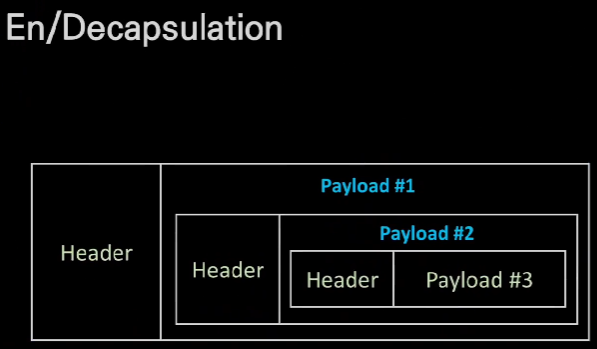

L3

하드웨어 수준은 이더넷

ip주소는 network id와 host id로 나뉜다.

---

L3 Packet

Packet이라는 말은 L3 IP Packet이다?

패킷 - 단위 데이터

Header와 Payload로 나뉜다.

최대 크기는 MTU(Maximum Transmission Unit) - 1500Byte

헤더 - 출발지/목적지 정보
페이로드 - 헤더가 실어 나르는 대상(택배내용)

와이어샤크를 통해 패킷을 볼 수 있다. (패킷 analyzer/sniffer)

---

Encapsulation - 단위화?

헤더를 지우는 과정 - decapsulation

---

패킷의 생성, 전달, 소멸

