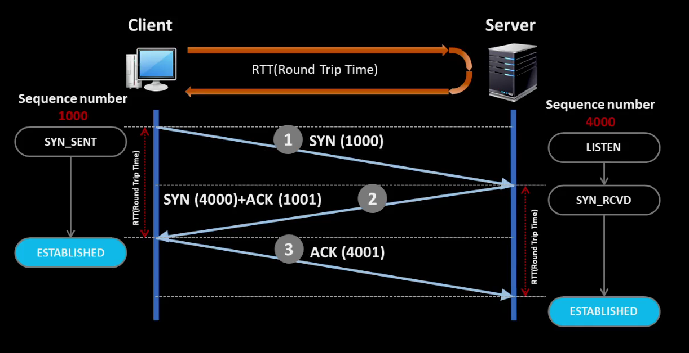
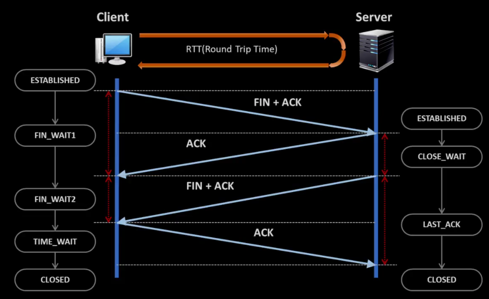
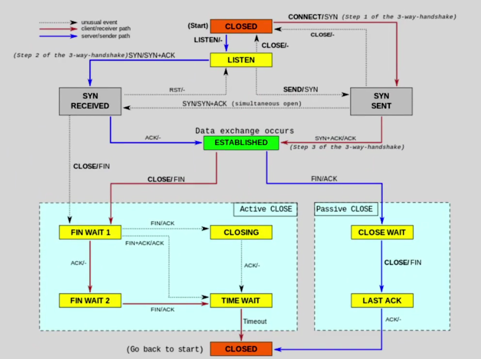

### Transport Layer

애플리케이션 간의 통신 담당

목적지 애플리케이션으로 데이터 전송

안정적이고 신뢰할 수 있는 데이터 전송 보장(TCP)  
필수 기능만 제공(UDP)

---

TCP 연결은 논리적

TCP에만 연결(Connection, Session)이라는 개념이 있다.

연결은 결과적으로 순서번호로 구현된다.

연결은 상태(전이) 개념을 동반한다.

---

### TCP 연결 과정 - 3 way handshaking

연결과정에서 오가는 segment는, payload가 없다.  
(IP header + TCP header)

TCP 연결 과정에서 - Sequence 번호를 교환한다. + 정책 교환(MSS)

> MSS를 교환함으로써 MTU를 설정한다.

> 실제 전선을 연결하는게 아니라, 논리적인 연결

---

### TCP 연결 종료 과정 - 4 way handshaking

(연결 시작/종료 모두 클라이언트가 한다)

---

### TCP (연결) 상태 변화

---

### TCP 연결이라는 착각

> 파일 다운로드 중 LAN 케이블을 분리했다가 다시 연결하면  
> TCP 연결은 어떻게 될까?
> 
> -> TCP 연결은 일정 시간동안 유지된다.

재전송 타이머의 기본 근사 값은 대략 3초이다.  
(대부분의 OS는 1초이내)

재전송 타이머 만료 이후에도 확인 응답을 받지 못한 경우 세그먼트를 재전송하고  
RTO(Retransmission Time-Out) 값은 두배 증가한다.  
(5회 재전송 모두 실패하면 전송 오류가 발생)

> TCP 연결이 사실은 Ent-Point의 주관적 착각에 불과하다

---

// TODO

흐름제어, 혼잡제어