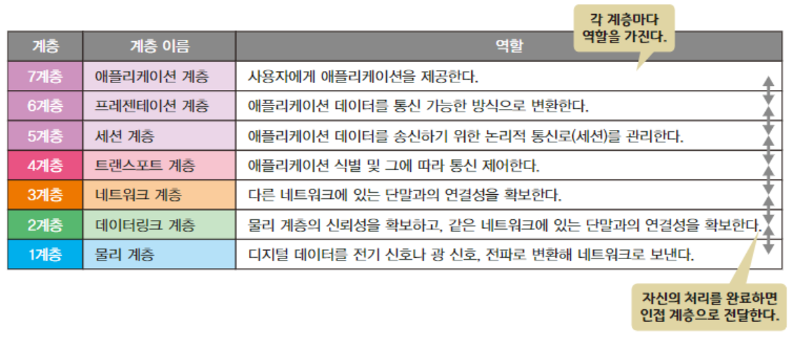

네트워크 세계에서는 패킷을 처리하기 위한 규칙이 존재한다.  
-> 프로토콜(protocol)

프로토콜은 계층으로 정리한다.

### 두가지 계층 구조 모델

OSI 7 Layer, TCP/IP Layer

---

### 계층별 데이터 단위

L2(Data Link Layer)에서 데이터 단위 - Frame

L3(Network Layer)에서 데이터 단위 - Packet  
(MTU(Maximum Transmission Unit) - 1500 Bytes)

L4에서, TCP에서 데이터 단위 - Segment  
(MSS(Max Segment Size))

> UDP는 Datagram

소켓 수준(유저 모드)에서 데이터 단위 - Stream  
(단위라기 보다는, 그냥 데이터 덩어리를 스트림이라 한다)  
ex) 스트리밍 서비스

스트림의 특징 - 시작은 있지만, 끝은 알 수 없다 - 연속적으로 이어진 큰 데이터

스트림 전체 데이터 - 4MB 일때
세그먼트로 넘어가려면 스트림을 잘라야 한다. -> Segmentation

---

### Encapsulation & Decapsulation

아래 계층으로 내려가면서,  
기존 데이터에 헤더를 추가하는 처리  
-> Encapsulation

위 계층으로 올라가면서,  
각 계층의 헤더를 제거하는 과정  
-> Decapsulation

---

### 각 계층의 대표 프로토콜

Physical Layer & Data Link Layer = 이더넷(IEEE802.3 - 유선 환경), IEEE802.11(무선 환경)  
Network Layer = IP(Internet Protocol)  
Transport Layer = TCP, UDP  
Application Layer = HTTP, HTTPS, DNS, ...

