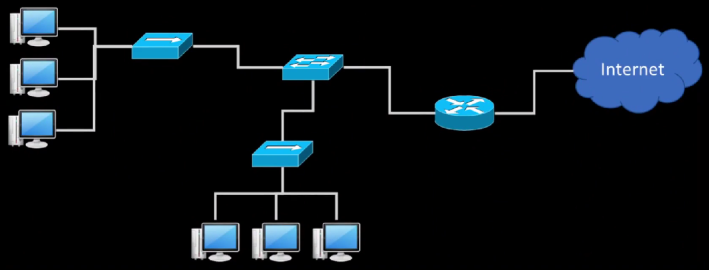

> OSI 7 Layer에서  
> L1, L2은 H/W, 그 위는 S/W다.  
> 하드웨어는 Physical, 소프트웨어는 Logical (== Virtual)  
> L2까지는 물리적인 걸로 설명한다.(전기신호 - 눈에 보이는 것들)  
> logical은 실체가 없다
> 
> 이걸 바탕으로 공부하자

---

### LAN(Local Area Network)

네트워크의 규모

WAN(Wide Area) > MAN > LAN(Local Area)

LAN의 예시  
공유기 + PC + 스마트폰 + IPTV 등 = 하나의 LAN

NIC(Network Inteface Card)는 H/W이고, MAC(Media Access Control) 주소를 갖는다.

컴퓨터한대가 LAN 카드를 여러 개 가질 수도 있다.  
-> MAC 주소를 여러개 가질 수도 있다.

LAN 카드 예시  

L2 수준의 단위? - 네트워크에서 유통되는 데이터 단위 -> 프레임(Frame)

요즘 유선 랜카드 전송속도 = 1 Gbps

---

### L2 access switch
end-point와 직접 연결되는 스위치  
(MAC 주소를 근거로 스위칭)

### L2 distribution switch  
L2 Access Switch를 위한 스위치  
VLAN(Virtual LAN) 기능을 제공

> 사무실에 방이 여러 개 있다.  
> 방마다 L2 Access Switch가 있다고 생각  
> L2 distribution switch는 한 층마다 있다고 생각  
> (라우터는 건물 하나마다 있다고 생각)
> 
> (대략)

---

### Broadcast

꼭 필요할 때만 써야하는 제한적인 통신 방법

-> Broadcast 범위를 최소화해야 함
  
Broadcast 주소의 MAC 주소는 전부 1(FF-FF-...-FF-FF)

> 네트워크 개발 당시에는 AND 연산으로 값을 비교했다.  
> -> Broadcast 주소는 모든 것에 해당함

목적지 주소가 broadcast다 -> 전부다 받으라는 뜻