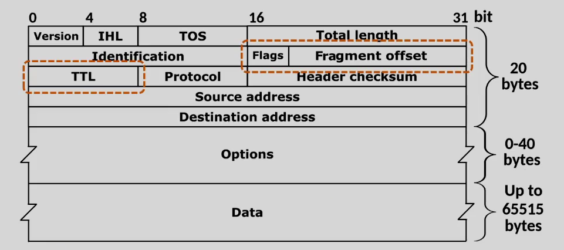
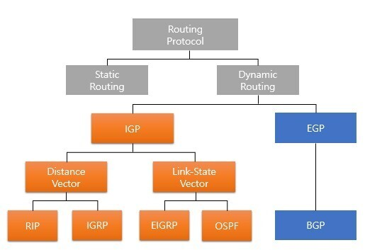

### Network Layer

호스트 간의 통신 담당(IP)  
목직지 호스트로 데이터 전송  
네트워크 간의 최적의 경로 탐색 역할

---

### IP(Internet Protocol) address

ip address란 기기가 네트워크 통신을 하기위해 사용되는 고유한 번호

> 가만히 있어도 ip는 바뀔 수 있다.

---

### Packet  
Network layer의 전송 단위  
Header와 Payload로 나뉜다.

최대 크기는 MTU(Maximum Transmission Unit) - 1500Byte

헤더 - 출발지/목적지 정보
페이로드 - 헤더가 실어 나르는 대상(택배내용)

와이어샤크를 통해 패킷을 볼 수 있다. (패킷 analyzer/sniffer)

---

### TCP/IP 송 & 수신 구조

소켓은 attach 된 메모리 공간, 버퍼가 있다 - Buffered I/O

> 버퍼 없이 직접 I/O하면 Non-buffered I/O

프로세스도 버퍼가 있다

버퍼에 있는 데이터 단위 - 스트림

서버에서 클라로 데이터 보내는 과정
1. 서버의 프로세스에서 디스크에 있는 데이터를 메모리(buffer)에 copy
2. 서버에서 클라로 데이터 send
3. 프로세스 버퍼에서 소켓 버퍼로 데이터를 copy
4. TCP layer(L4)에서 데이터 분해(segmentation)  
   각 데이터 단위 - segment
5. TCP -> IP - segment에 헤더 붙혀서 패킷 됨  
   IP -> L2 - packet에 헤더 붙혀서 frame 됨  
   (encapsulation)
6. Frame 단위 데이터가 이동
7. 클라에서 받은 패킷 decapsulation(헤더를 떼서 원본 데이터를 얻는다)
8. segment를 수신측 socket buffer에 담는다.  
   (ack # + window size 송신측에 보냄)
9. socket buffer의 데이터 애플리케이션 buffer로 copy

네트워크 장애 유형
1. Loss
2. re-transmission
3. ACK duplicaate
4. out of order - 중간 번호 패킷이 오지않고 다음 패킷이 온 경우
5. zero window(받는 end-point의 버퍼 사이즈가 부족한 경우)

대부분 1,2,3 모두 network 문제이지만  
4는 end-point 문제  
(2도 end-point 문제일 수 있음)

---

### IPv4 Header 형식

version - IPv4인지 v6인지  
IHL - header length(웬만하면 5)  
TOS - type of service
Total Length - 전체 패킷의 길이

단편화 관련 정보  
Identification, Flags, Fragment offset

TTL - time to live  
Protocol - L4의 프로토콜 정보  
Header checksum

source address  
destination address

---

### 서브네팅(subnetting)

IP 네트워크를 더 작은 여러 개의 네트워크로 분할하는 것

IP 주소를 네트워크 부분과 호스트 부분으로 나눈다.

이렇게 함으로써, 네트워크를 효율적으로 관리할 수 있게 한다.

> 대표적으로 브로드캐스트의 효율성이 증가한다.
> 
> 서브네팅을 통해 작은 네트워크를 분리함으로써,  
> 브로드캐스트의 대상을 좁힐 수 있다.

### 서브넷 마스크와 CIDR

서브넷 마스크를 기준으로 network id와 host id를 자른다.

> 지금은 컴퓨터 성능이 좋아져서 A,B,C class 개념을 잘 안쓴다 함

CIDR(Classless Inter-Domain Routing)  
192.168.0.10/24 - 왼쪽부터 24비트가 network id라는 뜻

---

Broadcast IP 주소 - host id 부분이 전부 다 1일 때

---

host 자신을 가리키는 IP 주소 - 127.0.0.1(Loopback address)

프로세스간 통신을 할 때도 구현함 - IPC(Inter-Process Comunication)

---

### TTL과 단편화

인터넷은 `라우터의 집합체`  
라고 할 수 있는  
논리 네트워크이다.

TTL(Time To Live)은 목적지에 도달하지 못한 패킷을 없애기 위한 장치

> 출발지와 목적지 사이 경로의 한 부분 - Hop
> 
> Hop count - 출발지와 목적지 사이에서 통과해야 하는 중간 장치들의 개수

Hop 지날때마다 TTL은 1 감소된다. & 0 되면 해당 패킷 버림

> 패킷이 목적지에 도달하지 못한다면, 그 패킷은 네트워크에 의미없는 트래픽만 주게 된다.  
> -> TTL을 이용해서 없애야 한다.

단편화는 MTU의 크기 차이로 인해 발생한다.

> MTU가 1500도 안되는 경우 - VPN(IPSec)

---

### 인터넷 설정 자동화를 위한 DHCP

인터넷 사용 전에 해야 할 설정
1. IP주소
2. Subnet mask
3. Gateway IP 주소
4. DNS 주소

위 설정을 자동으로 한다. -> DHCP를 활용한다.

DHCP(Dynamic Host Configuration Protocol) 체계는  
주소를 할당하는 서버와 할당 받으려는 클라이언트로 구성된다.

-> 내가 사용할 IP 주소를 서버가 알려준다.

> DHCP에서 부여하는 ip 주소는, 일반적으로 dynamic private IP 주소이다.

DHCP 서버를 찾는 브로드캐스트 패킷이 나간다  
-> 게이트웨이 전에 있는 end-point에 패킷이 도달한다.  
-> DHCP 서버는 응답 패킷(IP 주소 정보 있음)을 클라에 보낸다.

DHCP 서버는 브로드캐스트 도메인 안에 묶여있어야 한다.  
(게이트웨이를 넘어가면 안된다)

---

### ARP(Address Resolution Protocol) - 주소 결정 프로토콜

(여기서 address - IPv4, MAC)

ARP는 IP 주소를 이용해, MAC 주소를 알아낼 때 사용된다.

언제 사용되냐 - Gateway의 MAC 주소 <- 이걸 알아야 인터넷 가능

> PC가 네이버에 패킷 보낼때
>
> Frame 데이터의 정보  
> source address는 PC의 MAC 주소, IP 주소  
> destination address는 `Gateway의 MAC 주소`, 네이버의 IP 주소

> DHCP 서버는 게이트웨이의 MAC 주소까지 알려주진 않는다.  
> 이떄 ARP 요청을 보낸다.

### ARP 동작 원리

호스트가 네트워크 전체에 브로드캐스트를 한다.  
(게이트웨이의 IP 주소를 갖고 있는 호스트를 찾기 위하여)

게이트웨이에 해당하는 호스트가 브로드캐스트한 호스트에게 응답을 한다.  
(`유니캐스트`로 응답한다)

한 번의 ARP reply를 통해 해당 MAC 주소를 알게되면,  
이 MAC 주소를 메모리에 저장시킨다.  
(ARP 캐싱)

게이트웨이는 패킷의 목적지 ip 주소를 보고 패킷을 보낸다.

> LAN이란 브로드캐스트가 도달하는 범위

---

### Ping과 RTT

Ping은 네트워크의 상황을 알기 위한 도구  
(DoS 공격으로 악용되기도 한다)

Ping 유틸리티(그냥 프로그램)는 특정 Host에 대한 RTT(Round Trip Time)을 측정할 목적으로 사용된다.

> RTT(Round Trip Time): (왕복 시간)  
> 데이터 패킷이 대상으로 전송되는 데 걸리는 시간과  
> 해당 패킷에 대한 승인이 원본에서 다시 수신되는 데 걸리는 시간을 더한 것

ICMP(Internet Control Message Protocol)를 이용한다.

---

### public IP, private IP, static IP, dynamic IP
 
public IP 주소는 인터넷 서비스 공급자(ISP) 가 장치에 할당하며 공용 인터넷에서 장치를 식별하는 데 사용된다.  
private IP 주소는 가정 또는 사무실 네트워크와 같은 개인 네트워크 의 장치에 할당된다.

> public/private IP 주소는 목적에 따라 나뉜다.

> private IP가 공용 인터넷에 접속하려면 NAT or VPN이 필요하다.

static IP - 변경되지 않는 IP 주소, 서버같은 항상 같은 주소를 유지해야 하는 기기에 할당된다.  
dynamic IP - 변경 가능한 IP 주소, ISP는 일반적으로 사용자에게 동적 IP 주소를 할당함, 네트워크에 연결될 때마다 새로운 IP 주소 할당 됨

---

### NAT(Network Address Translation)

private IP 주소와 public IP 주소 간의 통신을 관리할 때 사용되는 기술

> NAT를 사용하는 이유  
> 사설 네트워크에 속한 여러 개의 호스트가 하나의 public IP 주소를 사용해 인터넷에 접속하기 위함
> (꼭 public IP 주소 <-> private IP 주소를 바꾸는 데에만 사용하는 것은 아님)

> private IP를 사용함으로써(NAT를 통해 네트워크 통신 함으로써)  
> 부족한 글로벌 IP 주소를 절약  
> & 내부 네트워크 관리의 용이성 향상  
> & 보안 향상

---

> 포트포워딩  
> 특정 IP 주소 & 포트 번호의 통신 요청을, 미리 설정해 둔 내부 단말기로 전송하는 기능

---

### 라우팅

패킷을 어디로 전송할지 결정하는 것  
패킷 수신자의 IP주소, 네트워크 홉 정보 등을 기반으로 이루어진다.

### 라우팅의 종류

정적 라우팅: 네트워크 관리자에 의해 라우팅 테이블이 유지/관리되는 기법
라우터끼리 라우팅 테이블을 교환하지 않고 라우팅이 이루어지기 때문에 보안과 대역폭에 장점이 있다.
하지만 경로에 문제가 생길 경우 대처하기 어렵다.

동적 라우팅: 네트워크의 변화에 따라서 라우팅 테이블을 관리하는 기법  
(라우팅 프로토콜에 따라서 최적의 경로를 선택한다)  
IGP와 EGP가 있다.

> 위 이미지에서는 정적 라우팅도 라우팅 프로토콜의 한 종류라고 표시했는데,  
> 대부분 동적 라우팅이 라우팅 프로토콜을 이용하는 기법이라고 설명하고 있다.

`IGP(Interior Gateway Protocol)`  
자치 시스템(AS - Autonomous System) 내에서 라우팅을 관리한다.  
RIP와 OSPF가 있다.

`EGP(Exterior Gateway Protocol)`  
AS 간 라우팅을 관리한다.  
BGP가 있다.

`RIP(Routing Information Protocol)`  
distance-vector 라우팅 기법  
주변 라우터로부터 주기적으로 라우팅 업데이트를 받아 최단 경로를 탐색한다.  
hop count를 기반으로 경로를 선택한다.  
(최대 15 hop count)

`OSPF(Open Shortest Path First)`  
네트워크의 토폴로지 정보를 기반으로 최적의 경로를 계산  
RIP와 달리 모든 라우터의 정보를 사용하여 최적의 경로를 탐색한다.

`BGP(Border Gateway Protocol)`
각 AS 경로의 정보와 속성을 사용하여 최적의 경로를 탐색한다.

