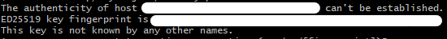

## SSH(Secure Shell)

TCP/IP 를 기반으로 동작하는 응용 계층 프로토콜

원격 시스템에 안전하게 접속하고 데이터를 안전하게 전송하기 위해 사용된다.

SSH는 데이터 전송을 암호화하여 중간에 누출되는 것을 방지한다.

> SSH는 비대칭키 방식을 이용해 인증을 한다.  
> 이때 대칭키를 주고받고,  
> 대칭키를 이용해 데이터를 암호화 해 주고받는다.

---

### 서버의 인증 과정

1. 클라가 서버에게 ssh 요청
2. 서버는 클라에게 자신(서버)의 공개키를 응답으로 준다.
3. 클라는 서버로부터 받은 공개키를 저장 & 난수값을 생성해서 (서버의) 공개키로 암호화하여 서버에게 전송
   (이떄 난수값의 해시값을 따로 저장해둔다 -> 나중에 확인하기 위함)
4. 서버는 자신(서버)의 개인키를 통해 클라로부터 받은 데이터를 복호화 & 난수값의 해시값을 클라에게 전송
5. 클라는 받은 해시값을 기존에 저장해둔 해시값과 비교함으로써, 서버를 인증

> 클라는 서버의 공개키를 .ssh/known_hosts 에 저장 해놓는다.

> 맨 처음 ssh 명령어를 통해 원격 서버에 접속을 요청하면, 아래와 같은 메시지가 뜬다.
>
> 
>
> 이는 해당 서버에 대한 요청의 응답으로 서버의 공개키를 받았는데,  
> 해당 공개키가 알 수 없는 공개키이기 때문이다.
> 
> (나중에 다시 요청한다면, 해당 서버의 공개키가 이미 저장되어 있기 떄문에, 위의 메시지는 뜨지 않는다)

---

### 클라이언트 인증 과정

원리는 서버의 인증 과정과 같다.
(역할만 반대로 바뀐다)

여기서 클라이언트의 개인키가 .pem 파일이다.

그리고 클라이언트의 공개키는 서버에 저장되는데,  
.ssh/authorized_keys 파일에 저장된다.

---

### 인증 후 데이터 전송 과정

서버와 클라이언트 모두 인증에 성공했다면,  
대칭키를 주고받는다.

> 세션키라고도 한다.
> (해당 연결이 끊나면 사라지기 때문)

이 대칭키를 이용해 데이터를 암호화해서 주고받는다.