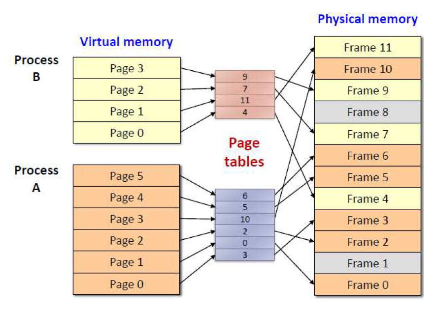

# 메모리 관리

메모리는 주소를 통해 접근하는 저장장치

> 컴퓨터 시스템은 32-bit or 64-bit 주소 체계를 사용한다.  
> 메모리의 한 단위(관리의 최소 단위)는 1 Byte
> 
> 32-bit: 최대 4GB개의 메모리를 관리할 수 있다.

메모리는 효율적인 운영을 위해 일련의 영역을 묶어서 사용한다.  
보통 4KB(2^12byte) 단위로 묶는데, 이를 페이지(page)라고 한다.

---

## 메모리 분할

운영체제가 메모리를 효율적으로 관리하기 위해 여러 분할로 나누는 기법

### 정적 분할

프로그램이 실행되기 전에 구역의 크기와 위치가 지정되는 방식

### 동적 분할

프로그램이 실행되는 동안 구역의 크기와 위치가 지정되는 방식

---

## 메모리 배치 기법

### Segmentation

프로세스의 주소 공간을 의미 단위의 세그먼트로 나누어 물리적 메모리에 올리는 방법이다.  
일반적으로는 코드(code), 데이터(data), 스택(stack) 등의 기능 단위로 세그먼트를 정의한다.

> 세그먼트는 의미를 가질 수 있는 논리적인 단위이기 때문에 크기는 균일하지 않다.

세그먼테이션 기법에서는 논리적 주소가 <세그먼트 번호, 오프셋> 으로 나뉘어 사용된다.
세그먼트 번호는 해당 논리적 주소가 프로세스 주소 공간 내에서 몇 번째 세그먼트에 속하는지를 나타낸다.
오프셋은 그 세그먼트 내에서 얼마만큼 떨어져 있는지에 대한 정보를 나타낸다.  

세그먼테이션 기법에서는 주소 변환을 위해 세그먼트 테이블을 사용한다.  
이 때 세그먼트 테이블의 각 항목은 기준점(base)과 한계점(limit)를 가지고 있다.

외부 단편화가 발생할 수 있다.

### Paging

메모리를 고정된 프레임인 페이지(page)로 나누어 관리하는 기법이다.

프로세스의 주소 공간을 페이지 단위로 나눠서 메모리에 적재한다.  
불연속적으로 메모리를 적재하기 때문에 외부 단편화가 발생하지 않으며, 메모리 접근 속도가 빠르다.  
CPU는 분리된 메모리 프레임을 참조할 때 `페이지 테이블`(page table)을 통해 가상 주소에서 물리 주소로 바뀐 주소로 참조한다.

대신 내부 단편화가 발생할 수 있다.

---

> 외부 단편화 vs 내부 단편화
>
> 외부 단편화(External Fragmentation)란  
> 프로세스의 메모리가 비연속적으로 저장되어서, 중간 중간 작은 빈 공간이 생기는 현상
>
> 내부 단편화(Internal Fragmentation)란  
> 프로세스에게 고정적으로 할당된 공간보다 실제 사용하는 공간이 적어, 빈 공간이 생기는 현상

---

## 가상 메모리(Virtual Memory)

---

## Swapping

