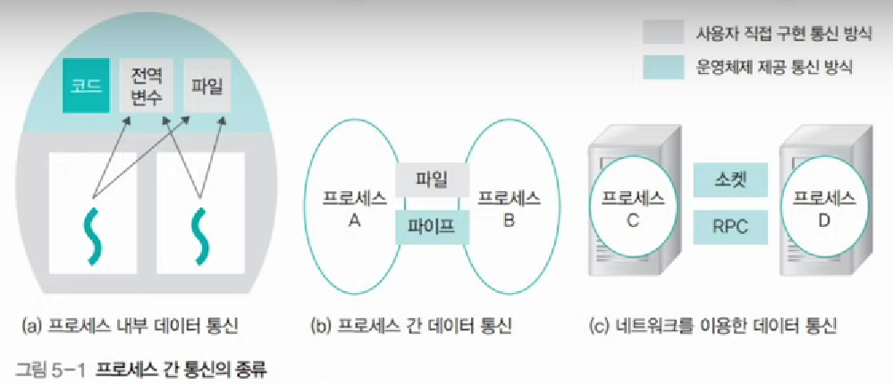

## 프로세스 간 데이터 교환 - IPC(Inter-Process Communication)

프로세스는 공간이 독립적으로 주어진다.
(외부 접근 차단을 OS가 보장한다)

이런 독립적 구조를 가진 프로세스 간의 통신을 해야 하는 상황이 있을 것이다.
이를 가능하도록 해주는 것이 바로 IPC 통신이다.

## IPC의 종류

### 1. 익명 파이프

파이프는 두 개의 프로세스를 연결하는데 하나의 프로세스는 데이터를 쓰기만 하고, 다른 하나는 데이터를 읽기만 할 수 있다.

한쪽 방향으로만 통신이 가능하다.

> 양쪽으로 모두 송/수신을 하고 싶으면 2개의 파이프를 만들어야 한다.

익명 파이프는 통신할 프로세스를 명확히 알 수 있는 경우에 사용한다.  
(부모-자식 프로세스 간 통신처럼)

### 2. Named 파이프

Named 파이프는 전혀 모르는 상태의 프로세스들 사이 통신에 사용한다.

즉, 익명 파이프의 확장된 상태로 부모 프로세스와 무관한 다른 프로세스도 통신이 가능한 것  
(통신을 위해 이름있는 파일을 사용)

하지만, Named 파이프 역시 읽기/쓰기 동시에 불가능하다.

### 3. 메시지 큐

입출력 방식은 Named 파이프와 동일하다.

다른 점은 메시지 큐는 파이프처럼 데이터의 흐름이 아니라 메모리 공간이다.

사용할 데이터에 번호를 붙이면서 여러 프로세스가 동시에 데이터를 쉽게 다룰 수 있다.

### 4. Shared Memory
 
공유 메모리는 데이터 자체를 공유하도록 지원하는 설비다.

> 파이프, 메시지 큐는 통신을 이용한 설비

공유 메모리는 프로세스 간 메모리 영역을 공유해서 사용할 수 있도록 허용해준다.

프로세스가 공유 메모리 할당을 커널에 요청하면,  
커널은 해당 프로세스에 메모리 공간을 할당해주고 이후 모든 프로세스는 해당 메모리 영역에 접근할 수 있게 된다.

중개자 없이 곧바로 메모리에 접근할 수 있어서 IPC 중에 가장 빠르게 작동함

대신 동기화 문제를 해결하기 위해 추가적인 동기화 매커니즘이 필요하다.  
(메모리 일관성을 유지하는 데 주의가 필요하다)

### 5. 소켓

네트워크 소켓 통신을 통해 데이터를 공유한다.

클라이언트와 서버가 소켓을 통해서 통신하는 구조로, 원격에서 프로세스 간 데이터를 공유할 때 사용한다.

다른 시스템과 통신이 가능하다.  
대신 로컬 머신 내의 IPC에 비해 속도가 느릴 수 있다.