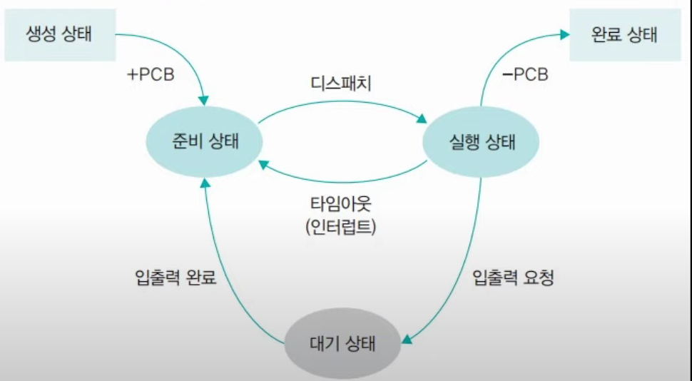
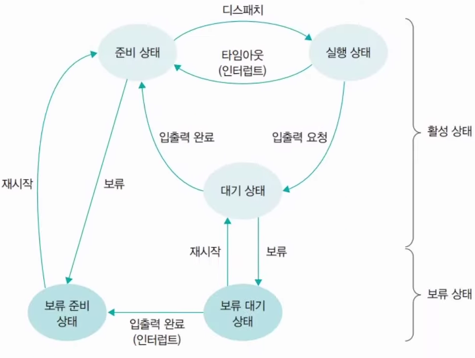
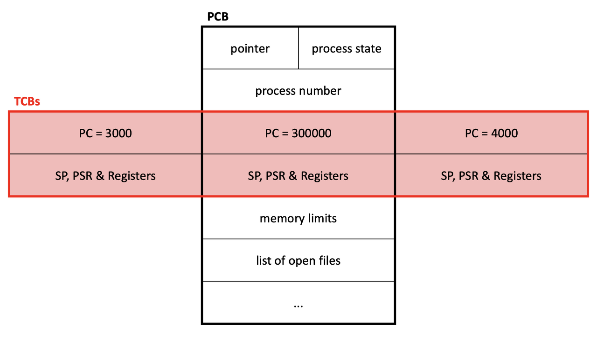

# 프로세스 & 스레드

## 프로그램

특정 작업을 수행하는 명령어들의 모임

## 프로세스(Process)

메모리에 적재되어서 실행 중인 프로그램  
(프로그램을 인스턴스화한 것)

> 설치된 프로그램을 실행한다(인스턴스화)  
> -> 메모리에 적재하고, 가상 메모리 할당, PCB 생성, 연산 진행  
> 이럴때 프로그램을 프로세스라 부름

---

OS는 virtual memory를 프로세스에게 할당한다.  
프로세스에 속한 모든 스레드는 프로세스의 가상메모리로 공간이 제한된다.  
-> thread local storage

---

### 프로세스의 문맥(Context)

프로세스의 수행 상태에 대한 정보

3종류가 있다.
1. 하드웨어 문맥: CPU의 수행 상태 - PC, 각종 레지스터
2. 주소 공간: Code, Data(bss), Stack, Heap (프로세스만의 독자적인 주소 공간)
   > bss(block started by symbol) 영역  
   > 메모리 공간을 최적화하기 위해,  
   > 초기화되지 않거나, 0으로 초기화 된 전역 & static 변수를 저장하는 공간
3. 커널상의 문맥: 프로세스를 관리하기 위한 자료구조 - 커널 스택, PCB

---

### 프로세스 상태

| 상태         | 설명                                 |
|------------|------------------------------------|
| New        | 프로세스가 막 생성된 상태                     |
| Ready      | 프로세스가 CPU에 실행되기 위해 대기하는 상태         |
| Running    | 프로세스가 실행되고 있는 상태                   |
| Waiting    | 프로세스가 특정 자원이나 이벤트를 기다리는 상태(입출력 작업) |
| Terminated | 프로세스가 실행을 완료한 상태                   |

Ready -> Running : Dispatch

> 프로세스를 관리할때는 큐가 쓰인다 - Ready Queue  
> (Ready 상태에 있는 프로세스에서 Running할 프로세스를 고를 때 사용됨)

> 프로세스가 Suspend 상태가 되는 케이스
> 1. 프로세스를 실행할 메모리가 부족할 때
> 2. IO 장치를 사용하기 위해 대기할 때

---

### PCB(Process Control Block)

OS가 시스템 내의 프로세스들을 관리하기 위해  
프로세스마다 유지하는 정보를 담은 커널 내의 자료구조

구성 요소
1. PID
2. 프로세스의 상태
2. PC 값
3. CPU 레지스터 값
4. 메모리 관리 정보(가상 메모리)  
...

---

### 문맥 교환(Context Switching)

실행시킬 프로세스를 변경하기 위해  
원래 수행 중인 프로세스의 문맥을 저장하고  
새로운 프로세스의 문맥을 세팅하는 과정

문맥 교환 과정
1. 해당 프로세스의 timeout or 다른 프로세스의 I/O 작업 완료 시, 시작
2. PC, 레지스터 값 등을 PCB에 저장
3. 현재 프로세스의 상태 변경(running -> waiting or ready or exit)
4. 다음에 수행시킬 프로세스를 선택
5. 선택된 프로세스의 상태를 변경(ready -> running)
6. 선택된 프로세스의 문맥 정보 복구
7. CPU는 새롭게 선택된 프로세스를 수행

> 문맥 교환은, 현재 실행중인 프로세스의 PCB를 저장하고,  
> 새로 실행 할 프로세스의 PCB를 불러 오는 두가지 과정이 필요  
> -> 모드 변경에 비해 큰 오버헤드를 갖는다

> 모드 변경
> 
> 프로세스 실행 중에 시스템콜이나 인터럽트가 발생하면,  
> CPU의 제어권이 OS로 넘어와 원래 실행 중이던 프로세스의 업무를 잠시 멈추고,  
> 커널 코드가 실행된다.  
> 이를 모드 변경이라 한다.
> 
> 프로세스의 실행 모드만 사용모드 -> 커널모드로 바뀌는 것일 뿐
> CPU를 점유하는 프로세스가 다른 프로세스로 변경되는 과정이 아님  
> (현재 프로세스의 문맥 저장과 간단한 복원만 일어나기 때문에 오버헤드가 적다)

프로세스는 CPU 자원(시간)을 분할해서 사용 - 시분할사용

---

## 스레드(Thread)

프로세스 내에서 실행되는 흐름의 단위

프로세스의 자원과 메모리를 공유  
(스레드간 효율적인 통신 가능)

> 프로세스가 존재한다면, 반드시 스레드도 1개 존재한다.  
> (스레드는 연산의 단위)

---

### TCB(Thread Control Block)

각 스레드는 별도의 스택과, 스레드 제어 블록(TCB)를 가지고 있다.

TCB에는 스레드 상태 정보(TID, ...), 레지스터 값, 우선순위 등의 정보를 포함한다.

스레드가 하나 생성될 때마다 TCB가 확장된다.

---

### 스레드의 종류

`1. 사용자 레벨 스레드`

사용자 레벨의 라이브러리를 통해 구현    
(라이브러리는 스레드의 생성 및 스케쥴링 등에 관한 관리 기능을 제공)

동일한 메모리 영역에서 스레드가 생성 및 관리되기 때문에,  
속도가 빠르다는 장점이 있다. 

다만 여러 개의 사용자 스레드 중 하나의 스레드가 시스템콜 등으로 중단되면 나머지 모든 스레드 역시 중단되는 단점이 있다.  
(커널은 사용자 스레드의 존재를 모름)

(다대일 매핑)

> 이는 커널이 프로세스 내부의 스레드를 인식하지 못하여 해당 프로세스를 대기 상태로 전환시키기 때문  
> (커널은 프로세스 단위로 자원을 할당하기 때문)

`2. 커널 레벨 스레드`

OS가 지원하는 스레드 기능으로 구현  
(커널이 스레드의 생성 및 스케쥴링 등을 관리)

커널 스레드가 시스템콜 등으로 중단되더라도,  
커널은 프로세스 내의 다른 스레드를 중단시키지 않고 계속 실행시킴 

다만, 사용자 스레드에 비해 생성 및 관리하는 것이 느리다.

(일대일 매핑)

> 혼합형(n:m) 스레드 (n > m)  
> 사용자는 원하는 수만큼 스레드 사용  
> 커널 스레드는 자신에게 할당된 하나의 사용자 스레드가 block 상태가 되어도,  
> 다른 스레드 수행 가능 - 병행 처리 가능
> 
> -> 효율적이면서도 유연함

---

## 스레드의 장점

1. 스레드끼리는 자원을 공유하기 때문에(Heap 영역) 스레드간 교환은 프로세스간 교환보다 빠르고 효율적

> 효율적인 이유  
> 
> 프로세스간 문맥 교환이 일어났을 경우, 이전에 저장되어 있던 캐시는 의미가 없게 된다.  
> (프로세스 간에는 공유 데이터가 없기 때문)  
> 
> 하지만 스레드는 프로세스의 자원을 공유  
> 스레드간 문맥 교환이 일어났을 경우, 이전 스레드의 공유자원에 대한 캐시 데이터는 의미 있는 정보
> 
> -> 스레드간 문맥 교환 때, 공유 자원에 대한 캐시를 비우지 않아도 됨  
> -> 효율적

2. 프로세스간 통신은 커널이 개입 되어야 하지만  
   같은 프로세스 내의 쓰레드들은 메모리와 파일을 공유하기 때문에 커널호출 없이 효율적으로 서로 통신 할 수 있다.
3. 프로세스 생성(종료)보다 스레드의 생성(종료)가 더 빠르다.  
   프로세스 fork는 모든 정보를 자식에게 복사하는 반면,  
   쓰레드는 프로세스의 많은 부분을 공유하기 때문에 일부분만 복사해서 생성할 수 있다

스레드는 heap 영역을 공유하기 떄문에, 위 장점들이 생겨났다.

> 이와 같은 장점으로 여러 개의 프로세스로 해야하는 작업을 하나의 프로세스에서 여러 개의 쓰레드로 나누어 수행한다. 이를 멀티쓰레딩이라고 한다

---

### (Appendix) Thread-safe

멀티 쓰레드 프로그래밍에서, 어떤 공유 자원에 여러 쓰레드가 동시에 접근해도, 프로그램 실행에 문제가 없는 상태

Thread-safe를 지키기 위한 4가지 방법

1. Re-entrancy (재진입성)  
어떤 함수가 한 스레드에 의해 호출되어 실행 중일 때, 다른 스레드가 그 함수를 호출하더라도 그 결과가 각각에게 올바로 주어져야 한다.

2. Thread-local storage (쓰레드 지역 저장소)  
공유 자원의 사용을 최대한 줄여 각각의 스레드에서만 접근 가능한 저장소들을 사용함으로써 동시 접근을 막는다.  
이 방식은 동기화 방법과 관련되어 있고, 또한 공유상태를 피할 수 없을 때 사용하는 방식이다.

3. Mutual exclusion (상호 배제)  
공유 자원을 꼭 사용해야 할 경우 해당 자원의 접근을 mutex, semaphore 등의 락으로 통제한다.

4. Atomic operations (원자 연산)  
공유 자원에 접근할 때 원자 연산을 이용하거나 '원자적'으로 정의된 접근 방법을 사용함으로써 상호 배제를 구현할 수 있다.