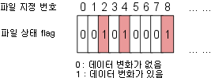
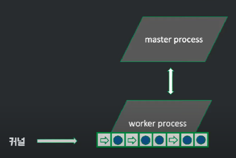

> nginx는 이벤트 처리 기반 아키텍처   
> 
> 한 개 또는 고정된 프로세스만 생성하고, 여러 개의 Connection을 모두 Event-Handler를 통해 비동기 방식으로 처리한다.  
> 적은 양의 스레드만 사용되기 때문에 Context Swiching 비용이 적다. 즉 CPU 부하가 적다.

어떻게 한 개 or 고정된 프로세스만으로 클라이언트의 다중 요청을 처리할 수 있다는 거지?

이것이 멀티플렉싱과 관련이 있다해서 공부해봤다.

---

## I/O Multiplexing

한 프로세스가 여러 파일을 관리하는 기법

---

FD들을 어떻게 감시하냐에 따라서 
어떤 상태로 대기하냐에 따라서 select, poll, epoll 로 나뉜다.

### select

대상 FD를 배열에다 쭉 집어넣고 하나하나 순차 검색하는 가장 원초적인 방식

어떤 FD에서 변경이 일어났는지는 fd_set을 다 훑으며 다시 찾아야 한다 - O(n)

### poll

관리 가능한 최대 FD 수가 1024로 제한적이었던 select와 달리 무한 개의 FD를 검사할 수 있다.

매번 최대 FD까지 loop를 도는 select와 달리 poll은 실제 FD 개수(nfds) 만큼만 loop만 돌게끔 구현할 수 있어 FD 수가 적은 경우 select보다 효율적일 수 있다.

하지만 감시하는 FD의 수만큼 loop를 돌아야 하기 떄문에, 어느 정도 FD의 수가 많아지면 성능이 select 보다 떨어질 수 있다.

### epoll

poll과 마찬가지로 FD의 수는 무제한이지만  
select, poll과 달리 FD의 상태가 kernel에서 관리하여 상태가 바뀐 것을 직접 통지해준다.

> FD를 검사하기 위해 루프를 돌 필요가 없다.

또한 변화가 감지된 FD의 '개수'가 아닌 '목록' 자체를 반환받기 때문에 대상 파일을 추가 탐색할 필요가 없어 효율적이다.  
O(1)

---

> select -> poll -> epoll 순으로 점점 발전했다.
> 
> epoll의 성능이 웬만하면 제일 좋다고 한다.

---

### 정리

결국 셋다 OS가 입출력을 처리함으로써  
상태가 변했을때만 프로세스/스레드가 동작한다.

> 싱글 스레딩 + OS의 처리 = 비동기 처리가 되는 것처럼 보인다.
> 
> 멀티스레딩이 필요하지 않게 되니까 컨텍스트 스위칭이 없다는 장점이 있다.

---

### nginx의 처리 방식

실제로 nginx도 epoll 방식을 이용해 클라이언트의 다중 요청을 처리한다고 한다.

  
(커널이 직접 worker process에게 클라이언트의 요청을 순서대로 전해준다)