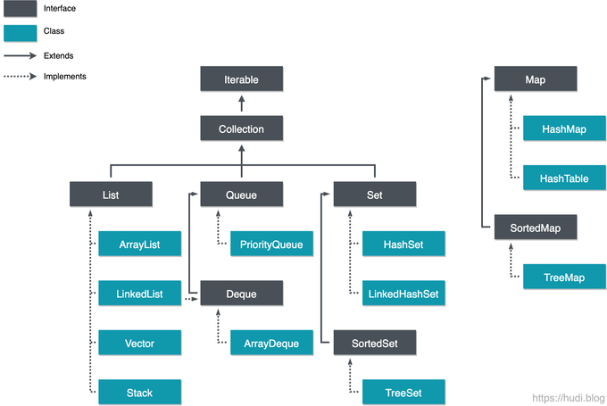

# 컬렉션
요소(element) 객체들의 저장소

    객체들의 컨테이너라고도 불림
    요소의 개수에 따라 크기 자동 조절
    요소의 삽입, 삭제에 따른 요소의 위치 자동 이동

고정 크기의 배열을 다루는 어려움을 해소해준다.

데이터 삽입, 삭제, 검색 등 편리한 API를 다수 제공한다.

## 컬렉션의 장점

1. List, Queue, Set, Map 등의 인터페이스를 제공하고, 이를 구현하는 클래스를 제공하여 일관된 API를 사용할 수 있다.

2. 가변적인 저장 공간을 제공한다. 고정적인 저장 공간을 제공하는 배열과 대비되는 특징이다.

3. 자료구조, 알고리즘을 구현하기 위한 코드를 작성할 필요 없이, `이미 구현된 컬렉션 클래스를 목적에 맞게 선택하여 사용`하면 된다.

4. 제공된 API의 코드는 검증되었으며, 고도로 최적화 되어있다.

## 컬렉션 프레임워크 계층

**`대표적인 인터페이스 4가지`**

`List`: 인덱스 순서로 요소를 저장한다. 중복된 데이터를 저장할 수 있다.

`Queue`: 데이터가 저장된 순서대로 출력되는 선입선출(FIFO)의 구조를 갖는 선형 자료구조이다.

`Set`: 순서가 없으며, 데이터를 중복하여 저장할 수 없다. 집합 연산(합집합, 교집합 등)을 지원한다.

`Map`: key-value 쌍으로 데이터를 저장한다. 순서가 존재하지 않으며, key가 중복 될 수 없다.
    
    추가로 ConcurrentHashMap은 Map 인터페이스를 구현(implements)한 클래스
    
    동시성 친화적이며 최신 기술을 반영한 HashMap

