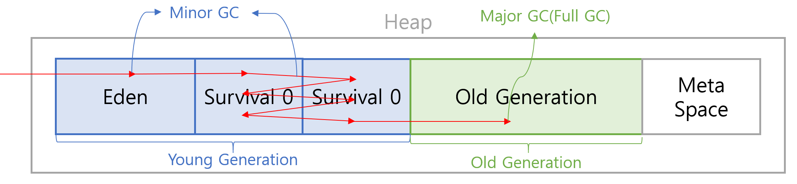

JVM의 실행 엔진의 컴포넌트

1. 인터프리터
2. JIT 컴파일러
3. 가비지 콜렉터

GC(Garbage Collector): 더 이상 참조하지 않는 객체를 모아서 정리한다.

위가 이론적으로 알고 있는 내용

그럼 어떻게 정리할까?

> 이를 잘 알아야 성능에 관하여 잘 다룰 수 있다 생각한다.

---

### GC(Garbage Collector)

프로그램이 동적으로 할당했던 메모리 영역 중 필요 없게 된 영역을 알아서 해제해준다.

> 동적으로 할당했던 메모리 영역 - Heap 영역  
> 필요 없게 된 영역 - 어떤 변수도 가리키지 않는 변수

> C/C++ 에서는 코드 레벨에서 직접 해제했다.  
> (delete 메서드, 소멸자)

`GC의 장점`  
메모리 누수를 막는다  
헤제된 메모리에 접근하는 오류 & 헤제한 걸 또 해제하는 현상을 막을 수 있디

`GC의 단점`  
GC의 오버헤드  
개발자는 언제 GC가 메모리를 해제하는지 모른다

---

## GC의 대표적인 알고리즘(Reference Counting & Mark and Sweeep)

### Reference Counting

힙 영역에 선언된 객체들에게 각각 reference count를 가지고 있는다
이 숫자가 0이 되면 해제한다

문제점 - 순환 참조

### Mark and Sweep

루트 스페이스(Root Space)에서부터 해당 객체를 참조할 수 있는지를 해제의 기준으로 삼는다  
(루트부터 그래프 순회를 통해 연결된 객체를 찾는다)

문제점 - 의도적으로 GC를 실행시켜야 한다  
(애플리케이션이 GC에게 컴퓨터 리소스를 내줘야 한다)  
어플리케이션 실행과 GC 실행이 병행된다.

> JVM의 GC는 기본적으로 Mark and Sweep 방식으로 돌아간다.

JVM 메모리에서의 루트 스페이스  
-> stack 영역의 로컬 변수, method 영역의 static 변수, native method stack의 JNI 참조

---

## Heap 영역

heap 영역은 크게 세 가지로 나뉜다.

1. young generation - minor GC 대상  
2. old generation - major GC(or full gc) 대상  
3. metaspace(자바 8부터) - 로드되는 클래스, 메서드 등에 관한 메타 정보 저장  
   리플렉션 클래스 로드 시 사용된다

> 자바 8 이전에는 metaspace 대신 Permanent generation이 있었음
> 
> metaspace와 permanent generation의 차이점
> 1. Permanent generation은 고정 크기  
>    metaspace는 자동확장
> 2. Permanent generation은 Java heap에 저장됐었음  
>    metaspace는 Native 메모리 영역을 사용한다
> 
> 기존 Permanent generation에는 올바른 가비지 컬렉션 메커니즘이 없었다.  
> 그래서 리플렉션을 과도하게 사용하면 OutOfMemoryError 에러로 인한 PerGen 오류가 발생했다고 한다.  
> 이를 개선하기 위해 metaspace는 자동 확장이 된다고 한다.

young generation은 세 영역으로 나뉜다.

Eden - 새롭게 생성된 객체들이 할당된 영역  
survival 0  
survival 1  
(survival - minor gc로부터 살아남은 객체들이 존재하는 영역)

> 맨 처음 eden 영역에 있는 객체들이 gc 이훙에 살아남는다면  
> 무조건 survival 영역으로 이동한다.

survival의 규칙 - 0 or 1 둘 중 하나는 꼭 비어있어야 한다.  
(gc 발생할 때마다 0->1 or 1->0 이동한다 & eden 영역에서 살아남은 객체들도 이동)

> minor gc에서 살아남을 때마다 age bit가 1 증가한다.
> 
> => survival 영역에 있는 객체들은 age bit가 1 이상이다.  
> (eden에 있다가 한번 살아남았기 떄문에)

### promotion

일정 수준의 age bit를 넘기면  
(오래된 객체라고 판단해서)  
해당 객체를 old generation 영역에 넘긴다.

시간이 많이 지나다 보면 old generation도 꽉차게 된다.  
-> major GC 발동

> 힙 영역을 두가지로 나눈 이유
> 
> GC 설계자들이 어플리케이션을 분석해보니  
> 대부분의 객체의 수명이 짧더라
> 
> -> 어차피 대부분의 객체가 금방 사라지니, young generation 안에서 최대한 처리하자

---

mark and sweep의 두번쨰 특징  
어플리케이션 실행과 gc 실행이 병행된다.

> stop the world  
> gc를 실행하기 위해 jvm이 어플리케이션 실행을 멈추는 것

## gc 방식

### `1. serial GC`

하나의 스레드로 GC를 실행하는 것  
stop the world 시간이 길다(레이스 컨디션 떄문에 한개만 사용됨)  
(싱글 스레드 환경 or heap이 매우 작을 때 사용)

### `2. parallel GC`

여러 개의 스레드로 GC를 실행하는 것  
멀티코어 환경에서 사용  
(java 8의 default GC 방식)

### `3. cms gc` (concurrent mark sweep)
(stop the world를 최소화하기 위해 고안됨)

대부분의 GC 작업을 어플리케이션 작업과 동시에 수행  
-> 메모리,cpu 많이 사용함, compaction(mark-and-sweep 이후 메모리 파편화를 해결하는 것) 제공 안됨

### `4. g1 gc` (garbage first)

힙 영역을 위 방식들과 조금 다르게 쓴다

힙을 일정 크기의 region으로 나누어서,  
어떤 영역은 young generation, 어떤 영역은 old generation으로 활용  
(런타임에 g1 gc가 필요에 따라 영역별 region 개수를 튜닝함 -> stop the world 최소화)  
(java 9 이후 default gc 방식)

---

gc 튜닝 주의할 점

> gc 튜닝은 성능 개선의 최종 단계
> 객체 생성 자체를 줄이려는 코드 레벨에서의 개선이 선행되어야 한다