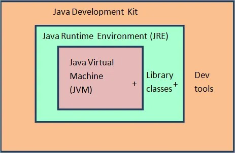

# JDK, JRE, JVM

> JDK: 자바 개발 키트, 자바 응용 프로그램을 개발하는 데 사용되는 도구  
> JDK에는 JRE를 포함하여, 자바 컴파일러, 디버거, 라이브러리 등이 있다. 

> JRE: 자바 실행 환경, 자바 프로그램을 실행하기 위해 사용되는 도구  
> JRE에는 JVM을 포함하여, 자바 라이브러리 등이 있다.

> JVM: 자바 가상 머신, 자바 프로그램을 실행하기 위한 가상 머신  
> JVM은 자바 바이트 코드를 해당 플랫폼의 네이티브 코드로 변환하고 실행한다.

> 자바 프로그램를 개발이 아닌 실행하는 목적만 있는 운영 서버에는 JDK가 아닌 JRE를 설치한다.

---

## JDK vs JRE

### JDK: Java Development Kit(자바 개발 키트)  
자바 응용 프로그램을 개발하는 데 사용되는 소프트웨어 개발 환경

자바 프로그램을 만들고 실행하고 디버그하는 데 필요한 도구와 라이브러리가 포함되어 있다.  
(자바 컴파일러(javac), 자바 런타임 환경(JRE), 그리고 자바 개발에 필요한 도구 & 라이브러리 등 ...)

> JRE와 달리, JDK는 오라클 밖에서 얻을 수 있다.

> 컴파일러(javac)를 통해 자바는 여러 플래폼에서 활용할 수 있다.

### JRE: Java Runtime Environment(자바 실행 환경)  
자바 프로그램이 컴퓨터에서 실행되도록 하는 소프트웨어 환경

자바 가상 머신(Java Virtual Machine) 뿐만 아니라 
자바 프로그램을 실행하는데 필요한 자바 클래스 라이브러리 등을 포함한다.

> 컴퓨터에서 자바 프로그램을 실행만 한다면, JRE만 설치하면 된다.  
> 반면에, 자바 프로그래밍을 할 계획이라면 JDK를 설치해야 한다.
> > 자바 프로그래밍을 할 계획이 없더라도 JDK를 설치해야 하는 경우가 있다.  
> > ex1) JSP를 이용하여 웹 애플리케이션을 배포하는 경우, 기술적으로는 
> > 애플리케이션 서버 내에서 자바 프로그램을 실행하는 것이기 때문에 JDK가 필요하다.  
> > -> 애플리케이션 서버는 JSP를 자바 서블릿으로 변환하고 JDK를 사용하여 서블릿을 컴파일해야 하기 때문이다.

---

## JVM

자바 가상 머신(Java Virtual Machine)의 약자로, 자바 바이트 코드(.class 파일)를 기계어로 
변환(인터프리터 & JIT 컴파일러)하여 실행한다.  
-> 특정 플랫폼에 종속적이다.

> JVM은 자바 프로그래밍 언어에 대해 아는 것이 없고, class 파일 형식만 알고 있다.  
> (class 파일에는 JVM 명령어(or 바이트코드)와 심볼 테이블 뿐만 아니라 다른 부수적인 정보도 포함되어 있다)