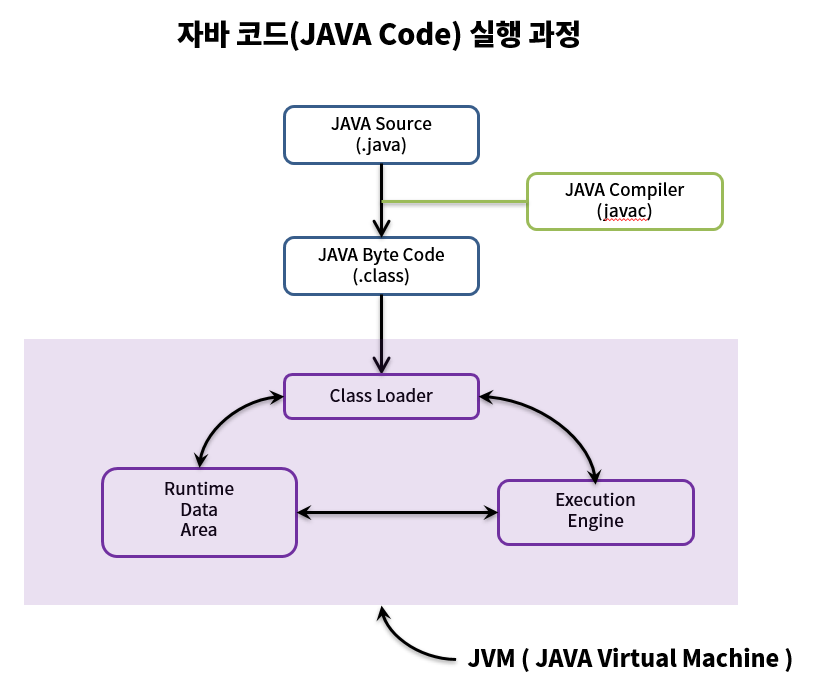

# Java 코드를 실행하는 과정

> 1. 자바는 컴파일러(javac)를 통해 소스코드(.java)를 바이트코드(.class)로 컴파일한다.  
> 2. 컴파일 된 바이트 코드를 JVM의 클래스 로더에게 전달한다.  
> 3. 클래스 로더는 동적 로딩을 통해 필요한 클래스들을 로딩 및 링크하여, JVM의 메모리인, 런타임 데이터 영역에 올린다.  
> 4. 실행 엔진은 JVM 메모리에 올라온 바이트 코드들을 명령어 단위로 하나씩 가져와서 실행한다.
> 
> (JVM의 실행 엔진에서 인터프리터가 한 줄씩 읽고, JIT 컴파일러가 소스코드 캐싱을 통해 최적화한다.)

---

> 자바가 특정 OS에 독립적인 이유가 JVM에 있다.  
> 자바는, JVM이 자바 언어를 특정 OS에 맞게 변경을 해주기 때문에, 특정 플랫폼에 종속적이게 된다.

자바 코드를 실행하기 위한 JVM의 핵심 컴포넌트  
-  클래스 로더
- 실행 엔진(인터프리터, JIT 컴파일러, GC)
- 런타임 데이터 영역

> 자바는 .java 파일을 .class 파일(바이트코드)로 한번 컴파일 하는 과정과, 바이트코드를 인터프리터 하는 방식 
> 2가지를 진행하기 때문에 느리다는 말이 있다.  
> (인터프리터 방식은 런타임 시에 소스 코드를 한줄씩 읽어 들이는 방식)

> 여기서 JIT 컴파일러는, 이미 한번 읽어서 기계어로 변경한, 소스코드는 번역하지 않는다.