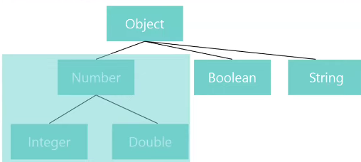

# 제네릭

## 제네릭이란?

클래스나 메서드에 사용할 내부 데이터 타입을 외부에서 지정하는 방법  
-> 객체별로 다른 타입의 자료가 저장될 수 있다.

---

## 제네릭 사용 방법

<> 안에 타입 매개변수를 선언  
```public class MyClass<T>{ }```  
```T, List<T>, ...```로 사용

해당 객체의 타입은 컴파일 타임에 지정한다.

---

## 제네릭의 장점

1. 특정 타입으로 제한함으로써 타입 안정성을 제공한다.(컴파일 타임에, 타입 검사를 통해 예외 방지)
2. 타입 체크와 캐스팅을 생략할 수 있으므로 코드가 간결해진다.  
   (그리고 약간의 성능 향상)
3. 코드의 재사용성이 높아진다.

---

## 상한 경계 제네릭

`<T extends Type>` 형태로 선언한다.  
-> "Type과 이의 자손 타입만 가능하도록 제한을 둔다"

`<T extends Number>`의 의미  


> `<T extends Number>`로 선언하면, Number와 그 자손 타입이 보장되기 때문에,  
> 함수 내에서 T 타입 변수는 Number에 구현된 모든 함수를 사용 가능하다.

> `<T extends Number>`로 선언하고, Number의 자손 타입이 아닌 String 타입을 매개변수로 받았을 때, 컴파일 에러가 난다.

---

> 이와 같이 제한된 제네릭을 설정하면,  
> 사용 가능한 타입에 대해 제한을 걸어줄 수 있으므로  
> 더욱 유연한 클래스와 함수의 사용이 가능해진다.
> 
> -> 타입 안전성을 제공해준다.

---

## 제네릭 캐스팅 문제

배열과 같은 일반적인 변수 타입과 달리, 제네릭 서브 타입 간에는 형변환이 불가능하다.  

```
Integer[] ints = new Integer[10];
Object[] obj = ints; // possible

List<Integer> list1 = new ArrayList<>();
List<Object> list2 = list1; // compile error
```

> 이를 해결하기 위한 개념이 와일드카드이다.  
> (와일드카드는 다른 파일에서 자세하게 다룸)

---

## 제네릭 타입 소거(Erasure)

컴파일 시점에 제네릭 타입이 사라지는 것  
(이전 자바와 호환성을 위해)

> 자바 5(JDK 1.5)에 제네릭이라는 개념이 등장했다.    
> (이전에 사용됏던 자바 코드와 상위 자바 버전의 코드가 호환이 되야 해서,  
> 컴파일 시점에 제네릭 타입이 소거된다)

-> 클래스 파일(.class)에는 제네릭 타입에 대한 정보는 존재하지 않게 된다.

---

### Reifiable vs Non-Reifiable

실체화 타입(Reifiable):  
int, Number, List, List<?>와 같은, 컴파일 단계에서 타입 소거에 의해 지워지지 않는 타입 정보

> List<?>에서 ?(와일드카드)는 애초에 타입정보를 명시하지 않은 것으로,   
> 컴파일 시점에 소거를 한다고 해도 잃을 것이 없어서 실체화 타입이라 볼 수 있다.

비실체화 타입(Non-Reifiable):  
List<T>, List<String>, List<? extends Number>와 같은,  
컴파일 시점에 타입 소거에 의해 타입 정보가 제거된 타입

---

### 타입 소거 과정

1. 제네릭 타입 제거  

> `<T extends Number>` -> Number 치환  
> `T` -> Object 치환

2. 제거 후, 타입이 일치하지 않는 곳은 형변환 추가

예시   
```java
// 컴파일 전
public class Box<T extends Number> {
    List<T> list = new ArrayList<>();

    void add(T item){
        list.add(item);
    }

    T getValue(int i){
        return list.get(i);
    }
}

// 컴파일 후
public class Box {
    List list = new ArrayList();

    void add(Number item){
        list.add(item);
    }

    Number getValue(int i){
        return (Number)list.get(i);
    }
}
```

---

### Bridge 메서드

컴파일러는 확장된 제네릭 타입에 대해서 타입 소거를 해도 다형성을 보존하게 하기위해 별도의 bridge 메서드를 생성한다.

브릿지 메서드 예시  
```java
class Node<T> {
    public T data;
    public Node(T data) { this.data = data; }
    public void setData(T data) {
        System.out.println("Node<T> 클래스의 메서드 호출");
        this.data = data;
    }
}

class IntegerNode extends Node<Integer> {
    public IntegerNode(Integer data) { super(data); }
    @Override
    public void setData(Integer data) {
        System.out.println("IntegerNode 클래스의 메서드 호출");
        this.data = data + 1000;
    }
}
```

위 클래스들을 컴파일 해서 타입소거가 진행되면

```java
class Node<Object> {
    public Object data;
    public Node(Object data) { this.data = data; }
    public void setData(Object data) {
        System.out.println("Node<T> 클래스의 메서드 호출");
        this.data = data;
    }
}

class IntegerNode extends Node {
    public IntegerNode(Integer data) { super(data); }
    public void setData(Integer data) {
        System.out.println("IntegerNode 클래스의 메서드 호출");
        this.data = data + 1000;
    }
}
```

위의 IntegerNode 클래스를 보면,  
처음에는 setData를 오버라이딩했는데,  
타입소거가 진행된 뒤에 setData 메서드는, 오버라이딩이 아닌, 오버로딩이 되었다.  
(Node 클래스의 setData의 파라미터가 타입 소거에 의해 Object이기 때문)

여기서 개발자의 의도는 setData 메서드를 오버라이딩한 것이다.  
그런데 제네릭의 타입 소거 떄문에 오버로딩 되었다.  
따라서 이러한 간극을 없애기 위해 컴파일러는 해당 제네릭 타입의 타임 소거를 위한 bridge method를 생성하게 해준다.

```java
class IntegerNode extends Node { 
    public IntegerNode(Integer data) { super(data); }
    public void setData(Object data) { // bridge method
        this.setData((Integer) data);
    }
    public void setData(Integer data) {
        System.out.println("IntegerNode 클래스의 메서드 호출");
        this.data = data + 1000;
    }
}
```

컴파일러가 브릿지 메서드를 생성해줌으로써, 개발자가 의도한 오버라이딩이 제대로 지켜졌다.

---

## 힙 오염(pollusion)

힙 오염(Heap pollution)은 단어 그대로 JVM의 힙(Heap) 메모리 영역에 저장되어있는 특정 변수(객체)가 불량 데이터를 참조함으로써,   
만일 힙에서 데이터를 가져오려고 할때 얘기치 못한 런타임 에러가 발생할 수 있는 오염 상태를 말한다.

제네릭의 타입 소거로 인해 발생할 수 있다.

다음 예시를 보자.

```
List<Double> list1 = new ArrayList<>();
list1.add(1.1);
list1.add(1.2);

Object obj = list1; // 업캐스팅

List<String> list2 = (List<String>) obj; // 다운캐스팅

list2.add("string1");
list2.add("string2");

System.out.println(list2); // [1.1, 1.2, string1, string2]

for(String s: list2) // 런타임 에러
    ;
```

코드만 봤을 때는 `List<Double> -> Object -> List<String>` 되게 이상한 코드로 보인다.  
하지만 컴파일러는 위의 코드에 대해 컴파일 에러를 알려주지 않는다.

1. 컴파일러는 캐스팅 했을때 변수에 저장할 수 있느냐만을 검사한다.  
   (타입 캐스팅 전체를 검사하지 않는다)
2. 제네릭은 타입 소거되면 결국 Object가 된다.  
   (list에 String과 Double이 공존할 수 있게 된다)

### 해결법

Collections 클래스의 checkList()를 통해 힙 오염을 방지할 수 있다.  
(이 메서드는 해당 객체에 대해 의도치 않은 타입의 데이터가 들어갔을 때 이를 감지하여 예외를 발생시켜 준다)