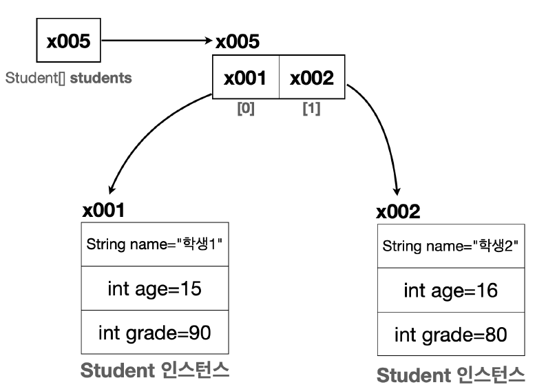

# 배열

> 자바에서 대입(=)은 항상 변수에 들어 있는 값을 **복사**한다.

### (원시형 타입) 배열의 선언

```int[] students = new int[5];```  

1. 배열 변수 선언 ```int[] students;```
2. 배열 생성 & 참조값 보관 ```students = new int[5];```  
    new int[5]라는 배열을 생성하고(배열의 크기만큼 메모리를 확보(지금은 20byte)),  
    students에 배열의 참조값을 보관


> new int[5] 배열은 힙 영역에 생성되고,  
> students는 스택 영역에 생성된다.  
> (students가 new int[5]의 참조값을 보관(위치를 가리킴))

---

### 클래스 배열의 선언

```
Student[] students = new Student[2];
students[0] = new Student();
students[1] = new Student();
```

```Student[] students = new Student[2];```  


Student 변수를 2개 보관할 수 있는 사이즈 2의 배열을 만든다.  
(배열에는 아직 참조값을 대입하지 않았기 때문에 참조값이 없다는 의미의 null 값으로 초기화 된다)

```students[0] = new Student();```  
```students[1] = new Student();```  
  
(객체에 값이 있다고 가정한 그림)  
각각의 new Student()의 참조값을 students[0], students[1]에 복사해서 대입

> 다시 말하지만, 자바에서 대입(=)은 항상 변수에 들어 있는 값을 **복사**한다.