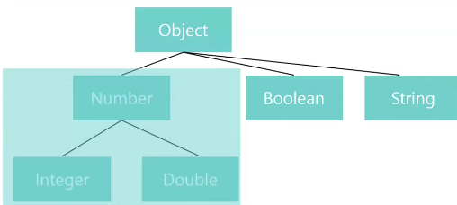
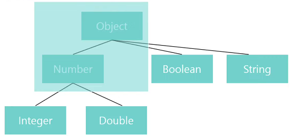

# 제네릭

## 제네릭이란?

클래스나 메서드에 사용할 내부 데이터 타입을 외부에서 지정하는 방법

---

## 제네릭 사용 방법

<> 안에 타입 매개변수를 선언하는 방식으로 사용 `List<T>`  
해당 객체의 타입은 컴파일 타임에 지정한다.

---

## 제네릭의 장점

1. 특정 타입으로 제한함으로써 타입 안정성을 제공한다.
2. 타입 체크와 형변환을 생략할 수 있으므로 코드가 간결해진다.

---

## 제네릭 클래스와 제네릭 메서드

### 제네릭 클래스 선언

클래스 이름 뒤에 타입 매개변수를 위치

```java
class ClassName<T> { ... }
```

> 선언된 T 타입은 클래스 내에서 자유롭게 사용 가능하다.

> 타입 매개변수로 T, E, K, V 등을 사용하지만, 원하는대로 설정해도 괜찮다.  
> 두개 이상의 제네릭 타입을 선언할 수도 있다. - Map<K, V>

---

### 제네릭 메서드 선언

접근 지정자와 반환 타입 사이에 타입 매개변수를 위치

> 선언된 T 타입은 해당 메서드 내에서 자유롭게 사용 가능하다.

    클래스에 선언된 제네릭과 메서드에 선언된 제네릭의 시그니처가 같다면?

    선언을 할 수 있지만, 클래스 멤버변수를, 메서드에 선언된 제네릭 타입에 변수를 대입한다면,
    컴파일 에러가 발생한다.
    (캐스팅을 해주면 에러가 발생하지 않는다)

----

## 제한된 제네릭

> 제네릭을 통해 받은 인자들을 모두 더해주는 메서드를 만들려고 하는데,  
> 이러면, 인자들이 모두 숫자 타입(Number)이라는 것이 보장되어야 한다.

제네릭 타입의 조건을 제한하는 방법은, `상한 경계`와 `하한 경계` 두 가지가 있다.

---

### 상한 경계 제네릭

`<T extends Type>` 형태로 선언한다.  
-> "Type과 이의 자손 타입만 가능하도록 제한을 둔다"

`<T extends Number>`의 의미  


> `<T extends Number>`로 선언하면, Number와 그 자손 타입이 보장되기 때문에,  
> 함수 내에서 T 타입 변수는 Number에 구현된 모든 함수를 사용 가능하다.

> `<T extends Number>`로 선언하고, Number의 자손 타입이 아닌 String 타입을 매개변수로 받았을 때, 경고가 표시된다.

### 하한 경계 제네릭

`<T super Type>` 형태로 선언한다.  
-> "Type과 이의 `조상` 타입만 가능하도록 제한을 둔다"

`<T super Number>`의 의미  


---

> 이와 같이 제한된 제네릭을 설정하면,  
> 사용 가능한 타입에 대해 제한을 걸어줄 수 있으므로  
> 더욱 유연한 클래스와 함수의 사용이 가능해진다.

---

## 와일드카드

<> 사이에 물음표를 사용해 나타낸다. `<?>`  
`알 수 없는 타입`을 의미한다.

---

제네릭 타입의 클래스의 인스턴스를 와일드카드로 선언했을 때,  
해당 인스턴스에 제네릭 타입 매개변수를 보낼 때(대표적으로 setter) 컴파일 에러가 발생한다. - 생성자 제외

```java
public class Generic<T>{
    public T t;
    
    public Generic(T t){ ... }
    public void doing(T t){ ... }
}

public class Main{
    public static void main(String[] args) {
        Generic<?> generic = new Generic<>((Number) 1); // 제네릭 타입의 클래스를 와일드카드로 선언
        generic.doing((Number) 2); // 컴파일 에러
    }
}
```

다음과 같은 에러가 발생한다.  


생성된 객체의 타입이 확정되지 않았기 때문에,  
와일드카드 형태에서는 값의 대입이 불가능하다.

---

그럼 어떻게 사용할까?

-> 와일드카드도 제한된 제네릭처럼 경계를 설정해 주었을 때 기능을 발휘한다.

---

### 경계 와일드카드

와일드카드에도 상한 경계 와일드카드와 하한 경계 와일드카드가 존재한다.

`<? extends Type>, <? super Type>`

> 여기서 제네릭 경계와 차이가 있는데,
> 
> `<T extends Number>`가 Number와 그 자손 타입에 해당하는 타입들 중 하나로 치환된다 라면,  
> `<? extends Number>`는 Number와 그 자손 타입임은 보장되지만, 구체적으로 확정은 불가능하다.  
> 라는 의미를 가진다.

---

## 정리

와일드카드는 제네릭보다 조금 약한 제약의 강도를 보이지만,  
이 특성을 활용 해 제네릭과 결합한다면 더욱 복잡한 제약조건을 부여할 수 있다.

> 아직 와일드카드의 필요성을 잘 모르겠다..  
> 이건 나중에 필요해지면 공부해야 할 듯

---

궁금한점
1. 제네릭 보다 와일드카드가 유용한 케이스가 있는가?
2. 와일드카드의 제한은 어디서 쓰이는가?