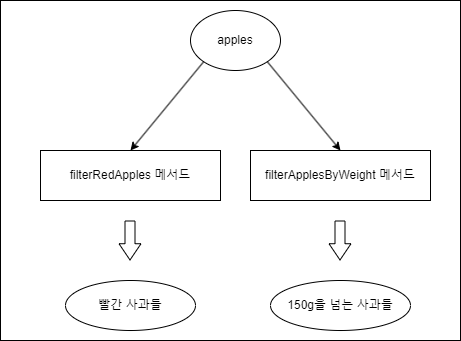
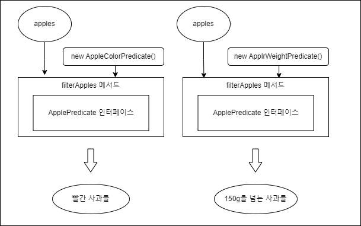

# 모던 자바인액션

## 1. 동적 파라미터화

우리가 어떤 상황에서 일을 하든, 소비자의 요구사항은 항상 바뀐다.

동작 파라미터화를 이용하면 자주 바뀌는 요구사항에 효과적으로 대응할 수 있다. 

동작 파라미터화란 아직은 어떻게 실행할 것인지 결정하지 않은 코드 블록을 의미한다.

예시
```java
public interface ApplePredicate {
	boolean test(Apple apple);
}

public List<Apple> filterApple(List<Apple> apples, ApplePredicate p){
    // ApplePredicate를 파라미터로 받는다.
    // test 함수를 통해 apple들의 값을 비교하면서 filter 수행한다.
    ...
}
```

---

### 요구사항
```java
public class Apple{
    int weight;
    String color;
}
```

사과를 재배하는 농부가 사과를 구별하고 싶어서,
내가 사과를 분류해주는 프로그램을 구현한다고 하자.

처음에 농부는 빨간사과를 분류하고 싶다고 했다.

```java
public List<Apple> filterRedApple(List<Apple> apples){
    List<Apple> result = new ArrayList<>();
    for(Apple apple: apples){
        if(apple.color == "RED")
        result.add(apple);
    }
    return result;
}
```

모든사과를 입력하면 빨간사과만 리턴하는 함수를 짰는데,
나중에 농부가 150g을 넘는 사과를 분류하고 싶다고 했다.

그래서 나는 filterApplesByWeight 라는 메서드를 추가로 생성했다.

```java
List<Apple> filterApplesByWeight(List<Apple> apples) {
	List<Apple> result = new ArrayList<>();
	for(Apple apple: apples){
    	if(apple.getWeight() > 150){
        	result.add(apple);
        }
    }
    return result;
}
```

---

### 기존 코드의 문제점

기존 메서드들을 비교해 보면 겹치는 코드가 너무 많다.

```java
List<Apple> filterApples(List<Apple> apples) {
	List<Apple> result = new ArrayList<>();
	for(Apple apple: apples){
    	if(/* 사과를 분류하는 기준 */){ // 이 코드를 제외하고 모두 같은 코드
        	result.add(apple);
        }
    }
    return result;
}
```

위처럼 사과를 분류하는 기준을 제외한 다른 코드는 모두 같다.

여기서 농부가 또 다른 분류기준을 주면 어떻게될까?

그럼 또 새로운 메서드를 추가할 것인가?

---

### 문제 해결 과정

결국 농부의 요구사항은 사과를 어떤 속성에 기초해서(빨간색인가?, 150g을 넘는가?) 분류할 것인지, 아닌지를 판단만 하면 되므로, 참 또는 거짓을 반환하는 함수를 만든다

```java
public interface ApplePredicate() {
	boolean test(Apple apple);
}
```

다음 예제처럼 여러 선택조건을 대표하는 여러버전의 ApplePredicate를 정의할 수 있다.

```java
public class AppleWeightPredicate implements ApplePredicate {
    @Override
    public boolean test(Apple apple) {
      return apple.getWeight() > 150;
    }
}

public class AppleRedColorPredicate implements ApplePredicate {
    @Override
    public boolean test(Apple apple) {
        return apple.getColor() == Color.RED;
    }
}

```

이 다음은 filterApples에서 ApplePredicate 객체를 받아 애플의 조건을 검사하도록 메서드를 고친다.

```java
List<Apple> filterApples(List<Apple> apples, ApplePredicate p) {
	List<Apple> result = new ArrayList<>();
	for(Apple apple: apples){
    	if(p.test(apple)){ // 깔끔하다
        	result.add(apple);
        }
    }
    
    return result;
}
```

만약 빨간 사과를 분류하고 싶다면
filterApples(apples, new AppleColorPredicate())처럼
AppleColorPredicate 객체를 선언해서 filterApples 메서드를 호출해주면 되고,

150g을 넘는 사과를 분류하고 싶다면,
filterApples(apples, new AppleWeightPredicate()) 처럼 선언해주면 된다.

---

### 그림으로 정리

위의 문제 해결 과정을 그림으로 보자



(다른 메서드)
기존 코드의 문제점은 분류기준이 바뀔때마다 새로운 메서드를 생성해야 한다는 것이다.


그래서 동작 파라미터화를 적용하면,



(같은 메서드)
ApplePredicate라는 인터페이스가 filterApples메서드의 인자로 입력되면서,

사과를 분류하는 기준(동작)을 메서드의 파라미터로 받아서, 좀더 유연하게 사과를 분류할 수 있게 되었다.

---

### 한개의 파라미터, 다양한 동작

이렇게 동작 파라미터화, 즉 메서드가 다양한 동작(또는 전략)을 받아서 내부적으로 다양한 동작을 수행할 수 있다.

---

## 람다

동적 파라미터화를 이용해서 변화하는 요구사항에 효과적으로 대응하는 코드를 구현할 수 있음을 확인했다.

하지만 인터페이스를 상속받은 특정 클래스를 선언하고, 해당 클래스를 메서드의 파라미터로 전달해주는 건 너무 귀찮다.

익명클래스라는 방법도 있지만, 코드를 더 줄이고 싶다.
> 익명 클래스 예시
> ```java
> new ApplePredicate<Apple>(){
>     public bool test(Apple a1, Apple a2){   
>         ...
>     }
> }
> ```

이번 장은 더 깔끔한 코드로 동작을 구현하고 전달하는 자바 8의 새로운 기능인 람다 표현식을 설명한다.

---

### 람다란 무엇인가?

람다 표현식은 메서드로 전달할 수 있는 익명 함수를 단순화한 것

람다 표현식에는 이름은 없지만, 파라미터 리스트, 바디, 반환 형식, 발생할 수 있는 예외 리스트는 가질 수 있다.

---

### 람다의 특징

1. 익명 - 보통의 메서드와 달리 이름이 없다. 구현해야할 코드가 줄어든다.
    > 이름 고민을 안해도 되니 얼마나 좋은가!
2. 함수 - 람다는 메서드처럼 특정 클래스에 종속되지 않으므로 함수라고 부른다.
    > 하지만 메서드처럼 파라미터 리스트, 바디, 반환형식, 가능한 예외 클래스를 포함한다.
3. 전달 - 람다 표현식을 메서드 인수로 전달하거나 변수로 저장할 수 있다.
4. 간결성 - 익명 클래스처럼 많은 코드를 구현할 필요가 없다.

익명클래스를 사용한 코드를 람다표현식으로 변경하면 코드가 깔끔해진다.

```java
Comparator<Apple> byWeight;

// 익명클래스
byWeight = new Comparator<Apple>(){
    public int compare(Apple a1, Apple a2){
        return a1.getWeight().compareTo(a2.getWeight());
    }
}

// 람다
byWeight = (Apple a1, Apple a2) -> a1.getWeight().compareTo(a2.getWeight());
```

---

### 람다 표현식

람다는 세부분으로 이루어진다.
```(Apple a1, Apple a2) -> a1.getWeight().compareTo(a2.getWeight());```
(파라미터1, 파라미터2, ...) -> {바디}
1. 파라미터 리스트
2. 화살표 - 화살표는 람다의 파라미터 리스트와 바디를 구분한다.
3. 람다 바디

**람다의 다양한 표현식**

1. 람다 표현식에는 return이 함축되어 있다.
```(String s) -> s.length()``` // String 형식의 파라미터 하나를 가지며 int를 반환

```(Apple a) -> a.getWeight() > 150``` // Apple 받아서 boolean 반환

2. {} 을 이용해서 여러 행의 문장을 포함할 수 있다.
```java
// int 두개 받아서 void 리턴

(int x, int y) -> {
    System.out.println("Result:");
    System.out.println(x + y);
}
```
> {} 을 이용할때 값을 반환하려면 return을 사용해야 한다.

---

### 함수형 인터페이스

함수형 인터페이스란 정확히 하나의 추상 메서드를 지정하는 인터페이스
> Comparaotr, Runnable 등이 있다.

> 인터페이스는 디폴트 메서드를 포함할 수 있다.
>
> 많은 디폴트 메서드가 있더라도 추상 메서드가 오직 하나라면 함수형 인터페이스이다.

람다 표현식으로 함수형 인터페이스의 추상 메서드 구현을 직접 전달할 수 있으므로 '전체 표현식을 함수형 인터페이스의 인스턴스로 취급'할 수 있다.
> 기술적으로 따지면 함수형 인터페이스를 구현한 클래스의 인스턴스

---

### 함수 디스크럽터 

함수형 인터페이스의 추상 메서드 시그니처는 람다 표현식의 시그니처를 가리킨다.

람다 표현식의 시그니처를 서술하는 메서드를 '함수 디스크럽터'라고 부른다.

> 람다 표현식은 변수에 할당하거나 함수형 인터페이스를 인수로 받는 메서드로 전달할 수 있으며, 함수형 인터페이스의 추상 메서드와 같은 시그니처를 갖는다.

> 시그니처 - 메서드의 파라미터 변수와 리턴 변수의 타입을 정의해놓은 표현식?

> 왜 함수형 인터페이스를 인수로 받는 메서드에만 람다 표현식을 사용할 수 있을까?
> 
> 언어 설계자들이 언어를 더 복잡하게 만들지 않는 현재 방법을 선택했다.
>
> 그리고 대부분의 자바 프로그래머가 하나의 추상 메서드를 갖는 인터페이스에 익숙하다는 점도 고려했다.

---

### 람다 활용: 실행 어라운드 패턴

실행 어라운드 패턴 - 실제 자원을 처리하는 코드를 설장과 정리 두 과정이 둘러싸는 형태를 갖는 형식의 코드
> 보일러 플레이트 코드 같은건가 (BufferedReader, File 열고 닫는 것들)

실행 어라운드 패턴을 갖는 메서드가 있고, 해당 메서드 안에서 실제 자원을 처리하는 코드를 람다 표현식으로 전달해주면 깔끔하게 짤 수 있다.

```java
String str = processFile((BufferedReader br) -> br.readLine();
// processFile은 받은 파라미터를 통해 실제 자원을 처리해주는 메서드
// 실행 어라운드 패턴은 processFile 에만 해당한다.
// 람다를 이용하면 실제 비즈니스 로직에만 집중할 수 있다.
```

---

### 함수형 인터페이스 사용 - 다양한 함수형 인터페이스

1. Predicate

```java.util.function.Predicate<T>``` 인터페이스는 test라는 추상 메서드를 정의,

test는 제네릭 형식의 T의 객체를 인수로 받아 boolean을 반환한다.

2. Consumer

```java.util.function.Consumer<T>``` 인터페이스는 제네릭 형식 T 객체를 받아서 void를 반환하는 accept 라는 추상 메서드를 정의한다.

3. Function

```java.util.function.Function<T,R>``` 인터페이스는 제네릭 형식 T 객체를 인수로 받아서 제네릭 형식 R 객체를 반환하는 추상 메서드 apply를 정의한다.

> 제네릭 파라미터는 참조형만 사용할 수 있다. (Integer, List, ...) (기본형 X - int, double)
>
> 참조형을 기본형으로 전황하는 동작을 언박싱, 기본형->참조형으로 변환하는 동작을 박싱이라 한다.
>
> -> 자바는 이 기능을 자동으로 제공하지만, 약간의 비용이 소요된다.
>> 박싱한 값은 기본형을 감싸는 래퍼며 힙에 저장된다. 따라서 박싱한 값은 메모리를 더 소비하며 기본형을 가져올 때도 메모리를 탐색하는 과정이 필요하다.
>>
>> 자바 8에서는 오토박싱 동작을 피할 수 있도록 특별한 버전의 함수형 인터페이스를 제공한다. (IntPredicate, ...)

---

### 형식 검사, 형식 추론, 제약

**형식 검사**

람다 표현식을 활용할때에는, 대상 파라미터가 어떤 함수 디스크럽터를 가지고 있는지 파악하고 제대로 활용해야 한다.

> 특별한 void 호환 규칙
>
> 람다의 바디에 일반 표현식이 있으면 void를 반환하는 함수 디스크럽터와 호환된다.
> 
> ```s -> list.add(s)``` add 메서드는 boolean을 반환하지만 일반 표현식이라 boolean, void 둘다 호환된다.

> Object는 함수형 인터페이스가 아니다. 함수형 인터페이스로 캐스팅해서 Object 변수로 초기화할 수 있다.
>
> ```Object o = (Runnable)() -> {System.out.println("Hello")};```

**형식 추론**

```(Apple a1, Apple a2) -> { ~ }``` 이 코드를 ```(a1, a2) -> { ~ }``` 로 사용할 수 있다.

컴파일러가 대상형 식을 이용해서 함수 디스크럽터를 알수 있다. -> 컴파일러는 람다의 시그니처도 추론할 수 있다.

**지역 변수 사용**

람다 표현식에서는 자유 변수(외부에서 정의된 변수)를 활용할 수 있다. 이와 같은 동작을 '람다 캡쳐링'이라고 부른다.

자유 변수에는 제약이 있다. 해당 지역 변수는 한번만 할당되어야 한다. - 마치 final처럼

> 이러한 이유는, 람다 - 인스턴스 변수는 힙에 저장되는 반면에 지역 변수는 스택에 위치한다.
>
> 람다가 스레드에서 실행된다면, 지역 변수를 할당한 스레드가 사라져서 변수 할당이 해제되었는데도 람다를 실행하는 스레드에서는 해당 변수에 접근할 수 있음.
>
> 따라서 자바 구현에서는 원래 변수에 접근을 허용하는 것이 아니라 자유 지역 변수의 복사본을 제공한다.
>
> -> 복사본의 값이 바뀌지 않아야 하므로 지역 변수에는 한번만 값을 할당해야 한다는 제약이 생긴 것이다.

---

### 메서드 참조

메서드 참조를 이용하면 기존의 메서드 정의를 재활용해서 람다처럼 전달할 수 있다.

> 이제는 파라미터까지 전부 컴파일러가 예측해주네

메서드 참조를 만드는 방법

1. 정적 메서드 참조 - ```(int a) -> System.out.println(a)``` -> ```System.out::println```
2. 다양한 형식의 인스턴스 메서드 참조 - ```(Apple a1) -> a1.getWeight()``` -> ```Apple::getWeight```
3. 기존 객체의 인스턴스 메서드 참조 - ```(Apple a2) -> a1.compare(a2)``` -> ```a1::compare```

---

### 람다 표현식을 조합할 수 있는 유용한 메서드

Comparator, Function, Predicate 같은 함수형 인터페이스는 람다표현식을 조합할 수 있도록 유틸리티 메서드를 제공한다.

-> 여러개의 람다 표현식을 조합해서 복잡한 람다 표현식을 만들 수 있다.

여기서 등장하는 것이 `디폴트 메서드`이다.

1. Comparator 조합

정적메서드 Comparator.comparing을 이용 

```inventory.sort(Comparator.comparing(Apple::getWeight))``` 무게별로 오름차순으로 정렬됨

여기서 내림차순으로 정렬하고 싶다면,

```inventory.sort(Comparator.comparing(Apple::getWeight).reversed())```

이 코드처럼 처음 비교자 구현을 그대로 재사용해서 사과의 무게를 기준으로 역정렬할 수 있다.

여기서 무게가 같은 사과가 있다면?

```
inventory.sort(Comparator.comparing(Apple::getWeight)
    .reversed()
    thenComparing(Apple::getCountry)) // 사과 무게가 같다면 국가별로 정렬
```

thenComparing 메서드로 두번째 비교자를 만들 수 있다. getWeight를 이용하는데 무게가 같다면 두번째 비교자를 이용한다.

이외에도 Predicate 등 다양한 함수형 인터페이스가 디폴트 메서드를 통해 복잡한 람다 표현식을 만들 수 있다.


---

### 람다 간단 정리
|이름|의미|
|--|--|
|람다 표현식|익명 함수의 일종, 이름은 없지만 파라미터 리스트, 바디, 반환 형식을 가지며 예외를 던질수 있음|
|함수형 인터페이스|오직 하나의 추상 메서드만 정의하는 인터페이스(디폴트 메서드는 가능)|
|함수 시그니처|함수의 이름, 함수의 파라미터, 함수의 리턴 타입 3가지를 정의해놓은 것|
|함수 디스크럽터|함수형 인터페이스의 추상 메서드 시그니처|

람다 표현식 전체가 함수형 인터페이스의 인스턴스로 취급된다.

자바 8은 ```Predicate<T>와 Function<T,R>``` 같은 제네릭 함수형 인터페이스와 관련한 박싱 동작을 피할 수 있는 IntPredicate, IntToLongFunction 등과 같은 기본형 특화 인터페이스도 제공한다.

실행 어라운드 패턴에 람다를 활용하면 유연성과 재사용성을 추가로 얻을 수 있다.

함수형 인터페이스는 람다 표현식을 조합할 수 있는 다양한 디폴트 메서드를 제공한다.

> 제네릭 파라미터는 참조형만 사용할 수 있다. (Integer, List, ...) (기본형 X - int, double)
>
> 참조형을 기본형으로 전황하는 동작을 언박싱, 기본형->참조형으로 변환하는 동작을 박싱이라 한다.
>
> -> 자바는 이 기능을 자동으로 제공하지만, 약간의 비용이 소요된다.
>> 박싱한 값은 기본형을 감싸는 래퍼며 힙에 저장된다. 따라서 박싱한 값은 메모리를 더 소비하며 기본형을 가져올 때도 메모리를 탐색하는 과정이 필요하다.
>>
>> 자바 8에서는 오토박싱 동작을 피할 수 있도록 특별한 버전의 함수형 인터페이스를 제공한다. (IntPredicate, ...)

람다 표현식이 인스턴스 변수인가?