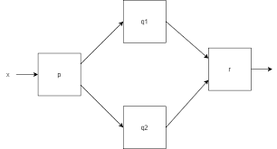
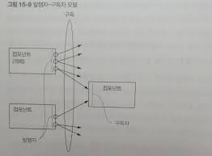

# 15. CompletableFuture와 리액티브 프로그래밍 컨셉의 기초

## 15.1 동시성을 구현하는 자바 지원의 진화

### 15.1.1 스레드와 높은 수준의 추상화

7장에서는 자바 스트림으로 외부 반복(명시적 루프) 대신 내부 반복을 통해 얼마나 쉽게 병렬성을 달성할 수 있는지 설명했다.

    스트림을 이용해 스레드 사용 패턴을 추상화할 수 있다.

자바 5의 ExecutorService 개념과 스레드 풀을 살펴보자

### 15.1.2 Executor와 스레드 풀

자바 5는 Executor 프레임워크와 스레드 풀을 통해 스레드의 힘을 높은 수준으로 끌어올리는, 즉 자바 프로그래머가 테스크 제출과 실행을 분리할 수 있는 기능을 제공했다.

자바 ExecutorService는 Task를 Submit하고 나중에 결과를 수집할 수 있는 인터페이스를 제공한다. 프로그램은 newFixedThreadPool 같은 팩토리 메서드 중 하나를 이용해 스레드 풀을 만들어 사용할 수 있다.

```ExecutorService newFixedThreadPool(int nThreads)```

이 메서드는 워커 스레드라 불리는 nThreads를 포함하는 ExecutorService를 만들고 이들을 스레드 풀에 저장한다.

이 방식의 장점은 하드웨어에 맞는 수의 테스트를 유지함과 동시에 수천개의 테스크를 스레드 풀에 아무 오버헤드 없이 제출할 수 있다는 점이다.

프로그래머는 테스크(Runnable or Callable)를 제공하면 스레드가 이를 실행한다.

`스레드 풀이 나쁜 이유`

거의 모든 관점에서 스레드를 직접 사용하는 것보다 스레드 풀을 이용하는 것이 바람직하지만 두가지 사항을 주의해야 한다.

1. k 스레드를 가진 스레드 풀은 오직 k만큼의 스레드를 동시에 실행할 수 있다.
    > 초과로 제출된 테스크는 큐에 저장되며 이전에 테스크중 하나가 종료되기 전까지는 스레드에 할당하지 않는다.
2. 중요한 코드를 실행하는 스레드가 죽는 일이 발생하지 않도록 보통 자바 프로그램은 main이 반환하기 전에 모든 스레드의 작업이 끝나길 기다린다.
    > 따라서 프로그램을 종료하기 전에 모든 스레드 풀을 종료하는 습관을 갖는 것이 중요하다1

### 15.1.3 스레드의 다른 추상화 : 중첩되지 않은 메서드 호출

엄격한 포크/조인: 스레드 생성과 join()이 한 쌍처럼 중첩된 메서드 호출 내에 추가된 것
> 스레드 생성과 join()이 한 메서드안에 있는것?

한 메서드에 없는걸 여유로운 포크/조인 이라 한다.

15장에서는 사용자의 메서드 호출에 의해 스레드가 생성되고 메서드를 벗어나 계속 실행되는 동시성 형태에 초점을 둔다.

    이런 종류, 특히 메서드 호출자에 기능을 제공하도록 메서드가 반환된 후에도 만들어진 테스크 실행이 계속되는 메서드를 비동기 메서드라 한다.

이들 메서드를 사용할 때 위험성이 따른다.

1. race condition 문제
2. 기존 실행 중이던 스레드가 종료되지 않은 상황에서 자바의 main() 메서드가 반환하면 어떻게 될까? 아래 두가지 방법 모두 안전하지 못하다.<br>
    애플리케이션을 종료하지 못하고 모든 스레드가 실행을 끝낼 때까지 기다린다.<br>
    애플리케이션 종료를 방행하는 스레드를 강제종료(kill)시키고 애플리케이션을 종료한다.
>
    자바 스레트는 setDaemon() 메서드를 이용해 데몬 또는 비데몬으로 구분시킬 수 있다.
    데몬 스레드는 애플리케이션이 종료될때 강제종료되는 스레드
    main() 메서드는 모든 비데몬 스레드가 종료될 때까지 프로그램을 종료하지 않고 기다린다.

## 동기 API와 비동기 API

실행하는데 오랜 시간이 걸리는 f,g 메서드가 있다고 하자.

f,g의 작업을 컴파일러가 완전하게 이해하기 어려우므로 보통 자바 컴파일러는 코드 최적화와 관련한 아무 작업도 수행하지 않을 수 있다.

별도의 스레드로 f와 g를 실행하는 코드는 복잡하다.

```java
Thread t1 = new Thread(() -> {result.left = f(x)});
Thread t2 = new Thread(() -> {result.right = g(x)});
t1.start();
t2.start();
t1.join();
t2.join();
System.out.println(result.left+result.right);
```

Runnable(Thread의 인터페이스) 대신 Future API 인터페이스를 이용해 코드를 더 단순화할 수 있다.<br>
(이미 ExecutorService로 스레드 풀을 설정했다고 가정)

```java
ExecutorService executorService = Executors.newFixedThreadPool(2);
Future<Integer> y = executorService.submit(()->f(x));
Future<Integer> z = executorService.submit(()->g(x));
System.out.println(y.get() + z.get());

executorService.shutdown();
```

여전히 이코드도 명시적인 submit 메서드 호출 같은 불필요한 코드로 오염되었다.

    명시적 반복 대신 스트림을 이용해 내부 반복으로 바꾼것처럼 비슷한 방법으로 이 문제를 해결해야 한다

문제 해결은 비동기 API라느 기능으로 API를 바꿔서 해결할 수 있다.

### 15.2.1  Future 형식 API

첫번째 대안, 일단 f,g의 시그니처를 다음처럼 바꾼다<br>
int f(int x) => Future\<Integer\> f(int x);

그리고 다음처럼 호출이 바뀐다.

```java
Future<Integer> y = f(x);
Future<Integer> z = g(x);
System.out.println(y.get() + z.get());
```

### 15.2.2 리액티브 형식 API

두번째 대안에서 핵심은 f,g의 시그니처를 바꿔서 콜백 형식의 프로그래밍을 이욯하는 것이다.

```void f(int x, IntConsumer dealWithResult);```

f에 추가 인수로 콜백을 전달해서 f의 바디에서는 return 문으로 결과를 반환하는 것이 아니라, 결과가 준비되면 이를 람다로 호출하는 테스크를 만드는 것이 비결이다.

f는 바디를 실행하면서 테스크를 만든 다음 즉시 반환하므로 코드 형식이 다음처럼 바뀐다.

```java
f(x, (int y) -> {
    result.left = y;
    ...
})

...
```

근데 이것도 문제가 있음

### 15.2.3 sleep(그리고 기타 blocking 동작)은 해로운 것으로 간주

```java
work1();
Thread.sleep(10000); // 10초 동안 잠
work2();
```

위 코드보다 아래코드가 훨씬 낫다.

```java
ScheduledExecutorService scheduledExecutorService = Executors.newScheduledThreadPool(1);
work1();
scheduledExecutorService.schedule(ScheduledExecutorServiceExample::work2, 10, TimeUnit.SECONDS);
scheduledExecutorService.shutdown();
```

위와 아래의 차이점은,

위 코드는 work1이 수행된후 10초동안 sleep한다. 그리고 꺠어나서 work2를 실행한 다음 종료하고 워커 스레드를 해제한다.

아래 코드는 work1을 실행하고 종료한다. 하지만 work2가 10초 뒤에 실행될 수 있도록 큐에 추가한다.

    위 코드는 sleep 동안 귀중한 스레드 자원을 점유하는 반면, 아래 코드는 다른 작업이 실행될 수 있도록 허용한다는 점이다.
>
    테스크를 만들 때는 이런 특징을 잘 활용해야 한다. 테스크가 실행되면 귀중한 자원을 점유하므로 테스크가 끝나서 자원을 해제하기 전까지 테스크를 계속 실행해야 한다. 테스크를 block하는 것보다는 다음 작업을 테스크로 제출하고 현재 테스크는 종료하는 것이 바람직하다.

### 15.2.5 비동기 API에서 예외는 어떻게 처리하는가?

Future를 구현한 CompletableFuture에서는 런타임 get() 메서드에 예외를 처리할 수 있는 기능을 제공하며 회복할 수 있도록 exceptionally() 같은 메서드도 제공한다.

리액티브 형식의 비동기 API에서는 return 대신 기존 콜백이 호출되므로 예외가 발생했을 때 실행될 추가 콜백을 만들어 인터페이스를 바꿔야 한다.

    예외 터졌을때 대처할 메서드를 인자로 받을 수 있게

자바 9 플로 API에서는 여러 콜백을 한 객체(Subscriber\<T\> 클래스)로 감싼다.
```java
void onComplete();
void onError(Throwable throwable);
void onNext(T item);
```

값이 있을때(onNext), 도중에 에러가 발생했을 때(onError), 값을 다 소진했거나 에러가 발생해서 더이상 처리할 데이터가 없을때(onComplete)

```void f(int x, Subscriber<Integer> s);```

## 15.3 박스와 채널 모델

동시성 모델을 가장 잘 설계하고 개념화하기 위한 기법을 박스와 채널 모델이라고 부른다.



박스와 채널 모델로 대규모 시스템 구현의 추상화 수준을 높일 수 있다.

## 15.4 CompletableFuture와 콤비네이터를 이용한 동시성

자바 8에서는 Future 인터페이스의 구현인 CompletableFuture를 이용해 Future를 조합할 수 있는 기능을 추가했다.

    CompletableFuture는 실행할 코드 없이 Future를 만들 수 있도록 허용하며 complete() 메서드를 이용해 나중에 어떤 값을 이용해 다른 스레드가 이를 완료할 수 있고 get()으로 값을 얻을 수 있도록 허용한다.

f(x)와 g(x)를 동시에 실행해 합계를 구하는 코드를 다음처럼 구현할 수 있다.

```java
ExecutorService executorService = Executors.newFixedThreadPool(10);
int x = 1337;

CompletableFuture<Integer> a = new CompletableFuture<>();
executorService.submit(() -> a.complete(f(x)));
int b = g(x);
System.out.println(a.get() + b);

executorService.shutdown();
```

위 코드는 f(x)의 실행이 끝나지 않았을때 get()을 기다려야 하므로 프로세싱 자원을 낭비할 수 있다.

다음 코드를 보자

```java
ExecutorService executorService = Executors.newFixedThreadPool(10);
int x = 1337;

CompletableFuture<Integer> a = new CompletableFuture<>();
CompletableFuture<Integer> b = new CompletableFuture<>();
CompletableFuture<Integer> c = a.thenCombine(b, (y, z)-> y + z);
executorService.submit(() -> a.complete(f(x)));
executorService.submit(() -> b.complete(g(x)));

System.out.println(c.get());
executorService.shutdown();
```

여기서 thenCombine이 핵심이다. Future a와 Future b의 결과를 알지 못한 상태에서 thenCombine은 두 연산이 끝났을 때 스레드 풀에서 실행된 연산을 받는다. 

`결과를 추가하는 세번쨰 연산 c는 다른 두작업이 끝날 때까지는 스레드에서 실행되지 않는다`

따라서 기존의 두가지 버전의 코드에서 발생했던 block 문제가 어디서도 일어나지 않는다.

-> 병렬 실행의 효율성은 높이고 데드락은 피하는 최상의 해결책을 구현할 수 있다.

## 15.5 발행-구독 그리고 리액티브 프로그래밍

Future는 `한 번`만 실행해 결과를 제공한다.

반면 리액티브 프로그래밍은 시간이 흐르면서 여러 Future 같은 객체를 통해 여러 결과를 제공한다.

자바 9에서는 java.util.concurrent.Flow의 인터페이스에 발행-구독 모델을 적용해 리액티브 프로그래밍을 제공한다.

플로 API 짧게 정리(17장에서 자세히 봄)

1. 구독자가 구독할 수 있는 발행자
2. 이 연결을 구독(subscription)이라 한다.
3. 이 연결을 이용해 메시지(또는 이벤트로 알려짐)를 전송한다.



    대표적인 예시로 액셀이 있다.

    A1, B1에 숫자를 넣고 C1에서 결과를 본다고 하면,

    C1에는 =A1+B1으로 설정되어있음 -> A1과 B1에 있는 값을 합친다.

    여기서 A1이나 B1의 값이 바뀌면 C1의 값도 자동으로 바뀐다.
    
    -> C1은 A1과 B1을 항상 감시하고 있다.

    여기서 발행자가 A1, B1
    구독자가 C1
    C1이 A1, B1을 구독했다.

압력: 처음에 약간의 sms 메시지가 있는 새폰에서는 가입이잘 동작할 수 있지만 몇년후에느 매초마다 수천개의 메시지가 전달되는 상황

(역압력 같은 내용은 중요하므로 다음 절에서 설명한다)

## 15.6 리액티브 시스템 vs 리액티브 프로그래밍

리액티브 시스템은 런타임환경이 변화에 대응하도록 전체 아키텍쳐가 설계된 프로그램을 가리킨다.

리액티브 프로그래밍을 이용해 리액티브 시스템을 구현할 수 있다.

## 15.7 마치며

스레드 풀은 보통 유용하지만 block되는 테스크가 많아지면 문제가 발생한다.

메서드를 비동기로 만들면 병렬성을 추가할 수 있으며 부수적으로 루프를 최적화한다.

CompletableFuture 클래스는 한 번의 비동기 연산을 표현한다. 콤비네이터로 비동기 연산을 조합함으로 Future를 이용할 때 발생했던 기존의 blocking 문제를 해결할 수 있다.

Flow API는 발행-구독 프로토콜, 역압력을 이용하면 자바의 리액티브 프로그래밍의 기초를 제공한다.

리액티브 프로그래밍을 이용해 리액티브 시스템을 구현할 수 있다.


---

결국 race condition 문제를 조심해야 하고,

다른 스레드 기다리는 동안 sleep되거나 block되는건 별로라고 하네 - 기다리는 동안 자원 낭비하니까

그리고 멀티스레드를 사용하겠다고 짜는 코드가 지저분해지는 것도 별로고

위 문제들을 해결하는 방법이 15,16,17에 있음 - 방법은 아니고 도와주는 도구