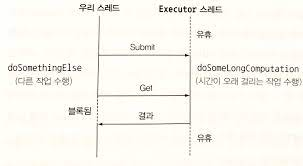
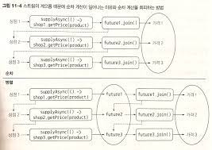
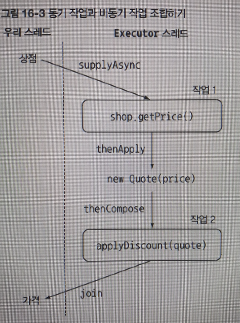
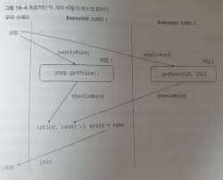

# 16 CompletableFuture: 안정적 비동기 프로그래밍

이번 장에서는 실용적인 예제를 통해 자바 8에서 제공하는 Future의 구현 CompletableFuture이 비동기 프로그램에 얼마나 큰 도움을 주는지 설명한다. 또한 자바 9에서 추가된 내용도 소개할 것이다.

## 16.1 Future의 단순 활용

자바 5부터는 미래의 어느 시점에 결과를 얻는 모델에 활용할 수 있도록 Future 인터페이스를 제공하고 있다.

    비동기 계산을 모델링하는데 Future를 이용할 수 있으며, Future는 계산이 끝났을 때 결과에 접근할 수 있는 참조를 제공한다.
    시간이 걸릴 수 있는 작업을 Future 내부로 설정하면 호출자 스레드가 결과를 기다리는 동안 다른 유용한 작업을 수행할 수 있다.

    마치 단골 세탁소에 한 무더기의 옷을 드라이클리닝 서비스를 맡기는 것처럼,
    세탁소 주인은 드라이클리닝이 언제 끝날 지 적힌 영수증(Future)을 줄 것이다.
    드라이클리닝이 진행되는 동안 우리는 원하는 일을 할 수 있다.

Future는 저수준의 스레드에 비해 직관적으로 이해하기 쉽다는 장점이 있다.

Future를 이용하려면 시간이 오래 걸리는 작업을 Callable 객체 내부로 감싼 다음에 ExecutorService에 제출해야 한다.

다른 작업을 처리하다가 시간이 오래 걸리는 작업의 결과가 필요한 시점이 되었을 때 Future의 get 메서드로 결과를 가져올 수 있다.<br>
get 메서드를 호출했을 때 이미 계산이 완료되어 결과가 준비되었다면 즉시 결과를 반환하지만 결과가 준비되지 않았다면 작업이 완료될때까지 우리 스레드를 블록시킨다.



여기서 만약 오래 걸리는 작업이 영원히 끝나지 않으면 어떻게 될까?<br>
-> 이 문제를 방지하기 위해 get 메서드를 오버로드해서 우리 스레드가 대기할 최대 타임아웃 시간을 설정하는 것이 좋다.

### 16.1.1 Future 제한

Future의 결과가 있을때 호출하는 메서드 A, 결과가 없을때 호출하는 메서드 B, 타임아웃되었을때 호출하는 메서드 C 등을 구현해야 할때, Future로 이를 구현하는 것은 쉽지 않다. 이들의 의존성을 표현하기가 어렵다

이 장에서는 위 기능을 포함하여 다양한 기능을 선언형으로 이용할 수 있도록 자바 8에서 새로 제공하는 CompletableFuture 클래스(Future 인터페이스를 구현한 클래스)를 살펴본다. 

Stream과 CompletableFuture는 비슷한 패턴, 즉 람다 표현식과 파이프라이닝을 활용한다.

    따라서 Future와 CompletableFuture의 관계를 Collection과 Stream의 관계에 비유할 수 있다.

### 16.1.2 CompletableFuture로 비동기 애플리케이션 만들기

CompletaableFuture를 이용해서 다음과 같은 기술을 배울 수 있다.

1 - 고객에게 비동기 API를 제공하는 방법을 배운다.

2- 동기 API를 사용해야 할때 코드를 비블록으로 만드는 방법을 배운다. 두 개의 비동기 동작을 파이프라인으로 만드는 방법과 두 개의 동작 결과를 하나의 비동기 계산으로 합치는 방법을 살펴본다.

3 - 비동기 동작의 완료에 대응하는 방법을 배운다. 모든 비동기 동작에서 결과를 얻을 때까지 기다리는 것이 아니라 각 동작에서 결과를 얻을때마다 즉시 결과를 반환하는 방법을 배운다.

// 동기 API와 비동기 API

## 16.2 비동기 API 구현

### 16.2.1 동기 메서드를 비동기 메서드로 변환

기존 메서드의 반환타입을 Future로 바꿔야 한다.<br>
```String -> Future<String>```<br>
-> 호출자 스레드가 블록되지 않고 다른 작업을 실행할 수 있다

간단히 말해 Future는 결과값의 핸들일 뿐이며 계산이 완료되면 get 메서드로 결과를 얻을 수 있다.<br>
위 반환 타입에서 String은 해당 메서드가 모두 실행되고 반환된다.<br>
하지만 Future<String>은 해당 메서드의 실행에 관계없이 즉시 반환된다 & get으로 나중에 결과를 얻을 수 있음

```java
public Future<Double> getPriceAsync(String product) {
CompletableFuture<Double> futurePrice 
                = new CompletableFuture<>(); // 계산 결과를 포함한 CompletableFuture 생성
new Thread(() -> {
    double price = calculatePrice(product); // 다른 스레드에서 비동기적으로 실행
    futurePrice.complete(price); // 계산이 완료되면 Future에 값을 설정
}).start();
return futurePrice; // 계산 결과가 완료되길 기다리지 않고 Future를 반환한다.
}
```

getPriceAsync 메서드를 실행하고, 다른 일을 하다가, 결과값을 받고 싶을때 Future의 get메서드를 통해 결과값을 받는다.

    이때 calculatePrice의 실행이 완료되지 않았다면 계속 기다린다(block)

### 16.2.2 에러 처리 방법

caculatePrice 메서드에서 에러가 발생한다면 어떻게 될까?

예외가 발생하면 해당 스레드에만 영향을 미친다. 즉, 에러가 발생해도 가격 계산은 계속 진행되며 일의 순서가 꼬인다.

결국 클라이언트는 get 메서드가 반환될때까지 영원히 기다리게 될 수도 있다.

이처럼 블록 문제가 발생할 수 있는 상황에서는 타임아웃을 활용하는 것이 좋다.

completeExceptionally 메서드를 이용해서 CompletableFuture 내부에서 발생한 예외를 클라로 전달해야 한다.

```java
public Future<Double> getPriceAsync(String product) {
CompletableFuture<Double> futurePrice 
                = new CompletableFuture<>();
new Thread(() -> {
    try{
        double price = calculatePrice(product);
        futurePrice.complete(price);
    } catch(Exception ex){
        futurePrice.completeExceptionally(ex); // 도중에 문제가 발생하면 에러를 포함시켜 Future를 종료
    }
}).start();
return futurePrice;
}
```

`팩토리 메서드 supplyAsync로 CompletableFuture 만들기`

여기서 조금더 간단하게 CompletableFuture를 만드는 방법도 있다.

```java
public Future<Double> getPriceAsync(String produc){
    return CompletableFuture.supplyAsync(() -> calculatePrice(product));
}
```

supplyAsync 메서드는 Supplier를 인수로 받아서 CompletableFuture를 반환한다. & CompletableFuture는 Supplier를 실행해서 비동기적으로 결과를 생성한다.

ForkJoinPool의 Executor 중 하나가 Supplier를 실행할 것이다.

    여기서 두 번째 인수를 받는 오버로드 버전의 supplyAsync 메서드를 이용해서 다른 Executor를 지정할 수 있다.

여기서 만든 CompletableFuture는 위와 같은 방법으로 에러를 관리한다.

## 16.3 비블록 코드 만들기

지금부터는 블록 메서드를 사용할 수밖에 없는 상황에서 멀티쓰레드를 이용하는 방법을 알아본다.

### 16.3.1 병렬 스트림으로 요청 병렬화하기

병렬 스트림을 이용해서 순차 계산을 병렬로 처리해서 성능을 개선할 수 있다.

```java
shops.parallelStream().map(shop -> /* 오래걸리는 메서드 */ ).collect(toList()); // List<String> 반환 가정
```

### 16.3.2 CompletableFuture로 비동기 호출 구현하기

```java
shops.stream().map(shop -> CompletableFuture.supplyAsync(
    () -> /* 오래걸리는 메서드 */
)).collect(toList());
```

위 코드로 List\<CompletableFuture\<String\>\>을 얻을 수 있다. 여기서 모든 CompletableFuture의 동작이 완료되고 결과를 추출한 다음에 리스트를 반환해야 한다.

두번째 map 연산을 List\<CompletableFuture\<String\>\>에 적용할 수 있다. 즉, 리스트의 모든 CompletableFuture에 join을 호출해서 모든 동작이 끝나기를 기다린다.

    CompletableFuture의 join 메서드는 Future의 get 메서드와 같은 의미를 갖는다.

    다만 join은 아무 예외도 발생시키지 않는다.
    따라서 join 메서드를 try/catch로 감쌀 필요가 없다.

이를 적용한 코드

```java
public List<String> findPricesFuture(String product) {
    List<CompletableFuture<String>> priceFutures =
        shops.stream()
            .map(shop -> /* 오래걸리는 메서드 */)
            .collect(Collectors.toList());

    List<String> prices = priceFutures.stream()
        .map(CompletableFuture::join)
        .collect(Collectors.toList());
    return prices;
}
```

두개의 스트림 파이프라인으로 처리했다. 스트림은 lazy한 특성이 있으므로 하나의 파이프라인으로 연산을 처리했다면 모든 가격 정보 요청 동작이 동기적, 순차적으로 이루어지는 결과가 된다.



그림에서 윗부분은 하나의 파이프라인으로 처리했을때의 과정이다.<br>
아랫부분은 두개의 파이프라인으로 처리했을떄의 과정이다.

윗부분은 supplyAsync를 적용하고 바로 join을 했기때문에, 비동기의 의미가 없어진다.

---

위 코드처럼 많은 메서드를 이용해서 비동기 방식을 구현했지만, 이 코드의 성능은 병렬스트림과 크게 차이나지 않는다.

그럼 CompletableFuture 버전은 병렬 스트림과 다를 것이 없을까?

결과적으론 비슷하지만, CompletableFuture는 병렬 스트림 버전에 비해 `작업에 이용할 수 있는 다양한 Executor를 지정할 수 있다`는 장점이 있다.

    따라서 Executor로 스레드 풀의 크기를 조절하는 등 애플리케이션에 맞는 최적화된 설정을 만들 수 있다.

### 16.3.4 커스텀 Executor 사용하기

한 상점에 하나의 스레드가 할당될 수 있도록, 즉 가격 정보를 검색하려는 상점 수만큼 스레드를 갖도록 Executor를 설정한다.

스레드 수가 너무 많으면 오히려 서버가 크래시될 수 있으므로 하나의 Executor에서 사용할 스레드의 최대 개수는 100 이하로 설정하는 것이 바람직하다.

    스레드 풀 크기 조절 방안은 CPU 마다 다르다

```java
private final Executor executor = Executors.newFiexdThreadPool(Math.min(shops.size(), 100)),
    new ThreadFactory(){
        public Thread newThread(Runnable r){
            Thread t = new Thread(r);
            t.setDaemon(true); // 데몬 스레드를 사용
            return t;
        }
    }
```

    우리가 만드는 풀은 데몬 스레드를 포함한다. 
    데몬 스레드는 자바 프로그램이 종료될때 강제로 실행이 종료될 수 있다.

이제 새로운 Executor를 팩토리 메서드 supplyAsync의 두번째 인수로 전달할 수 있다.<br>
```CompletableFuture.supplyAsync(() -> /* 오래걸리는 메서드 */, executor);```

이 코드의 성능은 잘나온다.(생략)<br>
결국 애플리케이션의 특성에 맞는 Executor를 만들어 CompletableFuture를 활용하는 것이 바람직하다는 사실을 확인할 수 있다.<br>
비동기 동작을 많이 사용하는 상황에서는 지금 살펴본 기법이 가장 효과적일 수 있음을 기억하자.

    `스트림 병렬화와 CompletableFuture 병렬화`

    지금까지 병렬 스트림 또는 CompletableFuture를 이용해서, 컬렉션 계산을 병렬화하는 방법을 살펴봤다.
    다음을 참고하면 어떤 병렬화 기법을 사용할 것인지 선택하는 데 도움이 된다.

    I/O가 포함되지 않은 계산 중심의 동작을 실행할 때는 `스트림 인터페이스`가 가장 구현하기 간단하며 효율적일 수 있다
    (모든 스레드가 계산 작업을 수행하는 상황에서는 프로세스 코어 수 이상의 스레드를 가질 필요가 없다)

    반면 작업이 I/O를 기다리는 작업을 병렬로 실행할 때는 CompletableFuture가 더 많은 유연성을 제공하며 대기/계산의 비율에 적합한 스레드 수를 설정할 수 잇다.
    (특히 스트림의 lazy 특성 때문에 스트림에서 I/O를 실제로 언제 처리할지 예측하기 어려운 문제도 있다)

## 16.4 비동기 작업 파이프라인 만들기

### 16.4.3 동기 작업과 비동기 작업 조합하기

```java
public List<String> findPrices(String product){
    List<CompletableFuture<String>> priceFutures = 
       shops.stream()
            .map(shop -> CompletableFuture.supplyAsync(
                () -> shop.getPrice(product), executor))
            .map(future -> future.thenApply(Quote::parse))
            .map(future -> future.thenCompose(quote ->
                        CompletableFuture.supplyAsync(
                            () -> Discount.applyDiscount(quote), executor)))
            .collect(toList());

    return priceFutures.stream()
                    .map(CompletableFuture::join)
                    .collect(toList());
}
```

위 코드는 getPrice, Quote.parse, applyDiscount 메서드 3개를 적용하는 코드이다.<br>
코드의 과정을 그림으로 보자



`thenApply와 thenCompose의 차이점`

thenApply는 이전 메서드와 동기적으로 실행된다. -> 하나의 메서드처럼

thenCompose는 이전 메서드와 비동기적으로 실행된다. & Executor를 새로 지정할 수 있다.

즉 위 코드의 핵심 메서드는 세개(getPrice, parse, applyDiscount) 이지만, 결국 두가지 CompletableFuture로 이루어진 연쇄적으로 수행되는 두개의 비동기 동작을 만들 수 있다.
- 상점에서 가격정보를 얻어 와서 Quote로 변환하기
- 변환된 Quote를 Discount 서비스로 전달해서 할인된 최종가격 획득하기

    thenApply는 원격 서비스나 I/O가 없느 메서드 일때, 즉시 지연없이 동작을 수행시킬때 쓰자
    thenCompose는 원격 서비스나 I/O에 해당하는 메서드 일때, 비동기적으로 실행시키고 싶을때 쓰자

---

자바 8의 CompletableFuture API는 이와 같이 두 비동기 연산을 파이프라인으로 만들 수 있도록 thenCompose 메서드를 제공한다.

    thenCompose 메서드도 Async로 끝나는 버전이 존재한다. Async로 끝나지 않는 메서드는 이전 작업을 수행한 스레드와 같은 스레드에서 작업을 실행함을 의미하며, 
    Async로 끝나는 메서드는 다음 작업이 다른 스레드에서 실행되도록 스레드 풀로 작업을 제출한다.

### 16.4.4 독립 CompleatableFuture와 비독립 CompletableFuture 합치기

위 코드와 달리 실전에서는, 독립적으로 실행된 두개의 CompletableFuture 결과를 합쳐야 하는 상황이 종종 발생한다.

이런 상황에서는 thenCombine 메서드를 사용한다. thenCombine 메서드는 BiFunction을 두번쨰 인수로 받는다.<br>
(BiFunction은 두개의 CompletableFuture 결과를 어떻게 합칠지 정의한다, thenCombine도 Async 버전이 존재한다)

```java
Future<Double> futurePriceInUSD = 
       CompletableFuture.supplyAsync(() -> shop.getPrice(product)) // 첫번째 테스크
            .thenCombine(
                CompletableFuture.supplyAsync(
                    () -> ExchangeService.getRate(Money.EUR, Money.USD)), // 두번쨰 테스크
                (price, rate) -> price * rate); // 두 결과를 곱해서 정보를 합친다
```

위 코드의 과정을 그림으로 보자



여기서 합치는 연산은 단순한 곱셈이므로 별도의 테스크에서 수행하여 자원을 낭비할 필요가 없다.<br>
따라서 thenCombineAsync 대신 thenCombine 메서드를 이용했다.

### 16.4.5 Future의 리플렉션과 CompletableFuture의 리플렉션

CompletableFuture는 람다 표현식을 사용한다.

람다 덕분에 다양한 동기 Task, 비동기 Task를 활용해서 복잡한 연산 수행 방법을 효과적으로 쉽게 정의할 수 있는 선언형 API를 만들 수 있다.

### 16.4.6 타임아웃 효과적으로 사용하기

Future의 계산 결과를 읽을 때는 무한정 기다리는 상황이 발생할 수 있으므로 블록을 하지 않는 것이 좋다.

자바 9에서는 CompletableFuture에서 제공하는 몇가지 기능을 이용해 이런 문제를 해결할 수 있다.

`orTimeout 메서드`는 지정된 시간이 지난 후에 CompletableFuture를 TimeoutException으로 완료하면서 또 다른 CompletableFuture를 반환할 수 있도록 내부적으로 ScheduledThreadExecutor를 활용한다. 그리고 사용자가 쉽게 이해할 수 있는 메시지를 제공할 수 있다.

일시적으로 서비스를 이용할 수 없는 상황에서 꼭 서버에서 얻은 값이 아닌 미리 지정된 값을 사용할 수 있는 상황도 있다.

`completeOnTimeout 메서드`를 이용하면 이 기능을 쉽게 구현할 수 있다.

```java
CompletableFuture<Double> futurePriceInUSD =
          CompletableFuture.supplyAsync(() -> shop.getPrice(product))
          .thenCombine(
              CompletableFuture.supplyAsync(
                  () ->  ExchangeService.getRate(Money.EUR, Money.USD))
              // 자바 9에 추가된 타임아웃 관리 기능
              .completeOnTimeout(ExchangeService.DEFAULT_RATE, 1, TimeUnit.SECONDS),
              (price, rate) -> price * rate
          )
          // 자바 9에 추가된 타임아웃 관리 기능
          .orTimeout(3, TimeUnit.SECONDS);
```

    completeOnTimeout 메서드는 CompletableFuture를 반환하므로 이 결과를 다른 CompletableFuture 메서드와 연결할 수 있다.

## 16.5 CompletableFuture의 종료에 대응하는 방법

실전에서 사용하는 다양한 원격 서비스는 얼마나 지연될지 예측하기 어렵다.

이제 CompletableFuture의 모든 결과를 기다리지 않고, CompletableFuture가 결과를 제공할 때마다 즉시 보여줄 수 있는 코드를 만들어보자.

### 16.5.1 CompletableFuture가 반환할때마다 출력

일단 기존 List\<CompletableFuture\<String\>\>를 반환하는 메서드의 리턴 타입을 바꿔야한다.<br>
(그냥 collect를 안하면 됨)<br>
Stream\<CompletableFuture\<String\>\> findPricesStream(String product) { ... }

그리고 자바 8의 CompletableFuture API는 thenAccept 메서드로 이 기능을 제공한다.

findPricesStream("myPhone").map(f -> f.thenAccept(System.out::println)); // Consumer 인자로 받음

    thenAccept도 Async 버전이 존재한다.thenAcceptAsync 메서드는 CompletableFuture가 완료된 스레드가 아니라 새로운 스레드를 이용해서 Consumer를 실행한다.
    (하지만 이는 불필요한 Context Switching이 발생할 수 있다)
    무조건적으로 Async를 쓰는 것은 좋지 않다.

thenAccept 메서드는 CompletableFuture가 생성한 결과를 어떻게 소비할지 미리 지정했으므로 CompletableFuture\<Void\>를 반환한다.

---

여기서 모든 결과를 받고 전부다 실행했다는 말을 출력하고 싶다고 할때,<br>
CompletableFuture\<Void\>를 배열로 추가하고 실행 결과를 기다려야 한다.

```java
CompletableFuture[] futures = findPricesStream(product)
    .map(f -> f.thenAccept(s -> System.out.println(s + " (done in " + ((System.nanoTime() - start) / 1_000_000) + " msecs)")))
    .toArray(size -> new CompletableFuture[size]);
CompletableFuture.allOf(futures).join();
```

팩토리 메서드 allOf는 CompletableFuture 배열을 입력으로 받아 CompletableFuture\<Void\>를 반환한다.

allOf 메서드가 반환하는 CompletableFuture에 join을 호출하면 원래 스트림의 모든 CompletableFuture의 실행 완료를 기다릴 수 있다.

처음으로 받았을때 확인하고 싶을때 `anyOf 메서드` 사용<br>
CompletableFuture 배열을 입력으로 받아서 CompletableFuture\<Object\>를 반환한다.<br>
CompletableFuture\<Object\>는 처음으로 완료한 CompletableFuture의 값으로 동작을 완료한다.

## 16.6 로드맵

17장에서는 CompletableFuture(연산 또는 값으로 종료하는 일회성 기법)의 기능이 한번에 종료되지 않고 일련의 값을 생상하도록 일반화하는 자바 9 Flow API를 살펴본다.

## 16.7 마치며

// TODO


