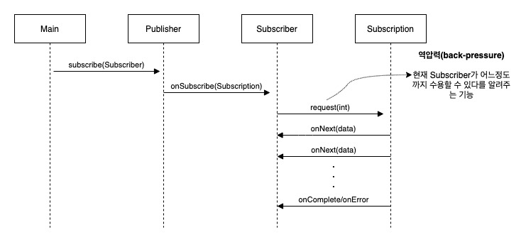
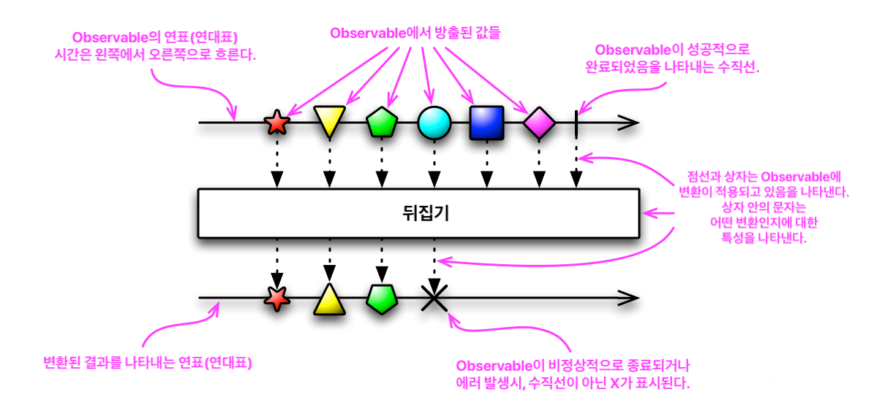
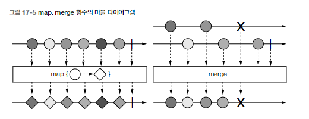

# 17 리액티브 프로그래밍

다음과 같은 세가지의 이유로 리액티브 프로그래밍 패러다임의 중요성이 증가하고 있다.

- 빅데이터: 보통 빅데이터는 페타바이트 단위로 구성되며 매일 증가한다.
- 다양한 환경: 모바일 디바이스에서 수천 개의 멀티 코어 프로세서로 실행되는 클라우드 기반 클러스터에 이르기까지 다양한 환경에 애플리케이션이 배포된다.
- 사용 패턴: 사용자는 1년 내내 항상 서비스를 이용할 수 있으며, 밀리초 단위의 응답 시간을 기대한다.

예전 소프트웨어 아키텍처로는 오늘날의 이런 요구사항을 만족시킬 수 없다.

---

리액티브 프로그래밍에서는 다양한 시스템과 소스에서 들어오는 데이터 항목 스트림을 비동기적으로 처리하고 합쳐서 이런 문제를 해결한다.

## 17.1 리액티브 매니패스토

리액티브 매니패스토는 리액티브 애플리케이션과 시스템 개발 핵심 원칙을 공식적으로 정의한다.

1 - 반응성(responsive): 리액티브 시스템은 빠를 뿐 아니라 더 중요한 특징으로 일정하고 예상할 수 있는 반응 시간을 제공한다. 결과적으로 사용자가 기대치를 가질 수 있다. 기대치를 통해 사용자의 확신이 증가하면서 사용할 수 있는 애플리케이션이라는 확인을 제공할 수 있다.<br>
2 - 회복성(resilient): 장애가 발생해도 시스템은 반응해야 한다. 컴포넌트 실행 복제, 여러 컴포넌트의 시간(sender와 receiver가 독립적인 생명주기를 가짐)과 공간(sender와 receiver가 다른 프로세스에서 실행됨) 분리, 각 컴포넌트가 비동기적으로 작업을 다른 컴포넌트에 위임하는 등 리액티브 매니페스토는 회복성을 달성할 수 있는 다양한 기법을 제시한다.<br>
3 - 탄력성(elastic): 애플리케이션의 생명주기 동안 다양한 작업 부하를 받게 되는데 이 다양한 작업 부하로 애플리케이션의 반응성이 위협받을 수 있다. 리액티브 시스템에서는 무서운 작업 부하가 발생하면 자동으로 관련 컴포넌트에 할당된 자원 수를 늘린다.<br>
4 - 메시지 주도(Message-driven): 회복성과 탄력성을 지원하려면 약한 결합, 고립, 위치 투명성 등을 지원할 수 있도록 시스템을 구성하는 컴포넌트의 경계를 명확하게 정의해야 한다. 비동기 메시지를 전달해 컴포넌트 끼리의 통신이 이루어진다. 이 덕분에 회복성(장애를 메시지로 처리)과 탄력성(주고 받은 메시지의 수를 감시하고 메시지의 양에 따라 적절하게 리소스를 할당)을 얻을 수 있다.

이들 원칙은 다양한 크기의 애플리케이션 상황에 적용할 수 있다. 하지만 이들 원칙을 어디에서 어떤 수준으로 적용할 수 있는지 자세히 확인할 필요가 있다.

### 17.1.1 애플리케이션 수준의 리액티브

애플리케이션 수준 컴포넌트의 리액티브 프로그래밍의 주요 기능은 비동기로 작업을 수행할 수 있다는 점이다.

    이벤트 스트림을 block하지 않고 비동기로 처리하는 것이 최신 멀티코어 CPU의 사용률을 극대화할 수 있는 방법이다.

이 목표를 달성할 수 있도록 리액티브 프레임워크와 라이브러리는 스레드(상대적으로 비싸고 희귀한 자원)를 Future, Actor, 일련의 콜백을 발생시키는 이벤트 루프 등과 공유하고 처리할 이벤트를 변환하고 관리한다.

    이들 기술은 스레드보다 가벼울 뿐 아니라 개발자에게 큰 이득을 제공한다. 개발자 입장에서는 이들 기술을 이용함으로 동기, 비동기 애플리케이션 구현의 추상 수준을 높일 수 있으므로 동기 블록, Race condition, Dead lock 같은 저 수준의 멀티스레드 문제를 직접 처리할 필요가 없어지면서 비즈니스 요구사항을 구현하는데 더 집중할 수 있다.

스레드를 다시 쪼개는 종류의 기술을 이용할 때는 메인 이벤트 루프 안에서는 절대 동작을 block하지 않아야 한다는 중요한 전제 조건이 항상 따른다. (DB나 파일 시스템 접근 등 모든 I/O 관련 동작이 block 동작에 속한다)

    CPU 관련 작업과 I/O 관련 작업을 분리하면 조금 더 정밀하게 풀의 크기 등을 설정할 수 있고 두 종류의 작업의 성능을 관찰할 수 있다.
    
    CPU 관련 작업은 실제로 할당된 CPU 코어 또는 스레드를 100퍼센트 활용한다. 
    반면 I/O 관련 작업에서는 CPU 코어나 스레드가 처리할 일이 없이 블록되는 상황이 태반이다.

### 17.1.2 시스템 수준의 리액티브

`리액티브 시스템`은 여러 애플리케이션이 한 개의 일관적인, 회복할 수 있는 플랫폼을 구성할 수 있게 해줄 뿐 아니라 이들 애플리케이션 중 하나가 실패해도 전체 시스템은 계속 운영될 수 있도록 도와주는 소프트웨어 아키텍처다.

리액티브 시스템의 주요 속성으로 메시지 주도를 꼽을 수 있다.

## 17.2 리액티브 스트림과 Flow API

리액티브 프로그래밍은 리액티브 스트림을 사용하는 프로그래밍이다.

    리액티브 스트림은 잠재적으로 무한의 비동기 데이터를 순서대로 그리고 block하지 않는 역압력을 전제해 처리하는 표준 기술이다.

    역압력은 발행-구독 프로토콜ㄹ에서 이벤트 스트림의 구독자가 발행자가 이벤트를 제공하는 속도보다 느린 속도로 소비하면서 문제가 발생하지 않도록 보장하는 장치다.

넷플릭스, 레드햇, 트위터, 라이트밴드 및 기타 회사들이 참여한 리액티브 스트림 프로젝트에서는 모든 리액티브 스트림 구현이 제공해야 하는 최소 기능 집합을 네 개의 관련 인터페이스로 정의했다.<br>
자바 9의 새로운 java.util.concurrent.Flow 클래스뿐 아니라 Akka 스트림(라이트밴드), RxJava(넷플릭스) 등 많은 서드 파티 라이브러리에서 이들 인터페이스를 구현한다.

### 17.2.1 Flow 클래스 소개

자바 9에서는 리액티브 프로그래밍을 제공하는 클래스 java.util.concurrent.Flow를 추가했다. 이 클래스는 정적 컴포넌트 하나를 포함하고 있으며 인스턴스화할 수 없다. Flow 클래스는 중첩됩 인터페이스 4개를 포함한다.

Publisher<br>
Subscriber<br>
Subscription<br>
Processor<br>

Publisher가 항목을 발행하면 Subscriber가 한 개씩 또는 한 번에 여러 항목을 소비하는데, Subscription이 이 과정을 관리할 수 있도록 Flow 클래스는 관련된 인터페이스와 정적 메서드를 제공한다.<br>
Publisher는 수많은 일련의 이벤트를 제공할 수 있지만 Subscriber의 요구사항에 따라 역압력 기법에 의해 이벤트 제공 속도가 제한된다. Publisher는 자바의 함수형 인터페이스로, Subscriber는 Publisher가 발행한 이벤트의 리스너로 자신을 등록할 수 있다.<br>
Subscription은 Publisher와 Subscriber 사이의 제어 흐름, 역압력을 관리한다.

이들 세 인터페이스 및 Processor 인터페이스를 보자.

```java
@FunctionalInterface
public interface Publisher<T>{
    void subscribe(Subscriber<? super T> s);
}
```

반면 Subscriber 인터페이스는 Publisher가 관련 이벤트를 발행할 때 호출할 수 있도록 콜백 메서드 네 개를 정의한다.

```java
public interface Subscriber<T>{
    void onSubscribe(Subscription s);
    void onNext(T t);
    void onError(Throwable t);
    void onComplete();
}
```

이들 이벤트는 다음 프로토콜에서 정의한 순서로 지정된 메서드 호출을 통해 발행되어야 한다.

onSubscribe onNext* (onError | onComplete)?

항상 처음에 onSubscribe가 호출되고, 이어서 onNext가 여러번 호출된다.<br>
이벤트 스트림은 영원히 지속되거나 아니면 onComplete 콜백을 통해 더 이상의 데이터가 없고 종료됨을 알릴 수 있으며, 또는 Publisher에 장애가 발생햇을 때는 onError를 호출할 수 있다.

Subscriber가 Publisher에 자신을 등록할 때 Publisher는 처음으로 onSubscribe 메서드를 호출해 Subscription 객체를 전달한다. 

Subscription 인터페이스는 메서드 두개를 정의한다. Subscription은 첫번째 메서드로 Publisher에게 주어진 개수의 이벤트를 처리할 준비가 되었음을 알릴 수 있다. 두번째 메서드로는 Subscription을 취소, 즉 Publisher에게 더 이상 이벤트를 받지 않음을 통지한다.

```java
public interface Subscription{
    void request(long n);
    void cancel();
}
```



위 그림은 Flow API에서 정의하는 인터페이스를 구현한 애플리케이션의 평범한 생명주기를 보여준다.

Flow 클래스의 네번째이자 마지막 멤버 Processor 인터페이스는 단지 Publisher와 Subscriber를 상속받을 뿐 아무 메서드도 추가하지 않는다.

```java
public interface Processor<T, R> extends Subscriber<T>, Publisher<R> {}
```

실제 이 인터페이스는 리액티브 스트림에서 처리하는 이벤트의 변환 단계를 나타낸다.

    Processor가 에러를 수신하면 이로부터 회복하거나(그리고 Subscription은 취소로 간주)
    즉시 onError 신호로 모든 Subscriber에 에러를 전파할 수 있다.
    마지막 Subscriber가 Subscription을 취소하면 Processor는 자신의 업스트림 Subscription도 취소함으로 취소 신호를 전파해야 한다.

### 17.2.2 첫번째 리액티브 애플리케이션 만들기

(자세한 구현은 책에서 확인)

request만큼 그냥 onNext 호출하면 스택 오버플로우 발생함

-> Executor를 Subscription에서 추가한 다음, 다른 스레드에서 Subscriber로 세 요소르 전달하는 방법 사용

### 17.2.3 Processor로 데이터 변환하기

사실 Processor의 목적은 Publisher를 구독한 다음 수신한 데이터를 가공해 다시 제공하는 것이다.

    Publisher한테 Processor는 Subscriber가 되고, Subscriber한테 Processor는 Publisher가 된다.
    -> 그래서 Processor는 Publisher, Subscriber를 동시에 상속 받는다.

### 17.2.4 자바는 왜 플로 API 구현을 제공하지 않는가?

자바 라이브러리는 보통 인터페이스와 구현을 제공하는 반면 플로 API는 구현을 제공하지 않는다.

    일례로 리스트 API는 ArrayList<T>를 포함한 다양한 클래스가 List<T> 인터페이스를 구현한다.

이러한 이유는, API를 만들 당시 Akka, RxJava 등 다양한 리액티브 스트림의 자바 코드 라이브러리가 이미 존재했기 때문이다. 원래 같은 발행-구독 사상에 기반해 리액티브 프로그래밍을 구현했지만, 이들 라이브러리는 독립적으로 개발되었고 서로 다른 이름규칙과 API를 사용했다. 

    JPA랑 하이버네이트 같은건가?
    하이버네이트가 먼저 나오고, 이를 표준화한 인터페이스인 JPA가 나옴

자바 9의 표준화 과정에서 자신만의 방법이 아닌 이들 라이브러리는 공식적으로 java.util.concurrent.Flow의 인터페이스를 기반으로 리액티브 개념을 구현하도록 진화했다. 이 표준화 작업 덕분에 다양한 라이브러리가 쉽게 협력할 수 있게 되었다.

## 17.3 리액티브 라이브러리 RxJava 사용하기

RxJava는 자바로 리액티브 애플리케이션을 구현하는데 사용하는 라이브러리이다. 

    넷플릭스의 Rx 프로젝트의 일부로 시작됨

자바 플로 인터페이스는 ```import java.lang.concurrent.Flow.*```인데,<br>
Publisher의 구현인 Observable 같은 클래스는 ```import io.reactivex.Observable```이다.

    좋은 시스템 아키텍처 스타일을 유지하려면 시스템에서 오직 일부에 사용된 개념의 세부 사항을 전체 시스템에서 볼 수 있게 만들지 않아야 한다.
    따라서 Observable의 추가 구조가 필요한 상황에서만 Observable을 사용하고 그렇지 않으면 Publisher의 인터페이스를 사용하는 것이 좋다.
    (ArrayList를 사용하더라도, 파라미터 형식을 List로 설정함으로 구현 세부사항을 밖으로 노출하지 않는것처럼)
    (이때 ArrayList를 LinkedList로 바꾸더라도 기존 코드를 크게 바꿀 필요가 없다(대신 성능은 변하겠지))

---

RxJava는 Flow, Publisher를 구현하는 두 클래스(Flowable, Observable)를 제공한다.

여기서 Flowable은 역압력을 지원한다.<br>
Observable은 역압력을 지원하지 않는다.<br>
(이 클래스는 단순한 프로그램, 마우스 움직임 같은 사용자 인터페이스 이벤트에 더 적합하다)

    마우스 움직임을 느리게 하거나 멈출 수 없기 때문에 역압력 적용 불가능
    RxJava는 천개이하의 요소를 가진 스트림이나 마우스 움직임, 터치 이벤트 등 역압력을 적용하기 힘든 GUI 이벤트 그리고 자주 발생하지 않는 종류의 이벤트에 역압력을 적용하지 말 것을 권장한다.

(자세한 구현은 책에서 확인)

### 17.3.2 Observable을 변환하고 합치기

스트림에서 관심있는 요소만 거른 다른 스트림을 만들거나 매핑 함수로 요소를 변환하거나 두 스트림을 다양한 방법으로 합치는 등의 작업은 바로바로 이해하기 어렵다.

리액티브 스트림 커뮤니티는 마블 다이어그램이라는 시각적 방법을 이용해 이런 어려움을 해결하고자 노력한다.

`마블 다이어그램`은 수평선으로 표시된 리액티브 스트림에 임의의 순서로 구성된 요소가 기하학적 모형이 나타난다. 특수 기호는 에러나 완료 신호를 나타낸다. 박스는 해당 연산이 요소를 어떻게 변화하거나 여러 스트림을 어떻게 합치는지 보여준다.



이 표기법을 이용하면 모든 RxJava 라이브러리의 함수를 시각적으로 표현할 수 있다.<br>
아래 그림은 map(Observable이 발행하는 요소를 변환)과 merge(두 개 이상의 Observable이 방출한 이벤트를 하나로 합침)의 예다.



---

RxJava의 완벽한 가이드를 제공하려면 책 한 권이 따로 필요하므로 17장에서 모두를 설명할순 없었다.

## 17.4 마치며

리액티브 소프트웨어가 지녀야 할 네가지 관련 특징(반응성, 회복성, 탄력성, 메시지 주도)을 서술하는 리액티브 매니페스토가 리액티브 프로그래밍 사상을 공식화한다.

여러 애플리케이션을 통합하는 리액티브 시스템과 한개의 애플리케이션을 구현할 때에 각각 다른 접근 방식으로 리액티브 프로그래밍 원칙을 적용할 수 있다.

리액티브 애플리케이션은 리액티브 스트림이 전달하는 한 개 이상의 이벤트를 비동기로 처리함을 기본으로 전제한다.

리액티브 스트림은 비동기적으로 처리되므로 역압력 기법이 기본적으로 탑재되어 있다.

설계와 표준화 절차 결과가 자바에 반영되었다. 자바 9 플로 API는 Publisher, Subscriber, Subscription, Processor 네 개의 핵심 인터페이스를 정의한다.

대부분의 상황에서는 이들 인터페이스를 직접 구현할 필요가 없으며 실제 이들 인터페이스는 리액티브 패러다임을 구현하는 다양한 라이브러리의 공용어 역할을 한다.

가장 흔한 리액티브 프로그래밍 도구로 RxJava를 꼽을 수 있으며 이 라이브러리는 자바 9 Flow API의 기본 기능에 더해 다양한 강력한 연산자를 제공한다. 예를 들어 스트림에서 방출한 요소를 변환하거나, 거를 수 있으며 여러 스트림의 데이터를 일부 합치거나 전체를 모을 수 있다.


