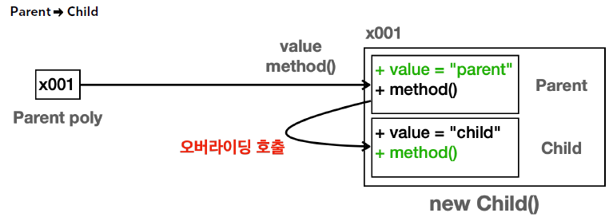

# 다형성과 캐스팅

객체지향 프로그래밍의 대표적인 특징: 캡슐화, 상속, 다형성

---

## 다형성

> 다형성(Polymorphism): 다양한 형태, 여러 형태

프로그래밍에서 다형성은 한 객체가 여러 타입의 객체로 취급될 수 있는 능력을 뜻한다.

다형성을 이루는 핵심 이론
- 다형성 참조: 하나의 변수 타입으로 다양한 자식 인스턴스를 참조할 수 있는 기능
- 메서드 오버라이딩: 기존 기능을 하위 타입에서 새로운 기능으로 재정의하는 것

---

## 다형성 참조

하나의 변수 타입으로 다양한 자식 인스턴스를 참조할 수 있는 기능

```java
public class Parent{ /* */ }
public class Child extends Parent { /* */ }
public class Child2 extends Child { /* */ }

public class Main{
    public static void main(String[] args) {
        Parent p = new Parent(); // 부모(변수)가 부모 (인스턴스) 참조
        Parent p = new Child(); // 부모가 자식 참조
        Parent p = new Child2(); // 부모가 자식2 참조
        
        // Child c = new Parent(); 자식은 부모를 참조할 수 없다
    }
}
```

다형적 참조: 부모는 자식을 담을 수 있다

> 다형적 참조의 한계
> 
> ```Parent p = new Child();```  
> ```p.childMethod(); // 불가능```  
> 자식 인스턴스를 참조하는 부모 변수는 자식의 메서드를 호출할 수 없다.  
> (상속 관계에서 (메서드나 필드를 찾을 때) 부모 방향으로 찾아 올라갈 수는 있지만 자식 방향으로 찾아 내려갈 수는 없다)

이럴 때 필요한 것은 바로 `캐스팅'이다.

---

## 캐스팅

캐스팅: 특정 타입으로 변경하는 것

업캐스팅: 부모 타입으로 변경  
다운캐스팅: 자식 타입으로 변경

### 다운캐스팅

```
Parent p = new Child();
Child c = (Child) p;
c.childMethod();
```

> 다운캐스팅을 한다고, p의 타입이 변하는 것은 아니다.  
> 해당 참조값을 꺼내고, 꺼낸 참조값이 Child 타입이 되는 것이다.  
> -> p의 타입은 Parent로 기존과 같이 유지된다.

### 업캐스팅

```
Child c = new Child();
Parent p = c; // 굳이 명시적 형변환 할 필요 없다.
```

> 오히려 업캐스팅은 명시적 형변환을 생략하는 것을 권장한다고 한다.

---

### 다운캐스팅과 주의점

다운캐스팅은 잘못하면 심각한 런타임 오류가 발생할 수 있다.

```
Parent p = new Parent();
Child c = (Child) p; // 런타임 오류!!!
```

위 코드는 컴파일은 된다. 그런데 런타임 중에 오류가 난다.  
(런타임 오류는 매우 크리티컬한 오류 - 프로그램이 실행하는 도중에 발생하기 때문)

---

### instanceof

```instanceof```를 사용해서 원하는 타입으로 변경이 가능한지 확인할 수 있다.

```
if(parent instanceof parent) // true
if(parent instanceof child) // false
if(child instanceof parent) // true !
```

instanceof는 오른족 대상의 자식 타입을 왼쪽에서 참조하는 경우에도 true를 반환한다.

> 쉽게 생각하면, 오른쪽에 있는 타입에 왼쪽에 있는 인스턴스의 타입이 들어갈 수 있는지 대입해보면 된다.

---

## 다형성과 메서드 오버라이딩

> 오버라이딩 된 메서드는 항상 우선권을 가진다

부모 타입의 변수가 자식 타입의 인스턴스를 참조해도, 자식 클래스의 메서드를 호출할 수 없다. 

여기서 자식 클래스가 부모 메서드를 오버라이딩 했다면,  
(자식 인스턴스를 참조하는 부모 변수는) 자식 메서드를 호출할 수 있다.




