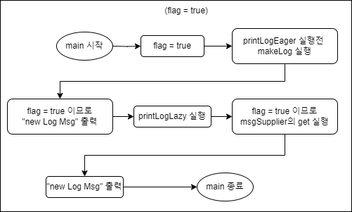

## 람다를 이용한 조건부 연기 평가(실행)

모던 자바인액션 책에 있는 부분인데,

```
9.1.5 코드 유연성 개선

...

logger.log(Level.FINER, "Problem: " + generateDiagnostic());

...

안타깝게도 위 코드로 모든 문제가 해결된 것은 아니다. 즉, 인수로 전달된 메시지 수준에서 logger가 활성화되어 있지 않더라도 항상 로깅 메시지를 평가하게 된다.

람다를 이용하면 이 문제를 쉽게 해결할 수 있다. 특정 조건(예제에서는 logger 수준을 FINER로 설정)에서만 메시지가 생성될 수 있도록 메시지 생성 과정을 연기할 수 있어야 한다.자바 8 API 설계자는 이와 같은 logger 문제를 해결할 수 있도록 Supplier를 인수로 갖는 오버로드된 log 메서드를 제공했다.

...

logger.log(Level.FINER, () -> "Problem: " + generateDiagnositc());

log 메서드는 logger의 수준이 적절하게 설정되어 있을 때만 인수로 넘겨진 람다를 내부적으로 실행한다. 다음은 log 메서드의 내부 구현 코드다.

public void log(Level level, Supplier<String> msgSupplier){
    if(logger.isLoggable(level)){
        log(level, msgSupplier.get()); // 람다 실행
    }
}

...
```

(위 코드는 log의 레벨이 FINER일 때 인자로 준 문자열을 로깅하는 코드이다)

처음 이 부분을 읽고 이해가 안됐다.

    생성 과정을 뒤로 미루더라도, 어차피 같은 문자열을 생성하지 않나?
    뭐가 달라지지?

그래서 이 람다를 사용했을때와(Supplier 사용) 사용 안했을때를(String 사용) 비교해봤다.

---

### 너무 오래걸리는 메시지 예시

예를 들어보자.

로깅 메시지를 생성하는 메서드가 있는데, 이 메서드는 너무 오래걸린다고 가정하면,

```
public static String makeLog(){
        try {
            Thread.sleep(100000); // 100초 기다림 (== 100000ms)
        } catch(Exception ex) { throw new RuntimeException(ex); }
        return "new Log Msg";
    }

    public static void printLogEager(final Boolean flag, final String msg){
        if(flag == true)
            System.out.println(msg);
    }

    public static void printLogLazy(final Boolean flag, Supplier<String> msgSupplier){
        if(flag == true)
            System.out.println(msgSupplier.get());
    }

public static void main(String[] args){
    Boolean flag = true;
    printLogEager(flag, makeLog());
    System.out.println("?"); // to divide eager and lazy method
    printLogLazy(flag, () -> makeLog());
}

```

flag가 true일 때, printLogEager과 printLogLazy 둘다 100초를 기다리고 (총 200초) "new Log Msg" 라는 문자열을 출력한다.

이때 flag가 false라면?

```
public static void main(String[] args){
    Boolean flag = false; // true -> false
    printLogEager(flag, makeLog());
    System.out.println("?"); // to divide eager and lazy method
    printLogLazy(flag, () -> makeLog());
}
```

당연히 두 메서드 모두 문자열을 출력하지 않는다.<br>
하지만 main 메서드를 실행하는데 100초가 걸린다.

바로 printLogEager 메서드 때문이다.

    printLogEager 메서드는 flag의 값과 관계없이, 두번째 인자로 받은 makeLog 메서드를 실행하고, 자기자신을 실행한다.

    반면에 printLogLazy는 flag의 값이 false이기 때문에, msgSupplier의 get 메서드(makeLog 메서드)를 실행하지 않는다.

---

### 그림 설명



flag가 true일때는 printLogEager, printLogLazy 메서드 둘다 makeLog 메서드 실행 후 "new Log Msg"을 출력한다.


flag가 false일때는, 두 메서드 다 "new Log Msg"을 출력하지 않는데,<br>
printLogEager 메서드 실행 전, makeLog 메서드를 실행한다. 이때 의미없는 100초를 소비한다.

---

## 정리

람다를 사용하면 해당 메서드의 평가(실행) 시기를 연기한다.(delay)

    사실 이 정리는 책에 이미 써있는 말이다. (위에 있음)
    
    `람다를 이용하면 이 문제를 쉽게 해결할 수 있다. 특정 조건(예제에서는 logger 수준을 FINER로 설정)에서만 메시지가 생성될 수 있도록 메시지 생성 과정을 연기할 수 있어야 한다.`

    역시 직접 코딩해봐야 와닿는 것 같다.