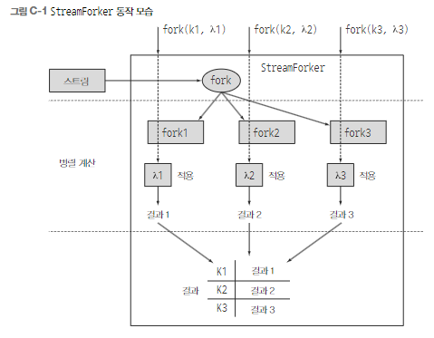

# A 기타 언어 업데이트

## A.1 어노테이션

자바 8의 어노테이션은 두가지가 개선되었다.
- 어노테이션을 반복할 수 있다.
- 모든 형식에 어노테이션을 사용할 수 있다.

### A.1.1 어노테이션 반복

이전 자바에서는 선언에서 지정한 하나의 어노테이션만 허용했다.

### A.1.2 형식 어노테이션

자바 8에서는 모든 형식에 어노테이션을 적용할 수 있다.

    new 연산자, instanceof, 형식캐스트, 제네릭 형식 인수, implements, throws 등에 어노테이션을 사용할 수 있다.

## A.2 일반화된 대상 형식 추론

자바 8 이전까지는 콘텍스트에만 의존해서 추론이 실행되었다.(대상 형식화)

예를 들어 다음과 같은 코드는 사용할 수 없었다.

```java
static void cleanCars(List<Car> cars){
    ...
}
cleanCars(Collections.emptyList());
```

명시적인 형식 인수를 제공해서 위 에러를 해결할 수 있다.

```cleanCars(Collections.<Car>emptyList());```

자바 8부터는 제네릭 인수를 추론해줘서 그냥 사용가능하다.

# B 기타 라이브러리 업데이트

## B.1 컬렉션

컬렉션 API의 가장 큰 업데이트는 스트림의 등장이다. 스트림 외에도 다양한 업데이트가 적용되었다.

### B.1.1 추가 메서드

자바 API 설계자는 많은 새로운 메서드를 컬렉션 인터페이스와 클래스에 추가했다.(대부분 디폴트 메서드)

### B.1.2 Collections 클래스

Collections는 오랫동안 컬렉션 관련 동작을 수행하고 반환하는 역할을 담당하는 클래스다.

Collections는 불변의, 동기화된, 검사된, 빈 NavigableMap과 NavigableSet을 반환할 수 있는 새로운 메서드를 포함한다. 또한 동적 형식 검사에 기반을 둔 Queue 뷰를 반환하는 checkedQueue라는 메서드도 제공한다.

### B.1.3 Comparator

Comparator 인터페이스는 디폴트 메서드와 정적 메서드를 추가로 제공한다.

comparing, reversed, thenComparing, ...

## B.2 동시성

자바 8에는 동시성과 관련된 기능도 많이 업데이트되었다.

### B.2.1 아토믹

java.util.concurrent.atomic 패키지는 AtomicInteger, AtomicLong 등 단일 변수에 아토믹 연산을 지원하는 숫자 클래스를 제공한다.

### B.2.2 ConcurrentHashMap

성능을 개선하면서 ConcurrentHashMap의 내부 구조가 바뀌었다. 보통 맵의 개체는 키로 생성한 해시코드를 접근할 수 있는 버킷에 저장된다. 하지만 키가 같은 해시코드를 반환하는 상황에서는 O(n) 성능의 리스트로 버킷을 구현해야 하므로 성능이 나빠진다. 자바 8에서 버킷이 너무 커지면 동적으로 리스트를 정렬 트리로(O(lgn)의 성능으로) 교체한다.
> 키가 Comparable일때만(String,Number) 이 기능을 사용할 수 있다.

ConcurrentHashMap은 마치 스트림을 연상시키는 세 종류의 연산을 지원한다.

forEach, reduce, search

## B.3 Arrays

Arrays 클래스는 배열을 조작하는데 사용하는 다양한 정적 메서드를 제공한다. 

parallelSort, setAll, parallelSetAll, parallelPrefix 4개의 메서드가 추가되었다.

# C 스트림에 여러 연산 병렬로 실행하기

`스트림은 한번만 연산을 수행할 수 있으므로 결과도 한번만 얻을 수 있다`는 것이 자바 8 스트림의 가장 큰 단점이다.

한 스트림에서 여러 결과를 얻어야 하는 상황이 있을 수 있다.

## C.1 스트림 포킹

스트림에서 여러 연산을 병렬로 실행하려면 먼저 원래 스트림을 감싸면서 다른 동작을 정의할 수 있도록 StreamForker를 만들어야 한다.

```java
public class StreamForker<T> {

    private final Stream<T> stream;
    private final Map<Object, Function<Stream<T>, ?>> forks = new HashMap<>();

    public StreamForker(Stream<T> stream) {
        this.stream = stream;
    }

    public StreamForker<T> fork(Object key, Function<Stream<T>, ?> f) {
        forks.put(key, f);
        return this;
    }

    public Results getResults() {
        ... // 구현
    }
}
```

fork 메서드는 여러 연산을 Forking해서 파이프라인을 만든다.

getResults 메서드를 호출하면 fork 메서드로 추가한 모든 연산이 실행된다.



# C.2 성능 문제

위 방법은 메모리에 있는 데이터로 스트림을 만든 상황에서는 블록 큐를 사용하면서 발생하는 오버헤드가 병렬 실행으로 인한 이득보다 클 수가 있다.

반대로 아주 큰 파일을 스트림으로 사용하는 등 비싼 I/O 동작을 수행하는 상황에서는 한 번만 스트림을 활용하는 것이 더 좋은 선택일 수 있다.

# D 람다와 JVM 바이트코드

부록 D에서는 생성된 클래스 파일을 분석하면서 람다 표현식이 어떻게 컴파일되는지 설명한다.

## D.1 익명 클래스

익명 클래스는 애플리케이션 성능에 악영향을 주는 특성을 포함한다.

- 컴파일러는 익명 클래스에 대응하는 새로운 클래스 파일을 생성한다.
- 새로운 익명 클래스는 클래스나 인터페이스나 새로운 서브형식을 만든다.

## D.2 바이트코드 생성

자바 컴파일러는 자바 소스 파일을 자바 바이트코드로 컴파일한다. JVM은 생성된 바이트코드를 실행하면서 애플리케이션을 동작시킨다. 

익명 클래스와 람다 표현식은 각기 다른 바이트코드 명령어로 컴파일된다.

## D.3 구원투수 InvokeDynamic

//

## D.4 코드 생성 전략