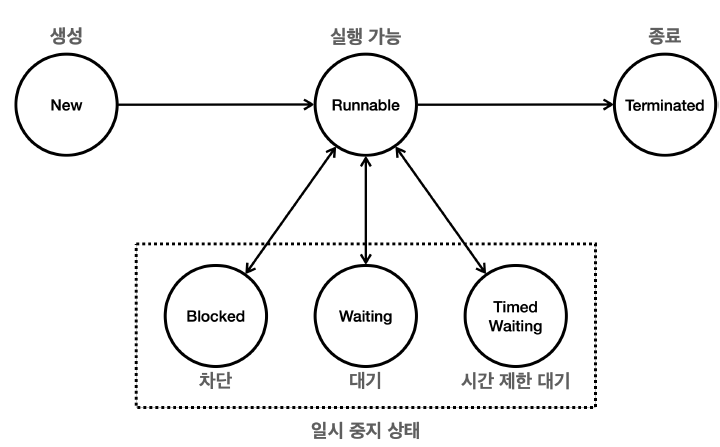

### Thread 클래스

`Thread.currentThread()` 현재 실행 중인 스레드의 객체 반환  
(메인 메서드 실행 중인 스레드 이름 - main)

Thread 클래스를 상속받아 run 메서드를 오버라이딩 하고,  
해당 객체의 start 메서드를 실행하면,  
직접 작성한 run 메서드를 병렬로 실행한다.  
(새로운 스레드를 생성하여 실행)

> run 메서드가 아닌 start 메서드를 호출해야  
> 새로운 스레드로 실행된다.

`스레드 간 실행 순서는 보장하지 않는다`

---

### Runnable 인터페이스

위는 Thread를 상속받는 방법  
이제부터는 Runnable 인터페이스를 구현하는 방법 (실무에선 이 방법 많이 쓴다)

똑같이 run 메서드를 오버라이딩하여 구현하면 된다.  
(Thread 클래스가 Runnable 인터페이스를 구현한 클래스)

대신 스레드 객체를 생성할 때, 실행할 작업을 생성자로 전달해야 한다.

```java
class Thread {
    public static void main(String[] args) {
        Thread thread = new Thread(() -> System.out.println("hello thread"));
    }
}
```

---

### Thread 상속 vs Runnable 구현 차이점

자바는 단일 상속만 허용하기 때문에, Thread 상속받으면 다른 클래스를 상속받을 수 없다.  
or (만약 기존 클래스가 상속받았다면) Thread 상속을 위해 기존 클래스를 새로 만들어야 한다.

> 그리고 Thread를 상속받아도, 해당 메서드의 기능을 거의 사용하지 않는다.

그리고 Runnable 인터페이스에는 실행할 작업(run 메서드)만 있다.  
-> 코드의 분리  
(Thread 클래스에는 많은 다른 메서드가 있기 때문)

그리고 Runnable 객체를 공유할 수 있다 -> 자원 관리 효율적  
(하나의 Runnable 객체를 가지고 여러 Thread 생성 가능)

대신 코드가 약간 복잡해짐

> 그냥 Runnable 써라  
> (만약 Thread 클래스의 기능들을 사용해야 한다면 그때는 Thread를 상속 받겠지)

### 스레드의 상태

New, Runnable, Blocked, Waiting, Timed Waiting, Terminated  
가 있다.



New - `new Thread(...)`를 통해 생성됐을 떄의 상태

Runnable - 실행 가능한 상태(OS 스케쥴러에 있거나(실행될 준비됨), 실행 중)

> 스레드가 실행중인지, OS 스케쥴러에 있는지 알 수 없다.  
> (이는 OS가 알아서 관리하기 때문에)

Blocked - 차단된 상태

> 보통 다른 스레드에 의해 동기화 락을 얻기 위해 기다리는 상태이다.  
> `synchronized` 블록 등

Waiting - 다른 스레드의 특정 작업이 완료되기를 무기한 기다리는 상태

> `wait`, `join` 메서드가 호출될 때 등  
> (다른 스레드가 `notify` 또는 `join`이 완료될 때까지 기다린다)

Timed Waiting - 시간 제한 대기 상태

> Waiting 상태에서 일정 시간만 대기하는 것을 추가한 것  
> `sleep` 메서드를 호출했을 때도 이 상태에 해당한다.

Terminated - 종료 상태

> 스레드의 실행이 완료된 상태  
> (정상적으로 종료 or 예외 발생돼 종료)

// todo epoll, park 공부

---

### Runnable 인터페이스의 run 메서드에서 체크 예외를 던질 수 없다.

```java
public interface Runnable {
    void run();
}
```

run 메서드는 예외를 던지지 않는다.

그리고 부모 메서드를 오버라이딩할 때,  
자식 메서드는 부모 메서드보다 더 많은 예외를 던질 수 없다.

> 자식 메서드는 부모 메서드가 던질 수 있는 체크 예외의 하위 타입만 던질 수 있다.

### 만약 자식 메서드가 부모 메서드보다 더 많은 예외를 던진다면?

> 물론 컴파일 에러가 나지만, 안난다고 가정하고 비즈니스 로직을 생각해보자.

```java
class Parent {
    void method() throws InterruptedException {
        // ...
    }
}
class Child extends Parent {
    @Override
    void method() throws Exception {
        // ...
    }
}
public class Test {
    public static void main(String[] args) {
        Parent p = new Child();
        try {
            p.method();
        } catch (InterruptedException e) {
            // InterruptedException 처리
        }
    }
}
```

만약 p 객체가 Child 객체라면,  
Exception 예외를 던졌을 때 (InterruptedException이 아닌)  
main 메서드는 이를 처리할 수 없다.

이것은 확실하게 모든 예외를 체크하는 체크 예외의 규약에 위배된다.  
`예외는 던지거나 처리해야 한다`

> 체크 예외 재정의 규칙
> 1. 자식 클래스에게 재정의된 메서드는 부모 메서드가 던질 수 있는 체크 예외의 하위 타입만 던질 수 있다.
> 2. 원래 메서드가 체크 예외를 던지지 않는 경우, 재정의된 메서드도 체크 예외를 던질 수 없다.

---

따라서 run 메서드를 오버라이딩할 때,  
체크 예외를 던지지 않는다.

---

