# 애플리케이션 부하 테스트 개요

nGrinder를 이용해 스프링 서버의 부하 테스트를 진행했다.

## 스펙

### 하드웨어 스펙

스프링 서버는 AWS EC2에 띄웠고, DB는 AWS RDS에 MySQL을 사용했다.

EC2: t2.micro  
(vCPU: 1, 메모리: 1GiB) 

RDS: db.t3.micro  
(vCPU: 2, 메모리: 1GiB)

### 소프트웨어 스펙

API 서버는 스프링 부트를 사용했고,  
DB는 MySQL을 사용했다.

자바 버전: 17

## 메트릭 수집 도구

### 스프링 서버

프로메테우스 & 그라파나를 이용해 메트릭을 수집했다.  
그리고 APM 도구인 스카우터를 이용해 xlog를 수집했다.

### DB

AWS RDS를 이용하기 때문에,  
RDS가 CloudWatch를 통해 제공하는 메트릭을 이용했다.

---

## 부하 테스트 시나리오  

nGrinder의 vuser는 100명으로 설정했다.  
(agent: 1, process: 1, thread: 100)

OAuth2 인증을 통해 인증을 받은 vuser가  
20분 동안 "/api/articles/main" API를 호출했다.

---

### /api/articles/main API

해당 API는  
인증 된 유저가 한달동안 작성한 게시글 & 오늘 작성한 게시글  
을 가져오는 API이다.  
(이를 이용해 메인 페이지에 게시글을 보여준다)

---

## 부하 테스트 결과

평균 TPS는 63.5로 나왔다.  
(매우 낮다....)

## 테스트 중 메트릭 확인 - 1. GC

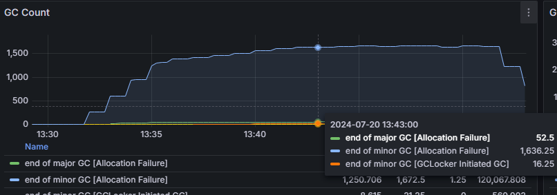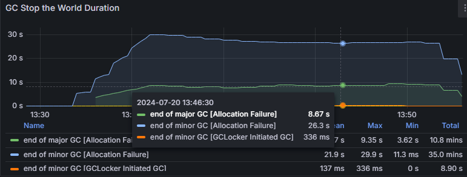

위 사진은 GC가 실행된 횟수 & GC의 소요 시간에 대한 그래프이다.  

Minor GC가 분당 약 1600/5=500 번 정도 실행되었고,  
분당 총 소요 시간은 약 25/5=5초 정도이다.

Major GC가 분당 약 50/5=10번 정도 실행되었고,  
분당 총 소요 시간은 약 8/5=1.6초 정도이다.

> 위 메트릭은 1분마다 계속 오르는 count 계열 메트릭을  
> increase 함수를 이용해 5분 간격으로 계산한 것이다.  
> -> 1분 당 메트릭을 알기 위해 5로 나눴다.

요청이 계속 들어오기 떄문에, GC가 늘어난 것은 당연한 거지만,  
이건 너무 많은 것 같다.

### GC가 너무 많이 일어나는 이유

일단 데이터를 얻어와서 필터링하는 작업이 문제인 걸로 보인다.

현재 데이터 작업 프로세스
1. DB로부터 인증한 유저가 작성한 모든 articles를 가져온다.
2. 스프링 서버에서 이번 달에 소비한 게시글만 필터링한다.
3. 데이터를 응답에 담아 클라이언트에게 보낸다.

여기서 1,2번이 문제인 것 같다.  
(데이터를 DB에서 필터링하지 않고 서버에서 필터링하는 것)

만약 DB로부터 받은 데이터가 10000개인데,  
이 중 응답으로 100개도 안되는 데이터만 필요하다면,  
남은 9900개는 의미없이 메모리를 차지하게 된다.  
-> 의미없는 GC를 발생시킨다.

## 테스트 중 메트릭 확인 - 2. HikariCP

스카우터의 xlog 중에서
1. Elapsed Time이 가장 낮은 xlog - L
2. Elapsed Time이 가장 높은 xlog - H

위 2개를 확인해봤다.

L의 xlog  
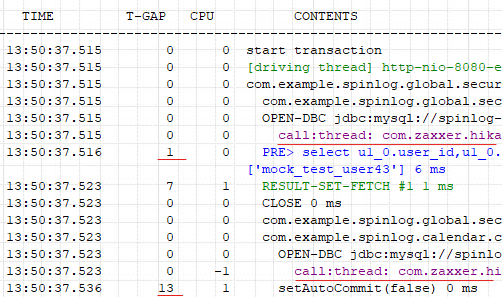

L의 elapsed time = 107 ms  
Hikari Pool로부터 Connection을 가져오는데 1ms, 13ms 가 걸렸다.

H의 xlog  
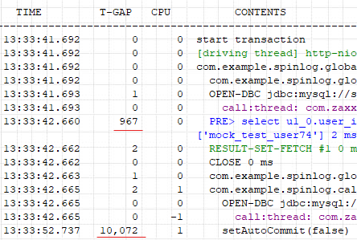

H의 elapsed time = 11234 ms  
Hikari Pool로부터 Connection을 가져오는데 967ms, 10072ms 가 걸렸다.

위로부터 알 수 있는 사실은,  
사용자의 요청을 처리하는데 Connection Pool로부터 Conneciton을 얻는데 시간이 많이 걸린다.  
(거의 전부라고 봐도 무방하다)

> 그리고 모든 xlog의 SqL Time 그래프를 확인해봤는데,  
> 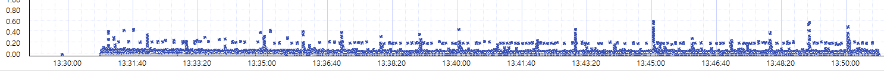
>
> 대부분 비슷하게 나왔다.  
> (0.1ms ~ 0.6ms 사이에 대부분 분포되어있다)

### Conneciton을 가져오는데 시간이 많이 걸리는 이유

일단 DB 쪽의 병목 관련 문제는 아닌 것 같다.  
(대부분의 쿼리는 빠른 시간에 처리되고 있다)  
(그리고 모든 쿼리는 락을 걸지 않는다)

1. 그냥 요청이 많이 오니까  
   -> Connection Pool에 Connection이 없어서 대기하는 것 같다.
2. 하나의 요청에 트랜잭션이 두번 발생한다.  
   -> Connection을 두번 가져온다.
3. 모든 article들을 가져오는 쿼리  
   -> 스프링 서버에서 필터링  
   -> 필요없는 데이터가 많이 메모리를 차지한다.  
   -> GC가 많이 일어난다.

위 xlog를 보면 `call:thread: ~` 라는 로그가 총 두개가 있다.  
(이는 Connection을 얻는 로그)

첫번째 커넥션은 사용자의 인증을 수행하기 위해 사용되었고,  
두번째 커넥션은 사용자의 요청을 처리하기 위해 사용되었다.

안그래도 서버의 vCPU가 1이라서 다중 요청을 처리하는데 오래걸리는데,  
하나의 요청이 커넥션을 두번 가져오니까 더 오래걸리는 것 같다.

-> 인증할 때 굳이 DB에 접근하는 건 너무 비효율적으로 보인다.  
(그럼 DB없이 인증하고 나중에 처리?)

### 스프링 서버와 DB 서버의 메트릭 비교

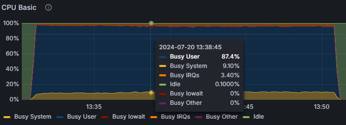

스프링 서버의 CPU 메트릭이다.  
-> CPU utilization이 100%에 가깝다. (20분 동안)  
-> 죽을라 한다...

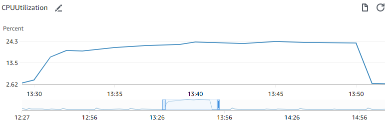

DB 서버의 CPU 메트릭이다.  
-> 스프링 서버에 비해 CPU utilization이 낮다. (최대 25%)

> 스프링 서버의 CPU utilization이 너무 높다.  
> -> 스프링 서버의 병목이 DB 서버에 영향을 미치는 것 같다.

스프링 서버가 일하는 거에 비해, DB 서버가 너무 논다.  
-> 커넥션 풀의 커넥션 개수를 늘리는 것이 좋을 것 같다.

EC2 서버의 vCPU는 1, DB 서버의 vCPU는 2이다.  
-> 당연히 DB 서버가 더 빠르게 일을 할 수 있다.

> 메모리는 (부하 테스트 중) 둘 다 크게 늘지 않았다.

---

## ETC

`1 - Disk I/O`

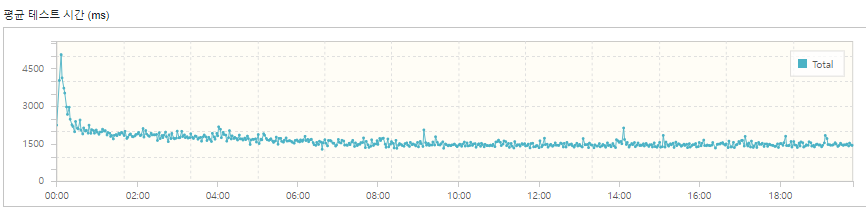

부하테스트를 20분간 진행했는데,  
초반(1분)에만 TPS가 낮게 나왔다.

이 이유는 Disk I/O 때문인걸로 보인다.

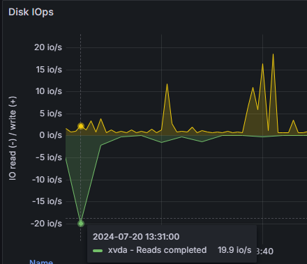

위 메트릭은 Disk IOps 메트릭이다.  
여기서 Disk의 write 작업은 초반에만 이루어지고,  
이후에는 이루어지지 않았다.

따라서 초반에는 Disk의 write 작업에 의해 TPS가 평균에 비해 낮게 나왔고,  
이후에는 write 작업이 없어져서 (메모리에 적재되어서) TPS가 (초반에 비해) 높게 나왔다.

> 다른 메트릭을 보니, Page fault로 인한 write 작업이 있었던 것 같다.  
> 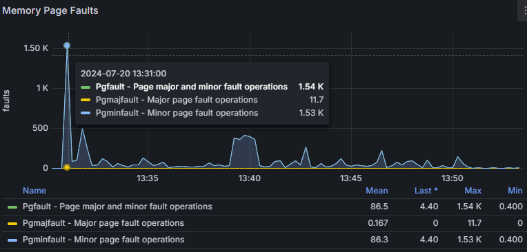

`2 - TCP Connection`

http 요청을 할 때,  
(현재 우리 서버는 http/1.1을 사용하고 있기 때문에)  
request에서 Connection 헤더의 값이 keep-alive로 설정되어 있거나 해당 헤더가 아예 없다면,  
서버는 해당 요청을 처리한 후, 클라이언트와의 연결을 끊지 않고 유지한다.

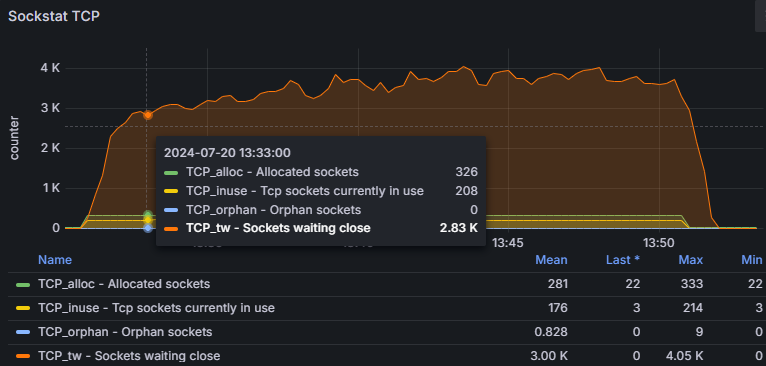

그런데 위 메트릭을 보면, (TCP 관련 메트릭이다)  
연결이 끊어지는 것을 대기하는 TCP Connection이 많이 쌓여있는 것을 볼 수 있다.

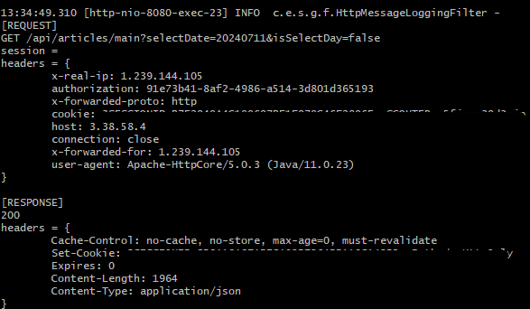

이를 해결하기 위해 http 로그를 보니,  
모든 요청의 Connection 헤더가 close로 설정되어 있었다.  
-> 이는 nGrinder에서 필요한 작업이다.  
(애플리케이션에서 해줄 것이 없다)

> TCP 4-way handshaking 과정은 socket.close() 메서드를 호출하면 자동으로 처리되는데,  
> 서버쪽 TCP 소켓들이 TIME_WAIT 상태로 대기한다는 것은,  
> 서버쪽에서 먼저 FIN 패킷을 보냈기 때문이다.
> 
> 이 부분은 nGrinder의 소켓 관리 코드 & 스프링(톰캣)의 소켓 관리 코드를 확인해봐야 할 것 같다.

---

## TODO

1. 세션 인증 작업 최적화 (DB 접근 최소화)
2. 데이터 필터링 작업 DB로 이동
3. nGridner Connection 헤더 작업 확인
4. 커넥션 풀의 커넥션 개수 늘리기(1,2번 작업 이후 메트릭 확인 후 결정)
5. 힙 사이즈 조절
6. 트랜잭션의 범위를 좁히는 작업

---

## 성능 개선

### 1. DB와의 커넥션 수를 줄이자.

현재 /api/articles/main 요청은 DB와 두번의 커넥션이 있다.

첫번째 커넥션은 없어도 될 것 같다.  
현재 세션 정보가 DB에 있는 정보와 일치하는 지 체크하는 로직  
-> 어차피 비즈니스 로직에서 한번 검증을 하기 때문에 불필요 해 보인다.

-> 세션을 새로 생성할 때, authenticationName 만 넣는 것이 아니라, email도 같이 넣어준다.  
-> 세션 인증 필터에서 OAuth2Response를 생성할 때, 세션에 있는 정보들로만 구성 & DB 조회 로직 삭제  
-> DB 조회를 딱 한번만 하기 때문에, 커넥션을 조회하는 수가 줄어들어 인터럽트도 줄어들고, 그만큼 대기하는 스레드 수도 줄 듯  
-> 성능 개선 예상

`커넥션 수 줄이기 전 메트릭`  
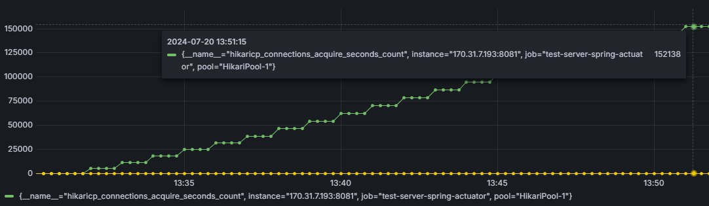

`커넥션 수 줄인 후 메트릭`  
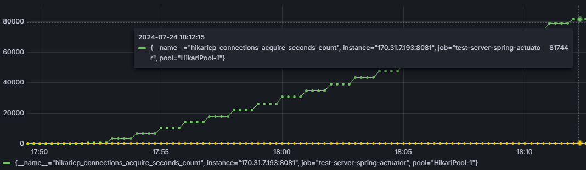

커넥션 수를 2번에서 1번으로 줄인 만큼,  
총 조회 횟수가 절반으로 줄었다.

`커넥션 수 줄이기 전 xlog`  
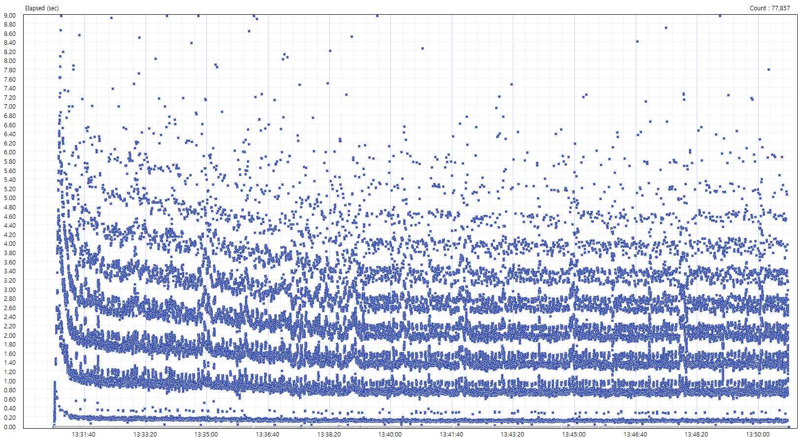

`커넥션 수 줄인 후 xlog`  
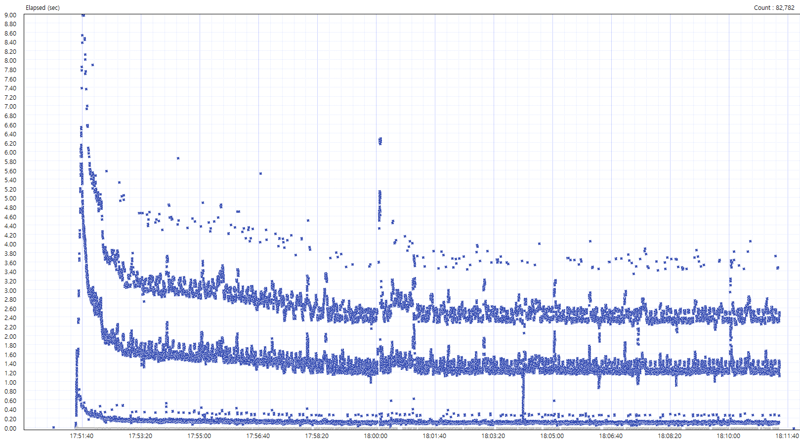

대부분의 xlog의 elapsed time이 줄어든 것을 볼 수 있다.

커넥션 수를 2번에서 1번으로 줄인 이후의 TPS 결과는  
TPS가 63.5에서 68.5로 증가했다.  
(약 7.8% 증가)

---

### 2. 비즈니스 로직 개선

현재 스프링 서버의 CPU utilization이 100%에 가까운데, DB의 CPU utilization은 20%를 조금 넘는다.  
DB에서 조금 더 처리하는게 좋아 보인다.

현재 DB로 부터 특정 유저의 모든 articles를 조회하여,  
스프링 서버에서 현재 달에 해당하는 articles만 필터링하고 있다.  
-> 날짜에 상관없이 모든 articles를 DB로부터 가져오기 때문에 비효율적으로 보인다.  
-> DB에서 현재 유저에 해당하고, 현재 달에 해당하는 articles를 가져오는 것으로 코드 변경해보자  
-> 스프링 서버에서 딱 원하는 데이터만 얻기 때문에 의미없는 Article 객체가 생성되지 않아 GC 횟수가 준다.  
-> 성능 개선 예상

`기존 비즈니스 로직 시나리오`  
1. authenticationName을 가지고 User를 찾는다.
2. DB로부터 모든 articles를 가져온다. (732 rows) *
3. 스프링 서버에서 현재 달에 해당하는 articles만 필터링한다. (62 rows)
4. 현재 날짜에 해당하는 articles만 필터링한다. (2 rows)
5. 위 정보를 응답에 담아 클라이언트에게 보낸다.

`변경된 비즈니스 로직 시나리오`
1. authenticationName을 가지고 User를 찾는다. *
2. DB로부터 현재 달에 해당하는 articles를 가져온다. (62 rows) *
3. DB로부터 현재 날짜에 해당하는 articles를 가져온다. (2 rows) *
4. 위 정보를 응답에 담아 클라이언트에게 보낸다.

(*는 DB에서 처리하는 부분)

`비즈니스 로직 변경 전 GC 메트릭`  

`비즈니스 로직 변경 후 GC 메트릭`  
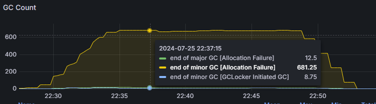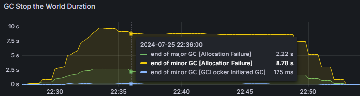

GC 횟수가 약 1/3로 줄었다.

`비즈니스 로직 변경 후 TPS 변화`  
68.2 -> 170.8  
(약 150% 증가)

> 확실히 DB에서 필터링을 하는 것이 훨씬 빠르다.

다른 메트릭들의 변화  
1. 스프링 서버 CPU utilization: 100% -> 70%
2. DB CPU utilization: 25% -> 73%

스프링 서버의 병목이 해소되어 DB의 CPU utilization이 늘어났다.

---

### 3. 쿼리 최적화

현재 DB에서 사용하는 articles 테이블 관련 쿼리는 총 2개이다.

1. 인증 한 유저에 해당하고 현재 달에 해당하는 articles를 가져오는 쿼리
2. 인증 한 유저에 해당하고 현재 날짜에 해당하는 articles를 가져오는 쿼리

위 두가지 쿼리를 하나의 쿼리로 가져오는 건 어떨까?

이때 가져오는 column들의 개수가 늘어난다.

`기존 작업`  
DB로부터 2번의 쿼리를 날려서 데이터를 가져온다.

`변경된 작업`  
DB로부터 1번의 쿼리를 날려서 데이터를 가져온다.  
(인증 한 유저에 해당하고 현재 달에 해당하는 articles를 가져오는 쿼리)  
이후 스프링 서버에서 현재 날짜에 해당하는 데이터만 필터링한다.

`쿼리 최적화 이후 TPS 변화`  
170.8 TPS -> 231.5 TPS  
(약 35% 증가)

`쿼리 최적화 이후 스프링 서버 CPU utilization 변화`  
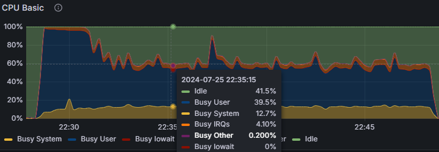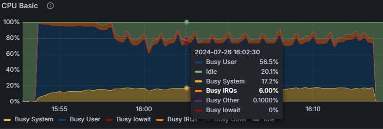  
평균 60% -> 80%  

`쿼리 최적화 이후 DB CPU utilization 변화`  
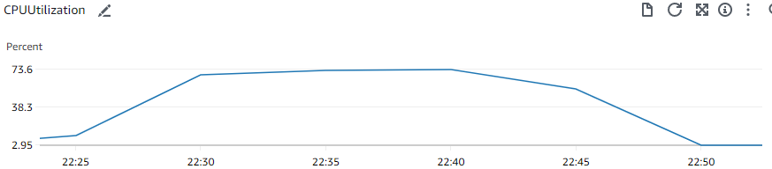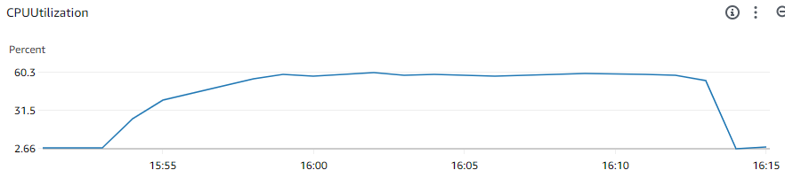  
평균 73% -> 60%

DB에 보내는 쿼리의 개수가 2개->1개로 줄면서,  
DB의 CPU utilization이 줄었다.  
대신 스프링 서버의 CPU utilization이 늘어났다.

`쿼리 최적화 이후 GC 메트릭`  
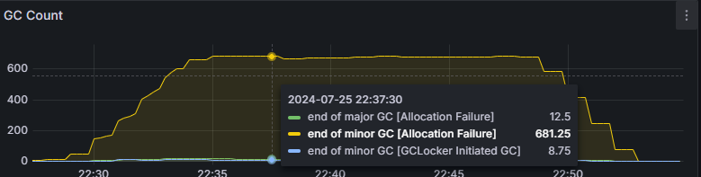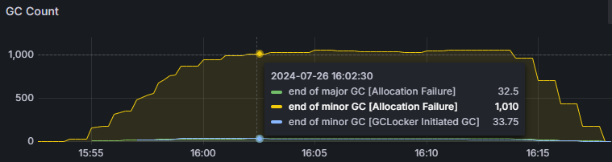  
스프링 서버의 작업이 늘어났기 때문에 GC 횟수가 늘었다.

---