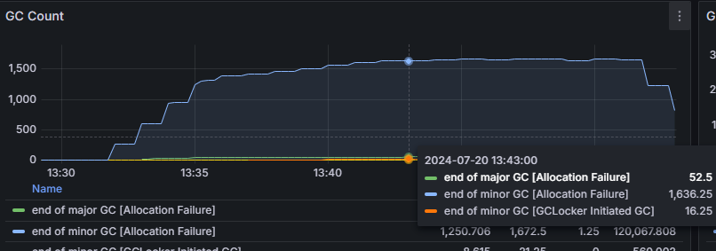
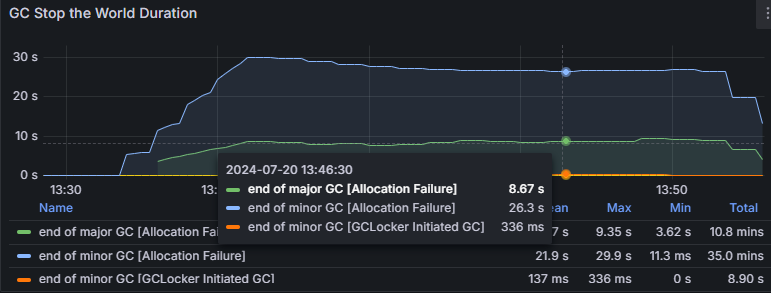
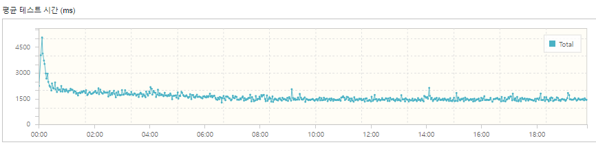
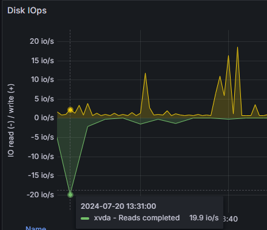
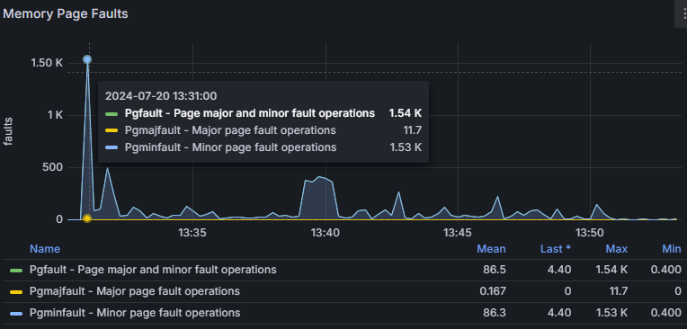
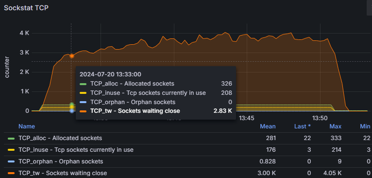
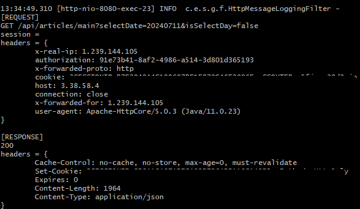
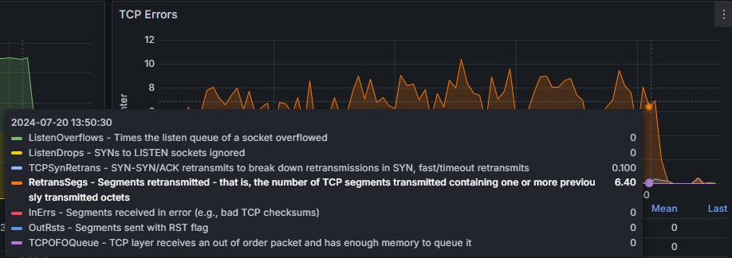

# 애플리케이션 부하 테스트 개요

nGrinder를 이용해 스프링 서버의 부하 테스트를 진행했다.

## 하드웨어 스펙

스프링 서버는 AWS EC2에 띄웠고, DB는 AWS RDS에 MySQL을 사용했다.

EC2: t2.micro  
(vCPU: 1, 메모리: 1GiB, 시간당 CPU 크레딧: 6, 네트워크 성능: 5Gbps) 

RDS: db.t3.micro
(vCPU: 2, 메모리: 1GiB, 시간당 CPU 크레딧: 12, 네트워크 성능: 5Gbps)

---

## 추가 도구

### 스프링 서버

프로메테우스 & 그라파나를 이용해 메트릭을 수집했다.  
그리고 APM 도구인 스카우터를 이용해 xlog를 수집했다.

### DB

AWS RDS를 이용하기 때문에,  
RDS가 CloudWatch를 통해 제공하는 메트릭을 이용했다.

---

## 부하 테스트 시나리오  

nGrinder의 vuser는 100명으로 설정했다.  
(agent: 1, process: 1, thread: 100)

그리고 20분 동안 "/api/articles/main" API를 호출했다.

---

### /api/articles/main API

해당 API는 인증 된 유저가 한달동안 작성한 게시글을 가져오는 API이다.  
(이를 이용해 메인 페이지에 게시글을 보여준다)

---

# 부하 테스트 실행

## 부하 테스트 결과

평균 TPS는 63.5로 나왔다.  
(매우 낮다....)

## 테스트 중 메트릭 확인 - 1. GC

위 사진은 GC가 실행된 횟수 & GC의 소요 시간에 대한 그래프이다.  

Minor GC가 분당 약 1600/5=500 번 정도 실행되었고,  
분당 총 소요 시간은 약 25/5=5초 정도이다.

Major GC가 분당 약 50/5=10번 정도 실행되었고,  
분당 총 소요 시간은 약 8/5=1.6초 정도이다.

> 위 메트릭은 1분마다 계속 오르는 count 계열 메트릭을  
> increase 함수를 이용해 5분 간격으로 계산한 것이다.  
> -> 1분 당 메트릭을 알기 위해 5로 나눴다.

요청이 계속 들어오기 떄문에, GC가 늘어난 것은 당연한 거지만,  
이건 너무 많은 것 같다.

### GC가 너무 많이 일어나는 이유

일단 데이터를 얻어와서 필터링하는 작업이 문제인 걸로 보인다.

현재 데이터 작업 프로세스
1. DB로부터 인증한 유저가 작성한 모든 articles를 가져온다.
2. 스프링 서버에서 이번 달에 소비한 게시글만 필터링한다.
3. 데이터를 응답에 담아 클라이언트에게 보낸다.

여기서 1,2번이 문제인 것 같다.  
(데이터를 DB에서 필터링하지 않고 서버에서 필터링하는 것)

만약 DB로부터 받은 데이터가 10000개인데,  
이 중 응답으로 100개도 안되는 데이터만 필요하다면,  
남은 9900개는 의미없이 메모리를 차지하게 된다.  
-> 의미없는 GC를 발생시킨다.

---

## ETC

`1 - 힙 덤프`

부하테스트 이후  
Tenured 영역의 used 메트릭이 상당히 높아져서 힙 덤프를 확인해봤는데 딱히 문제는 없었다.  
-> 이건 힙 덤프를 너무 늦게 얻어서 그런걸지도..

그리고 힙 덤프를 보니, 스카우터의 DateHelper 라는 클래스가 꽤 많이 차지하고 있었다.  
(문제가 될 정도는 아니지만 클래스로더 만큼 차지하고 있었다)

`2 - Disk I/O`

부하테스트를 20분간 진행했는데,  
초반(1분)에만 TPS가 낮게 나왔다.

이 이유는 Disk I/O 때문인걸로 보인다.

위 메트릭은 Disk IOps 메트릭이다.  
여기서 Disk의 write 작업은 초반에만 이루어지고,  
이후에는 이루어지지 않았다.

따라서 초반에는 Disk의 write 작업에 의해 TPS가 평균에 비해 낮게 나왔고,  
이후에는 write 작업이 없어져서 (메모리에 캐싱되어서) TPS가 (상대적으로) 높게 나왔다.

> 다른 메트릭을 보니, Page fault로 인한 write 작업이 있었던 것 같다.  
> 

`3 - TCP Connection`

http 요청을 할 때,  
(현재 우리 서버는 http/1.1을 사용하고 있기 때문에)  
request에서 Connection 헤더의 값이 keep-alive로 설정되어 있거나 해당 헤더가 아예 없다면,  
서버는 해당 요청을 처리한 후, 클라이언트와의 연결을 끊지 않고 유지한다.

그런데 위 메트릭을 보면, (TCP 관련 메트릭이다)  
연결이 끊어지는 것을 대기하는 TCP Connection이 많이 쌓여있는 것을 볼 수 있다.

이를 해결하기 위해 http 로그를 보니,  
모든 요청의 Connection 헤더가 close로 설정되어 있었다.  
-> 이는 nGrinder에서 필요한 작업이다.  
(애플리케이션에서 해줄 것이 없다)

`4 - TCP Error`

이건 또 뭐냐..

---

## TODO

1. 데이터 필터링 작업 DB로 이동 & GC 메트릭 확인
2. 세션 인증 작업 최적화 (DB 접근 최소화)
3. nGridner Connection 헤더 작업 확인