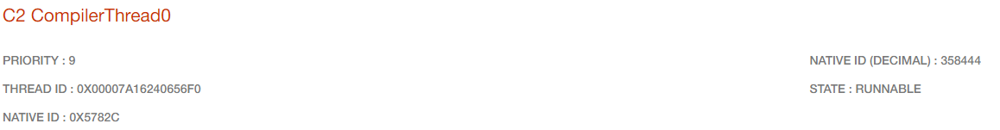

# 애플리케이션 부하 테스트 개요

nGrinder를 이용해 스프링 서버의 부하 테스트를 진행했다.

## 스펙

### 하드웨어 스펙

스프링 서버는 AWS EC2에 띄웠고, DB는 AWS RDS에 MySQL을 사용했다.

EC2: t2.micro  
(vCPU: 1, 메모리: 1GiB) 

RDS: db.t3.micro  
(vCPU: 2, 메모리: 1GiB)

### 소프트웨어 스펙

API 서버는 스프링 부트를 사용했고,  
DB는 MySQL을 사용했다.

자바 버전: 17

## 메트릭 수집 도구

### 스프링 서버

프로메테우스 & 그라파나를 이용해 메트릭을 수집했다.  
APM 도구인 스카우터를 이용해 xlog를 수집했다.  
JVisualVM을 이용해 CPU, 메모리, 스레드, 힙 영역에 대한 상세한 메트릭을 수집했다.

### DB

AWS RDS를 이용하기 때문에,  
RDS가 CloudWatch를 통해 제공하는 메트릭을 이용했다.

---

## 부하 테스트 시나리오  

nGrinder의 vuser는 100명으로 설정했다.  
(agent: 1, process: 1, thread: 100)

OAuth2 인증을 통해 인증을 받은 vuser가  
20분 동안 "/api/articles/main" API를 호출했다.

### /api/articles/main API

해당 API는  
인증 된 유저가 한달동안 작성한 게시글 & 오늘 작성한 게시글  
을 가져오는 API이다.  
(이를 이용해 메인 페이지에 게시글을 보여준다)

### DB 데이터 상황

약 80만개의 article 데이터가 있다.  
(최근 2년동안 매일 2개씩 500명의 유저가 작성한 걸 가정했다)

main API 조회시, 총 한 달 데이터는 약 60개 정도이다.

---

## 부하 테스트 결과

평균 TPS는 30로 나왔다.  
(매우 낮다....)

## 테스트 중 메트릭 확인 - 1. GC

위 사진은 스프링 서버가 부하 테스트 중  
사용한 CPU utilization와 그 중 GC가 차지하는 비율을 보여주고 있다.

CPU 리소스 대부분(97%)를 사용하고 있고,  
여기서 GC가 30% ~ 40% 정도 차지하고 있다.

> GC가 너무 많이 일어나는 이유를 찾아보자.

### GC가 너무 많이 일어나는 이유

일단 데이터를 얻어와서 필터링하는 작업이 문제인 걸로 보인다.

현재 데이터 작업 프로세스
1. DB로부터 인증한 유저가 작성한 모든 articles를 가져온다.
2. 스프링 서버에서 이번 달에 소비한 게시글만 필터링한다.
3. 데이터를 응답에 담아 클라이언트에게 보낸다.

여기서 1,2번이 문제인 것 같다.  
(데이터를 DB에서 필터링하지 않고 서버에서 필터링하는 것)

만약 DB로부터 받은 데이터가 10000개인데,  
이 중 응답으로 100개도 안되는 데이터만 필요하다면,  
남은 9900개는 의미없이 메모리를 차지하게 된다.  
-> 의미없는 GC를 발생시킨다.

## 테스트 중 메트릭 확인 - 2. HikariCP

스카우터의 xlog 중에서
1. Elapsed Time이 가장 낮은 xlog - L
2. Elapsed Time이 가장 높은 xlog - H

위 2개를 확인해봤다.

L의 xlog  

L의 elapsed time = 107 ms  
Hikari Pool로부터 Connection을 가져오는데 1ms, 13ms 가 걸렸다.

H의 xlog  

H의 elapsed time = 11234 ms  
Hikari Pool로부터 Connection을 가져오는데 967ms, 10072ms 가 걸렸다.

위로부터 알 수 있는 사실은,  
사용자의 요청을 처리하는데 Connection Pool로부터 Conneciton을 얻는데 시간이 많이 걸린다.  
(거의 전부라고 봐도 무방하다)

> 그리고 스카우터로부터 각 xlog의 SQL time을 확인해보니,  
> 거의 비슷했다.

### Conneciton을 가져오는데 시간이 많이 걸리는 이유

일단 DB 쪽의 병목 관련 문제는 아닌 것 같다.  
(대부분의 쿼리는 빠른 시간에 처리되고 있다)  
(그리고 모든 쿼리는 락을 걸지 않는다)

위 사진은 DB의 CPU utilization이다.  
DB 쪽 CPU는 많은 부하를 받지 않고 있다.

1. 그냥 요청이 많이 오니까  
   -> Connection Pool에 Connection이 없어서 대기하는 것 같다.
2. 하나의 요청에 트랜잭션이 두번 발생한다.  
   -> Connection을 두번 가져온다.
3. 모든 article들을 가져오는 쿼리  
   -> 스프링 서버에서 필터링  
   -> 필요없는 데이터가 많이 메모리를 차지한다.  
   -> GC가 많이 일어난다.

위 xlog를 보면 `call:thread: ~` 라는 로그가 총 두개가 있다.  
(이는 Connection을 얻는 로그)

첫번째 커넥션은 사용자의 인증을 수행하기 위해 사용되었고,  
두번째 커넥션은 사용자의 요청을 처리하기 위해 사용되었다.

안그래도 서버의 vCPU가 1이라서 다중 요청을 처리하는데 오래걸리는데,  
하나의 요청이 커넥션을 두번 가져오니까 더 오래걸리는 것 같다.

-> 인증할 때 굳이 DB에 접근하는 건 너무 비효율적으로 보인다.  
(일단 DB 없이 진행 한 다음, 예외 로직은 서비스 레이어에서 처리하자)

---

## TODO

1. 세션 인증 작업 최적화 (DB 접근 최소화)
2. 데이터 필터링 작업 DB로 이동
4. 커넥션 풀의 커넥션 개수 늘리기(1,2번 작업 이후 메트릭 확인 후 결정)
5. 힙 사이즈 조절
6. 스레드 풀 사이즈 조절

---

## 성능 개선

### 요청 당 DB와의 커넥션 수를 줄이자.

현재 /api/articles/main 요청은 DB와 두번의 커넥션이 있다.

첫번째 커넥션은 없어도 될 것 같다.  
현재 세션 정보가 DB에 있는 정보와 일치하는 지 체크하는 로직  
-> 어차피 비즈니스 로직에서 한번 검증을 하기 때문에 불필요 해 보인다.

-> 세션을 새로 생성할 때, authenticationName 만 넣는 것이 아니라, email도 같이 넣어준다.  
-> 세션 인증 필터에서 OAuth2Response를 생성할 때, 세션에 있는 정보들로만 구성 & DB 조회 로직 삭제  
-> DB 조회를 딱 한번만 하기 때문에, 커넥션을 조회하는 수가 줄어들어 인터럽트도 줄어들고, 그만큼 대기하는 스레드 수도 줄 듯  
-> 성능 개선 예상

`커넥션 수 줄이기 전 메트릭`  

`커넥션 수 줄인 후 메트릭`  

커넥션 수를 2번에서 1번으로 줄인 만큼,  
총 조회 횟수가 절반으로 줄었다.

대부분의 xlog의 elapsed time이 줄어든 것을 볼 수 있다.

커넥션 수를 2번에서 1번으로 줄인 이후의 TPS 결과는  
TPS가 30에서 33로 증가했다.  
(약 10% 증가)

---

### 비즈니스 로직 개선

현재 스프링 서버의 CPU utilization이 100%에 가까운데, DB의 CPU utilization은 20%를 조금 넘는다.  
DB에서 조금 더 처리하는게 좋아 보인다.

현재 DB로 부터 특정 유저의 모든 articles를 조회하여,  
스프링 서버에서 현재 달에 해당하는 articles만 필터링하고 있다.  
-> 날짜에 상관없이 모든 articles를 DB로부터 가져오기 때문에 비효율적으로 보인다.  
-> DB에서 현재 유저에 해당하고, 현재 달에 해당하는 articles를 가져오는 것으로 코드 변경해보자  
-> 스프링 서버에서 딱 원하는 데이터만 얻기 때문에 의미없는 Article 객체가 생성되지 않아 GC 횟수가 준다.  
-> 성능 개선 예상

`기존 비즈니스 로직 시나리오`  
1. authenticationName을 가지고 User를 찾는다.
2. DB로부터 모든 articles를 가져온다. (1682 rows) *
3. 스프링 서버에서 현재 달에 해당하는 articles만 필터링한다. (86 rows)
4. 현재 날짜에 해당하는 articles만 필터링한다. (2 rows)
5. 위 정보를 응답에 담아 클라이언트에게 보낸다.

`변경된 비즈니스 로직 시나리오`
1. authenticationName을 가지고 User를 찾는다. *
2. DB로부터 현재 달에 해당하는 articles를 가져온다. (86 rows) *
3. DB로부터 현재 날짜에 해당하는 articles를 가져온다. (2 rows) *
4. 위 정보를 응답에 담아 클라이언트에게 보낸다.

(*는 DB에서 처리하는 부분)

`비즈니스 로직 변경 전 GC 메트릭`  

`비즈니스 로직 변경 후 GC 메트릭`  

CPU utilization에 GC의 비율이 30% -> 2%로 줄었다.

`비즈니스 로직 변경 후 TPS 변화`  
33 -> 152  
(약 360% 증가)

> 확실히 DB에서 필터링을 하는 것이 훨씬 빠르다.

다른 메트릭들의 변화  
1. 스프링 서버 CPU utilization: 100% -> 60%
2. DB CPU utilization: 25% -> 80%

스프링 서버의 병목이 해소되어 DB의 CPU utilization이 늘어났다.

---

### DB 인덱스 활용

DB로부터 데이터를 빠르게 가져오기 위해 인덱스를 추가했다.

인덱스의 칼럼은 (user_id, spend_date) 이다.

> 인덱스의 칼럼을 위와 같이 한 이유
> 
> 1. user_id, spend_date는 인증한 유저에 해당하는 데이터를 가져오기 위한 필수 칼럼이다.
> 2. 여기서 순서를 user_id, spend_date로 한 이유는,  
>    spend_date로 먼저 인덱스를 걸면, user_id로 필터링을 할 수 없다.  
>    (spend_date가 범위 조건이기 때문에 user_id로 필터링을 할 수 없다)  
>    (이는 spend_date 칼럼만 있는 인덱스를 이용하는 것과 같다고 볼 수 있다)

그리고 인덱스를 이용하기 위해  
querydsl을 이용한 쿼리를 약간 수정했다.

`where year(spend_date) = ? and month(spend_date) = ?`  
-> `where spend_date between ? and ?`

> 칼럼을 가공하면 인덱스를 이용할 수 없다.

`인덱스 추가 이후 TPS 변화`  
137 -> 309  
(약 125% 증가)

`인덱스 추가 이후 스프링 서버 CPU utilization 변화`  
50% -> 100%

`인덱스 추가 이후 DB CPU utilization 변화`  
81% -> 28%

> DB의 병목이 줄어들어 WAS의 병목이 늘어남

---

여기서 문제는 WAS의 CPU utilization이 100%에 가깝다는 것이다.  
(이는 WAS의 CPU 코어 수가 1개이기 때문에 발생하는 문제)

---

### htop 명령어와 스레드 덤프를 이용한 CPU utilization 확인

htop 명령어를 통해 부하테스트 중 스레드 별 CPU utilization을 확인했다.

nid(native thread id)가 358444인 스레드와 358438인 스레드의 CPU utilization이 높은 것을 볼 수 있다.

> 여기서 358444 스레드는 계속 높은 CPU utilization을 보였고,  
> 358438 스레드는 가끔 높은 CPU utilization을 보였다.

스레드 덤프를 통해 nid별 스레드 분석을 해봤다.

  

위 사진에서 보이돗이, 358444 스레드의 이름은 `C2 CompilerThread0`이다.  
이 스레드는 JIT 컴파일러 스레드이다.  
(자바 바이트 코드를 네이티브 코드로 컴파일하는 스레드)

> 위 스레드는 필수적인 스레드이기 때문에,  
> 이 스레드의 CPU utilization을 줄이는 것은 불가능하다.

위 사진에서 보이듯이, 358438 스레드의 이름은 `VM Thread`이다.  
이 스레드는 GC를 수행하는 스레드이다. (Serial GC를 사용하는 경우)

JVisualVM을 통해 확인해보니,  
이 스레드의 CPU utilization이 높을 때는, Full GC가 발생하는 시점이었다.  

그리고 다른 스레드들의 CPU utilization은 대부분 0%~1%를 유지하고 있었다.  
  
---

점유율이 높은 스레드는 필수 스레드이고 다른 스레드들은 대부분 비슷한 점유율을 보인다.  
-> 병목이 발생하지 않는다.

이는 스프링 서버에서 너무 많은 커넥션을 사용하고 있기 때문이다.  
MinConneciton, MaxConnection을 조절해보자.

> default 값은 10, 100이다.

// todo  
MinConnection, MaxConnection 조절  
nginx의 처리 방식 분석

---

### 톰캣 스레드 풀의 maxThread 조절

현재 서버의 CPU 코어 수는 1개이다.

톰캣의 default maxThread는 200이다.

스프링 서버의 적절한 maxThreads를 찾기 위해,  
로그 스케일로 테스트를 진행했다.

10, 20, 30, 40, 50, 70, 100, 140, 200으로 테스트를 진행했다.

> minThread는 5로 설정

스레드 풀의 사이즈별 메트릭 결과

|maxThreads|TPS|CPU utilization| GC activity(minor GC) | GC count(increase 5m - minor GC, major GC) | memory(MB - used, free) |heap(MB)|DB CPU|Context Switching & interrupt(K)|비고|
|--|--|--|-----------------------|--------------------------------------------|-------------------------|--|--|--|--|
|10|320|87| 2.9                   | 1719,X                                     | 539, 112                |108.3|33.3|7.79, 24,7||
|20|315|87| 3.7                   | 1420,X                                     | 526, 103                |131.3|32.3|8,25||
|30|312|88| 3.2                   | 1431,1                                     | 582,85                  |137|31.8|8.23,25.8||
|40|314|88.6| 4.2                   | 1350,9                                     | 601,78                  |142|31.6|8.2,25|Full GC 주기적으로 보이기 시작|
|50|295|87| 4.2                   | 1250,17                                    | 600,80                  |146.6|31.2|7.8,24.5|Full GC 많아짐|
|70|290|90| 4.9                   | 1200,18.75                                 | 600~700,80~120          |159.5|30.5|7.7,24.3||
|100|293|93.6| 5.3                   | 1100,18.75                                 | 631,100                 |168.25|29.8|7.72,24.3||
|140|300|92| 7.5                   | 1080,17.5                                  | 649,87                  |179.8|30|7.79,24.3|스레드 110개 이하만 생성됨|
|200|290|90| 5.3                   | 1070,17.5                                  | 650,80~100              |174.3|29.6|7.79,24.1|스레드 110개 이하만 생성됨|

CPU utilization이나 Memory, TPS 메트릭은 스레드 풀이 증가하면 비례하게 증가/감소했다.  
(피크를 찍은 부분은 보이지 않았다)

하지만 GC 관련 메트릭에서 차이가 보였다.

|maxThreads| GC count(increase 5m - major GC) |
|--|----------------------------------|
|10| X                                |
|20| X                                |
|30| 1                                |
|40| 9                                |
|50| 17                               |
|70| 18.75                            |
|100| 18.75                            |
|140| 17.5                             |
|200| 17.5                             |

maxThreahs가 30 -> 40 으로 증가할 때, GC count가 1 -> 9로 증가했다.  
그리고 maxThreads가 40 -> 50 으로 증가할 때, GC count가 9 -> 17로 증가했다.

GC count가 피크하기 직전인 maxThreads 30을 스프링 서버의 maxThread로 설정했다.  

> maxThreads가 30일때는 full GC가 거의 발생하지 않았다.  
> 그리고 TPS, CPU, Memory 메트릭도 (상대적으로) 적절했다.

> 현재 main API보다 I/O bound인 API가 존재한다.  
> 이를 감안하면 maxThreads를 더 늘리는 것도 고려해볼만 하다.

---

// todo 모니터링 8081 쪽 스레드 따로 조정 가능한가

---

### 쿼리 최적화

현재 DB에서 사용하는 articles 테이블 관련 쿼리는 총 2개이다.

1. 인증 한 유저에 해당하고 현재 달에 해당하는 articles를 가져오는 쿼리
2. 인증 한 유저에 해당하고 현재 날짜에 해당하는 articles를 가져오는 쿼리

위 두가지 쿼리를 하나의 쿼리로 가져오는 건 어떨까?

`기존 작업`  
DB로부터 2번의 쿼리를 날려서 데이터를 가져온다.

`변경된 작업`  
DB로부터 1번의 쿼리를 날려서 데이터를 가져온다.  
(인증 한 유저에 해당하고 현재 달에 해당하는 articles를 가져오는 쿼리)  
이후 스프링 서버에서 현재 날짜에 해당하는 데이터만 필터링한다.

쿼리 1개로 줄인 요청을, maxThreads를 20,30,40,50으로 조정해서 추가 테스트를 진행했다.

|maxThreads|TPS| CPU utilization | GC activity(minor GC) | GC count(increase 5m - minor GC, major GC) | memory(MB - used, free) | heap(MB) | DB CPU | Context Switching & interrupt(K) |
|--|--|-----------------|-----------------------|--------------------------------------------|-------------------------|----------|--------|----------------------------------|
|20|330| 91              | 3.0                   | 1500,X                                     | 541,78                  | 129.74   | 29.7   | 7.85,23.9                        |
|30|340| 88| 3.6                   |1480,1| 550~575,129             | 135.33   | 30     | 8.2,25.3                         |
|40|335|88|3.6|1416,11| 593,104                 | 140.3    |  30    | 8,24.6                           |
|50|330|88.8|4.3|1367,17|610,90|145.3|30| 7.9,24.5                         |

> 전반적으로 쿼리 2개를 보낼때보다, 1개를 보낼 때의  
> TPS가 높게 나왔다.

쿼리 1개인 요청도 maThreads가 30일 때 가장 적절한 것으로 보인다.  
(full GC 피크를 찍기 직전이고 TPS가 가장 높음)

---

