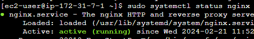
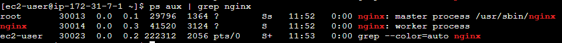
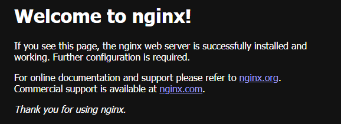

nginx와 apache를 ec2에 설치할 때 사용했던 명령어들을 정리했다.

---

### Nginx 실습

nginx 설치  
`sudo yum install -y nginx`

> yum  
> 레드햇 계열에서 사용하는 패키지 관리 명령어  
> (데비안, 우분투 계열은 apt-get을 사용한다)

nginx 버전 확인  
`nginx -v`

nginx 시작
`sudo service nginx start` or  
`sudo systemctl start nginx`

nginx 종료  
`sudo service nginx stop` or  
`sudo systemctl stop nginx`

nginx 서비스의 상태 확인  
`sudo service nginx status` or  
`systemctl status nginx` or  
`ps aux | grep nginx`

> service, systemctl  
> 둘다 리눅스 시스템에서 서비스를 관리하는 데 사용되는 명령어
> 
> service  
> init 시스템을 사용하는 레거시 시스템에서 서비스를 관리하는데 사용되는 명령어  
> (대부분의 최신 리눅스 배포판에서는 Systemd로 대체됐다)
> 
> systemctl  
> Systemd를 사용하는 시스템에서 사용된다.  
> Systemd는 최근의 리눅스 시스템에서 기본 초기화 및 서비스 관리 시스템으로 사용된다.

> ps 명령어  
> (Process Status의 약자)  
> 현재 실행 중인 프로세스에 대한 정보를 보여주는 명령어
> 
> ps aux = ps -a -u -x  
> -a: 모든 사용자의 프로세스를 보여준다.  
> -u: 상세한 정보를 사용자 형태로 출력한다.  
> -x: 터미널과 관계없이 모든 프로세스를 보여준다.
> 
> 이때 ps의 출력을 파이프(|)를 사용하여 grep 명령어에 전달한다.  
> (grep: 주어진 텍스트에서 특정 패턴을 찾는 명령어)

`sudo systemctl status nginx` 명령어를 통해 nginx가 실행 중인지 확인  
  
(active & running 표시가 떠야 실행 중임)

`ps aux | grep nginx` 명령어를 통해 nginx가 실행 중인지 확인  

> `ps aux | grep nginx` 명령어로 프로세스 확인할 때 주의할 점
>
> 
>
> 위 라인만 출력됐다면, 이는 nginx가 실행 중인 것이 아니다.  
> ps aux | grep nginx 명령어도 프로세스에 의해 돌아가기 떄문에 ps 명령어의 감지 대상이 되기 떄문이다.  
> (이때 ps, grep 명령어가 별도의 프로세스로 실행 된다)

### nginx 웹 서버 연결 성공했을 때 캡쳐

  
(아무 설정 안하고 http 요청했을 때 사진)

---

### Apache 실습

nginx와 거의 똑같다.  
(명령어 입력할 때 nginx 대신 httpd를 입력하면 됨)

### apache 웹 서버 연결 성공했을 때 캡쳐

  
(아무 설정 안하고 http 요청했을 때 사진)