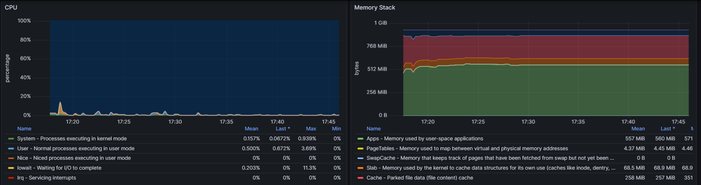

프로메테우스, 그라파나를 이용했다.

node_exporter를 통해 해당 컴퓨터의 CPU, 메모리 사용량을 메트릭으로 제공한다.  
이를 프로메테우스 & 그라파나와 연결해 모니터링한다.

node_exporter 설치  
`wget https://github.com/prometheus/node_exporter/releases/download/v1.7.0/node_exporter-1.7.0.linux-amd64.tar.gz`

압축 해제  
`tar xvzf node_exporter-1.7.0.linux-amd64.tar.gz`

해당 파일 이동해서 node_exporter 실행(백그라운드로)  
`nohup ./node_exporter &`

prometheus.yml 파일에서 port 번호 9100으로 설정  
(node_exporter가 9100을 이용하기 때문)

prometheus와 grafana 모두 실행해서 CPU & 메모리 사용량 확인

