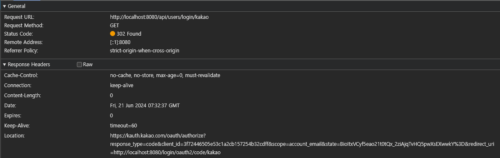

# OAuth2 프로세스 분석

## Oauth2란 무엇인가?

OAuth2는 인증 및 권한 부여 프로토콜로,  
인증 서버와 리소스 서버로 구성돼 있다.

- 인증 서버: 사용자 인증을 담당한다.
- 리소스 서버: 사용자의 리소스를 보관하고, 이를 제공한다.

이때 인증 서버와 리소스 서버를 직접 구현한다기 보다는,  
구글, 카카오, 네이버 등의 외부 서버를 사용한다.

> 이를 통해 사용자는 각 서버에 대한 계정을 가지고,  
> 다른 서비스를 이용할 수 있다.

---

## OAuth2 프로세스

1. 사용자가 Application에 로그인을 시도한다.
2. Application은 사용자를 인증 서버로 리다이렉트한다.
3. 사용자는 인증 서버에 로그인을 시도한다.
4. 로그인에 성공하면, 인증 서버는 권한 부여 승인 코드를 Application으로 전달한다.
   (이때 인증 서버에서 바로 Application으로 전달하는 것이 아니라, 리다이렉트를 통해 User를 거친 후에 Application으로 전달한다)
5. Application은 권한 부여 승인 코드를 이용해 인증 서버에 Access Token을 요청한다.
6. Access Token을 받으면, Application은 리소스 서버에 Access Token을 전달한다.
7. 리소스 서버는 Access Token을 검증하고, 사용자의 리소스를 전달한다.
8. 사용자는 Application을 통해 리소스를 이용한다.

> 2 ~ 5 번까지는 인증 서버와의 통신이고,  
> 6 ~ 8 번까지는 리소스 서버와의 통신이다.

---

## OAuth2 관련 코드 분석

OAuth2를 사용하기 위해서, 스프링 시큐리티를 이용했다.

아래는 OAuth2 관련 코드(ClientRegistration 클래스 설정 코드)를 캡쳐한 사진이다.

맨처음 사용자가 Application에 로그인을 시도하면,  
Application은 인증 서버로 사용자를 리다이렉트한다.  
(이때의 url: `https://kauth.kakao.com/oauth/authorize`)
(authorizationRequestUri로 설정)

사용자가 인증 서버에 로그인을 성공한다면,  
인증 서버는 권한 부여 승인 코드를 Application으로 전달한다.  
(이때의 url: `http://localhost:8080/login/oauth2/code/kakao`)  
(redirectionUri로 설정)

위에서 받은 권한 부여 승인 코드를 이용해,  
Application은 인증 서버에 Access Token을 요청한다.  
(이때의 url: `https://kauth.kakao.com/oauth/token`)  
(tokenUri로 설정)

Access Token을 받으면,  
Application은 리소스 서버에 Access Token을 전달하여 원하는 리소스를 요청한다.  
(이때의 url: `https://kapi.kakao.com/v2/user/me`)  
(userInfoUri로 설정)

---

## OAuth2 프로세스 분석

> 로컬호스트에서 카카오 로그인을 시도한 것을 캡쳐했다.

> 크롬의 개발자 도구를 이용해 OAuth2 프로세스를 분석했다.

> 스프링 시큐리티는  
> 사용자가 Application에게 로그인 성공 이후  
> 권한 부여 승인 코드를 전달 했을 때,  
> 이를 가지고 이후의 작업을 자동으로 처리한다.  
> 
> 이러면 중간에 어떤 요청/응답이 있었는지 확인하기 어렵기 때문에,  
> tokenUri를 다른 uri로 설정하여 자동으로 처리하는 것을 막은 다음,  
> Access Token 이후의 과정을 포스트맨으로 직접 요청했다.

### 1. 사용자가 Application에 로그인을 시도한다.

Application에 로그인을 시도한다.

Application은 이를 인증 서버로 리다이렉트한다.

> 이때 쿼리 파라미터로,  
> `client_id`, `redirect_uri`, `response_type`, `scope`, `state` 를 전달한다.

### 2. 사용자가 인증 서버에 로그인을 성공한다.

인증 서버에서 로그인에 성공한 이후,  
인증 서버는 권한 부여 승인 코드를 Application으로 전달한다.

> 이때 쿼리 파라미터로 `code`, `state` 를 전달한다.

### 3. Application은 권한 부여 승인 코드를 이용해 Access Token을 요청한다.

http method는 POST이고,  
Content-Type은 application/x-www-form-urlencoded이다.

이때 body에는 `client_id`, `client_secret`, `redirect_uri`, `code`, `grant_type` 를 전달한다.

결과  

access_token과 token_type 등을 받았다.

> 이때 scope 결과로 ClientRegistration에서 설정한 scope를 전달한다.

### 4. Application은 리소스 서버에 Access Token을 전달하여 원하는 리소스를 요청한다.

http method는 GET이고,  
Authorization에는 `Bearer {access_token}`을 전달한다.
(Bearer는 `token_type`에 해당한다)

결과  

사용자의 정보를 받았다.

json 데이터 id 필드와, ClientRegistration에서 설정한 userNameAttributeName 필드(`kakao_account`)를 받았다.

kakao_account 필드 안에는 이메일 정보가 들어있다.

> 이 경우는 카카오에 해당하며,  
> 구글과 네이버에서는 json 데이터 형식이 다를 수 있다.

---

## 이후 작업

마지막으로 사용자의 정보를 받은 이후에,  
이를 이용해 로그인을 진행하거나 회원가입을 진행할 수 있다.

> DefaultOAuth2UserService 클래스의 loadUser 메소드를 오버라이딩하면,  
> 위의 OAuth2 프로세스를 통해 받은 사용자 정보를 이용할 수 있다.

