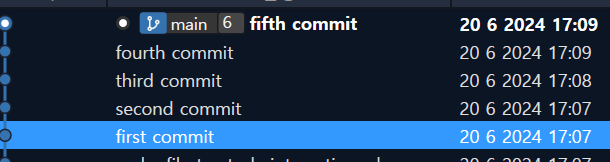
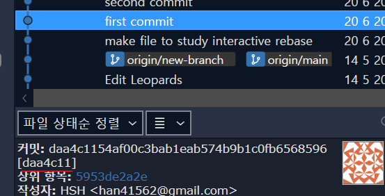
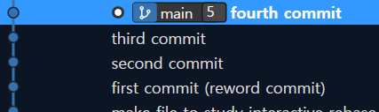

# git 명령어 연습

## 여러 브랜치의 커밋 관리

### 특정 브랜치를 다른 커밋으로 옮기는 방법

특정 브랜치를 다른 커밋으로 옮기고 싶다.

> 사실 브랜치를 커밋으로 옮긴다는 표현은  
> 잘못된 표현이다.
> 
> 브랜치는 커밋을 가리키는 포인터이기 때문에,  
> 브랜치를 옮기는 것은 커밋을 옮기는 것이다.
> 
> 그럼에도 위처럼 표현하는 이유는  
> 브랜치를 옮기는 것이 커밋을 옮기는 것과  
> 같은 결과를 가져오기 때문이다.

특정 브랜치 A를 다른 커밋으로 옮길 때,  
A의 커밋에 해당하는 다른 브랜치가 있어야 한다.  
(A 브랜치의 커밋을 유지하기 위해서)

옮기고 싶은 커밋의 해시값이 `5953de2` 라고 가정하자.  

현재 브랜치가 A일 떄,
`git checkout 5953de2` 를 통해 해당 커밋으로 이동한다.

그리고  
`git switch -c {새로운 브랜치 이름}` 을 통해  
새로운 브랜치를 생성하고, 해당 브랜치로 이동한다.

> checkout 을 하고 나서는 현재 속한 브랜치가 없기 때문에,  
> (정확히는 HEAD가 detached 상태이기 때문에)  
> 새로운 브랜치를 생성하고 이동해야 한다.

### 로컬 브랜치의 커밋들을 원격 저장소의 브랜치로 푸시할 때

1. 원격 저장소의 같은 브랜치로 푸시하는 경우  
   `git push {원격 저장소 이름} {브랜치 이름}`  
   (자동으로 원격 저장소의 같은 이름의 브랜치로 푸시된다)  
   (없다면 새로 생성된다)
2. 원격 저장소의 다른 브랜치로 푸시하는 경우  
    `git push {원격 저장소 이름} {로컬 브랜치 이름}:{원격 저장소 브랜치 이름}`  
    (로컬 브랜치의 커밋들이 원격 저장소의 다른 브랜치로 푸시된다)

---

## interactive rebase

5개의 커밋

각 커밋이 한줄씩 추가했다.

첫번째 커밋 이전의 커밋 해시값을 이용해 interactive rebase 실행

> 내가 수정하고 싶은 커밋이 있다면,  
> 해당 커밋 이전의 커밋 해시값을 이용해야 한다.

`git rebase -i 5953de2`

첫번째 커밋부터 현재 커밋까지  
모든 커밋의 리스트가 vim 에디터로 표시됐다.

> {명령어} {커밋 해시값} {커밋 메시지} 로 구성되어 있다.

여기서 vim 에디터를 이용해 수정해야 한다.

---

### interactive rebase 명령어

커밋 유지 - `pick`  
(default로 설정되어 있는 명령어)

커밋 삭제 - `drop`  
(또는 삭제할 커밋 라인을 지우는 것으로도 가능하다)

커밋 순서 바꾸기 - 에디터에서 순서를 바꾸면 된다.

커밋 메시지 수정 - `reword`  
pick을 해당 명령어로 수정하고, 저장 & 종료하면,  
해당 커밋 메시지를 수정하기 위한 에디터가 열린다.

> 커밋 메시지와 작업까지 동시에 수정하는 명령어는 `edit`

커밋 합치기 - `squash`, `fixup`  
둘 다 이전의 커밋과 합치는 명령어이다.

> 

---

### interactive rebase 결과

첫번째 커밋은 reword를 이용해 메시지를 수정했다.  
네번째 커밋과 다섯번째 커밋은 합쳤다.

  
(첫번째 커밋 메시지를 수정하는 캡처 사진)

`결과`

첫번째 커밋 메시지가 수정됐고,  
4번째 커밋과 5번째 커밋이 합쳐졌다.

---

### interactive rebase 주의사항

이 명령어는 기존의 커밋을 수정하는 작업이기 때문에,  
원격 리포지토리에 푸시된 커밋들을 로컬에서 rebase 하여  
푸시하는 일은 지양해야 한다.

> 이 명령어는 내가 한 작업을 PR 올리기 전에  
> 커밋을 깔끔하게 하는 작업을 할때 유용한 명령어인 것 같다.