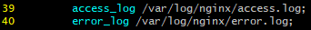

### Nginx 설정 파일 위치

`/etc/nginx/nginx.conf` 위치에 nginx 설정 파일이 있다.



위 코드를 통해 nginx 로그 파일을 설정할 수 있다.  
(http 블록 안에 있음)

---

### Nginx 로그 파일 설정

이때 error.log 에는 디버그 모드를 설정할 수 있다.

`error_log /var/log/nginx/error.log debug;`  
(디버그 모드로 설정하면 대량의 정보가 기록되어 성능이 저하됨을 유의하자)

> access log에는 디버그 모드를 설정할 수 없다.
>
> access log의 목적  
> 클라이언트 요청에 대한 간단한 기록을 유지하는 것

```
events {
    debug_connection 192.168.1.1;
    debug_connection 192.168.10.0/24;
}
```  
events 블록 안에 특정 IP를 `debug_connection`으로 설정해주면,  
해당 IP 대해서만 디버그 모드를 세팅할 수 있다.

---

### Nginx conf 파일 directive

> https://nginx.org/en/docs/ 사이트를 통해 확인할 수 있다.
> 
> 여기서 module이 각종 명령어(directive)에 대한 설명이다.
> 
> Docs 읽는 방법
> ```
> Syntax: 문법
> Default: 기본값(없으면 -)
> Context: 해당 Syntax가 적용되는 Context(block directive)
> ```

많이 쓰이는(or 앞으로 내가 쓸) directives

`http`  
context: main  
http 관련 configuration에 대한 정보를 설정하는 context directive(block)  
(`server` context와 `location` context의 루트 context)

`server`  
context: http  
가상 호스팅의 개념으로 하나의 서버에 대한 정보를 설정하는 context directive

`location`  
context: server  
해당 서버의 location을 설정하는 context directive  
(특정 URL을 처리하는 방법을 설정)

`events`  
네트워크 동작에 관한 내용을 설정하는 context directive

`include`  
context: any  
다른 곳에 존재하는 설정 파일을 불러올 수 있다.

> 이떄 추가하는 파일 형식 예시  
> .inc

`proxy_pass`  
context: location  
프록시 서버의 URL을 지정하는 directive

> proxy_pass가 속해있는 location의 path가 /example/ 인데,
> proxy_pass가 선언한 URL이 http://example.com:8080/api 라면
> 
> nginx는 http://example.com:8080/api/example/ 로 라우팅 해준다.  
> (normalize 된다)

`proxy_set_header`  
context: location  
nginx가 다른 URL로 라우팅 해주면서, 해당 데이터에 헤더의 정보를 넣어줄 때 사용하는 directive