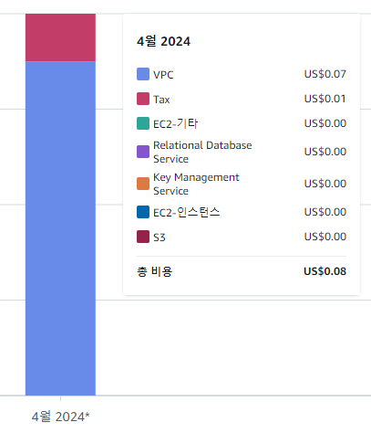

AWS는 프리티어에게 RDS도 특정 기기에 대해 무료로 제공하는데,  
요금이 발생했다.
(아주 조금)

이를 확인해보니, RDS는 무료로 제공하는게 맞지만, public으로 접근할 때는 요금이 발생한다고 한다.

> 2024/02 부터 요금 정책이 변했다고 한다.
> 
> 이전에는 모두 무료였는데, 2024/02부터 EC2의 public IPv4에 대해서만,  
> 무료로 제공한다고 한다.

### 해결 방법

RDS의 퍼블릭 액세스를 불가능으로 바꾸면 된다.

그런데 퍼블릭 액세스를 불가능으로 바꾸면, 외부(로컬)에서 RDS에 접속을 하지 못한다.

> 이때는, SSH 프로토콜로 EC2에 접속한 후,  
> EC2에서 RDS에 접속하면 된다.

---

