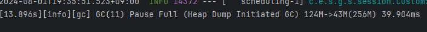

## 힙 덤프를 생성할 때, 자동으로 GC가 수행된다.

### 개요

실행 중인 자바 프로그램의 힙 덤프를 스냅샷으로 저장하고, 이를 분석하여 메모리 누수를 찾을 수 있다.  
그리고 힙 영역에 있는 객체들을 분석할 수 있다.

문제는 특정 시점에 힙 덤프를 생성해야 하는데,  
visualVM을 이용해 힙 덤프를 생성할 때 자동으로 GC가 수행된다.

> 이는 GC를 수행하여 메모리의 최신 상태를 반영한 힙덤프를 생성하려는 목적이라고 한다.

  
힙 덤프 생성 전, GC를 수행하는 로그

### 해결

일단 visualVM에서 GC 없이 힙 덤프를 생성하는 방법은 지금 당장은 없는 것 같다.

결국 visualVM을 사용하지 않고,  
`jmap` or `jcmd` 명령어를 사용하여 힙 덤프를 생성하는 방법을 사용해야 한다.

`jmap -dump:format=b,file={file_name}.hprof {pid}`  
`jcmd {pid} GC.heap_dump -all {file_name}.hprof`

> `jcmd` 명령어 사용시 -all 옵션을 사용하지 않으면,  
> visualVM의 힙 덤프와 동일하게 GC가 수행된다.  
> (이 역시 live-object만 포함된 객체만 보기 위함이라고 한다)
> 
> `jmap`은 옵션에 관게없이 GC를 수행하지 않고 힙 덤프를 생성한다.
> 
> ref: [jcmd 설명](https://docs.oracle.com/javase/9/tools/jcmd.htm#JSWOR743)

> 만약 file_name을 상대 경로로 지정하면,  
> jmap의 결과는 현재 디렉토리에 생성된다.  
> jcmd의 결과는 해당 프로세스(자바 프로그램)가 실행된 디렉토리에 생성된다.

> jmap vs jcmd
> 
> jmap은 메모리 작업을 수행하는 명령어이다.  
> jcmd는 JVM에게 명령을 내리는 명령어이다.  
> (jcmd가 더 많은 기능을 제공한다)