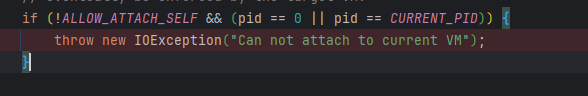
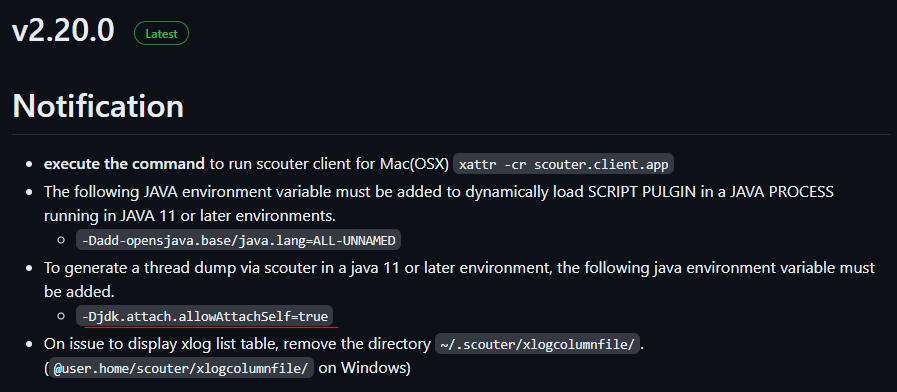
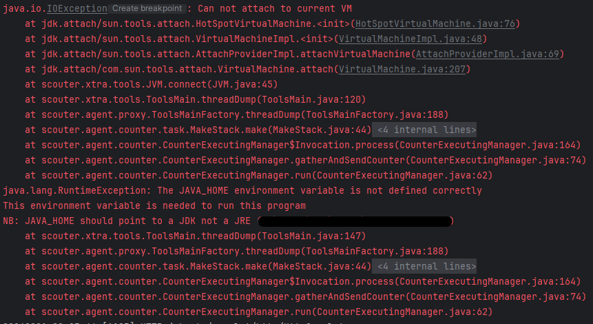

## IOException

### 개요

scouter의 agent.java를 javaagent로 사용하고 있는데,  
scouter와 관련한 IOException이 발생했다.

### 원인

일단 디버깅을 해 어떤 지점에서 발생했는지 확인해봤다.



위 코드에서 ALLOW_ATTACH_SELF 변수의 값이 false라서 IOException이 발생했다.  

```java
class HotSpotVirtualMachine implements VirtualMachine {
    private static final boolean ALLOW_ATTACH_SELF;

    static {
        PrivilegedAction<ProcessHandle> pa = ProcessHandle::current;
        CURRENT_PID = AccessController.doPrivileged(pa).pid();

        String s = VM.getSavedProperty("jdk.attach.allowAttachSelf");
        ALLOW_ATTACH_SELF = "".equals(s) || Boolean.parseBoolean(s);
    }
    // ...
}
```

이 변수는 `HotSpotVirtualMachine` 클래스의 static 블록에서 초기화되는데,  
`jdk.attach.allowAttachSelf` 시스템 프로퍼티의 값이 false라면 false로 초기화된다.

스카우터의 릴리즈 노트를 읽어보니  
스카우터에서 스레드 덤프를 얻으려고 할 떄,  
이 옵션을 true로 설정하라고 한다.



> 스레드 덤프 관련 옵션은 agent.java의 conf 파일에서 설정할 수 있다.  
> default 값은 false이기 때문에 이 에러가 발생하지 않는다.
> 
> scouter.conf 파일에서 스레드 덤프 관련 옵션을 true로 설정하면,  
> `jdk.attach.allowAttachSelf` 옵션을 true로 설정해야 한다.

---

### 해결

자바 프로그램 실행 시 `-Djdk.attach.allowAttachSelf=true` 옵션을 추가하여 실행하면 된다.

> 하나 이해가 안되는 점은, 에러 로그가 관련 없는 메시지를 출력한다는 것이다.
> 
>   
> 
> 위 사진을 보면 IOException이 발생했는데,  
> JAVA_HOME 환경 변수와 관련한 메시지가 출력되었다.  
> 이는 스카우터 내부의 로그 문제로 보인다.